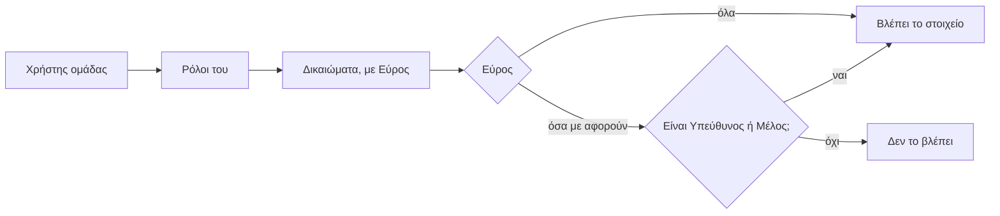

# Ρόλοι και Δικαιώματα

> **👁️ Με μια ματιά**
> Κάθε άνθρωπος παίρνει έναν ή περισσότερους **Ρόλους**. Ο Ρόλος είναι ένα πακέτο **Δικαιωμάτων** με όνομα, που φτιάχνει και αλλάζει ο Ιδιοκτήτης χωρίς προγραμματιστή.
> Κάθε Δικαίωμα έχει **Εύρος**: «όλα» ή «όσα με αφορούν». Τα ποσά και το κόστος είναι δικά τους Δικαιώματα, ξεχωριστά από τα υπόλοιπα.
> Σήμερα υπάρχουν πέντε σταθεροί ρόλοι που αλλάζουν μόνο με αλλαγή στο σύστημα. Στο νέο σύστημα υπάρχουν έτοιμοι Ρόλοι ως αρχή, και ό,τι χρειαστεί φτιάχνεται από τον Ιδιοκτήτη.
> Οι πελάτες έχουν δικούς τους Ρόλους και βλέπουν μόνο τα δεδομένα του Πελάτη που έχουν επιλέξει.

## 🧩 Πώς δουλεύουν οι Ρόλοι

| Αρχή | Τι σημαίνει στην πράξη |
|---|---|
| **Λειτουργεί με έναν άνθρωπο** | Ένας Ιδιοκτήτης χωρίς ομάδα κάνει τα πάντα, χωρίς να περιμένει κανέναν. Ό,τι αφορά πολλά άτομα (Έγκριση πρότασης, ουρά «Χωρίς υπεύθυνο», Αίτημα πρόσβασης) μένει αόρατο και δεν μπλοκάρει όταν δεν υπάρχει δεύτερος άνθρωπος. Κάθε νέος κανόνας ελέγχεται και με αυτό το σενάριο. |
| Ο Ρόλος είναι πακέτο Δικαιωμάτων | «Παραγωγή» ή «Πωλήσεις» δεν είναι βαθμίδες. Είναι ονόματα για συνδυασμούς Δικαιωμάτων που μπορείς να αλλάξεις. |
| Πολλοί Ρόλοι ανά Χρήστη | Ένας άνθρωπος που πουλάει και μοντάρει παίρνει δύο Ρόλους. Τα Δικαιώματά τους προστίθενται. |
| Ο κατάλογος των Δικαιωμάτων είναι σταθερός | Οι Ρόλοι αλλάζουν ελεύθερα. Ένα **νέο** Δικαίωμα (π.χ. για μια καινούργια επικίνδυνη ενέργεια) προστίθεται μόνο με αλλαγή του ίδιου του συστήματος. |
| Το σύστημα ελέγχει Δικαιώματα, όχι ονόματα Ρόλων | Αν μετονομάσεις ή σπάσεις έναν Ρόλο, τίποτα δεν χαλάει. |
| Δύο είδη Ρόλων: ομάδας και πελάτη | Δεν ανακατεύονται. Ένας Χρήστης έχει Ρόλους μόνο του ενός είδους, και κάθε είδος προσφέρει μόνο τα δικά του Δικαιώματα. |
| Δεν υπάρχει βαθμίδα «admin» | Η «Διαχείριση» είναι ένας έτοιμος Ρόλος σαν τους άλλους. |

### Ο Ιδιοκτήτης

Είναι ο μόνος Ρόλος με ειδική θέση.

- Έχει πάντα **όλα** τα Δικαιώματα και δεν διαγράφεται.
- Μπορούν να υπάρχουν πολλοί Ιδιοκτήτες, αλλά πάντα **τουλάχιστον ένας**.
- Μόνο ο Ιδιοκτήτης αλλάζει **Ρόλους, συνδρομές και ενσωματώσεις**.
- Μόνο ο Ιδιοκτήτης αλλάζει τα φορολογικά στοιχεία, τους τραπεζικούς λογαριασμούς και τον ΦΠΑ της εταιρείας. Μια αλλαγή IBAN στέλνει τα χρήματα αλλού.
- Αρχικά μόνο ο Ιδιοκτήτης **καταχωρεί Τιμολόγια**. Είναι κανονικό Δικαίωμα που κανένας έτοιμος Ρόλος δεν έχει από την αρχή· ο Ιδιοκτήτης μπορεί να το δώσει σε έναν Ρόλο, π.χ. στον Λογιστή.

## 🎯 Εύρος: «όλα» ή «όσα με αφορούν»

Όταν ο Ιδιοκτήτης δίνει ένα Δικαίωμα σε έναν Ρόλο ομάδας, διαλέγει και το Εύρος του.

| Εύρος | Τι καλύπτει |
|---|---|
| **Όλα** | Όλα τα στοιχεία της εταιρείας, ανεξάρτητα από το ποιος τα χειρίζεται. |
| **Όσα με αφορούν** | Μόνο όσα συνδέονται με τον ίδιο τον Χρήστη, με τους δύο τρόπους του παρακάτω πίνακα. |

Δεν έχουν όλα τα Δικαιώματα και τα δύο Εύρη. Κάθε Δικαίωμα προσφέρει όσα έχουν νόημα για αυτό (π.χ. η διαχείριση Καταλόγου είναι πάντα «όλα»).

### Πότε κάτι «με αφορά»

| Αν είμαι… | …τότε με αφορούν |
|---|---|
| **Υπεύθυνος** ενός Πελάτη | Ο Πελάτης, **όλες** οι Συμφωνίες του, όλες οι Ευκαιρίες του και **όλα** τα Γυρίσματά του |
| **Υπεύθυνος** μιας Ευκαιρίας σε Πελάτη άλλου (με Αίτημα πρόσβασης) | Ο Πελάτης, **όλες** οι Συμφωνίες του και **μόνο οι δικές του** Ευκαιρίες |
| **Μέλος** μιας Παραγωγής (Υπεύθυνός της, ή όποιος έχει ανάθεση σε εργασία, Γύρισμα ή Παραδοτέο της) | Η Παραγωγή και τα Γυρίσματα, τα Παραδοτέα και τα Μηνύματά της (όσα έχουν την ετικέτα της) |

Βασικοί κανόνες:
- Όποιος «Διαχειρίζεται Πελάτες και Ευκαιρίες» με Εύρος «με αφορά» βλέπει για **κάθε** Πελάτη μόνο ότι υπάρχει και ποιος είναι ο Υπεύθυνός του, ώστε να μην πλησιάζει πελάτη συναδέλφου (βλ. `03-processes/02-sales.md`, «Ένας Πελάτης, ένας πωλητής»).
- Το «με αφορά» υπολογίζεται **τη στιγμή που ζητείται** και δεν αποθηκεύεται πουθενά. Όταν σε αφαιρέσουν από Υπεύθυνο ή Μέλος, χάνεις την πρόσβαση αμέσως.
- Αν δύο Ρόλοι του ίδιου Χρήστη δίνουν το ίδιο Δικαίωμα με διαφορετικό Εύρος, **ισχύει το ευρύτερο**.
- Οι Ρόλοι πελάτη **δεν** έχουν επιλογή Εύρους. Καλύπτουν πάντα μόνο τον Πελάτη που έχει επιλέξει ο Χρήστης εκείνη τη στιγμή, οπότε δεν γίνεται να ρυθμιστούν κατά λάθος σε «όλα».

## 💶 Ποσά και κόστος: ξεχωριστά Δικαιώματα

Τα χρήματα δεν ακολουθούν το module. Κάθε Συμφωνία, Παραγωγή ή Πελάτης έχει τρία επίπεδα πληροφορίας:

| Επίπεδο | Τι περιέχει | Τι Δικαίωμα χρειάζεται |
|---|---|---|
| Περιεχόμενο | Τι περιλαμβάνει, ποιος το κάνει, πότε | Το Δικαίωμα «Βλέπει» του module |
| Ποσά | Τιμές, Τιμολογητέα, Τιμολόγια, οφειλές | «Βλέπει ποσά» |
| Κόστος | Εκτιμώμενο και πραγματικό κόστος, ώρες, περιθώριο, κερδοφορία | «Βλέπει κόστος και κερδοφορία» |

- Οι **Πωλήσεις** έχουν «Βλέπει ποσά» με Εύρος «με αφορά» και όχι «Βλέπει Οικονομικά»: βλέπουν τα ποσά των δικών τους προτάσεων και Συμφωνιών, όχι Καρτέλα Πελάτη, Υπόλοιπο, κόστος ή περιθώριο.
- Όποιος βλέπει μια Συμφωνία ή Παραγωγή χωρίς «Βλέπει ποσά», τη βλέπει **χωρίς νούμερα**. Ένας μοντέρ βλέπει τη δουλειά της Παραγωγής, όχι την τιμή της Συμφωνίας.
- Η απόκρυψη δεν γίνεται μόνο στην οθόνη. Η βάση αρνείται να δώσει ποσά σε όποιον δεν έχει Δικαίωμα, ακόμα κι αν υπάρχει λάθος σε κάποια οθόνη.
- Το «**Διαχειρίζεται κόστος**» είναι ακόμα πιο αυστηρό. Αλλάζει τα έξοδα της εταιρείας (που περιέχουν μισθούς), τις παραγωγικές ώρες, τις εκτιμώμενες ώρες Καταλόγου και γραμμής, τις **Πραγματικές ώρες**, τους πολλαπλασιαστές του Εύρους τιμής και το όριο Υπέρβασης κόστους. Όποιος δεν το έχει, βλέπει τη γραμμή με τις ώρες του Καταλόγου. Αρχικά το έχει μόνο ο Ιδιοκτήτης, γιατί τα έξοδα περιέχουν μισθούς· μπορεί να το δώσει σε έναν Ρόλο. Όποιος έχει μόνο το «Βλέπει κόστος και κερδοφορία» βλέπει τα **σύνολα** (Κόστος ώρας, περιθώριο, κερδοφορία), όχι τις αναλυτικές γραμμές εξόδων.
- Οι ειδοποιήσεις για χαμηλό περιθώριο και Υπέρβαση κόστους πηγαίνουν **μόνο** σε όσους βλέπουν κόστος.
- Ο πελάτης δεν βλέπει ποτέ κόστος, ώρες, περιθώριο ούτε Τιμολογητέα.

## 🧰 Τα βασικά που έχει πάντα κάθε μέλος της ομάδας

Δεν είναι Δικαιώματα. Κανένας Ρόλος δεν τα αφαιρεί.

| Βασικό | Τι είναι |
|---|---|
| Προφίλ και προτιμήσεις | Στοιχεία, γλώσσα, ποιες ειδοποιήσεις θέλει |
| Σήμερα | Η αρχική του, με κάρτες που ταιριάζουν στους Ρόλους του |
| Σύνδεσμος ημερολογίου | Προσωπικός σύνδεσμος ανάγνωσης για το ημερολόγιο του κινητού |
| Ο δικός του Κλεισμένος χρόνος | Καταχωρεί μόνος του πότε δεν είναι διαθέσιμος |
| Γνώση | Τα στοιχεία που έχουν Κοινό τους Ρόλους του |

## 🏁 Οι έτοιμοι Ρόλοι

Έρχονται έτοιμοι για να ξεκινήσει η εταιρεία. Ο Ιδιοκτήτης τους αλλάζει ή φτιάχνει δικούς του.

### Ρόλοι ομάδας

| Ρόλος | Ποιος είναι | Τι μπορεί | Τι δεν μπορεί |
|---|---|---|---|
| **Ιδιοκτήτης** | Ο κάτοχος του συστήματος | Όλα | Τίποτα δεν του λείπει |
| **Διαχείριση** | Τρέχει την καθημερινή λειτουργία | Όλα με Εύρος «όλα», εκτός από όσα έχει μόνο ο Ιδιοκτήτης. Καταχωρεί τις Εισπράξεις. | Να αλλάξει Ρόλους, συνδρομές, ενσωματώσεις και φορολογικά στοιχεία. Να καταχωρήσει Τιμολόγιο. |
| **Παραγωγή** | Γυρίζει, μοντάρει, παραδίδει | Γυρίσματα, Συνεργείο και Δελτίο, Παραγωγές, Παραδοτέα, δέσμευση εξοπλισμού και τα δύο είδη Μηνυμάτων (προς πελάτη και εσωτερικά), για όσα τον αφορούν. Δεν ελέγχει Παραδοτέα. Βλέπει τον Εξοπλισμό και τη διαθεσιμότητα της ομάδας. | Να δει ποσά. Να κλείσει Γύρισμα για πελάτη ή να εγκρίνει κράτηση. |
| **Πωλήσεις** | Φέρνει πελάτες, κλείνει Συμφωνίες | Πελάτες και Ευκαιρίες, Συμφωνίες και προτάσεις, ποσά, Γυρίσματα (τα βλέπει και τα κλείνει), Συνομιλία με τον πελάτη και Εσωτερικά Μηνύματα, Αναφορές, για όσα τον αφορούν. Βλέπει τον Κατάλογο και τη διαθεσιμότητα της ομάδας. | Να παρεκκλίνει από τον Κατάλογο. Να εγκρίνει κράτηση. Να δει κόστος. |
| **Λογιστής** | Ελέγχει και εξάγει τα οικονομικά | Βλέπει Πελάτες, Συμφωνίες, Οικονομικά και ποσά, βγάζει Αναφορές και εξαγωγές, για όλη την εταιρεία. | Οτιδήποτε άλλο. Είναι μόνο ανάγνωση. Δεν βλέπει κόστος και κερδοφορία. |

### Ρόλος πελάτη

| Ρόλος | Ποιος είναι | Τι μπορεί | Τι δεν βλέπει |
|---|---|---|---|
| **Πλήρης** | Ο άνθρωπος του Πελάτη που δουλεύει με τη Devre | Βλέπει και υπογράφει Συμφωνίες. Κλείνει Γύρισμα. Βλέπει Παραγωγές. Σχολιάζει και εγκρίνει Εκδόσεις. Βλέπει Οικονομικά (Καρτέλα και Τιμολόγια). Συνομιλεί με την ομάδα. Προσκαλεί και αφαιρεί συναδέλφους. | Κόστος, ώρες, περιθώριο, Τιμολογητέα, εσωτερικά Μηνύματα και Σχόλια, εσωτερικούς ελέγχους. Άλλους Πελάτες. |

Ο πελάτης ξεκινά μόνο με τον «Πλήρη». Αν χρειαστούν στενότεροι Ρόλοι (π.χ. κάποιος που βλέπει μόνο Παραδοτέα), τους φτιάχνει ο Ιδιοκτήτης χωρίς καμία αλλαγή στο σύστημα.

### Αναλυτικά ανά Δικαίωμα (ομάδα)

Σύμβολα: **Ό** = όλα · **Α** = όσα με αφορούν · **—** = όχι. Ο Ιδιοκτήτης έχει τα πάντα με Ό.

| Περιοχή | Δικαίωμα | Διαχείριση | Παραγωγή | Πωλήσεις | Λογιστής |
|---|---|---|---|---|---|
| Πελάτες και Πωλήσεις | Βλέπει Πελάτες | Ό | — | Α | Ό |
| | Διαχειρίζεται Πελάτες και Ευκαιρίες | Ό | — | Α | — |
| | Μεταβιβάζει Υπεύθυνο | Ό | — | — | — |
| | Συγχωνεύει Πελάτες | Ό | — | — | — |
| Κατάλογος | Βλέπει Κατάλογο | Ό | — | Ό | — |
| | Διαχειρίζεται Κατάλογο | Ό | — | — | — |
| Συμφωνίες | Βλέπει Συμφωνίες | Ό | — | Α | Ό |
| | Συντάσσει προτάσεις | Ό | — | Α | — |
| | Παρεκκλίνει από τον Κατάλογο | Ό | — | — | — |
| | Λύει Συμφωνία | Ό | — | — | — |
| Γυρίσματα | Βλέπει Γυρίσματα | Ό | Α | Α | — |
| | Κλείνει Γύρισμα | Ό | — | Α | — |
| | Εγκρίνει κράτηση | Ό | — | — | — |
| | Διαχειρίζεται Συνεργείο και Δελτίο | Ό | Α | — | — |
| Εξοπλισμός | Βλέπει Εξοπλισμό | Ό | Ό | — | — |
| | Διαχειρίζεται απόθεμα | Ό | — | — | — |
| | Δεσμεύει εξοπλισμό | Ό | Α | — | — |
| Ημερολόγιο | Βλέπει διαθεσιμότητα ομάδας | Ό | Ό | Ό | — |
| | Αμφίδρομο ημερολόγιο Google | Ό | — | — | — |
| Παραγωγές | Βλέπει, διαχειρίζεται, παραδίδει χειροκίνητα | Ό | Α | — | — |
| Παραδοτέα | Βλέπει, ανεβάζει και στέλνει Έκδοση, ακυρώνει | Ό | Α | — | — |
| | Ελέγχει Παραδοτέα | Ό | — | — | — |
| Οικονομικά | Βλέπει Οικονομικά | Ό | — | — | Ό |
| | Βλέπει ποσά | Ό | — | Α | Ό |
| | Καταχωρεί Εισπράξεις | Ό | — | — | — |
| | Καταχωρεί Τιμολόγια | — | — | — | — |
| | Βλέπει κόστος και κερδοφορία | Ό | — | — | — |
| | Διαχειρίζεται κόστος | — | — | — | — |
| Μηνύματα | Συνομιλεί με πελάτη (διαβάζει, γράφει προς πελάτη και Εσωτερικά Μηνύματα) | Ό | Α | Α | — |
| Αυτοματισμοί | Διαχειρίζεται Αυτοματισμούς και Μηνύματα συστήματος | Ό | — | — | — |
| Γνώση | Διαχειρίζεται Γνώση | Ό | — | — | — |
| Αναφορές | Βλέπει Αναφορές | Ό | — | Α | Ό |
| | Εξάγει δεδομένα | Ό | — | — | Ό |
| Ιστοσελίδα | Διαχειρίζεται Ιστοσελίδα | Ό | — | — | — |
| Ομάδα και Πρόσβαση | Προσκαλεί και απενεργοποιεί Χρήστες ομάδας | Ό | — | — | — |
| | Προσκαλεί και αφαιρεί Χρήστες πελάτη | Ό | — | — | — |
| Ρυθμίσεις | Διαχειρίζεται Ρυθμίσεις | Ό | — | — | — |
| Διατομεακά | Βλέπει ίχνος ενεργειών | Ό | — | — | — |
| | Βλέπει Υγεία συστήματος | Ό | — | — | — |
| **Μόνο Ιδιοκτήτης** | Ρόλοι, συνδρομές, ενσωματώσεις, φορολογικά στοιχεία (ΑΦΜ, ΔΟΥ, ΓΕΜΗ), λογαριασμοί, ΦΠΑ, πλαφόν AI, «Άνοιγμα σε πελάτες» | — | — | — | — |

Κάθε Αναφορά δείχνει μόνο όσα επιτρέπουν τα υπόλοιπα Δικαιώματα του Χρήστη, και το «Εξάγει δεδομένα» βγάζει μόνο όσα βλέπει ο Χρήστης. Βλ. [Αναφορές: λεπτομέρειες κανόνων](02-capability-map.md#-αναφορές-λεπτομέρειες-κανόνων).

## 👥 Πελάτες ως Χρήστες: πρόσκληση, εναλλαγή, απενεργοποίηση

| Θέμα | Πώς λειτουργεί |
|---|---|
| **Πρόσκληση** | Η είσοδος γίνεται μόνο με πρόσκληση. Δεν υπάρχει ανοιχτή εγγραφή. Μετά την υπογραφή της πρώτης Συμφωνίας, ο Υπογράφων προσκαλείται αυτόματα ως Χρήστης πελάτη με τον Ρόλο «Πλήρης». Όποιος έχει Δικαίωμα «Προσκαλεί και αφαιρεί Χρήστες πελάτη» μπορεί να προσκαλέσει άλλους ή να τους αφαιρέσει. |
| **Συνάδελφοι** | Ο «Πλήρης» προσκαλεί και αφαιρεί συναδέλφους στον Πελάτη του, και η ομάδα ειδοποιείται. |
| **Είσοδος** | Email και κωδικός, σύνδεσμος εισόδου στο email, ή Google. Ένας λογαριασμός Google μπαίνει μόνο αν το email του έχει προσκληθεί. |
| **Πολλοί Πελάτες** | Ένας Χρήστης πελάτη μπορεί να ανήκει σε περισσότερους Πελάτες (π.χ. ο ιδιοκτήτης δύο επιχειρήσεων). Διαλέγει με ποιον δουλεύει και **αλλάζει** όποτε θέλει. |
| **Τι βλέπει μετά την εναλλαγή** | Μόνο τα δεδομένα του επιλεγμένου Πελάτη. Τα Δικαιώματά του καλύπτουν εκείνον και κανέναν άλλον. |
| **Πολλοί Χρήστες ανά Πελάτη** | Ένας Πελάτης μπορεί να έχει πολλούς. Το σύστημα ξεκινά με έναν, αλλά οι ειδοποιήσεις «προς τον πελάτη» πηγαίνουν σε όλους. |
| **Πελάτης ανενεργός** | Είναι μόνο ένδειξη. Οι Χρήστες του συνεχίζουν να συνδέονται και να επικοινωνούν. |

### Αποχώρηση και απενεργοποίηση

| Τι γίνεται | Αποτέλεσμα |
|---|---|
| Ένας Χρήστης **δεν διαγράφεται**. Απενεργοποιείται. | Δεν μπορεί πια να συνδεθεί. Το όνομά του μένει στο ιστορικό. |
| Ανοιχτές αναθέσεις του | Επιστρέφουν για νέα ανάθεση (π.χ. οι Πελάτες και οι Ευκαιρίες για τους οποίους ήταν Υπεύθυνος). |
| Ο Σύνδεσμος ημερολογίου του | Παύει να λειτουργεί. |
| Αίτημα GDPR | Τα στοιχεία του ανωνυμοποιούνται. |

## 🔑 Ομάδα και Πρόσβαση: λεπτομέρειες κανόνων

Αποφασίστηκαν με το ticket [Ομάδα και Πρόσβαση](https://github.com/ntontischris/dmsfinal/issues/86). Οι οθόνες είναι η N1 (Ομάδα), η N2 (Χρήστες πελάτη), η N3 (Συνάδελφοι), η N4 (Ρόλοι και Δικαιώματα) και η N5 (Ενσωματώσεις και συνδρομές).

**Ποιος δίνει Ρόλο σε Χρήστη ομάδας (απόφαση του Ιδιοκτήτη).** Όποιος «Προσκαλεί και απενεργοποιεί Χρήστες ομάδας» διαλέγει τους Ρόλους της πρόσκλησης, και με τον ίδιο κανόνα αλλάζει τους Ρόλους ενός υπάρχοντος Χρήστη. Ο κανόνας είναι **χωρίς κλιμάκωση**: δίνει μόνο Ρόλους που δεν περιέχουν Δικαίωμα ή Εύρος που δεν έχει ο ίδιος, και ποτέ τον Ρόλο Ιδιοκτήτης. Τους Ρόλους ενός Ιδιοκτήτη τους αλλάζει μόνο Ιδιοκτήτης. Η Διαχείριση, για παράδειγμα, δεν δίνει Ρόλο με «Καταχωρεί Τιμολόγια» ή «Διαχειρίζεται κόστος». Οι Ρόλοι που δεν μπορεί να δώσει φαίνονται κλειδωμένοι, με το Δικαίωμα που του λείπει. Για κάθε πρόσκληση ή αλλαγή Ρόλων που δεν έκανε ο ίδιος, ο Ιδιοκτήτης παίρνει Ειδοποίηση (Γεγονός 58). Το «μόνο ο Ιδιοκτήτης αλλάζει Ρόλους» σημαίνει ότι μόνο αυτός φτιάχνει, αλλάζει και διαγράφει Ρόλους (N4), και μόνο αυτός δίνει ή αφαιρεί τον Ρόλο Ιδιοκτήτης.

**Πρόσκληση.**
- Θέλει ονοματεπώνυμο, email, τουλάχιστον έναν Ρόλο και γλώσσα.
- Ο σύνδεσμος ισχύει 7 μέρες. Η Επαναποστολή βγάζει νέο σύνδεσμο και ακυρώνει τον παλιό. Μια ληγμένη πρόσκληση μένει στη λίστα 30 μέρες.
- Ένα email που ανήκει ήδη σε Χρήστη του άλλου είδους δεν προσκαλείται, γιατί ένας Χρήστης δεν έχει και τα δύο είδη Ρόλων.
- Για το email ενός απενεργοποιημένου Χρήστη ομάδας, το σύστημα προτείνει Επανενεργοποίηση αντί για νέα πρόσκληση.
- Ένας Χρήστης πελάτη που προσκαλείται σε δεύτερο Πελάτη δεν παίρνει νέο λογαριασμό. Προστίθεται στον Πελάτη και λαμβάνει email «προστέθηκες».

**Απενεργοποίηση Χρήστη ομάδας.**
- Πριν από την επιβεβαίωση, το σύστημα δείχνει τι θα επιστρέψει για νέα ανάθεση:
  - οι Πελάτες και οι Ευκαιρίες του πάνε στην ουρά «Χωρίς υπεύθυνο»,
  - οι Παραγωγές όπου ήταν Υπεύθυνος μένουν χωρίς Υπεύθυνο,
  - οι Εργασίες και τα Παραδοτέα του μένουν χωρίς ανάθεση,
  - οι θέσεις του στα Συνεργεία μελλοντικών Γυρισμάτων αδειάζουν, με σήμα.
- Οι συνεδρίες του κλείνουν αμέσως και ο Σύνδεσμος ημερολογίου του παύει να λειτουργεί.
- Δεν γίνεται απενεργοποίηση του εαυτού σου, ούτε Ιδιοκτήτη από κάποιον που δεν είναι Ιδιοκτήτης. Δεν γίνεται ούτε του τελευταίου ενεργού Ιδιοκτήτη, οπότε ένας Ιδιοκτήτης χωρίς ομάδα δεν κλειδώνεται ποτέ έξω.
- Η Επανενεργοποίηση θέλει το ίδιο Δικαίωμα. Ο Χρήστης κρατά τους Ρόλους του, αλλά οι αναθέσεις του δεν επιστρέφουν.

**Χρήστες πελάτη.**
- Το Δικαίωμα λέγεται πλέον «Προσκαλεί και αφαιρεί Χρήστες πελάτη».
- Η αφαίρεση βγάζει τον Χρήστη από **αυτόν** τον Πελάτη. Αν δεν ανήκει σε άλλον Πελάτη, ο λογαριασμός του απενεργοποιείται. Αλλιώς συνεχίζει να δουλεύει με τους άλλους.
- Αν ο Χρήστης είναι Υπογράφων σε πρόταση που περιμένει υπογραφή, το σύστημα προειδοποιεί ότι η πρόταση θα χρειαστεί νέο Υπογράφοντα.
- Η πρόσκληση διαλέγει Ρόλο πελάτη, με προεπιλογή τον «Πλήρη».
- Κανένας έτοιμος Ρόλος ομάδας εκτός από τη Διαχείριση δεν έχει αυτό το Δικαίωμα. Ο Υπογράφων προσκαλείται αυτόματα και ο πελάτης προσκαλεί μόνος του τους συναδέλφους του, οπότε η πρόσβαση τρίτων μένει σε λίγα χέρια. Το Εύρος «όσα με αφορούν» μένει διαθέσιμο για Ρόλους που φτιάχνει ο Ιδιοκτήτης.

**Συνάδελφοι (ο πελάτης).**
- Ο «Πλήρης» έχει το Δικαίωμα πελάτη «Προσκαλεί και αφαιρεί συναδέλφους».
- Προσκαλεί με Ρόλο πελάτη που δεν ξεπερνά τον δικό του, επαναστέλνει ή ακυρώνει εκκρεμείς προσκλήσεις και αφαιρεί συναδέλφους στον ίδιο Πελάτη.
- Τον εαυτό του δεν τον αφαιρεί. Για να αποχωρήσει, γράφει στη Συνομιλία.
- Η ομάδα ειδοποιείται (Γεγονός 43, «Ο πελάτης προσκάλεσε ή αφαίρεσε συνάδελφο»).
- Ο πελάτης δεν βλέπει πότε μπήκε τελευταία φορά ένας συνάδελφος, ποιο μέλος της ομάδας τον προσκάλεσε, ούτε σε ποιους άλλους Πελάτες ανήκει.

**Αιτήματα GDPR (μόνο ο Ιδιοκτήτης).**
- **Εξαγωγή δεδομένων**, για ένα πρόσωπο (Χρήστη ομάδας ή πελάτη) ή για έναν ολόκληρο Πελάτη: Στοιχεία, Χρήστες, Συμφωνίες, Τιμολόγια σε PDF, Εισπράξεις, Γυρίσματα, Παραδοτέα με τα links τους, και Συνομιλία χωρίς Εσωτερικά Μηνύματα. Βγαίνει ένα ZIP με JSON, CSV και PDF. Είναι χωριστή από την Εξαγωγή της M2 και γράφεται στο Ίχνος ενεργειών.
- **Ανωνυμοποίηση προσώπου.**
  - Γίνεται μόνο σε απενεργοποιημένο Χρήστη ομάδας, σε Χρήστη πελάτη που έχει αφαιρεθεί, ή στην Επαφή ενός Πελάτη.
  - Είναι μη αναστρέψιμη και επιβεβαιώνεται με πληκτρολόγηση του ονόματος.
  - Σβήνει το όνομα (γίνεται «Ανωνυμοποιημένος Χρήστης N»), το email, το τηλέφωνο, τη φωτογραφία, τις προτιμήσεις και τον Σύνδεσμο ημερολογίου.
  - Τα Μηνύματα και το Ίχνος μένουν, με το νέο όνομα. Οι υπογεγραμμένες Συμφωνίες και τα Τιμολόγια μένουν όπως είναι, γιατί ο νόμος ζητά να διατηρούνται.
  - Ο Πελάτης ως επιχείρηση δεν ανωνυμοποιείται στο v1.
- Κάθε αίτημα καταγράφεται με ημερομηνία λήψης και ολοκλήρωσης. Η προθεσμία είναι 1 μήνας από τη λήψη, και ένα σήμα δείχνει πόσες μέρες μένουν. Η Διαχείριση δεν βλέπει καθόλου τις ενέργειες GDPR.

**Ρόλοι και Δικαιώματα (N4).**
- Κάθε Ρόλος έχει όνομα, περιγραφή και είδος (ομάδας ή πελάτη). Το είδος δεν αλλάζει μετά τη δημιουργία.
- Κάθε Δικαίωμα παίρνει «—», «Όσα με αφορούν» ή «Όλα», μόνο όσα Εύρη υποστηρίζει. Οι Ρόλοι πελάτη έχουν μόνο ναι ή όχι.
- Νέος Ρόλος φτιάχνεται από το μηδέν ή ως «Αντίγραφο του…».
- Η αποθήκευση δείχνει πρώτα ποιους Χρήστες επηρεάζει. Η αλλαγή ισχύει από την επόμενη ενέργειά τους και γράφεται στο Ίχνος (πριν → μετά).
- Ένας Ρόλος διαγράφεται μόνο όταν δεν τον έχει κανείς. Ο Ιδιοκτήτης δεν αλλάζει και δεν διαγράφεται. Ο «Πλήρης» μετονομάζεται αλλά δεν διαγράφεται, γιατί είναι ο Ρόλος της αυτόματης πρόσκλησης του Υπογράφοντος.
- Όσα κάνει μόνο ο Ιδιοκτήτης φαίνονται χωριστά και δεν δίνονται σε κανέναν Ρόλο: Ρόλοι, ο Ρόλος Ιδιοκτήτης, συνδρομές και ενσωματώσεις, φορολογικά και τραπεζικά στοιχεία, πλαφόν AI, αιτήματα GDPR.

**Ενσωματώσεις και συνδρομές (N5).** Οι συνδέσεις στήνονται από τον developer, χωρίς κλειδιά (ADR 0016).
- Για κάθε σύνδεση (Google ημερολόγιο, email, AI, έλεγχος ανθρώπου, στατιστικά, καταγραφή σφαλμάτων), ο Ιδιοκτήτης βλέπει:
  - την κατάσταση (λειτουργεί, προσοχή, δεν λειτουργεί, δεν έχει στηθεί),
  - την τελευταία επιτυχία,
  - τη χρήση απέναντι στο όριο (emails της ημέρας, δαπάνη AI του μήνα),
  - τα μοντέλα AI, μόνο για ανάγνωση.
- Ο Ιδιοκτήτης αλλάζει τρία πράγματα:
  - πατά «Έλεγχος τώρα»,
  - αλλάζει τα αναγνωριστικά Google Analytics και Meta Pixel, που είναι δημόσια και δεν είναι κλειδιά,
  - κρατά το **μητρώο συνδρομών** (πάροχος, τι καλύπτει, πλάνο, μηνιαίο κόστος, ανανέωση, λογαριασμός, ποιος πληρώνει), με σύνολο ανά νόμισμα.
- Η αλλαγή πλάνου γίνεται στον πάροχο, και εδώ απλώς καταγράφεται.
- Η σύνδεση και η αποσύνδεση παρόχων, τα μοντέλα και το DNS μένουν στον developer, και κάθε κάρτα το γράφει.
- Το πλαφόν AI αλλάζει στις Ρυθμίσεις › Εταιρεία › Βοηθός. Μια κόκκινη κατάσταση ειδοποιεί μέσω της Υγείας συστήματος.

## 📖 Σενάρια

**1. Δύο Ρόλοι, ένα Εύρος.** Η Μαρία είναι μοντέρ. Έχει τον Ρόλο «Παραγωγή» με Εύρος «όσα με αφορούν», οπότε βλέπει μόνο τις Παραγωγές όπου είναι Μέλος. Ο Ιδιοκτήτης τής δίνει και έναν δεύτερο Ρόλο «Εκδηλώσεις», που επιτρέπει «Βλέπει Γυρίσματα» με Εύρος «όλα». Από εκείνη τη στιγμή βλέπει τα Γυρίσματα όλης της εταιρείας, γιατί ισχύει το ευρύτερο. Τις Παραγωγές της δεν τις βλέπει περισσότερες.

**2. Μοντέρ χωρίς νούμερα.** Ο Άρης είναι Μέλος της Παραγωγής του «Καφέ Αθηνά». Βλέπει Γυρίσματα, Παραδοτέα, σχόλια και Δελτίο. Η Συμφωνία του πελάτη δεν του δείχνει τιμές, γιατί ο Ρόλος του δεν έχει «Βλέπει ποσά». Την επόμενη εβδομάδα τον αφαιρούν από την Παραγωγή. Η πρόσβαση χάνεται αμέσως, χωρίς να χρειαστεί να αλλάξει κανένας Ρόλος.

**3. Λογιστής και πωλητής.** Η Ελένη (Λογιστής) βλέπει όλα τα Τιμολόγια και τις Εισπράξεις και βγάζει εξαγωγή, αλλά δεν βλέπει περιθώριο κέρδους και δεν αλλάζει τίποτα. Ο Νίκος (Πωλήσεις) βλέπει τις τιμές των Συμφωνιών των δικών του Πελατών. Δεν βλέπει το κόστος, και δεν μπορεί να δώσει έκπτωση πέρα από την τυπική χωρίς να ζητήσει Έγκριση πρότασης.

**4. Πελάτης με δύο επιχειρήσεις.** Ο κ. Δημήτρης είναι Χρήστης πελάτη και στο «Γυμναστήριο Κίνηση» και στο «Ζαχαροπλαστείο Μέλι». Μπαίνει και διαλέγει «Ζαχαροπλαστείο Μέλι». Βλέπει Συμφωνίες, Γυρίσματα και Παραδοτέα μόνο του Ζαχαροπλαστείου. Όταν αλλάξει στο «Γυμναστήριο Κίνηση», βλέπει μόνο εκείνο. Ποτέ τα δύο μαζί.

**5. Αποχώρηση πωλητή.** Ο Νίκος αποχωρεί από την εταιρεία. Η Διαχείριση τον απενεργοποιεί. Δεν μπορεί να συνδεθεί, αλλά τα μηνύματα και οι Δραστηριότητές του μένουν με το όνομά του. Οι Πελάτες και οι Ευκαιρίες του επιστρέφουν για νέα ανάθεση και η Διαχείριση τα δίνει σε άλλον Υπεύθυνο.

✅ Κανόνες που θα ελέγχονται

- **Δεδομένου ότι** ένας Χρήστης έχει δύο Ρόλους που δίνουν το ίδιο Δικαίωμα με Εύρος «όσα με αφορούν» και «όλα», **όταν** ζητά ένα στοιχείο, **τότε** βλέπει όλα.
- **Δεδομένου ότι** ένας Χρήστης έχει Δικαίωμα με Εύρος «όσα με αφορούν», **όταν** αφαιρεθεί από Υπεύθυνος ή Μέλος Παραγωγής, **τότε** χάνει αμέσως την πρόσβαση χωρίς καμία άλλη αλλαγή.
- **Δεδομένου ότι** ένας Υπεύθυνος Πελάτη έχει Εύρος «όσα με αφορούν» στις Συμφωνίες, **όταν** ανοίγει τον Πελάτη, **τότε** βλέπει όλες τις Συμφωνίες του.
- **Δεδομένου ότι** ένας Χρήστης δεν έχει «Βλέπει ποσά», **όταν** ανοίγει μια Συμφωνία, Παραγωγή ή Τιμολογητέο, **τότε** βλέπει τα στοιχεία χωρίς κανένα ποσό, και η βάση δεν του στέλνει τα ποσά.
- **Δεδομένου ότι** ένας Χρήστης δεν έχει «Βλέπει κόστος και κερδοφορία», **όταν** ζητά ώρες, κόστος ή περιθώριο, **τότε** δεν τα λαμβάνει.
- **Δεδομένου ότι** υπάρχει ένας μόνο Ιδιοκτήτης, **όταν** κάποιος προσπαθεί να τον απενεργοποιήσει ή να τον βγάλει από τον Ρόλο, **τότε** το σύστημα αρνείται.
- **Δεδομένου ότι** ένας Χρήστης έχει Ρόλο ομάδας, **όταν** του δοθεί Ρόλος πελάτη, **τότε** το σύστημα αρνείται, γιατί τα δύο είδη δεν ανακατεύονται.
- **Δεδομένου ότι** ένας Χρήστης πελάτη ανήκει σε δύο Πελάτες, **όταν** έχει επιλέξει τον έναν, **τότε** δεν βλέπει τίποτα από τον άλλον.
- **Δεδομένου ότι** ένας Χρήστης απενεργοποιείται, **όταν** προσπαθεί να συνδεθεί, **τότε** αποτυγχάνει, ενώ το όνομά του μένει στο ιστορικό και οι ανοιχτές αναθέσεις του επιστρέφουν για νέα ανάθεση.
- **Δεδομένου ότι** ένας Ρόλος αλλάζει, **όταν** ο Χρήστης συνεχίζει να δουλεύει, **τότε** τα νέα Δικαιώματα ισχύουν στην επόμενη ενέργειά του και ό,τι έχει ήδη γίνει δεν αλλάζει.
- **Δεδομένου ότι** κάποιος χωρίς Ρόλο Ιδιοκτήτη προσπαθεί να αλλάξει Ρόλους, συνδρομές ή ενσωματώσεις, **όταν** το κάνει, **τότε** το σύστημα αρνείται.

## ❓ Ανοιχτά ερωτήματα

*Το #5 κλείστηκε με το ticket [Μηνύματα](https://github.com/ntontischris/dmsfinal/issues/78): για την ομάδα υπάρχει ένα Δικαίωμα, «Συνομιλεί με πελάτη», που καλύπτει ανάγνωση, Μηνύματα προς πελάτη και Εσωτερικά Μηνύματα· το «Βλέπει Συνομιλία» και το «Γράφει στη Συνομιλία» είναι μόνο του πελάτη. Λεπτομέρειες στο [κεφ. 3.6](03-processes/06-messages-and-requests.md#-λεπτομέρειες-κανόνων-μηνύματα).*

*Το #3 (καταγραφή χρόνου) κλείστηκε με το ticket [Παραγωγές](https://github.com/ntontischris/dmsfinal/issues/72): δεν υπάρχει καταγραφή χρόνου από την ομάδα· τις Πραγματικές ώρες τις γράφει μόνο όποιος «Διαχειρίζεται κόστος», στη G3.*

*Τα #1, #4 και #7 κλείστηκαν με το ticket [Ομάδα και Πρόσβαση](https://github.com/ntontischris/dmsfinal/issues/86): το Δικαίωμα έγινε «Προσκαλεί και αφαιρεί Χρήστες πελάτη» και ο «Πλήρης» αφαιρεί συναδέλφους (#1)· το «Καταχωρεί Τιμολόγια» μένει στον Ιδιοκτήτη ως προεπιλογή και δίνεται σε Ρόλο (#4, όπως αποφασίστηκε στο [#51](https://github.com/ntontischris/dmsfinal/issues/51))· κανένας έτοιμος Ρόλος εκτός της Διαχείρισης δεν προσκαλεί Χρήστες πελάτη, και το Εύρος «όσα με αφορούν» μένει για Ρόλους του Ιδιοκτήτη (#7). Λεπτομέρειες στην ενότητα [Ομάδα και Πρόσβαση: λεπτομέρειες κανόνων](#-ομάδα-και-πρόσβαση-λεπτομέρειες-κανόνων).*

Πηγές

- ADR 0001: Οι Ρόλοι είναι επεξεργάσιμα πακέτα Δικαιωμάτων, με έναν μόνο προστατευμένο Ιδιοκτήτη.
- ADR 0007: Τα Δικαιώματα έχουν Εύρος, και το «με αφορά» υπολογίζεται την ώρα που ζητείται.
- ADR 0015: Ρυθμίσεις (τα φορολογικά στοιχεία, οι λογαριασμοί και ο ΦΠΑ μόνο από τον Ιδιοκτήτη).
- ADR 0017: Κόστος από ώρες, «Διαχειρίζεται κόστος».
- Συμπληρωματικά: ADR 0004 (Τιμολόγιο), ADR 0005 (αμφίδρομο ημερολόγιο), ADR 0011 (Εγκρίνει και Ελέγχει Παραδοτέα), ADR 0012 (Συνομιλία), ADR 0013 (Ιστοσελίδα), ADR 0003 (είσοδος με πρόσκληση).
- Issue #7: Χρήστες και ρόλοι του νέου συστήματος.
- Issue #16: Μοντέλο δικαιωμάτων, κατάλογος Δικαιωμάτων και έτοιμοι Ρόλοι.
- `CONTEXT.md`, ενότητα «Άνθρωποι και πρόσβαση».

