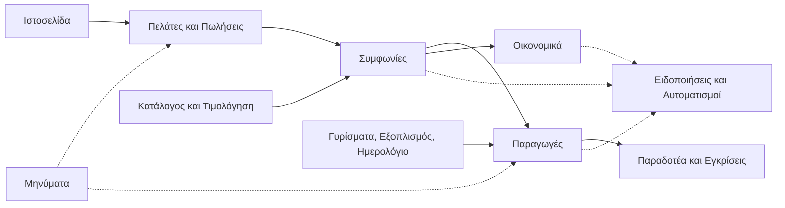

# Χάρτης δυνατοτήτων

> **👁️ Με μια ματιά**
> Το νέο σύστημα έχει 17 ενότητες (modules), κομμένες ανά **επιχειρησιακή περιοχή** και όχι ανά ρόλο: Πελάτες, Συμφωνίες, Γυρίσματα, Παραδοτέα, Οικονομικά και τα υπόλοιπα.
> Δεν υπάρχουν «εφαρμογή διαχείρισης», «εφαρμογή πωλητή» και «πύλη πελάτη» ως ξεχωριστά κομμάτια. Κάθε άνθρωπος έχει έναν **χώρο εργασίας** που φτιάχνεται από τις ενότητες και τις ενέργειες που του επιτρέπουν τα Δικαιώματά του.
> Σε σχέση με σήμερα: μία Συμφωνία αντί για τρία ασύνδετα έγγραφα, ένα Γύρισμα αντί για τρεις εισόδους, μία Συνομιλία ανά πελάτη, και τίποτα γραμμένο μέσα στο σύστημα που να μην αλλάζει από την εταιρεία.

## 🗺️ Πώς δένουν οι ενότητες

Η ραχοκοκαλιά είναι μία: **Ευκαιρία → Συμφωνία → Παραγωγή → Τιμολόγιο → Είσπραξη**. Κάθε ενότητα είτε είναι κρίκος της, είτε την τροφοδοτεί, είτε την υπηρετεί.

Οι υπόλοιπες ενότητες (Χρόνος, Γνώση και Βοηθός, Αναφορές, Σήμερα, Ομάδα και Πρόσβαση, Ρυθμίσεις) δεν είναι κρίκοι. Στηρίζουν όλη τη ροή και περιγράφονται παρακάτω.

## 🧱 Οι ενότητες ανά περιοχή

### Πωλήσεις και τιμές

**1. Πελάτες και Πωλήσεις.** Κρατά κάθε Πελάτη από την πρώτη επαφή και μετά: υποψήφιος, ενεργός ή ανενεργός, χωρίς να τον αλλάζει κανείς με το χέρι. Κάθε πιθανή πώληση είναι μια Ευκαιρία που προχωρά από Στάδια που ορίζει η εταιρεία, με πλήρες ιστορικό επικοινωνίας και υποχρεωτικό Λόγο απώλειας όταν χάνεται. Δεν υπάρχει ξεχωριστό «lead» ούτε μετατροπή.

**2. Κατάλογος και Τιμολόγηση.** Είναι η μοναδική πηγή κάθε τιμής. Εδώ ζουν τα Πακέτα και οι Υπηρεσίες που πουλάει η εταιρεία, με τις τρέχουσες τιμές τους, τις Εκτιμώμενες ώρες, το εκτιμώμενο κόστος και το περιθώριο δίπλα στην τιμή ως οδηγό. Η τιμή την οποία γράφει ο άνθρωπος είναι πάντα δική του απόφαση. Ό,τι δεν πουλιέται πια αρχειοθετείται.

**3. Συμφωνίες.** Ένα ενιαίο έγγραφο ανά πελάτη, από την πρόταση ως τη λήξη. Η υπογραφή γίνεται ηλεκτρονικά από το πρόσωπο του πελάτη που ορίζει η ομάδα. Οι όροι (πληρωμή, ακυρώσεις, διάρκεια, ανανέωση) γράφονται μία φορά. Στη μηνιαία Συμφωνία ανοίγουν αυτόματα Περίοδοι, που δείχνουν τι δικαιούται ο πελάτης, τι χρησιμοποίησε και τι πρέπει να τιμολογηθεί.

### Δουλειά πεδίου

**4. Γυρίσματα.** Ο πελάτης ζητά κράτηση μέσα στις Παροχές του και την εγκρίνει η ομάδα ή το σύστημα αυτόματα, όπως ορίζουν οι κανόνες της εταιρείας. Η ομάδα ορίζει Συνεργείο ανά Γύρισμα (με έτοιμα πρότυπα) και στέλνει Δελτίο γυρίσματος που κάθε μέλος επιβεβαιώνει ξεχωριστά. Δύο Γυρίσματα την ίδια ώρα επιτρέπονται όταν τα Συνεργεία τους δεν έχουν κοινά άτομα. Το Γύρισμα είναι μία οντότητα: η κράτηση του πελάτη είναι απλώς Γύρισμα που «αναμένει έγκριση».

**5. Εξοπλισμός.** Το μητρώο του εξοπλισμού της εταιρείας, που το ρυθμίζει η Διαχείριση. Κάθε Γύρισμα δεσμεύει συγκεκριμένα αντικείμενα, και το σύστημα προειδοποιεί (ή μπλοκάρει, ανάλογα με τη ρύθμιση) όταν το ίδιο αντικείμενο ζητείται σε δύο Γυρίσματα που επικαλύπτονται.

**6. Ημερολόγιο.** Μία ενιαία **όψη** με Γυρίσματα, προθεσμίες και Κλεισμένο χρόνο. Δεν είναι πηγή δεδομένων: ο καθένας βλέπει μόνο ό,τι του αναλογεί. Ο πελάτης βλέπει τα δικά του και πότε είναι διαθέσιμη η εταιρεία. Όλοι παίρνουν προσωπικό σύνδεσμο ανάγνωσης για το κινητό τους. Ένα κοινό Εταιρικό ημερολόγιο Google συγχρονίζεται και προς τις δύο κατευθύνσεις, αλλά το Google δεν παρακάμπτει ποτέ κανόνα του συστήματος.

### Παραγωγή και παράδοση

**7. Παραγωγές.** Η δουλειά για έναν πελάτη που καταλήγει σε Παραδοτέα. Κάθε Παραγωγή ανήκει σε μία Συμφωνία (η μηνιαία Συμφωνία ανοίγει μία ανά Περίοδο). Η κατάστασή της βγαίνει αυτόματα από τα Γυρίσματα, τις εργασίες και τα Παραδοτέα της. Η ομάδα βλέπει ποιος κάνει τι, και μια Παραγωγή κλείνει ως παραδομένη με το χέρι μόνο με υποχρεωτικό σχόλιο.

**8. Παραδοτέα και Εγκρίσεις.** Κάθε Παραδοτέο έχει Εκδόσεις (v1, v2…) ως συνδέσμους σε αρχεία που μένουν στο Google Drive, στο Vimeo ή στο YouTube. Ο πελάτης σχολιάζει πάνω στο video με χρόνο και εγκρίνει ή ζητά αλλαγές. Η έγκριση είναι οριστική και σιωπηρή έγκριση δεν υπάρχει. Το Όριο αλλαγών και ο εσωτερικός έλεγχος πριν φτάσει κάτι στον πελάτη ρυθμίζονται από την εταιρεία.

**9. Χρόνος.** Κρατά τις Πραγματικές ώρες γυρίσματος και μοντάζ κάθε Παραγωγής, ώστε η εταιρεία να συγκρίνει τι υπολόγισε με τι πήρε πράγματι και να δει ποιοι πελάτες τη συμφέρουν. Τις ώρες γυρίσματος τις προτείνει το σύστημα από τα Γυρίσματα. Τις επιβεβαιώνει ή τις γράφει μόνο όποιος «Διαχειρίζεται κόστος».

### Χρήματα

**10. Οικονομικά.** Η εικόνα του τι χρωστά κάθε πελάτης. Τα Τιμολόγια εκδίδονται έξω από το σύστημα (στον λογιστή ή σε άλλο εργαλείο) και καταχωρούνται εδώ ανεβάζοντας το PDF. Το σύστημα προσυμπληρώνει τα στοιχεία και ο άνθρωπος επιβεβαιώνει. Οι Εισπράξεις (RF, τραπεζική κατάθεση, μετρητά) εξοφλούν πρώτα τα παλαιότερα Τιμολόγια. Το Τιμολογητέο είναι η εσωτερική υπενθύμιση ότι κάτι πρέπει να τιμολογηθεί. Εδώ ζουν και τα έξοδα της εταιρείας, με κατηγορίες που ορίζει η Διαχείριση. Ο πελάτης βλέπει την Καρτέλα του, όχι το Τιμολογητέο.

### Επικοινωνία

**11. Μηνύματα.** Μία Συνομιλία ανά Πελάτη, όπου γίνεται όλη η γραπτή επικοινωνία μαζί του. Ένα Μήνυμα μπορεί να έχει ετικέτα Παραγωγής, που ορίζει ποιος της ομάδας το βλέπει. Η ομάδα γράφει και Εσωτερικά Μηνύματα στην ίδια Συνομιλία, που ο πελάτης δεν βλέπει. Ό,τι ζητά ο πελάτης (νέο Παραδοτέο, αλλαγή μετά την έγκριση) γίνεται Αίτημα με κατάσταση και μπαίνει σε μία ουρά της ομάδας.

**12. Ειδοποιήσεις και Αυτοματισμοί.** Κάθε άνθρωπος έχει κέντρο ειδοποιήσεων και προτιμήσεις. Η εταιρεία διαλέγει από έτοιμο κατάλογο Γεγονότων (π.χ. «στάλθηκε Τιμολόγιο», «λήγει Συμφωνία») και φτιάχνει Αυτοματισμούς: ποιο κανάλι, σε ποιον, πότε και με τι κείμενο. Όλα στα ελληνικά και στα αγγλικά. Τα απολύτως απαραίτητα emails (πρόσκληση, επαναφορά κωδικού, κωδικός υπογραφής) είναι πάντα ενεργά.

### Γνώση και δημόσιο πρόσωπο

**13. Γνώση και Βοηθός.** Μία βάση με Άρθρα και Αρχεία για όλα όσα χρειάζεται να ξέρει η ομάδα ή ο πελάτης. Κάθε στοιχείο έχει Κοινό (ποιοι Ρόλοι το βλέπουν, ή «δημόσιο»). Ο Βοηθός απαντά σε ερωτήσεις μόνο από όσα επιτρέπεται να δει όποιος ρωτά, δείχνει πάντα πηγές και λέει «δεν ξέρω» όταν δεν βρίσκει. Λειτουργεί και στην Ιστοσελίδα για τους Επισκέπτες. Δεν γράφει τιμές, παραπέμπει στον Κατάλογο.

**Ιστοσελίδα.** Το δημόσιο πρόσωπο της Devre Media ζει μέσα στο ίδιο σύστημα. Η ομάδα ρυθμίζει τους Τομείς, τις Δουλειές και τα λογότυπα πελατών (μόνο με Συναίνεση δημοσίευσης). Οι τιμές έρχονται από τα Πακέτα που σημειώνονται «δημόσια», και κάθε κουμπί οδηγεί στη φόρμα ενδιαφέροντος που γεννά Πελάτη και Ευκαιρία. *Δεν είχε αριθμό στον αρχικό χάρτη των 17 ενοτήτων. Προστέθηκε αργότερα, μαζί με δικό της Δικαίωμα.*

### Εικόνα και έλεγχος

**14. Αναφορές.** Έτοιμες αναφορές, δυνατότητα να φτιάξεις δικές σου και εξαγωγή σε Excel ή CSV. Κάθε αναφορά δείχνει μόνο όσα επιτρέπουν τα Δικαιώματα του ανθρώπου που τη βλέπει, οπότε ο ίδιος πίνακας μπορεί να έχει ποσά για τον Λογιστή και όχι για τον μοντέρ.

**15. Σήμερα.** Η αρχική σελίδα κάθε ανθρώπου, με κάρτες: τι έχω να κάνω, τι αναμένει, τι άλλαξε. Έχει προεπιλογή ανά Ρόλο και ο καθένας διαλέγει ποιες κάρτες θέλει και με ποια σειρά.

### Οργάνωση

**16. Ομάδα και Πρόσβαση.** Οι άνθρωποι της εταιρείας και των πελατών, οι προσκλήσεις τους και οι Ρόλοι τους. Όποιος φεύγει απενεργοποιείται και δεν διαγράφεται. Βλ. [Ρόλοι και Δικαιώματα](01-roles-and-permissions.md).

**17. Ρυθμίσεις.** Μία σελίδα όπου η Διαχείριση αλλάζει τα στοιχεία της εταιρείας, τις λίστες (Πηγές, Στάδια, είδη Παροχής, κατηγορίες εξόδων…), τους κανόνες (Γυρισμάτων, Παραδοτέων, Ωράριο κρατήσεων) και τις προεπιλογές (Όροι Συμφωνίας, Ισχύς πρότασης). Κάθε ενότητα έχει συντόμευση προς τη δική της περιοχή των Ρυθμίσεων. Μια αλλαγή ισχύει μόνο προς τα εμπρός.

**Διατομεακά:** το **ίχνος ενεργειών** (ποιος άλλαξε τι, πότε, από τι σε τι), το **Προφίλ και προτιμήσεις** για όλους και η **Υγεία συστήματος**, όπου φαίνεται αν δουλεύουν τα αυτόματα (αποστολές, συγχρονισμός Google). Ό,τι κοκκινίσει στέλνει Ειδοποίηση.

## 🧭 Πώς συντίθεται ο χώρος εργασίας κάθε ανθρώπου

Η αρχή: **δεν φτιάχνουμε οθόνες ανά ρόλο, φτιάχνουμε ενότητες ανά δουλειά**. Το τι εμφανίζεται σε κάθε άνθρωπο προκύπτει από τα Δικαιώματά του.

| Κανόνας | Τι σημαίνει |
|---|---|
| Μία ενότητα εμφανίζεται μόνο αν ο Χρήστης έχει το «Βλέπει» της | Όποιος δεν έχει Δικαίωμα για τα Οικονομικά δεν βλέπει καν το κουμπί. |
| Μέσα στην ενότητα, κάθε ενέργεια εμφανίζεται μόνο αν του επιτρέπεται | Ο πωλητής βλέπει «Σύνταξη πρότασης» αλλά όχι «Παρέκκλιση από τον Κατάλογο». |
| Το Εύρος κόβει τη λίστα | Με «όσα με αφορούν» ο μοντέρ βλέπει τις δικές του Παραγωγές, όχι όλες. |
| Τα ποσά και το κόστος εμφανίζονται μόνο σε όσους έχουν το σχετικό Δικαίωμα | Οι ίδιες οθόνες δείχνουν ή κρύβουν τα νούμερα. |
| Η αρχική «Σήμερα» και το Προφίλ ανήκουν σε όλους | Δεν είναι Δικαιώματα. |
| Οι νέοι Ρόλοι δεν χρειάζονται αλλαγή στο σύστημα | Ο Ιδιοκτήτης φτιάχνει Ρόλο «Μοντάζ» και ο χώρος εργασίας του προκύπτει μόνος του. |

Έτσι με τους έτοιμους Ρόλους προκύπτουν οι εξής χώροι εργασίας:

| Ρόλος | Ενότητες που βλέπει | Τι δεν βλέπει |
|---|---|---|
| **Διαχείριση** | Σχεδόν όλες (1–14, 16, 17) | Ρόλους, συνδρομές, ενσωματώσεις και φορολογικά στοιχεία (μόνο Ιδιοκτήτης) |
| **Παραγωγή** | Γυρίσματα, Εξοπλισμός, Ημερολόγιο, Παραγωγές, Παραδοτέα, Μηνύματα, Γνώση, Σήμερα | Πελάτες, Συμφωνίες, ποσά, Οικονομικά |
| **Πωλήσεις** | Πελάτες και Πωλήσεις, Κατάλογος (ανάγνωση), Συμφωνίες, Γυρίσματα (κράτηση), Ημερολόγιο, Μηνύματα, Αναφορές, Γνώση, Σήμερα | Κόστος, Οικονομικά, Εξοπλισμός |
| **Λογιστής** | Οικονομικά (ανάγνωση), Πελάτες και Συμφωνίες (ανάγνωση), Αναφορές και εξαγωγή, Σήμερα | Όλα τα υπόλοιπα, και κόστος και κερδοφορία |
| **Πλήρης (πελάτη)** | Ο χώρος του πελάτη, πάνω στις ενότητες 3, 4, 6, 7, 8, 10, 11 και 13 | Όλα τα εσωτερικά: κόστος, Τιμολογητέα, ώρες, Εσωτερικά Μηνύματα |

Η «πύλη πελάτη» **δεν είναι ξεχωριστή ενότητα**. Είναι ο χώρος εργασίας του πελάτη πάνω σε αυτές τις ίδιες ενότητες, με τα δικά του Δικαιώματα και μόνο για τον Πελάτη που έχει επιλέξει.

## 🔄 Τι αλλάζει σε σχέση με το σημερινό DMS

Η απογραφή του σημερινού συστήματος και η σύγκριση με τα εργαλεία της αγοράς έδειξαν πού να κρατήσουμε, πού να ενώσουμε και πού να κόψουμε.

### Ενώνουμε και απλοποιούμε

| Σήμερα | Στο νέο σύστημα |
|---|---|
| Πρόταση, συμβόλαιο και «agreement» είναι τρία ασύνδετα έγγραφα. Τα οικονομικά πληκτρολογούνται τρεις φορές. | **Μία Συμφωνία** με γραμμές και όρους που γράφονται μία φορά. |
| Το Γύρισμα έχει τρεις διαφορετικούς τρόπους να δημιουργηθεί και δύο σχεδόν ίδια μονοπάτια μετατροπής σε project. | **Ένα Γύρισμα**, μία διαδρομή. Η κράτηση του πελάτη είναι Γύρισμα που «αναμένει έγκριση». |
| Το «lead» δεν γίνεται πάντα πελάτης: η μετατροπή δεν δουλεύει για τους πωλητές. | **Πελάτης από την πρώτη επαφή**, με Ευκαιρίες. Καμία μετατροπή. |
| Κάθε project έχει δική του συνομιλία με δύο κανάλια. | **Μία Συνομιλία ανά Πελάτη**, με ετικέτα Παραγωγής και Εσωτερικά Μηνύματα. |
| Τέσσερις ξεχωριστές αποθήκες γνώσης (University, Sales Resources, handbook, βάση του chatbot). | **Μία Γνώση** με Κοινό ανά Ρόλο, και ο Βοηθός απαντά από αυτήν. |
| Πέντε σταθεροί ρόλοι, και κάθε νέος θέλει αλλαγή στο σύστημα. | **Ρόλοι-πακέτα Δικαιωμάτων**, που αλλάζει ο Ιδιοκτήτης. |
| Διπλή διαχείριση ομάδας. | Ένα σημείο, «Ομάδα και Πρόσβαση». |

### Κόβουμε

| Σήμερα | Στο νέο σύστημα |
|---|---|
| Πληρωμή με κάρτα μέσα στο σύστημα | Κόβεται. Οι Εισπράξεις καταχωρούνται (RF, τράπεζα, μετρητά). |
| Τιμοκατάλογοι και handbook γραμμένοι μέσα στο σύστημα, με τιμές που δεν ταιριάζουν με τον κατάλογο | Μία πηγή τιμών: ο Κατάλογος. |
| Ρυθμίσεις ανά ρόλο | Μία σελίδα Ρυθμίσεων. |
| Λίστες και καταστάσεις γραμμένες στο σύστημα (είδη υπηρεσίας, τρόποι πληρωμής, καταστάσεις) | Ρυθμίζονται από τη Διαχείριση. |
| Οθόνες και κομμάτια που δεν χρησιμοποιούνται (π.χ. ο παλιός οδηγός κράτησης σε έξι βήματα) | Δεν περνούν. |
| Δεδομένα από την παλιά βάση | Ξεκινάμε καθαρά. Κρατιέται μόνο αρχείο φύλαξης. |

### Διορθώνουμε και κρατάμε

| Σήμερα | Στο νέο σύστημα |
|---|---|
| Ο πελάτης φαίνεται να χρωστά μόλις γεννηθεί μια χρέωση, πριν κοπεί τιμολόγιο | **Μόνο το Τιμολόγιο δημιουργεί οφειλή.** Το Τιμολογητέο είναι εσωτερική υπενθύμιση. |
| Τιμολόγια ανεβαίνουν από έξω, με μισοαυτόματο διάβασμα | Το ίδιο στο v1 (η έκδοση μένει έξω), αλλά με Καρτέλα Πελάτη και υπόλοιπο που βλέπει και ο πελάτης. |
| Ο έλεγχος πρόσβασης έχει κενά σε αρκετά σημεία | Κάθε ενέργεια ελέγχει Δικαίωμα, και η βάση αρνείται να δώσει δεδομένα σε όποιον δεν δικαιούται. |
| Σταθερά emails με σταθερές ημερομηνίες (π.χ. «στις 25 του μήνα») | **Αυτοματισμοί** που ρυθμίζει η εταιρεία: ποιος, πότε, με ποιο κείμενο. |
| Αγγλικά γραμμένα μέσα σε σελίδες που έπρεπε να είναι ελληνικά | Ελληνικά και αγγλικά παντού που φτάνουν σε πελάτη. |
| Η Ιστοσελίδα με τις τιμές της είναι κλεισμένη μέσα στο σύστημα και αλλάζει μόνο με αλλαγή του | Το περιεχόμενό της ρυθμίζεται από την ομάδα, και οι τιμές της έρχονται από τον Κατάλογο. |

### Προσθέτουμε από τα στάνταρ της αγοράς

| Τι | Γιατί |
|---|---|
| **Ενιαίο έγγραφο προς τον πελάτη**: επιλογή υπηρεσίας, όροι και υπογραφή σε μία ροή | Είναι το ισχυρότερο σήμα επαγγελματισμού. Σήμερα αυτές οι ροές είναι σπασμένες. |
| **Review Παραδοτέων** με σχόλια πάνω στο video και ρητές καταστάσεις «εγκρίθηκε / χρειάζεται αλλαγές» | Ο πελάτης δείχνει ακριβώς πού θέλει αλλαγή. |
| **Ρόλος ξεχωριστός από δικαίωμα**, και περιορισμένος τύπος χρήστη για τον πελάτη | Η ειδικότητα ενός ανθρώπου δεν είναι το ίδιο με την πρόσβασή του. |
| **Μηνιαία πακέτα** (retainers) ως βασική δυνατότητα, με Περιόδους | Στην αγορά είναι αυτονόητα. Τα έχουμε ήδη στις μηνιαίες Συμφωνίες. |
| **Κύκλος ζωής από την πρώτη επαφή ως την επανάληψη της δουλειάς** | Είναι η ραχοκοκαλιά του συστήματος. |

## ⏭️ Τι μένει για αργότερα

Το Blueprint περιγράφει μόνο το v1. Τα παρακάτω είναι σκόπιμα εκτός:

| Αργότερα |
|---|
| Πλήρες εργαλείο σχεδιασμού Αυτοματισμών (αν/τότε, αλυσίδες). Στο v1 ο Αυτοματισμός δεν έχει συνθήκες. |
| Άλλα κανάλια ειδοποίησης: ειδοποιήσεις στο κινητό (push), SMS, Viber. |
| Απάντηση σε Μήνυμα απευθείας από το email, και συνομιλίες μόνο μέσα στην ομάδα. |
| Βοηθός με πρόσβαση στα δεδομένα του ίδιου του χρήστη. |
| Μαθήματα, quiz και υποχρεωτική ανάγνωση στη Γνώση. |
| Πληρωμή με κάρτα. |
| Freelancers και εξωτερικοί συνεργάτες ως Χρήστες. Στο v1 ένας εξωτερικός γράφεται ελεύθερα στο Συνεργείο χωρίς λογαριασμό. |
| Έκδοση Τιμολογίων μέσα από το σύστημα με διαβίβαση στην ΑΑΔΕ. |
| Κόστος ώρας ανά ρόλο (γυρίσματος, μοντάζ). Στο v1 υπάρχει ένα Κόστος ώρας ανά μήνα. |
| Ανάγνωση της προσωπικής διαθεσιμότητας από το Google των υπαλλήλων. Στο v1 ο καθένας καταχωρεί τον Κλεισμένο χρόνο του στο σύστημα. |
| Το πώς θα εμφανίζονται οι οδηγοί ρόλων μέσα στην εφαρμογή. Αποφασίζεται στην υλοποίηση. |

## 📖 Σενάρια

**1. Η ίδια οθόνη, τρεις άνθρωποι.** Ανοίγει η Συμφωνία του «Καφέ Αθηνά». Ο πωλητής βλέπει όρους, γραμμές και τιμές. Ο μοντέρ της Παραγωγής βλέπει τι περιέχει η δουλειά, αλλά χωρίς τιμές. Η Λογίστρια βλέπει τα ποσά και τα Τιμολόγια, όχι το περιθώριο. Δεν υπάρχουν τρεις ξεχωριστές οθόνες. Υπάρχει μία, με διαφορετικά Δικαιώματα.

**2. Ο νέος Ρόλος.** Η εταιρεία προσλαμβάνει υπεύθυνο social media. Ο Ιδιοκτήτης φτιάχνει Ρόλο «Social» με: Βλέπει Παραγωγές και Παραδοτέα (όσα τον αφορούν) και Γνώση. Την επόμενη μέρα ο άνθρωπος μπαίνει και βλέπει μόνο αυτές τις ενότητες. Δεν χρειάστηκε αλλαγή στο σύστημα.

**3. Το σημερινό «τρίο» γίνεται ένα.** Το «Ζαχαροπλαστείο Μέλι» ζητά μηνιαίο πακέτο. Η πωλήτρια φτιάχνει μία Ευκαιρία και μία Συμφωνία από τον Κατάλογο. Δεν ξαναγράφει ποσά σε συμβόλαιο και σε agreement. Με την υπογραφή ανοίγει αυτόματα η πρώτη Περίοδος με τη δική της Παραγωγή, και η Ευκαιρία κλείνει κερδισμένη.

**4. Η πύλη που δεν είναι πύλη.** Ο ιδιοκτήτης του «Γυμναστηρίου Κίνηση» συνδέεται και βλέπει τη Συμφωνία, το Ημερολόγιο, τις Παραγωγές, τα Παραδοτέα, τα Οικονομικά και τη Συνομιλία του. Είναι οι ίδιες ενότητες που χρησιμοποιεί η ομάδα, μόνο με λιγότερα Δικαιώματα και μόνο για τον δικό του Πελάτη.

✅ Κανόνες που θα ελέγχονται

- **Δεδομένου ότι** ένας Χρήστης δεν έχει το «Βλέπει» μιας ενότητας, **όταν** ανοίγει το σύστημα, **τότε** η ενότητα δεν εμφανίζεται στον χώρο εργασίας του.
- **Δεδομένου ότι** δύο Χρήστες βλέπουν την ίδια Συμφωνία, **όταν** ο ένας δεν έχει «Βλέπει ποσά», **τότε** βλέπει τα ίδια στοιχεία χωρίς νούμερα.
- **Δεδομένου ότι** ο Ιδιοκτήτης φτιάχνει νέο Ρόλο, **όταν** τον δώσει σε έναν άνθρωπο, **τότε** ο χώρος εργασίας του προκύπτει από τα Δικαιώματα του Ρόλου χωρίς άλλη ρύθμιση.
- **Δεδομένου ότι** ένας Χρήστης πελάτη έχει επιλέξει έναν Πελάτη, **όταν** ανοίγει οποιαδήποτε ενότητα, **τότε** βλέπει μόνο τα δεδομένα εκείνου του Πελάτη.
- **Δεδομένου ότι** μια τιμή αλλάζει στον Κατάλογο, **όταν** υπάρχει ήδη υπογεγραμμένη Συμφωνία, **τότε** η Συμφωνία δεν αλλάζει.
- **Δεδομένου ότι** ο πελάτης ζητά κράτηση, **όταν** την υποβάλλει, **τότε** δημιουργείται ένα Γύρισμα σε κατάσταση «αναμένει έγκριση», όχι ξεχωριστή εγγραφή.
- **Δεδομένου ότι** μια ενότητα χρειάζεται Αυτοματισμό (π.χ. υπενθύμιση), **όταν** τη ρυθμίζει η Διαχείριση, **τότε** δεν χρειάζεται αλλαγή στο σύστημα, εφόσον το Γεγονός υπάρχει ήδη στον κατάλογο.
- **Δεδομένου ότι** κάποιος ανεβάζει Τιμολόγιο, **όταν** το αποθηκεύει, **τότε** το σύστημα **δεν** το εκδίδει ούτε το στέλνει στην ΑΑΔΕ. Μόνο το καταχωρεί.
- **Δεδομένου ότι** μια Αναφορά τρέχει από δύο Χρήστες με διαφορετικά Δικαιώματα, **όταν** την ανοίγουν, **τότε** ο καθένας βλέπει μόνο όσα επιτρέπουν τα δικά του Δικαιώματα.

## ❓ Ανοιχτά ερωτήματα

*Το #2 (καταγραφή χρόνου) κλείστηκε με το ticket [Παραγωγές](https://github.com/ntontischris/dmsfinal/issues/72): δεν υπάρχει καταγραφή χρόνου από την ομάδα· τις Πραγματικές ώρες τις γράφει μόνο όποιος «Διαχειρίζεται κόστος», στη G3.*

1. **Η Ιστοσελίδα δεν έχει αριθμό ενότητας.** Ο αρχικός χάρτης έχει 17 ενότητες και δεν τη λέει. Μεταγενέστερη απόφαση την έκανε μέρος του συστήματος με δικό της Δικαίωμα. Εδώ περιγράφεται ως ενότητα εκτός αρίθμησης. Να επιβεβαιωθεί αν θα ανοίξει 18η ενότητα.
3. **Σύγκριση Εκδόσεων:** ο αρχικός χάρτης την αναφέρει στα Παραδοτέα, αλλά καμία μεταγενέστερη απόφαση δεν την ορίζει. Δεν περιγράφεται εδώ.
4. **Έτοιμες αναφορές και δικές του αναφορές:** ο χάρτης αναφέρει Αναφορές με δυνατότητα να φτιάξει ο χρήστης δικές του, και εξαγωγή. Δεν υπάρχει απόφαση για το ποιες αναφορές είναι έτοιμες και τι μπορεί να φτιάξει ο χρήστης.
5. **Ποιοι έχουν Υγεία συστήματος:** το λεξικό λέει «Ιδιοκτήτης και Διαχείριση», αλλά δεν υπάρχει Δικαίωμα στον κατάλογο.
6. **Κατάλογος οθονών ανά ρόλο:** δεν έχει γραφτεί ακόμα. Η πλήρης λίστα οθονών θα προκύψει μαζί με τους οδηγούς ρόλων.

Πηγές

- Issue #6: Χάρτης δυνατοτήτων (17 ενότητες, κόβονται, επόμενες φάσεις).
- Issue #2: Απογραφή σημερινού DMS (τοπικό αρχείο, κύρια ευρήματα).
- Issue #3: Benchmark εργαλείων video production και creative studio.
- Issue #1: Wayfinder, ενότητα «Out of scope».
- ADR 0002: Η ραχοκοκαλιά (μερικώς αντικαταστάθηκε από το ADR 0004: Τιμολόγιο και οφειλή).
- Συμπληρωματικά, για όσα άλλαξαν από τον αρχικό χάρτη: ADR 0003 (Ιστοσελίδα και είσοδος), ADR 0005 (Εταιρικό ημερολόγιο), ADR 0006 (Αυτοματισμοί), ADR 0012 (Συνομιλία), ADR 0013 (Ιστοσελίδα), ADR 0014 (Γνώση και Βοηθός), ADR 0015 (Ρυθμίσεις), ADR 0017 (κόστος και ώρες).
- Για τους Ρόλους και τα Δικαιώματα: ADR 0001, ADR 0007 και issue #16.

