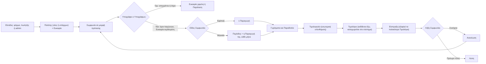
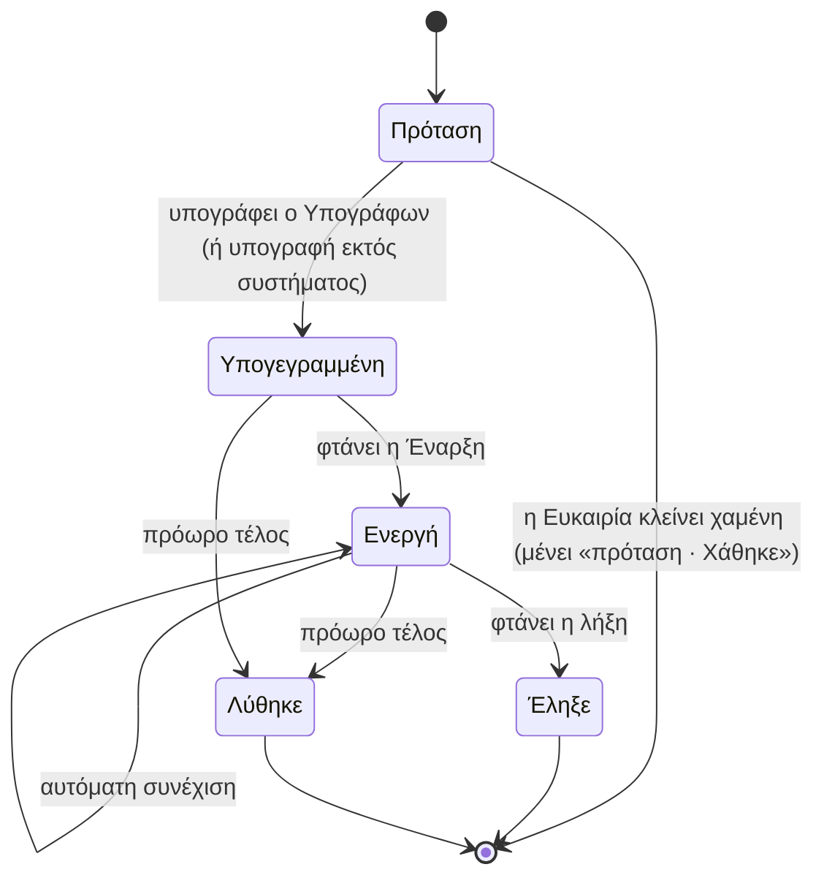
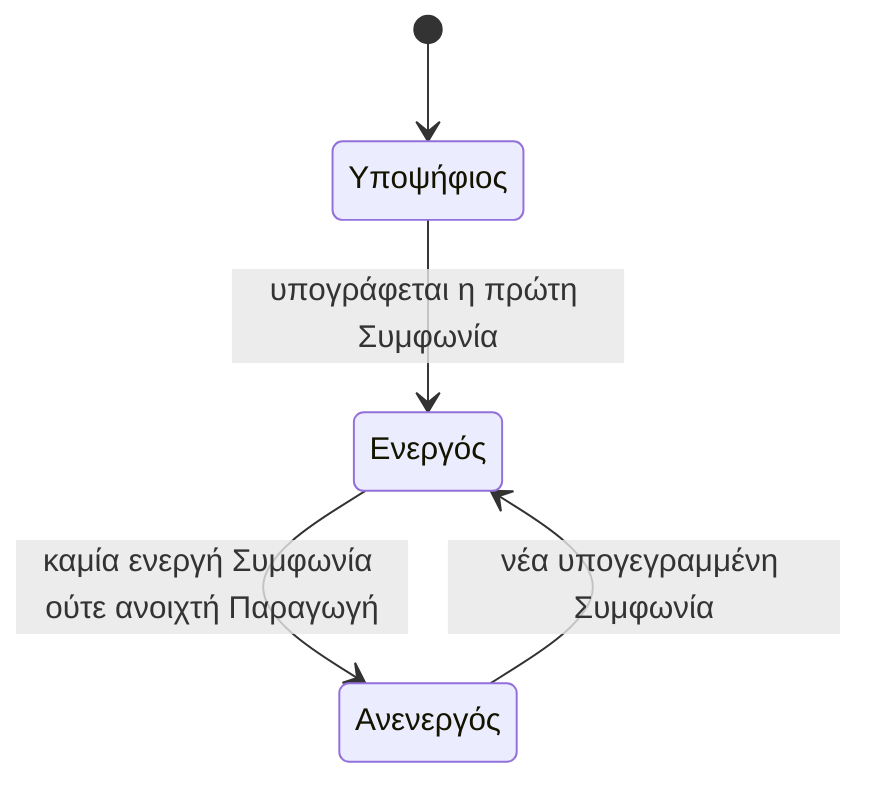

# Η ραχοκοκαλιά: από την πρώτη επαφή ως την Είσπραξη

> **👁️ Με μια ματιά**
> Μία γραμμή δουλειάς για όλη την εταιρεία: **Πελάτης + Ευκαιρία → Συμφωνία → Παραγωγή → Τιμολογητέο → Τιμολόγιο → Είσπραξη**. Κάθε βήμα γεννά αυτόματα το επόμενο, και κάθε Παραγωγή πελάτη ανήκει σε μία Συμφωνία.
> Σήμερα οι εμπορικοί όροι ζουν σε τέσσερα ασύνδετα σημεία (πρόταση, συμβόλαιο, πακέτο, τιμή έργου) και ξαναγράφονται με το χέρι. Το Γύρισμα μπαίνει από πολλές διαδρομές και η αποδοχή μιας πρότασης δεν ξεκινά τίποτα.
> Στο νέο σύστημα οι όροι γράφονται μία φορά, παγώνουν με την υπογραφή του πελάτη, και από εκεί βγαίνουν μόνα τους οι Περίοδοι, οι Παραγωγές και οι υπενθυμίσεις για Τιμολόγιο.
> Η οφειλή του πελάτη γεννιέται μόνο όταν υπάρξει **Τιμολόγιο**. Όσο δεν έχει κοπεί τιμολόγιο, υπάρχει μόνο μια εσωτερική υπενθύμιση προς εμάς.

Αυτό το κεφάλαιο είναι η μεγάλη εικόνα. Κάθε βήμα έχει δικό του κεφάλαιο με τη λεπτομέρεια, και εδώ υπάρχει μόνο η παραπομπή.

## 🚦 Πότε ξεκινά

Ξεκινά με **κάθε είσοδο**: ένας Επισκέπτης συμπληρώνει τη φόρμα ενδιαφέροντος στην Ιστοσελίδα, ένας πωλητής καταχωρεί μια επαφή, ή ο admin φτιάχνει μια Ευκαιρία με το χέρι. Και στις τρεις περιπτώσεις το αποτέλεσμα είναι το ίδιο: ένας Πελάτης (νέος ή υπάρχων) και μία Ευκαιρία. **Γύρισμα δεν γεννιέται ποτέ από την είσοδο.**

Τελειώνει όταν ο πελάτης έχει πληρώσει όλα τα Τιμολόγιά του και η Συμφωνία έχει λήξει, ανανεωθεί ή λυθεί. Για τον Πελάτη η ροή δεν «κλείνει»: ένας ενεργός Πελάτης μπορεί να έχει πολλές Συμφωνίες ταυτόχρονα, και κάθε μία τρέχει τον δικό της κύκλο.

## 👥 Ποιος συμμετέχει

| Ποιος | Τι κάνει στη ραχοκοκαλιά |
|---|---|
| **Επισκέπτης** | Ζητά προσφορά από την Ιστοσελίδα. Δεν έχει λογαριασμό. |
| **Πωλήσεις / Υπεύθυνος Ευκαιρίας** | Δουλεύει την Ευκαιρία, φτιάχνει την πρόταση, την στέλνει. |
| **Άνθρωπος με το Δικαίωμα «Παρεκκλίνει από τον Κατάλογο»** | Εγκρίνει προτάσεις που είναι χειρότερες για την εταιρεία από τον Κατάλογο. |
| **Υπογράφων του πελάτη** | Ο μόνος που υπογράφει ή απορρίπτει την πρόταση. |
| **Χρήστης πελάτη** | Κλείνει Γυρίσματα, εγκρίνει Παραδοτέα, βλέπει Τιμολόγια και υπόλοιπο, μιλά με την ομάδα. |
| **Παραγωγή (ρόλος και Υπεύθυνος Παραγωγής)** | Στήνει Γυρίσματα και Συνεργεία, δουλεύει τα Παραδοτέα, παραδίδει. |
| **Διαχείριση και Ιδιοκτήτης** | Εγκρίνουν κρατήσεις, παρακολουθούν το «Προς τιμολόγηση», καταχωρούν Εισπράξεις, λύνουν ή ανανεώνουν Συμφωνίες. |
| **Λογιστής** | Ειδοποιείται για κάθε νέο Τιμολογητέο και βλέπει τα οικονομικά, μόνο για ανάγνωση. |

Ποιος ακριβώς έχει ποιο Δικαίωμα φαίνεται στο κεφάλαιο των ρόλων. Εδώ ισχύει ο κανόνας ότι το σύστημα ελέγχει **Δικαιώματα**, όχι ονόματα ρόλων.

## 🪜 Βήματα

Το διάγραμμα δείχνει την πλήρη διαδρομή. Οι ρομβοειδείς κόμβοι είναι οι διακλαδώσεις.

| # | Βήμα | Υπεύθυνος | Τι γίνεται | Λεπτομέρεια |
|---|---|---|---|---|
| 1 | **Είσοδος** | Επισκέπτης, πωλητής ή admin | Η Πηγή είναι υποχρεωτική. Το σύστημα βρίσκει τον Πελάτη ή φτιάχνει νέο, και ανοίγει Ευκαιρία. | `02-sales.md` |
| 2 | **Πρόταση** | Υπεύθυνος της Ευκαιρίας | Φτιάχνεται Συμφωνία μέσα από την Ευκαιρία (το πολύ μία ανά Ευκαιρία). Αντιγράφει τιμές από τον Κατάλογο και Όρους από τις προεπιλογές, και αλλάζουν ελεύθερα όσο είναι πρόταση. | `02-sales.md`, `03-catalogue-agreement-cost.md` |
| 3 | **Υπογραφή** | Υπογράφων του πελάτη | Οι όροι παγώνουν. Η Ευκαιρία γίνεται κερδισμένη μόνη της. Ο Υπογράφων προσκαλείται ως Χρήστης πελάτη. | `02-sales.md` |
| 4 | **Αυτόματο στήσιμο** | Το σύστημα | Εφάπαξ Συμφωνία: μία Παραγωγή. Μηνιαία: στην Έναρξη ανοίγει η πρώτη Περίοδος με τη δική της Παραγωγή, και το ίδιο κάθε επόμενο ημερολογιακό μήνα. Η Έναρξη είναι η μέρα της υπογραφής ή η ημερομηνία που ορίζει η πρόταση· η πρώτη και η τελευταία Περίοδος μπορεί να είναι μερικές. Όλα γίνονται μαζί, ή καθόλου. | `03-catalogue-agreement-cost.md` |
| 5 | **Γυρίσματα** | Πελάτης ή ομάδα | Το Γύρισμα είναι μία οντότητα. Η κράτηση του πελάτη είναι Γύρισμα «αναμένει έγκριση», που δεσμεύει Παροχή και διαθεσιμότητα αμέσως. | `04-filming-and-calendar.md` |
| 6 | **Παραδοτέα** | Ομάδα και Χρήστης πελάτη | Η ομάδα δημιουργεί το Παραδοτέο και δεσμεύεται Παροχή. Ο πελάτης εγκρίνει, και η έγκριση είναι οριστική. Όταν εγκριθούν όλα, η Παραγωγή γίνεται παραδομένη. | `05-deliverables.md` |
| 7 | **Τιμολογητέο** | Το σύστημα | Γεννιέται μόνο του: δόση σε ορόσημο (εφάπαξ), ποσό Περιόδου στην αρχή της (μηνιαία), ή έξτρα πέρα από τις Παροχές. Ειδοποιεί όσους καταχωρούν Τιμολόγια και τον Λογιστή. | `07-invoicing-and-payments.md` |
| 8 | **Τιμολόγιο** | Όποιος έχει το Δικαίωμα «Καταχωρεί Τιμολόγια» | Το φορολογικό παραστατικό κόβεται **έξω** από το σύστημα. Ανεβαίνει το PDF και **μόνο τότε** ο πελάτης χρωστά. | `07-invoicing-and-payments.md` |
| 9 | **Είσπραξη** | Όποιος έχει το Δικαίωμα «Καταχωρεί Εισπράξεις» | Τα χρήματα πάνε στον λογαριασμό του Πελάτη και εξοφλούν πρώτα τα παλαιότερα Τιμολόγια. Επιτρέπονται μερικές πληρωμές. | `07-invoicing-and-payments.md` |
| 10 | **Λήξη** | Όποιος έχει το Δικαίωμα «Λύει Συμφωνία» για τη Λύση και το «Χωρίς συνέχιση»· ο Υπεύθυνος της νέας Ευκαιρίας για την Ανανέωση | Η Συμφωνία λήγει, ανανεώνεται ή λύνεται πρόωρα. Στην αυτόματη συνέχιση η ίδια Συμφωνία συνεχίζει με τους ίδιους όρους· στη «νέα Ευκαιρία» το σύστημα ανοίγει Ευκαιρία «ανανέωση» 30 μέρες πριν. | `03-catalogue-agreement-cost.md` |

Τα μηνύματα προς τον πελάτη και τα Αιτήματά του τρέχουν παράλληλα σε όλη τη διαδρομή, μέσα σε μία Συνομιλία ανά Πελάτη. Δείτε `06-messages-and-requests.md`.

### Οι τρεις κανόνες που κρατούν τη ροή ενιαία

1. **Τιμή και όροι ζουν σε ένα μόνο σημείο, τη Συμφωνία.** Ο Κατάλογος δίνει την αρχή. Αν αλλάξει τιμή στον Κατάλογο, όσα έχουν ήδη υπογραφεί δεν αλλάζουν.
2. **Δουλειά πελάτη χωρίς Συμφωνία δεν υπάρχει.** Χωρίς Συμφωνία δεν υπάρχει τιμή, άρα ούτε Τιμολογητέο ούτε κερδοφορία. Ένα έξτρα αντικείμενο που ζητά ο πελάτης γίνεται δεύτερη Συμφωνία. Εξαίρεση μόνο η Εσωτερική Παραγωγή (π.χ. showreel), που δεν έχει Πελάτη.
3. **Η οφειλή γεννιέται μόνο από Τιμολόγιο.** Το Τιμολογητέο είναι εσωτερική υπενθύμιση. Ο πελάτης δεν το βλέπει και δεν ανεβάζει το υπόλοιπό του.

## 🔄 Καταστάσεις

Η ραχοκοκαλιά περνά από τέσσερα αντικείμενα με δικό τους κύκλο ζωής. Οι περισσότερες καταστάσεις **προκύπτουν μόνες τους** και δεν γράφονται με το χέρι.

### Συμφωνία

| Κατάσταση | Τι σημαίνει | Πώς βγαίνει |
|---|---|---|
| **Πρόταση** | Οι όροι αναθεωρούνται με ιστορικό. Ο πελάτης δεν έχει δεσμευτεί. | Υπογραφή, ή η Ευκαιρία κλείνει ως χαμένη. Τότε η Συμφωνία **μένει «πρόταση»** με πορεία «Χάθηκε»: κλειδώνει μόνο για ανάγνωση και κρατιέται ως ιστορικό του τι προσφέρθηκε. Δεν υπάρχει κατάσταση «απορρίφθηκε». |
| **Υπογεγραμμένη** | Οι όροι έχουν παγώσει. Η δουλειά δεν έχει ξεκινήσει. | Φτάνει η Έναρξη, ή Λύση. |
| **Ενεργή** | Τρέχουν Περίοδοι, Παραγωγές, Τιμολογητέα. | Λήξη ή Λύση. Με αυτόματη συνέχιση μένει ενεργή για άλλη μία Διάρκεια. |
| **Έληξε** | Ο χρόνος της τελείωσε. Η μηνιαία λήγει στο τέλος της Διάρκειας, η εφάπαξ όταν παραδοθεί η Παραγωγή της. Ό,τι έχει ήδη γεννηθεί (ανοιχτές Παραγωγές, Τιμολογητέα) μένει. | Τέλος. Η συνέχεια είναι νέα Συμφωνία από Ευκαιρία «ανανέωση». |
| **Λύθηκε** | Πρόωρο τέλος, με ημερομηνία και λόγο. Δεν γεννιούνται νέες Περίοδοι ή Τιμολογητέα. Όσα έχουν ήδη γεννηθεί μένουν. Αν προβλέπεται ρήτρα, γεννιέται Τιμολογητέο λύσης. | Τέλος. |

### Ευκαιρία

| Έκβαση | Πώς γίνεται |
|---|---|
| **Ανοιχτή** | Είναι η αρχική κατάσταση. Μέσα της μπαίνουν τα Στάδια του admin. |
| **Κερδισμένη** | Μόνο το σύστημα την βάζει, με την υπογραφή της Συμφωνίας. |
| **Χαμένη** | Το σύστημα την βάζει όταν ο Υπογράφων απορρίψει. Ο άνθρωπος την βάζει με το χέρι, με υποχρεωτικό Λόγο απώλειας. |

Η λήξη της πρότασης **δεν** χάνει την Ευκαιρία. Δείτε `02-sales.md`.

### Πελάτης

| Κατάσταση | Τι σημαίνει |
|---|---|
| **Υποψήφιος** | Καμία υπογεγραμμένη Συμφωνία ακόμα. |
| **Ενεργός** | Τουλάχιστον μία ενεργή Συμφωνία ή μία ανοιχτή Παραγωγή. |
| **Ανενεργός** | Τίποτα από τα δύο. |

Η κατάσταση είναι **μόνο ένδειξη** και την υπολογίζει το σύστημα. Οι Χρήστες πελάτη ενός ανενεργού Πελάτη συνεχίζουν να συνδέονται και να μιλούν με την ομάδα.

### Παραγωγή και Τιμολογητέο

| Αντικείμενο | Πώς προχωρά | Έξοδος |
|---|---|---|
| **Παραγωγή** | Η κατάστασή της προκύπτει από τα Γυρίσματα, τις εργασίες και τα Παραδοτέα της. | Γίνεται **παραδομένη** μόνη της όταν εγκριθούν όλα τα Παραδοτέα, ή με το χέρι από την ομάδα με υποχρεωτικό σχόλιο. Σιωπηρή έγκριση δεν υπάρχει. |
| **Τιμολογητέο** | Γεννιέται αυτόματα και περιμένει Τιμολόγιο. | Κλείνει όταν τα Τιμολόγια του Πελάτη το καλύψουν, ξεκινώντας από τα παλαιότερα Τιμολογητέα. |
| **Τιμολόγιο** | Καταχωρείται με το PDF του. | Γίνεται ληξιπρόθεσμο μετά από όσες μέρες ορίζει η Συμφωνία, και κλείνει όταν εξοφληθεί. Ένα πιστωτικό δένεται με το Τιμολόγιο που διορθώνει και μειώνει την οφειλή. |

Η Περίοδος μιας μηνιαίας Συμφωνίας κλείνει **οικονομικά** στο τέλος του κύκλου, ενώ η Παραγωγή της μένει ανοιχτή μέχρι να παραδοθεί ή να ακυρωθεί και το τελευταίο Παραδοτέο.

## 🔔 Ειδοποιήσεις

Οι παρακάτω ειδοποιήσεις έρχονται **ενεργές από την αρχή**. Ο admin μπορεί να τις αλλάξει, να προσθέσει άλλες πάνω στα ίδια Γεγονότα ή να σβήσει όσες δεν χρειάζονται (εκτός από τα Μηνύματα συστήματος, που μένουν πάντα ενεργά).

| Πότε | Ποιος παίρνει | Πώς |
|---|---|---|
| Νέα Ευκαιρία από τη φόρμα | Όσοι έχουν Δικαίωμα Πωλήσεων. Ο Επισκέπτης παίρνει επιβεβαίωση ότι λάβαμε το αίτημά του. | Ειδοποίηση· email για τον Επισκέπτη |
| Υπογράφηκε Συμφωνία | Ο πελάτης (με το PDF της Συμφωνίας) και η Διαχείριση. | Email (απαραίτητο)· Ειδοποίηση |
| Λήγει ή συνεχίζεται αυτόματα Συμφωνία (30 μέρες πριν) | Ο πελάτης και η Διαχείριση. | Email· Ειδοποίηση |
| Ανοίγει Περίοδος | Ο πελάτης: την ημέρα έναρξης, και 5 μέρες πριν με υπενθύμιση να κλείσει Γύρισμα. | Email |
| Παραγωγή παραδόθηκε | Ο πελάτης. | Email |
| Γεννήθηκε Τιμολογητέο | Όσοι έχουν «Καταχωρεί Τιμολόγια» και ο Λογιστής. | Ειδοποίηση |
| Καταχωρήθηκε Τιμολόγιο | Ο πελάτης, με το PDF. | Email (απαραίτητο) |
| Τιμολόγιο ληξιπρόθεσμο | Ο πελάτης και η Διαχείριση. | Email· Ειδοποίηση |
| Καταχωρήθηκε Είσπραξη | Κανείς από την αρχή. Είναι διαθέσιμο αν θελήσει ο admin. | Ειδοποίηση ή email, κατά επιλογή |

Οι ειδοποιήσεις κάθε επιμέρους βήματος (πωλήσεις, Γυρίσματα, Παραδοτέα) περιγράφονται στα κεφάλαιά τους.

## ⚠️ Εξαιρέσεις

| Τι γίνεται όταν… | Τι κάνει το σύστημα |
|---|---|
| Ο πελάτης ζητά **έξτρα δουλειά πέρα από τις Παροχές** | Γεννιέται Τιμολογητέο έξτρα με την τιμή της αντίστοιχης Υπηρεσίας όπως τη γράφει η Συμφωνία. Δεν υπάρχει ξεχωριστή «τιμή έξτρα». |
| Ο πελάτης ζητά **ολόκληρο νέο αντικείμενο** | Φτιάχνεται δεύτερη Συμφωνία, μέσα από νέα Ευκαιρία. |
| **Τελειώνει ο μήνας με ανοιχτή δουλειά** | Το Παραδοτέο μένει για πάντα στην Περίοδο που κατανάλωσε την Παροχή του. Έχει δική του προθεσμία και η ομάδα δουλεύει από μία ουρά κατά προθεσμία. Δεν μεταφέρεται σε επόμενο μήνα. |
| **Περισσεύουν Παροχές** | Χάνονται, περνούν μόνο στην επόμενη Περίοδο ή μαζεύονται ως τη λήξη. Το ορίζουν οι Όροι κάθε Συμφωνίας. Προεπιλογή: μόνο στην επόμενη Περίοδο. |
| **Ξεχάστηκε να κοπεί τιμολόγιο** | Ο πελάτης θα φαίνεται να μη χρωστά. Το αντίβαρο είναι η ειδοποίηση για κάθε Τιμολογητέο και η λίστα «Προς τιμολόγηση». |
| **Λάθος στο Τιμολόγιο** | Καταχωρείται πιστωτικό, δεμένο με το Τιμολόγιο που διορθώνει. Μειώνει την οφειλή. |
| **Ο πελάτης πληρώνει μέρος** | Επιτρέπεται. Η Είσπραξη εξοφλεί ό,τι χωράει, ξεκινώντας από τα παλαιότερα Τιμολόγια. |
| **Ο πελάτης ζητά αλλαγή σε εγκεκριμένο Παραδοτέο** | Δεν σβήνει την έγκριση ούτε ό,τι γέννησε. Ο Υπεύθυνος της Παραγωγής διαλέγει: γύρος, χρεώνεται ή νέο Παραδοτέο. |
| **Πρόωρη λύση Συμφωνίας** | Η Συμφωνία λύνεται με ημερομηνία και λόγο. Δεν γεννιούνται νέες Περίοδοι ή Τιμολογητέα. Αν υπάρχει ρήτρα, γεννιέται Τιμολογητέο λύσης. Η λεπτομέρεια είναι στο `03-catalogue-agreement-cost.md`, ενότητα «Λύση». |
| **Ο Πελάτης γίνεται ανενεργός** | Τίποτα δεν κόβεται. Οι Χρήστες του συνεχίζουν να συνδέονται και να επικοινωνούν. |
| **Ο πελάτης απαιτεί πιστοποιημένη (qualified) υπογραφή** | Υπογράφει έξω από το σύστημα και η ομάδα καταχωρεί «Υπογράφηκε εκτός συστήματος» με το αρχείο. Βλ. `03-catalogue-agreement-cost.md`. |

## ⚙️ Τι ρυθμίζει ο admin

Τίποτα στη ραχοκοκαλιά δεν είναι κλειδωμένο μέσα στο σύστημα. Ο admin αλλάζει, χωρίς προγραμματιστή:

| Τι | Πού |
|---|---|
| Στάδια, Πηγές, Λόγοι απώλειας, είδη Δραστηριότητας | Λίστες στις Ρυθμίσεις |
| Πακέτα, Υπηρεσίες, είδη Παροχών και μονάδες τους, τιμές | Κατάλογος |
| Προεπιλεγμένοι Όροι Συμφωνίας (ένα σετ για μηνιαίες, ένα για εφάπαξ): μέρες πληρωμής, αχρησιμοποίητες Παροχές, Περίοδος χάριτος, διάρκεια και Ανανέωση, ρήτρα λύσης, δόσεις σε ορόσημα | Ρυθμίσεις (και ελεύθερη αλλαγή ανά Συμφωνία όσο είναι πρόταση) |
| Ισχύς πρότασης (σε μέρες) | Ρυθμίσεις (και αλλαγή ανά πρόταση) |
| Ποιες ειδοποιήσεις στέλνονται, σε ποιον, πότε και με ποιο κείμενο | Αυτοματισμοί |
| Ποιος μπορεί να κάνει τι (π.χ. να παρεκκλίνει, να καταχωρεί Τιμολόγια) | Ρόλοι |
| Στοιχεία εταιρείας, ΦΠΑ, λογαριασμοί τράπεζας | Ρυθμίσεις (μόνο ο Ιδιοκτήτης) |

**Κάθε αλλαγή ισχύει μόνο προς τα εμπρός.** Οι προεπιλογές αντιγράφονται όταν δημιουργείται ένα στοιχείο, και ό,τι έχει ήδη γίνει δεν αλλάζει. Μια τιμή που έχει ήδη χρησιμοποιηθεί δεν διαγράφεται: αποσύρεται (φεύγει από τις νέες επιλογές αλλά μένει στα παλιά στοιχεία).

## 🙋 Τι βλέπει ο πελάτης

| Βλέπει | Δεν βλέπει |
|---|---|
| Την πρόταση, με γραμμές, Παροχές, τιμή και Όρους, και την υπογράφει. | Κόστος, ώρες ή περιθώριο. |
| Την πρόοδο ανά Περίοδο και τι «αναμένει εκείνον». | Την ένδειξη καθυστέρησης (είναι εσωτερική). |
| Τα Γυρίσματά του και τα Παραδοτέα του. | Τα Τιμολογητέα. |
| Την Καρτέλα Πελάτη: Τιμολόγια, Εισπράξεις και υπόλοιπο. | Τα Εσωτερικά Μηνύματα της ομάδας. |
| Τη Συνομιλία με την ομάδα. | |

Δεν υπάρχει δημόσια σελίδα πληρωμής ούτε δημόσιος σύνδεσμος Παραδοτέων. Τα Τιμολόγια και το υπόλοιπο φαίνονται στον λογαριασμό του πελάτη και στο email (τραπεζικά στοιχεία, κωδικός πληρωμής RF). Όποιος εγκρίνει Παραδοτέο είναι Χρήστης πελάτη.

## 🔗 Πού ακουμπά άλλες ροές

| Κεφάλαιο | Τι καλύπτει |
|---|---|
| `02-sales.md` | Από την Ευκαιρία ως την υπογεγραμμένη Συμφωνία. |
| `03-catalogue-agreement-cost.md` | Κατάλογος, γραμμές και Όροι Συμφωνίας, Περίοδοι, μοντέλο κόστους και περιθώριο. |
| `04-filming-and-calendar.md` | Γυρίσματα, κρατήσεις, Συνεργεία, Δελτίο γυρίσματος, Ημερολόγιο. |
| `05-deliverables.md` | Παραδοτέα, Εκδόσεις, εγκρίσεις, αλλαγές. |
| `06-messages-and-requests.md` | Συνομιλία ανά Πελάτη και Αιτήματα. |
| `07-invoicing-and-payments.md` | Τιμολογητέο, Τιμολόγιο, Εισπράξεις, Καρτέλα Πελάτη. |

Η ροή αγγίζει επίσης τα κεφάλαια για τους ρόλους και τα Δικαιώματα, τις Ρυθμίσεις και τους Αυτοματισμούς.

**Αργότερα (μετά το v1):** έκδοση Τιμολογίων μέσα από το σύστημα με διαβίβαση στην ΑΑΔΕ, πληρωμή με κάρτα, συνεργάτες freelancers.

## 📖 Σενάρια

### 1. Η πρώτη δουλειά του «Καφέ Αθηνά»

Η κ. Μαρία από το «Καφέ Αθηνά» συμπληρώνει τη φόρμα στην Ιστοσελίδα. Το σύστημα φτιάχνει νέο Πελάτη και Ευκαιρία με Πηγή «Ιστοσελίδα». Η Ευκαιρία μπαίνει στην ουρά «Χωρίς υπεύθυνο», και ένας πωλητής την αναλαμβάνει. Φτιάχνει μηνιαία Συμφωνία «2 Γυρίσματα και 8 reels τον μήνα» (φανταστική τιμή 1.000 € + ΦΠΑ) με Έναρξη την 1η του επόμενου μήνα, την στέλνει, και η κ. Μαρία την υπογράφει με κωδικό που παίρνει στο email της. Η Ευκαιρία γίνεται κερδισμένη, η κ. Μαρία παίρνει πρόσκληση για λογαριασμό, και την 1η του μήνα ανοίγει η πρώτη Περίοδος, ολόκληρη, με τη δική της Παραγωγή. Την ίδια μέρα γεννιέται Τιμολογητέο 1.000 €, και η Διαχείριση με τον Λογιστή ειδοποιούνται.

### 2. Το Τιμολόγιο και η καθυστέρηση στο «Γυμναστήριο Κίνηση»

Η Διαχείριση βλέπει το ποσό «Προς τιμολόγηση» και ζητά να κοπεί τιμολόγιο. Το τιμολόγιο εκδίδεται έξω από το σύστημα, από τον λογιστή της εταιρείας, και ανεβαίνει ως PDF. Μόνο τότε το «Γυμναστήριο Κίνηση» χρωστά 1.240 € (με ΦΠΑ), και το βλέπει στην Καρτέλα του. Πληρώνει 500 € και η Είσπραξη εξοφλεί μέρος του. Όταν περάσουν οι μέρες που ορίζει η Συμφωνία, το Τιμολόγιο γίνεται ληξιπρόθεσμο για το υπόλοιπο 740 €, και ο πελάτης και η Διαχείριση ειδοποιούνται.

### 3. Έξτρα δουλειά και λήξη στο «Ζαχαροπλαστείο Μέλι»

Το «Ζαχαροπλαστείο Μέλι» έχει μηνιαία Συμφωνία με 8 reels τον μήνα και ζητά το 9ο. Γεννιέται Τιμολογητέο έξτρα με την τιμή που γράφει η Συμφωνία για το «έξτρα reel». Η Συμφωνία του έχει Ανανέωση με «νέα Ευκαιρία». Δύο μήνες αργότερα, 30 μέρες πριν τη λήξη, ο πελάτης και η Διαχείριση ειδοποιούνται, και το σύστημα ανοίγει μόνο του Ευκαιρία «ανανέωση» με αντίγραφο της πρότασης στις τρέχουσες τιμές του Καταλόγου. Ο Υπεύθυνος την ελέγχει και την στέλνει. Η παλιά Συμφωνία λήγει, οι ανοιχτές Παραγωγές της μένουν ως την παράδοση. Αν η Συμφωνία είχε αυτόματη συνέχιση, θα συνέχιζε η ίδια, με τις ίδιες τιμές, χωρίς νέα υπογραφή.

✅ Κανόνες που θα ελέγχονται

- **Δεδομένου ότι** ένας Επισκέπτης στέλνει τη φόρμα, **όταν** το σύστημα την επεξεργάζεται, **τότε** δημιουργείται Ευκαιρία (και Πελάτης αν δεν υπάρχει) και **δεν** δημιουργείται Γύρισμα.
- **Δεδομένου ότι** μια Συμφωνία είναι πρόταση, **όταν** ο Υπογράφων την υπογράψει, **τότε** οι όροι παγώνουν και η Ευκαιρία της γίνεται κερδισμένη χωρίς ανθρώπινη ενέργεια.
- **Δεδομένου ότι** μια μηνιαία Συμφωνία γίνεται ενεργή, **όταν** ανοίγει ένας κύκλος, **τότε** ανοίγει αυτόματα Περίοδος με τη δική της Παραγωγή. Οι κανόνες της Έναρξης και των μερικών Περιόδων ελέγχονται στο `03-catalogue-agreement-cost.md`.
- **Δεδομένου ότι** μια Παραγωγή ανήκει σε Πελάτη, **όταν** δημιουργείται, **τότε** ανήκει σε μία Συμφωνία. Μόνο η Εσωτερική Παραγωγή είναι χωρίς Συμφωνία.
- **Δεδομένου ότι** αλλάζει τιμή στον Κατάλογο, **όταν** υπάρχει ήδη υπογεγραμμένη Συμφωνία, **τότε** η Συμφωνία κρατά τις τιμές που υπέγραψε ο πελάτης.
- **Δεδομένου ότι** γεννιέται Τιμολογητέο, **όταν** δεν έχει καταχωρηθεί Τιμολόγιο, **τότε** το υπόλοιπο του πελάτη δεν αλλάζει και ο πελάτης δεν το βλέπει.
- **Δεδομένου ότι** καταχωρείται Τιμολόγιο, **όταν** αποθηκεύεται, **τότε** ανεβαίνει το υπόλοιπο του πελάτη και καλύπτονται τα παλαιότερα Τιμολογητέα του.
- **Δεδομένου ότι** καταχωρείται Είσπραξη, **όταν** ο πελάτης έχει ανοιχτά Τιμολόγια, **τότε** εξοφλούνται πρώτα τα παλαιότερα, χωρίς αντιστοίχιση με το χέρι.
- **Δεδομένου ότι** καταχωρείται πιστωτικό, **όταν** δένεται με Τιμολόγιο, **τότε** το υπόλοιπο του πελάτη μειώνεται.
- **Δεδομένου ότι** μια Συμφωνία λύνεται, **όταν** έχει ορίσει ημερομηνία και λόγο, **τότε** δεν γεννιούνται νέες Περίοδοι ή Τιμολογητέα και όσα έχουν γεννηθεί μένουν.
- **Δεδομένου ότι** κάθε Παραδοτέο ανήκει σε Περίοδο, **όταν** τελειώνει ο κύκλος, **τότε** το Παραδοτέο μένει στην Περίοδο που κατανάλωσε.
- **Δεδομένου ότι** ένας Πελάτης δεν έχει καμία ενεργή Συμφωνία ούτε ανοιχτή Παραγωγή, **όταν** υπολογίζεται η κατάστασή του, **τότε** γίνεται ανενεργός και οι Χρήστες του συνεχίζουν να συνδέονται.

## 🧭 Καθοδηγούμενα σενάρια: τι βρέθηκε

Ελέγχθηκε με το ticket [Καθοδηγούμενα σενάρια](https://github.com/ntontischris/dmsfinal/issues/94). Ο φανταστικός πελάτης «Κυψέλη Καφέ» πέρασε όλη τη ραχοκοκαλιά στο prototype (`/scenarios`): ένα σενάριο ανά ρόλο και ένα «Με έναν άνθρωπο». Οι 87 οθόνες χτίστηκαν σε 17 χωριστά tickets. Ο έλεγχος βρήκε περίπου 90 σημεία που δεν έδεναν, κυρίως στα φανταστικά δεδομένα: ονόματα, ημερομηνίες, ειδοποιήσεις για πράγματα που δεν υπήρχαν, σύνδεσμοι σε λάθος οθόνη. Διορθώθηκαν όλα.

Οι **κανόνες** που βγήκαν από τον έλεγχο, και ισχύουν για την υλοποίηση:

- **Μία πηγή για κάθε λίστα και προεπιλογή.** Η οθόνη Ρυθμίσεων και η οθόνη που χρησιμοποιεί μια τιμή διαβάζουν το ίδιο πράγμα. Αυτό ισχύει για τους Τρόπους είσπραξης, τις Πηγές, τα Στάδια, τους Λόγους απώλειας, τους προεπιλεγμένους Όρους, το Ωράριο κρατήσεων, το κόστος του μήνα και τα στοιχεία πληρωμής. Στο prototype υπήρχαν δεύτερα αντίγραφα που απέκλιναν.
- **Κανένας σύνδεσμος δεν οδηγεί σε «Χωρίς δικαίωμα».** Ένας σύνδεσμος προς οθόνη που ο ρόλος δεν έχει είτε κρύβεται, είτε δείχνει στην αντίστοιχη οθόνη του ρόλου. Για τον πελάτη, το Παραδοτέο ανοίγει στην H4 και όχι στην H2, και τα Μηνύματα στην J3 και όχι στη J1 ή τη J2. Το ποιος ανοίγει τι βγαίνει από τον κατάλογο οθονών του κεφ. 8 και δεν ξαναγράφεται.
- **Οι δημόσιες σελίδες (R1–R13) ανοίγουν για όλους.** Ένας συνδεδεμένος Χρήστης που βλέπει την Ιστοσελίδα βλέπει ό,τι και ο Επισκέπτης (κεφ. 8).
- **Νέες Ευκαιρίες από τη φόρμα:** η προεπιλογή είναι η ουρά «Χωρίς υπεύθυνο». Όσο ένας μόνο άνθρωπος αναθέτει, η ουρά δεν φαίνεται και η Ευκαιρία πάει σε αυτόν (κεφ. 5).
- **Η Ανανέωση ανοίγει και νωρίτερα, με το χέρι.** Η πρόταση της έρχεται στις τρέχουσες τιμές του Καταλόγου. Μια Παρέκκλιση της παλιάς Συμφωνίας (π.χ. έκπτωση πρώτου πελάτη) δεν μεταφέρεται μόνη της.
- **Οι Όροι κρατούν ό,τι ίσχυε όταν υπογράφηκαν** (ADR 0015). Έτσι, αν αλλάξει μια προεπιλογή (π.χ. όριο ακύρωσης από 48 σε 24 ώρες), η αλλαγή ισχύει μόνο για νέες προτάσεις. Το όριο γύρων ενός Παραδοτέου έρχεται από τους Όρους της Συμφωνίας του.
- **Κάθε ειδοποίηση και κάθε εγγραφή στο Ιστορικό αποστολών ή στο Ίχνος ανοίγει το συγκεκριμένο αντικείμενο** που αφορά, όχι την αρχή μιας λίστας.

**Τι δεν δείχνει το prototype**, γιατί δεν αποθηκεύει:
- μια ενέργεια δεν αλλάζει τις επόμενες οθόνες, π.χ. ένα Τιμολόγιο που καταχωρείται δεν μειώνει το υπόλοιπο,
- η συνέχεια της εφάπαξ «Βίντεο εγκαινίων» μετά την υπογραφή (Παραγωγή, δόσεις).

Κάθε βήμα σεναρίου δείχνει την Κυψέλη τη στιγμή που βρίσκεται σε εκείνο το σημείο: μια κλειστή Περίοδο, την τρέχουσα, την πρόταση που περιμένει υπογραφή.

## ❓ Ανοιχτά ερωτήματα

*Όλα κλείστηκαν. Το #3 με το ticket [Πελάτες και Πωλήσεις](https://github.com/ntontischris/dmsfinal/issues/59). Το #2 (ημερομηνία έναρξης) με το ticket [Συμφωνίες](https://github.com/ntontischris/dmsfinal/issues/62), στο `03-catalogue-agreement-cost.md`. Το #5 με το ticket [Παραγωγές](https://github.com/ntontischris/dmsfinal/issues/72): η εφάπαξ ανοίγει Παραγωγή χωρίς έτοιμα Παραδοτέα. Τα #1 (Είσπραξη πριν το Τιμολόγιο: «υπόλοιπο υπέρ του πελάτη», που συμψηφίζεται με το επόμενο Τιμολόγιο) και #4 (Τιμολόγια καταχωρεί όποιος έχει «Καταχωρεί Τιμολόγια», αρχικά μόνο ο Ιδιοκτήτης) αποφασίστηκαν στο κλείσιμο των ανοιχτών ερωτημάτων του Blueprint και επιβεβαιώθηκαν με το ticket [Οικονομικά](https://github.com/ntontischris/dmsfinal/issues/76), στο `07-invoicing-and-payments.md`.*

Πηγές

- ADR 0002 (η ραχοκοκαλιά), ADR 0004 (το Τιμολόγιο είναι η οφειλή), ADR 0008 (η Συμφωνία είναι γραμμές, οι Όροι είναι προεπιλογές).
- Issue #8 (η ραχοκοκαλιά), και για τις αρχικές ειδοποιήσεις το issue #14. Issue #62 (Συμφωνίες: Έναρξη, Περίοδοι, Ανανέωση, Λύση).
- `CONTEXT.md`: Πελάτης, Ευκαιρία, Συμφωνία, Περίοδος, Παραγωγή, Παραδοτέο, Τιμολογητέο, Τιμολόγιο, Είσπραξη, Καρτέλα Πελάτη, Ανανέωση.

