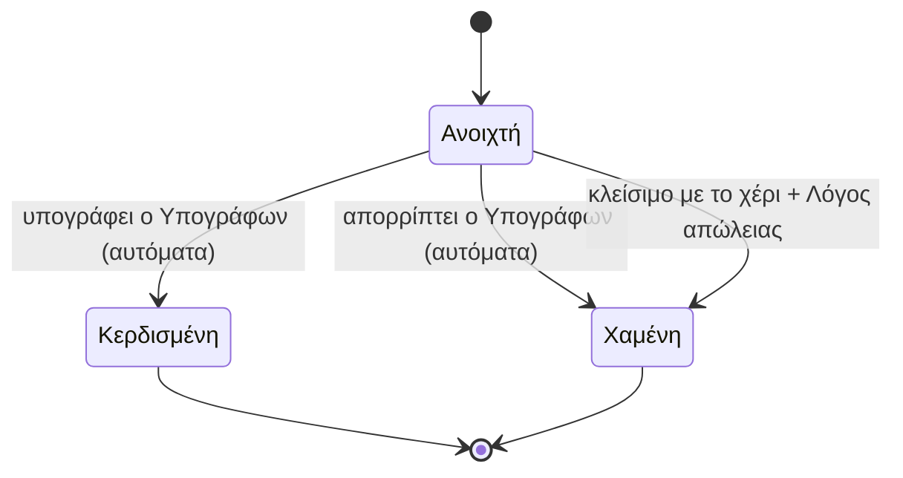
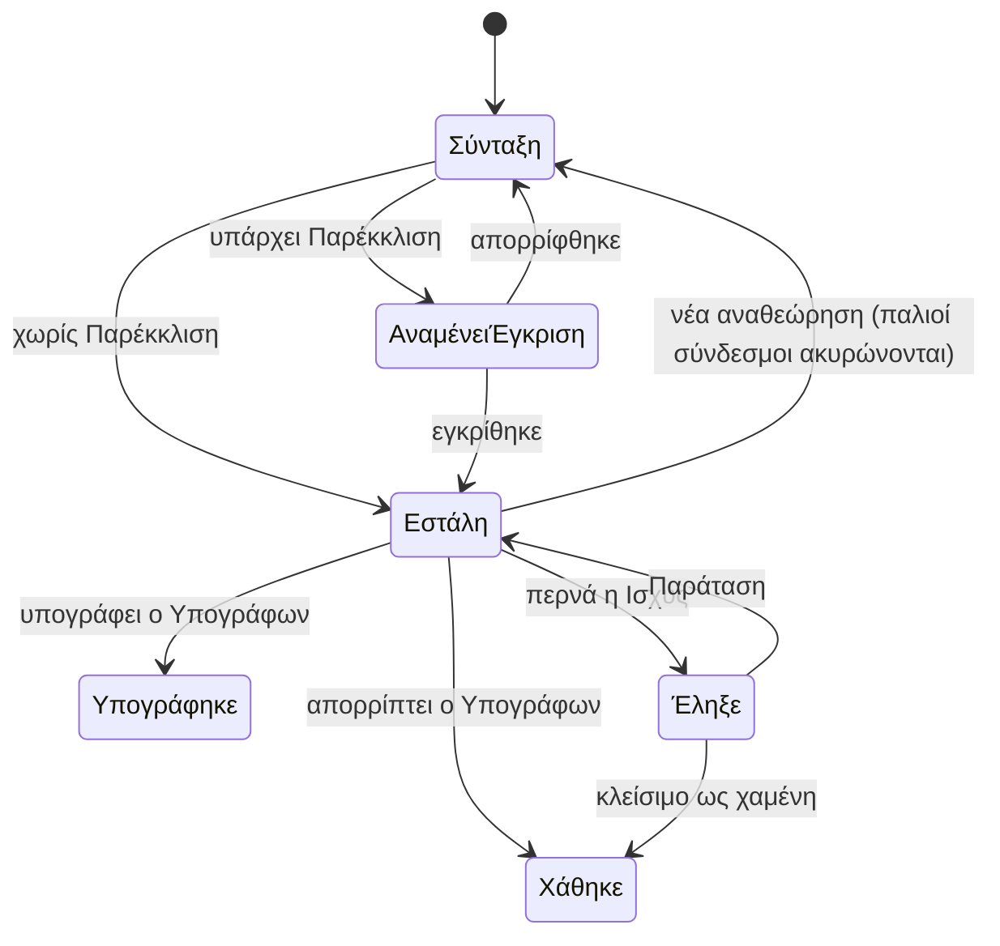

# Πωλήσεις: από την Ευκαιρία ως την υπογεγραμμένη Συμφωνία

> **👁️ Με μια ματιά**
> Κάθε ενδιαφέρον για δουλειά γίνεται **Ευκαιρία** πάνω σε έναν Πελάτη. Η Ευκαιρία προχωρά σε Στάδια που ορίζει ο admin, και ο Υπεύθυνός της φτιάχνει μέσα της μία πρόταση, δηλαδή τη Συμφωνία πριν υπογραφεί.
> Ο πελάτης βλέπει και υπογράφει την πρόταση από ιδιωτικό σύνδεσμο, χωρίς λογαριασμό. Υπογράφει **μόνο ένα πρόσωπο**, αυτό που όρισε η ομάδα. Η υπογραφή κερδίζει την Ευκαιρία αυτόματα.
> Πρόταση χειρότερη για την εταιρεία από τον Κατάλογο θέλει έγκριση πριν σταλεί. Χαμηλό περιθώριο δεν θέλει: ειδοποιεί, αλλά δεν μπλοκάρει.
> Σήμερα η αποδοχή μιας πρότασης δεν ενεργοποιεί τίποτα, το «κερδισμένη» το βάζει άνθρωπος και οι εκπτώσεις δεν ελέγχονται. Στο νέο σύστημα τα τρία αυτά αλλάζουν.

## 🚦 Πότε ξεκινά

Ξεκινά όταν δημιουργείται μια **Ευκαιρία**, με έναν από τους τρεις τρόπους:

| Είσοδος | Τι γίνεται |
|---|---|
| **Φόρμα ενδιαφέροντος** στην Ιστοσελίδα | Ο Επισκέπτης διαλέγει από τον Κατάλογο και στέλνει τα στοιχεία του. Η Πηγή μπαίνει μόνη της «Ιστοσελίδα». |
| **Πωλητής** | Καταχωρεί την Ευκαιρία και διαλέγει Πηγή. Σε νέο Πελάτη γίνεται ο ίδιος Υπεύθυνος του Πελάτη και της Ευκαιρίας. Σε Πελάτη άλλου πωλητή δεν μπορεί· στέλνει Αίτημα πρόσβασης (βλ. «Ένας Πελάτης, ένας πωλητής»). |
| **Admin** | Όπως ο πωλητής. Υπεύθυνος γίνεται ο ίδιος. |

Τελειώνει όταν η Ευκαιρία γίνει **κερδισμένη** (υπογράφηκε η Συμφωνία) ή **χαμένη**. Από εκεί και πέρα συνεχίζει η ραχοκοκαλιά (βλ. `01-backbone.md`).

## 👥 Ποιος συμμετέχει

| Ποιος | Τι κάνει |
|---|---|
| **Επισκέπτης** | Συμπληρώνει τη φόρμα. Δεν έχει λογαριασμό ούτε ρόλο. |
| **Υπεύθυνος** της Ευκαιρίας | Το ένα μέλος της ομάδας που απαντά για την Ευκαιρία: τη δουλεύει, γράφει Δραστηριότητες, φτιάχνει και στέλνει την πρόταση, αποφασίζει για Παράταση. |
| **Πωλήσεις** (έτοιμος ρόλος) | Διαχειρίζεται Πελάτες και Ευκαιρίες όσων τον αφορούν και συντάσσει προτάσεις. **Δεν** παρεκκλίνει από τον Κατάλογο. |
| **Εγκριτής** (όποιος έχει το Δικαίωμα «Παρεκκλίνει από τον Κατάλογο») | Εγκρίνει ή απορρίπτει προτάσεις με Παρέκκλιση. Ο Ιδιοκτήτης και η Διαχείριση το έχουν από την αρχή. |
| **Όσοι αναθέτουν** (Δικαίωμα «Μεταβιβάζει Υπεύθυνο») | Παίρνουν Ευκαιρίες από την ουρά «Χωρίς υπεύθυνο» και τις δίνουν σε Υπεύθυνο. |
| **Όσοι βλέπουν κόστος** | Ειδοποιούνται όταν μια πρόταση έχει χαμηλό περιθώριο. |
| **Υπογράφων** | Το ένα πρόσωπο του Πελάτη που υπογράφει ή απορρίπτει. |
| **Άλλοι παραλήπτες της πρότασης** | Βλέπουν και ζητούν αλλαγές. Δεν υπογράφουν. |

## 🪜 Βήματα

| # | Βήμα | Υπεύθυνος | Τι γίνεται |
|---|---|---|---|
| 1 | **Είσοδος και Πηγή** | Όποιος δημιουργεί | Η Πηγή είναι υποχρεωτική και διαλέγεται από λίστα του admin. Σε σύσταση μπορεί να σημειωθεί και ο Πελάτης που σύστησε. |
| 2 | **Ταίριασμα με υπάρχοντα Πελάτη** | Το σύστημα | Βλ. πίνακα παρακάτω. |
| 3 | **Ανάθεση** | Το σύστημα, και όσοι αναθέτουν | Σε νέο Πελάτη, Υπεύθυνος γίνεται όποιος δημιούργησε την Ευκαιρία. Σε υπάρχοντα Πελάτη, ο Υπεύθυνός του, εκτός αν εγκριθεί Αίτημα πρόσβασης. Νέος Πελάτης από φόρμα πάει εκεί που ορίζει η ρύθμιση «Νέες Ευκαιρίες από τη φόρμα πάνε σε»: σε συγκεκριμένο πρόσωπο (αρχικά ο Ιδιοκτήτης, ώστε ένας άνθρωπος να μη χρειάζεται να αναθέτει στον εαυτό του) ή στην ουρά «Χωρίς υπεύθυνο». Αυτόματη μοιρασιά σε πωλητές δεν υπάρχει. |
| 4 | **Δουλειά πάνω στην Ευκαιρία** | Υπεύθυνος | Μετακινεί την Ευκαιρία στα Στάδια. Γράφει Δραστηριότητες (κλήση, email, συνάντηση, σημείωση). Ορίζει πάντα **Επόμενο βήμα με ημερομηνία**. |
| 5 | **Σύνταξη πρότασης** | Υπεύθυνος | Φτιάχνει Συμφωνία μέσα από την Ευκαιρία: γραμμές από Πακέτα και Υπηρεσίες του Καταλόγου ή ελεύθερες γραμμές, όλες του ίδιου τύπου (εφάπαξ ή μηνιαία). Τιμές, Παροχές και Όροι αντιγράφονται και αλλάζουν ελεύθερα. |
| 6 | **Ορισμός Υπογράφοντα και Ισχύος** | Υπεύθυνος | Διαλέγει τον Υπογράφοντα (προεπιλογή: το κύριο πρόσωπο επικοινωνίας του Πελάτη) και ελέγχει την Ισχύς πρότασης (προεπιλογή από τις Ρυθμίσεις). |
| 7 | **Έλεγχος Παρέκκλισης** | Το σύστημα | Συγκρίνει την πρόταση με τον Κατάλογο και τις προεπιλογές. Αν βρει Παρέκκλιση, η πρόταση δεν στέλνεται χωρίς Έγκριση. |
| 8 | **Έγκριση πρότασης** | Εγκριτής | Βλ. ενότητα παρακάτω. Παραλείπεται αν ο Υπεύθυνος έχει ο ίδιος το Δικαίωμα. |
| 9 | **Αποστολή** | Υπεύθυνος | Κάθε παραλήπτης παίρνει email με τον δικό του Σύνδεσμο πρότασης. Δεν υπάρχει ξεχωριστό Δικαίωμα αποστολής: όποιος συντάσσει, στέλνει. Το ρίσκο το καλύπτει η Έγκριση πρότασης όταν υπάρχει Παρέκκλιση. |
| 10 | **Απάντηση πελάτη** | Υπογράφων / παραλήπτες | Υπογραφή, «Θέλω αλλαγές» ή απόρριψη. |
| 11 | **Υπογραφή** | Υπογράφων | Οι όροι παγώνουν, η Ευκαιρία γίνεται κερδισμένη, ο Υπογράφων προσκαλείται ως Χρήστης πελάτη. |
| 12 | **Λήξη** | Υπεύθυνος | Αν λήξει η Ισχύς, ο Υπεύθυνος δίνει Παράταση ή κλείνει την Ευκαιρία ως χαμένη. |

### Βήμα 2: Ταίριασμα με υπάρχοντα Πελάτη

| Τι βρίσκει το σύστημα | Τι κάνει |
|---|---|
| **Ακριβές ταίριασμα** email ή ΑΦΜ | Δεν φτιάχνει νέο Πελάτη. Βάζει την Ευκαιρία στον υπάρχοντα, με Υπεύθυνο τον δικό του. |
| **Κάτι που απλώς μοιάζει** (ίδιο τηλέφωνο, ίδιο τμήμα email μετά το @, παρόμοιο όνομα) | Φτιάχνει **νέο Πελάτη** με σήμα **«Πιθανό διπλό»**, που το βλέπουν μόνο όσοι «Συγχωνεύουν Πελάτες». Το σήμα κλείνει με **Συγχώνευση** (οι δύο Πελάτες γίνονται ένας, με όλες τις Ευκαιρίες, Συμφωνίες και το ιστορικό τους) ή με «είναι άλλος». |
| **Τίποτα** | Φτιάχνει νέο Πελάτη. Χρειάζεται πάντα κύριο πρόσωπο επικοινωνίας (όνομα, email), ακόμα και πριν αποκτήσει Χρήστες. |

Αυτόματη ένωση σε κάθε ομοιότητα δεν γίνεται, γιατί ένας άσχετος θα έμπαινε στον λογαριασμό άλλου πελάτη. Ο Επισκέπτης της φόρμας **βλέπει πάντα την ίδια απάντηση**, είτε υπήρχε ήδη είτε όχι, ώστε να μη μαθαίνει ποιοι είναι πελάτες μας.

### Ένας Πελάτης, ένας πωλητής

Κάθε Πελάτης ανήκει σε **έναν** Υπεύθυνο, και οι Ευκαιρίες του είναι, από προεπιλογή, δικές του. Δύο πωλητές δεν δουλεύουν τον ίδιο πελάτη χωρίς να το αποφασίσει η Διαχείριση, ώστε να μη γίνονται παρεξηγήσεις μέσα στην ομάδα και να μη δέχεται ο πελάτης δύο προσεγγίσεις.

| Θέμα | Πώς λειτουργεί |
|---|---|
| **Τι βλέπουν οι άλλοι πωλητές** | Ότι ο Πελάτης υπάρχει και ποιος είναι ο Υπεύθυνός του («Πελάτης του Νίκου»). Τίποτε άλλο: ούτε Ευκαιρίες, ούτε Συμφωνίες, ούτε ποσά. |
| **Νέα Ευκαιρία σε Πελάτη άλλου** | Μπλοκάρεται, με μήνυμα «Ο Πελάτης ανήκει στον Νίκο» και κουμπί **Αίτημα πρόσβασης** (τι αφορά, σχόλιο). |
| **Πού απαντά η Διαχείριση** | Στην ουρά «Χωρίς υπεύθυνο», ενότητα «Αιτήματα πρόσβασης». Ειδοποιούνται όσοι αναθέτουν· ο Υπεύθυνος του Πελάτη ενημερώνεται, αλλά δεν αποφασίζει. |
| **Έγκριση** | Ανοίγει **μία** Ευκαιρία με Υπεύθυνο τον πωλητή που ζήτησε. Ο Πελάτης μένει στον Υπεύθυνό του. Ο δεύτερος πωλητής βλέπει τον Πελάτη και τις Συμφωνίες του και μόνο τις δικές του Ευκαιρίες. Όταν η Ευκαιρία κλείσει, για νέα χρειάζεται νέο αίτημα. |
| **Απόρριψη** | Με υποχρεωτικό σχόλιο προς τον πωλητή. |
| **Μεταβίβαση Πελάτη** | Ο admin μπορεί αντί για έγκριση, ή οποτεδήποτε αργότερα, να δώσει όλο τον Πελάτη στον δεύτερο πωλητή. Οι ανοιχτές Ευκαιρίες του προηγούμενου Υπεύθυνου ακολουθούν τον Πελάτη. |

### Βήματα 7 και 8: Παρέκκλιση και Έγκριση πρότασης

**Παρέκκλιση** είναι κάθε σημείο που είναι χειρότερο για την εταιρεία από τον Κατάλογο και τις προεπιλογές. Ό,τι είναι προς όφελος της εταιρείας δεν είναι Παρέκκλιση.

| Είναι Παρέκκλιση | Δεν είναι Παρέκκλιση |
|---|---|
| Τιμή κάτω από τον Κατάλογο | Τιμή πάνω από τον Κατάλογο |
| Έκπτωση πέρα από την τυπική έκπτωση πρώτων μηνών | Η τυπική έκπτωση πρώτων μηνών |
| Ελεύθερη γραμμή | Γραμμή από τον Κατάλογο |
| Περισσότερες Παροχές από το Πακέτο | Παροχές όσες το Πακέτο |
| Όροι πιο χαλαροί από τις προεπιλογές | Όροι ίδιοι ή αυστηρότεροι |
| | **Παράταση** πρότασης που έληξε |
| | **Χαμηλό περιθώριο** (έχει δική του ροή, βλ. παρακάτω) |

Η σύγκριση γίνεται με τις τιμές που ίσχυαν όταν φτιάχτηκε η πρόταση. Μια αλλαγή του Καταλόγου αργότερα δεν κάνει μια ανοιχτή πρόταση Παρέκκλιση.

**Ροή έγκρισης:**

1. Ο Υπεύθυνος πατά «Αίτημα έγκρισης».
2. Ειδοποιούνται όσοι έχουν το Δικαίωμα «Παρεκκλίνει από τον Κατάλογο».
3. Ο Εγκριτής εγκρίνει ή απορρίπτει, με σχόλιο. Μπορεί και να αλλάξει ο ίδιος την πρόταση.
4. Με έγκριση, ο Υπεύθυνος μπορεί να στείλει. Με απόρριψη, αναθεωρεί και ξαναζητά.

Αν δεν απαντήσει κανείς, η Έγκριση **δεν λήγει** και δεν μπλοκάρει τίποτα άλλο στην Ευκαιρία. Η Σελίδα Ευκαιρίας δείχνει «Αναμένει Έγκριση · 3 μέρες», και μετά από 2 εργάσιμες ξαναειδοποιούνται όσοι εγκρίνουν (Αυτοματισμός που αλλάζει).

**Η Έγκριση δένεται με μία αναθεώρηση.** Αν μια επόμενη αναθεώρηση προσθέσει ή βαθύνει Παρέκκλιση (π.χ. μεγαλύτερη έκπτωση), χρειάζεται νέα Έγκριση. Αν απλώς αφαιρέσει Παρέκκλιση, δεν χρειάζεται. Όποιος έχει το Δικαίωμα δεν χρειάζεται Έγκριση.

Δεν θέλουν Έγκριση όλες οι προτάσεις: η καθυστέρηση θα χτυπούσε και τις κανονικές. Δεν υπάρχει ούτε όριο έκπτωσης που να κρίνει μόνο του, γιατί δεν πιάνει ελεύθερες γραμμές, επιπλέον Παροχές ή χαλαρούς Όρους.

### Το χαμηλό περιθώριο ειδοποιεί, δεν μπλοκάρει

Δίπλα στην τιμή της πρότασης φαίνεται (σε όσους βλέπουν κόστος) το εκτιμώμενο κόστος και το περιθώριο. Όταν το περιθώριο **του συνόλου της Συμφωνίας** πέσει κάτω από το **Ελάχιστο περιθώριο** της εταιρείας:

- η πρόταση παίρνει μόνιμο σήμα «χαμηλό περιθώριο», που το βλέπουν **μόνο όσοι βλέπουν κόστος** (το ίδιο και το Ελάχιστο περιθώριο),
- ειδοποιούνται εσωτερικά όσοι βλέπουν κόστος,
- η πρόταση **στέλνεται κανονικά**, χωρίς Έγκριση.

Η εταιρεία θέλει να ξέρει ότι κάτι ξέφυγε, όχι να καθυστερεί την πρόταση. Το Ελάχιστο περιθώριο βγαίνει από την ελάχιστη τιμή του Εύρους τιμής και είναι ένα για όλη την εταιρεία. Δεν μετριέται ανά γραμμή. Ο πελάτης δεν βλέπει ποτέ κόστος ή περιθώριο. Λεπτομέρειες για το μοντέλο κόστους στο `03-catalogue-agreement-cost.md`.

### Βήματα 9 έως 11: Σύνδεσμος πρότασης και υπογραφή

| Θέμα | Πώς λειτουργεί |
|---|---|
| **Σύνδεσμος πρότασης** | Ιδιωτικός σύνδεσμος, χωρίς λογαριασμό. **Κάθε παραλήπτης έχει τον δικό του.** |
| **Λήξη** | Όταν περάσει η Ισχύς πρότασης, ο σύνδεσμος σταματά να δουλεύει. |
| **Ακύρωση σε αναθεώρηση** | Κάθε αναθεώρηση ακυρώνει τους παλιούς συνδέσμους, ώστε να υπογράφεται πάντα η τελευταία. Η ομάδα στέλνει ξανά. |
| **Ανάκληση** | Η ομάδα μπορεί να ανακαλέσει έναν σύνδεσμο. |
| **Ποιος υπογράφει** | **Μόνο ο Υπογράφων.** Ο πελάτης δεν μπορεί να μεταβιβάσει την υπογραφή. Για αλλαγή Υπογράφοντα η ομάδα ξαναστέλνει. |
| **Πώς υπογράφει** | Γράφει το όνομά του, αποδέχεται και επιβεβαιώνει με κωδικό που έρχεται στο email του. Καταγράφονται ώρα και διεύθυνση σύνδεσης, και το PDF της Συμφωνίας κλειδώνει ώστε να μη χωρά κρυφή αλλαγή. |
| **Απόρριψη** | Μόνο ο Υπογράφων απορρίπτει. Η Ευκαιρία γίνεται χαμένη. |
| **Αίτημα αλλαγών** | **Όλοι** οι παραλήπτες μπορούν να πατήσουν «Θέλω αλλαγές». Η πρόταση μένει ανοιχτή και ειδοποιείται ο Υπεύθυνος. |
| **Μετά την υπογραφή** | Ο Υπογράφων προσκαλείται ως Χρήστης πελάτη με Ρόλο «Πλήρης». Όσοι είναι ήδη Χρήστες πελάτη βλέπουν την πρόταση και μέσα στον λογαριασμό τους. |

Η υπογραφή είναι απλή ηλεκτρονική υπογραφή μέσα στο σύστημα. Αν ένας πελάτης απαιτεί πιστοποιημένη (qualified) υπογραφή, υπογράφει έξω από το σύστημα και η ομάδα ανεβάζει το αρχείο.

### Βήμα 12: Λήξη και Παράταση

Η λήξη **δεν είναι απώλεια**. Συνήθως ο πελάτης απλώς άργησε, και η απώλεια θα θόλωνε τις μετρήσεις και θα ανάγκαζε νέα Ευκαιρία. Όταν λήξει η Ισχύς:

| Επιλογή του Υπεύθυνου | Αποτέλεσμα |
|---|---|
| **Παράταση** | Νέα Ισχύς (προεπιλογή η Ισχύς πρότασης των Ρυθμίσεων, αλλάζει τη στιγμή της Παράτασης), **νέος Σύνδεσμος πρότασης, ίδιες τιμές**. Δεν μετρά ως Παρέκκλιση, ακόμα κι αν στο μεταξύ άλλαξε ο Κατάλογος. |
| **Κλείσιμο ως χαμένη** | Η Ευκαιρία κλείνει με υποχρεωτικό Λόγο απώλειας. |

Μέχρι να αποφασίσει, η Ευκαιρία μένει ανοιχτή.

## 🔄 Καταστάσεις

### Έκβαση της Ευκαιρίας (σταθερή) και Στάδιο (του admin)

Το **Στάδιο** είναι το σημείο της ανοιχτής Ευκαιρίας στη διαδρομή των πωλήσεων, π.χ. «Πρώτη επαφή» ή «Διαπραγμάτευση». Δεν περιλαμβάνει το «κερδισμένη» και το «χαμένη». Η **Έκβαση** είναι χωριστή και σταθερή, ώστε μια μετονομασία ή διαγραφή Σταδίου να μην χαλά ποτέ το αυτόματο κλείσιμο από την υπογραφή.

| Έκβαση | Τι σημαίνει | Πώς βγαίνει |
|---|---|---|
| **Ανοιχτή** | Η Ευκαιρία δουλεύεται. Έχει Στάδιο και Επόμενο βήμα. | Υπογραφή, απόρριψη ή κλείσιμο με το χέρι. Η λήξη πρότασης **δεν** την κλείνει. |
| **Κερδισμένη** | Υπογράφηκε η Συμφωνία της. | Τέλος. Συνεχίζει η Συμφωνία. |
| **Χαμένη** | Ο πελάτης απέρριψε ή η ομάδα την έκλεισε με Λόγο. | Τέλος. Δεν ξανανοίγει: αν ο πελάτης το ξανασκεφτεί, ανοίγει **νέα** Ευκαιρία με «Νέα Ευκαιρία από αυτήν», που κρατά σύνδεσμο στην προηγούμενη και αντιγράφει την πρότασή της ως αφετηρία. Υπεύθυνος είναι ο Υπεύθυνος του Πελάτη. |

### Πορεία της πρότασης

Η πορεία είναι **σταθερή λίστα**, όπως η Έκβαση: ο admin δεν την αλλάζει, γιατί πάνω της στέκονται κανόνες (π.χ. «δεν στέλνεται χωρίς Έγκριση»). Στις οθόνες φαίνεται ως **δεύτερη ετικέτα** δίπλα στην κατάσταση της Συμφωνίας, π.χ. «πρόταση · Αναμένει Έγκριση», ώστε ο Υπεύθυνος να βλέπει με μια ματιά τι ζητά από αυτόν.

| Βήμα της πορείας | Τι σημαίνει | Πώς βγαίνει |
|---|---|---|
| **Σύνταξη** | Ο Υπεύθυνος γράφει ή αναθεωρεί. Κρατιέται ιστορικό αναθεωρήσεων. | Αίτημα έγκρισης ή αποστολή. |
| **Αναμένει Έγκριση** | Υπάρχει Παρέκκλιση και δεν έχει εγκριθεί. Δεν στέλνεται. | Έγκριση ή απόρριψη από Εγκριτή. |
| **Εστάλη** | Οι σύνδεσμοι είναι ενεργοί. «Θέλω αλλαγές» την αφήνει εδώ. | Υπογραφή, απόρριψη, λήξη ή νέα αναθεώρηση. |
| **Έληξε** | Οι σύνδεσμοι δεν δουλεύουν. Η Ευκαιρία μένει ανοιχτή. | Παράταση ή κλείσιμο ως χαμένη. |
| **Υπογράφηκε** | Η Συμφωνία γίνεται υπογεγραμμένη και οι όροι παγώνουν. | Τέλος της πώλησης. |
| **Χάθηκε** | Ο Υπογράφων απέρριψε ή η ομάδα έκλεισε την Ευκαιρία ως χαμένη. Η Συμφωνία μένει «πρόταση · Χάθηκε», μόνο για ανάγνωση. | Τέλος. |

## 🔔 Ειδοποιήσεις

Όλες έρχονται ενεργές από την αρχή και ο admin τις αλλάζει από τους Αυτοματισμούς. Τα Μηνύματα συστήματος (αποστολή Συνδέσμου πρότασης, κωδικός υπογραφής, πρόσκληση) μένουν πάντα ενεργά, και ο admin αλλάζει μόνο το κείμενό τους.

| Πότε | Ποιος παίρνει | Πώς |
|---|---|---|
| Αίτημα πρόσβασης σε Πελάτη άλλου πωλητή | Όσοι αναθέτουν· ενημέρωση και στον Υπεύθυνο του Πελάτη. Μετά την απάντηση, ο πωλητής που ζήτησε. | Ειδοποίηση |
| Νέα Ευκαιρία από φόρμα | Ο Υπεύθυνος, ή όσοι αναθέτουν όταν δεν υπάρχει Υπεύθυνος. Ο Επισκέπτης παίρνει «λάβαμε το αίτημά σας». | Ειδοποίηση· email στον Επισκέπτη |
| Ζητήθηκε Έγκριση πρότασης | Όσοι έχουν το Δικαίωμα «Παρεκκλίνει από τον Κατάλογο». | Ειδοποίηση |
| Εγκρίθηκε ή απορρίφθηκε η πρόταση | Ο **σημερινός** Υπεύθυνος της Ευκαιρίας. | Ειδοποίηση |
| Η Έγκριση περιμένει 2 εργάσιμες | Όσοι έχουν το Δικαίωμα «Παρεκκλίνει από τον Κατάλογο». | Ειδοποίηση |
| Χαμηλό περιθώριο πρότασης | Μόνο όσοι βλέπουν κόστος. | Ειδοποίηση |
| Ο πελάτης άνοιξε τον Σύνδεσμο πρότασης | Ο Υπεύθυνος της Ευκαιρίας. | Ειδοποίηση |
| Ο πελάτης ζήτησε αλλαγές | Ο Υπεύθυνος της Ευκαιρίας. | Ειδοποίηση |
| Ο πελάτης απέρριψε | Ο Υπεύθυνος της Ευκαιρίας. | Ειδοποίηση |
| Λήγει ο Σύνδεσμος (2 μέρες πριν) | Ο Υπεύθυνος της Ευκαιρίας. | Ειδοποίηση |
| Έληξε η πρόταση | Ο Υπεύθυνος της Ευκαιρίας. | Ειδοποίηση |
| Πέρασε το Επόμενο βήμα | Ο Υπεύθυνος της Ευκαιρίας. Η Ευκαιρία φαίνεται «ξεχασμένη». | Ειδοποίηση |
| Υπογράφηκε Συμφωνία | Ο πελάτης (email με το PDF, απαραίτητο) και η Διαχείριση. | Email· Ειδοποίηση |

«Ο Υπεύθυνος της Ευκαιρίας» σημαίνει πάντα τον **σημερινό**, τη στιγμή του Γεγονότος. Κανείς δεν ειδοποιείται για κάτι που έκανε ο ίδιος (βλ. `04-notifications-and-automations.md`).

Κάθε βήμα γράφεται και ως **Δραστηριότητα** στο ιστορικό της Ευκαιρίας και του Πελάτη (στάλθηκε πρόταση, άνοιξε ο Σύνδεσμος, υπογραφή, αλλαγή Σταδίου).

## ⚠️ Εξαιρέσεις

| Τι γίνεται όταν… | Τι κάνει το σύστημα |
|---|---|
| Ο **Υπογράφων αλλάζει** (π.χ. ο ιδιοκτήτης θέλει να υπογράψει ο συνέταιρος) | Ο πελάτης δεν μπορεί να το κάνει μόνος του. Η ομάδα ορίζει νέο Υπογράφοντα και στέλνει ξανά. |
| Κάποιος άλλος παραλήπτης προσπαθεί να υπογράψει | Δεν μπορεί. Βλέπει την πρόταση και μπορεί μόνο να ζητήσει αλλαγές. |
| Η πρόταση **αναθεωρείται μετά την αποστολή** | Οι παλιοί σύνδεσμοι ακυρώνονται. Πρέπει νέα αποστολή. Αν η αναθεώρηση προσθέτει ή βαθαίνει Παρέκκλιση, χρειάζεται νέα Έγκριση. |
| Ο **Κατάλογος αλλάζει** ενώ η πρόταση είναι ανοιχτή | Η πρόταση κρατά τις τιμές της και δεν γίνεται Παρέκκλιση. |
| Η νέα φόρμα **μοιάζει με υπάρχοντα Πελάτη** | Νέος Πελάτης με «Πιθανό διπλό», όχι αυτόματη ένωση. |
| Ο **Υπεύθυνος φεύγει** (απενεργοποιείται) | Ό,τι είχε επιστρέφει για νέα ανάθεση, δηλαδή στην ουρά «Χωρίς υπεύθυνο». |
| Ο πελάτης **ξαναγυρίζει** μετά από χαμένη Ευκαιρία | Νέα Ευκαιρία με σύνδεσμο στην προηγούμενη. Η παλιά μένει χαμένη, ώστε ο Λόγος απώλειας να μετρά αληθινά. |
| Ο πελάτης **δεν απαντά** | Περνά το Επόμενο βήμα και ο Υπεύθυνος ειδοποιείται. Αν λήξει η πρόταση, αποφασίζει Παράταση ή κλείσιμο. |
| Μια πρόταση έχει **χαμηλό περιθώριο** | Στέλνεται κανονικά, με σήμα και ειδοποίηση. |
| Ο πελάτης θέλει **πιστοποιημένη υπογραφή** | Υπογράφει έξω από το σύστημα και ανεβαίνει το αρχείο. |

## ⚙️ Τι ρυθμίζει ο admin

| Τι | Πού | Σημείωση |
|---|---|---|
| **Πού πάνε οι νέες Ευκαιρίες από τη φόρμα** | Ρυθμίσεις | Συγκεκριμένο πρόσωπο (αρχικά ο Ιδιοκτήτης) ή ουρά «Χωρίς υπεύθυνο». |
| **Στάδια** της διαδρομής πωλήσεων | Ρυθμίσεις | Αρχικά: Νέα, Πρώτη επαφή, Συνάντηση, Πρόταση, Διαπραγμάτευση. Προσθήκη, μετονομασία, σειρά. Ένα Στάδιο αποσύρεται μόνο αφού μεταφερθούν οι ανοιχτές Ευκαιρίες του σε άλλο. |
| **Πηγές** | Ρυθμίσεις | Αρχικά: Ιστοσελίδα, Instagram, Facebook, Σύσταση, Τηλέφωνο, Άλλο. |
| **Λόγοι απώλειας** | Ρυθμίσεις | Αρχικά: Τιμή, Δεν απάντησε, Επέλεξε άλλον, Όχι τώρα, Εκτός αντικειμένου. |
| **Είδη Δραστηριότητας** | Ρυθμίσεις | Αρχικά: Κλήση, Email, Συνάντηση, Σημείωση. |
| **Ισχύς πρότασης** (προεπιλογή σε μέρες) | Ρυθμίσεις | Αλλάζει και ανά πρόταση. |
| **Προεπιλεγμένοι Όροι** (μηνιαίες και εφάπαξ) | Ρυθμίσεις | Αντιγράφονται σε κάθε νέα πρόταση. |
| **Πολλαπλασιαστές Εύρους τιμής** (άρα και Ελάχιστο περιθώριο) | Ρυθμίσεις, όποιος «Διαχειρίζεται κόστος» | Δεν υπάρχει ξεχωριστή ρύθμιση ελάχιστου περιθώριου. |
| **Τυπική έκπτωση πρώτων μηνών** | Ρυθμίσεις | Ό,τι ξεπερνά αυτήν είναι Παρέκκλιση. |
| **Πακέτα, Υπηρεσίες, τιμές** | Κατάλογος | Ό,τι δεν πουλιέται αρχειοθετείται. |
| **Ποιος παρεκκλίνει, ποιος αναθέτει, ποιος βλέπει κόστος** | Ρόλοι | Αλλάζει μόνο ο Ιδιοκτήτης. |
| **Ειδοποιήσεις και κείμενα** | Αυτοματισμοί, Μηνύματα συστήματος | Ελληνικό και αγγλικό κείμενο. |

Οι αλλαγές ισχύουν **μόνο προς τα εμπρός**. Οι προεπιλογές αντιγράφονται όταν δημιουργείται μια πρόταση, και οι ανοιχτές προτάσεις δεν αλλάζουν από μόνες τους.

## 🙋 Τι βλέπει ο πελάτης

Ο Υπογράφων και οι άλλοι παραλήπτες ανοίγουν τον Σύνδεσμο πρότασης και βλέπουν ένα **καθαρό έγγραφο στη γλώσσα του Πελάτη**:

- γραμμές και Παροχές,
- τιμή, ΦΠΑ και σύνολο,
- Όρους,
- ημερομηνία λήξης,
- PDF για αποθήκευση.

Οι επιλογές είναι **υπογραφή** (μόνο ο Υπογράφων), **«Θέλω αλλαγές»** (όλοι) και **απόρριψη** (μόνο ο Υπογράφων). Κόστος, ώρες και περιθώριο δεν φαίνονται σε κανέναν. Η Παρέκκλιση και η Έγκριση είναι εσωτερικά και ο πελάτης δεν τα βλέπει. Οι υπάρχοντες Χρήστες πελάτη βλέπουν την πρόταση και μέσα στον λογαριασμό τους.

Ο Επισκέπτης της φόρμας παίρνει πάντα την ίδια απάντηση και ένα email ότι λάβαμε το αίτημά του.

## 🔗 Πού ακουμπά άλλες ροές

| Κεφάλαιο | Σχέση |
|---|---|
| `01-backbone.md` | Η πώληση είναι τα βήματα 1 έως 3 της ραχοκοκαλιάς. |
| `03-catalogue-agreement-cost.md` | Από εκεί έρχονται οι γραμμές, οι Όροι, το Εύρος τιμής και το περιθώριο. |
| `04-filming-and-calendar.md` | Μετά την υπογραφή ο πελάτης κλείνει Γυρίσματα μέσα στις Παροχές. |
| `06-messages-and-requests.md` | Μετά την υπογραφή ο Υπογράφων γίνεται Χρήστης πελάτη και μιλά με την ομάδα. |
| `07-invoicing-and-payments.md` | Αν η Συμφωνία έχει ορόσημο «υπογραφή», γεννιέται Τιμολογητέο. |

**Αργότερα (μετά το v1):** σύνδεση με Gmail για αυτόματο ιστορικό επαφών, αυτόματη μοιρασιά Ευκαιριών σε πωλητές.

## 📖 Σενάρια

### 1. Νέος πελάτης από τη φόρμα: «Καφέ Αθηνά»

Η κ. Μαρία συμπληρώνει τη φόρμα και διαλέγει το Πακέτο «2 Γυρίσματα και 8 reels τον μήνα». Το σύστημα δεν βρίσκει ίδιο email ή ΑΦΜ, οπότε φτιάχνει νέο Πελάτη και Ευκαιρία με Πηγή «Ιστοσελίδα». Η κ. Μαρία βλέπει το μήνυμα «Λάβαμε το αίτημά σας». Η Ευκαιρία πάει στο «Χωρίς υπεύθυνο» και όσοι αναθέτουν ειδοποιούνται. Η Διαχείριση τη δίνει στον Νίκο από τις Πωλήσεις, που τη μετακινεί στο Στάδιο «Πρώτη επαφή» και γράφει Δραστηριότητα «κλήση». Φτιάχνει πρόταση με τις τιμές του Καταλόγου. Δεν υπάρχει Παρέκκλιση, άρα την στέλνει κατευθείαν. Η κ. Μαρία, που είναι και Υπογράφουσα, ανοίγει τον σύνδεσμο και υπογράφει με τον κωδικό από το email της. Η Ευκαιρία γίνεται κερδισμένη, και η κ. Μαρία προσκαλείται στο σύστημα.

### 2. Έκπτωση που θέλει έγκριση: «Γυμναστήριο Κίνηση»

Το «Γυμναστήριο Κίνηση» υπάρχει ήδη, και στέλνει νέο ενδιαφέρον με το ίδιο email. Η Ευκαιρία πάει κατευθείαν στον Υπεύθυνό του, τη Ράνια. Η τυπική έκπτωση πρώτων μηνών είναι 10%, και η Ράνια θέλει να δώσει 25% για να κλείσει. Αυτό είναι Παρέκκλιση, και δεν έχει το Δικαίωμα να παρεκκλίνει. Πατά «Αίτημα έγκρισης». Ο Δημήτρης από τη Διαχείριση εγκρίνει με σχόλιο. Η Ράνια στέλνει. Ο πελάτης ζητά «Θέλω αλλαγές» και προσθέτει 4 reels. Η Ράνια αναθεωρεί: οι παλιοί σύνδεσμοι ακυρώνονται. Επειδή οι έξτρα Παροχές βαθαίνουν την Παρέκκλιση, χρειάζεται **νέα** Έγκριση. Μόλις εγκριθεί, στέλνει ξανά και ο Υπογράφων υπογράφει. Το σύστημα βάζει και σήμα «χαμηλό περιθώριο», και ειδοποιεί όσους βλέπουν κόστος, χωρίς να καθυστερήσει τίποτα.

### 3. Λήξη και Παράταση: «Ζαχαροπλαστείο Μέλι»

Η πρόταση για το «Ζαχαροπλαστείο Μέλι» έχει Ισχύ 14 μέρες. Δύο μέρες πριν τη λήξη η Υπεύθυνος ειδοποιείται. Η κ. Ελένη, η λογίστρια του πελάτη, ανοίγει τον σύνδεσμο και πατά «Θέλω αλλαγές», γιατί δεν είναι η Υπογράφουσα και δεν μπορεί να υπογράψει. Η Υπεύθυνος αλλάζει έναν όρο, και στέλνει ξανά. Ο πελάτης δεν απαντά και η πρόταση λήγει. Η Ευκαιρία **μένει ανοιχτή**. Στο μεταξύ ο Κατάλογος ανέβασε μια τιμή. Η Υπεύθυνος δίνει Παράταση: νέος σύνδεσμος, ίδιες τιμές, χωρίς νέα Έγκριση. Ο κ. Στέλιος, ο Υπογράφων, υπογράφει την επόμενη εβδομάδα.

### 4. Πιθανό διπλό

Μια φόρμα από το «Καφέ Αθήναιον» έχει το ίδιο τηλέφωνο με το «Καφέ Αθηνά», αλλά άλλο email και άλλο ΑΦΜ. Δεν υπάρχει ακριβές ταίριασμα, οπότε φτιάχνεται **νέος Πελάτης** με σήμα «Πιθανό διπλό». Η ομάδα βλέπει ότι είναι ο ίδιος άνθρωπος με νέα επωνυμία και πατά **Συγχώνευση**: οι δύο Πελάτες γίνονται ένας, με όλες τις Ευκαιρίες και το ιστορικό τους.

✅ Κανόνες που θα ελέγχονται

- **Δεδομένου ότι** μια Ευκαιρία δημιουργείται, **όταν** δεν έχει επιλεγεί Πηγή, **τότε** δεν αποθηκεύεται. Η φόρμα ενδιαφέροντος βάζει μόνη της «Ιστοσελίδα».
- **Δεδομένου ότι** φτάνει νέο ενδιαφέρον, **όταν** το email ή το ΑΦΜ ταιριάζει ακριβώς με υπάρχοντα Πελάτη, **τότε** η Ευκαιρία μπαίνει στον υπάρχοντα, με Υπεύθυνο τον δικό του, και δεν φτιάχνεται νέος Πελάτης.
- **Δεδομένου ότι** φτάνει νέο ενδιαφέρον, **όταν** μοιάζει με υπάρχοντα Πελάτη χωρίς ακριβές ταίριασμα, **τότε** φτιάχνεται νέος Πελάτης με σήμα «Πιθανό διπλό», που κλείνει μόνο με Συγχώνευση ή «είναι άλλος».
- **Δεδομένου ότι** ένας νέος Πελάτης ήρθε από τη φόρμα, **όταν** δημιουργείται η Ευκαιρία, **τότε** μπαίνει στην ουρά «Χωρίς υπεύθυνο» και ειδοποιούνται όσοι αναθέτουν.
- **Δεδομένου ότι** μια Ευκαιρία είναι ανοιχτή, **όταν** κάποιος την κλείνει με το χέρι ως χαμένη, **τότε** ο Λόγος απώλειας είναι υποχρεωτικός.
- **Δεδομένου ότι** μια Ευκαιρία είναι ανοιχτή, **όταν** υπογράφεται η Συμφωνία της, **τότε** γίνεται κερδισμένη μόνη της. Κανείς δεν μπορεί να την κάνει κερδισμένη με το χέρι.
- **Δεδομένου ότι** μια πρόταση έχει Παρέκκλιση, **όταν** δεν υπάρχει Έγκριση πρότασης για την τρέχουσα αναθεώρηση, **τότε** δεν μπορεί να σταλεί, εκτός αν ο Υπεύθυνος έχει το Δικαίωμα «Παρεκκλίνει από τον Κατάλογο».
- **Δεδομένου ότι** μια πρόταση έχει εγκριθεί, **όταν** μια νέα αναθεώρηση προσθέτει ή βαθαίνει Παρέκκλιση, **τότε** χρειάζεται νέα Έγκριση.
- **Δεδομένου ότι** ο Κατάλογος αλλάζει, **όταν** υπάρχει ανοιχτή πρόταση ή δίνεται Παράταση, **τότε** η πρόταση κρατά τις τιμές της και δεν θεωρείται Παρέκκλιση.
- **Δεδομένου ότι** το περιθώριο μιας πρότασης είναι κάτω από το Ελάχιστο περιθώριο, **όταν** ο Υπεύθυνος την στέλνει, **τότε** στέλνεται κανονικά, παίρνει σήμα «χαμηλό περιθώριο» και ειδοποιούνται μόνο όσοι βλέπουν κόστος.
- **Δεδομένου ότι** υπάρχουν πολλοί παραλήπτες, **όταν** ένας άλλος εκτός από τον Υπογράφοντα προσπαθεί να υπογράψει ή να απορρίψει, **τότε** δεν μπορεί. Μπορεί μόνο να ζητήσει αλλαγές.
- **Δεδομένου ότι** μια πρόταση αναθεωρείται, **όταν** έχει ήδη σταλεί, **τότε** όλοι οι παλιοί σύνδεσμοι σταματούν να δουλεύουν.
- **Δεδομένου ότι** μια πρόταση έληξε, **όταν** περνά η Ισχύς, **τότε** ο σύνδεσμος σταματά να δουλεύει και η Ευκαιρία μένει ανοιχτή μέχρι να αποφασίσει ο Υπεύθυνος.
- **Δεδομένου ότι** κανείς δεν ανοίγει τον σύνδεσμο ή δεν απαντά, **όταν** περάσει η ημερομηνία του Επόμενου βήματος, **τότε** ο Υπεύθυνος ειδοποιείται και η Ευκαιρία φαίνεται ξεχασμένη.

## ❓ Ανοιχτά ερωτήματα

Κανένα. Τα ερωτήματα του κεφαλαίου αποφασίστηκαν στο ticket [Πελάτες και Πωλήσεις](https://github.com/ntontischris/dmsfinal/issues/59).

Πηγές

- ADR 0009 (η πώληση κλείνει μόνο με την υπογραφή του Υπογράφοντα), ADR 0003 (ένα σύστημα, ένα domain: δημόσιες σελίδες και υπογραφή), ADR 0017 (το περιθώριο ειδοποιεί, δεν μπλοκάρει).
- Issue #19 (Πωλήσεις), issue #9 (δημόσιες σελίδες), και για Δικαιώματα και ειδοποιήσεις τα issues #16 και #14.
- `CONTEXT.md`, ενότητα «Εμπορικά»: Ευκαιρία, Στάδιο, Έκβαση, Λόγος απώλειας, Πηγή, Χωρίς υπεύθυνο, Πιθανό διπλό, Συγχώνευση, Δραστηριότητα, Επόμενο βήμα, Παρέκκλιση, Έγκριση πρότασης, Υπογράφων, Ισχύς πρότασης, Παράταση, Συμφωνία, Σύνδεσμος πρότασης, Ελάχιστο περιθώριο.

