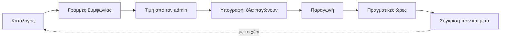
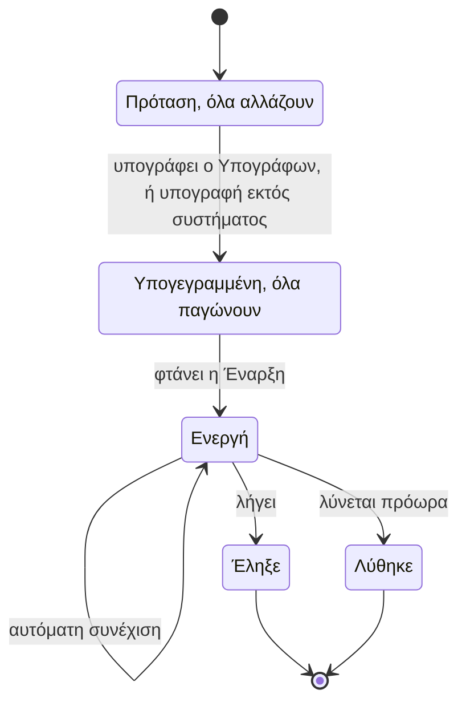
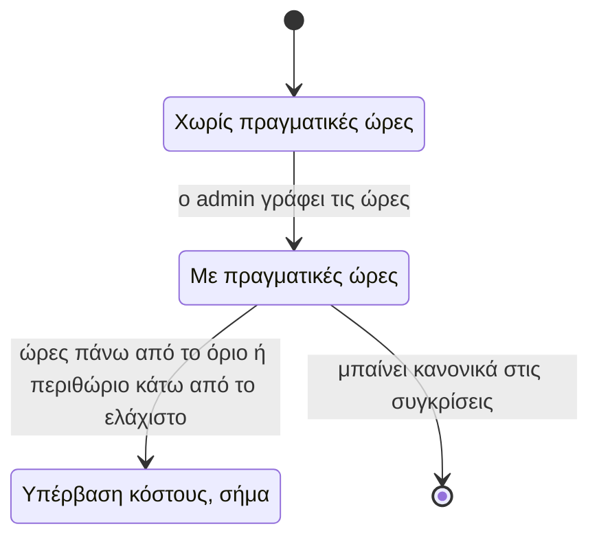

# Κατάλογος, Συμφωνία, κόστος και περιθώριο

> **👁️ Με μια ματιά**
> Ο **Κατάλογος** έχει Πακέτα και Υπηρεσίες. Η **Συμφωνία** ενός πελάτη είναι γραμμές από τον Κατάλογο, και κάθε πελάτης μπορεί να πάρει διαφορετικά πράγματα.
> Την **τιμή** τη γράφει πάντα ο admin. Το σύστημα δείχνει δίπλα το εκτιμώμενο κόστος και το περιθώριο, και ειδοποιεί όταν κάτι ξεφεύγει. Δεν μπλοκάρει ποτέ.
> Μετά την Παραγωγή ο admin γράφει πόσες ώρες πήρε στην πράξη. Έτσι βλέπει **ποιοι πελάτες τον συμφέρουν**: ανά Παραγωγή, ανά πελάτη και ανά μήνα για όλη την εταιρεία.
> Σήμερα το «auto» κόστος έβγαζε την τιμή και ο πελάτης είχε ένα μόνο πακέτο. Στο νέο σύστημα το κόστος συμβουλεύει, δεν αποφασίζει.
>
> *Όπου γράφουμε «ο admin», εννοούμε όποιον έχει το αντίστοιχο Δικαίωμα. Στους έτοιμους Ρόλους είναι συνήθως ο Ιδιοκτήτης ή η Διαχείριση.*

## 🚦 Πότε ξεκινά

| Στιγμή | Τι γίνεται |
|---|---|
| **Πρώτο στήσιμο** | Ο admin γράφει τον Κατάλογο, τα έξοδα και τις ώρες. Μέχρι να συμπληρωθούν, φαίνονται ως «εκκρεμεί» και το σύστημα δεν ανοίγει σε πελάτες. |
| **Κάθε νέα πρόταση** | Φτιάχνεται Συμφωνία από γραμμές του Καταλόγου και ο admin ορίζει την τιμή. |
| **Κάθε μήνα** | Ο admin ενημερώνει, αν χρειάζεται, τα έξοδα και τις παραγωγικές ώρες. Κάθε μήνας κρατά το δικό του Κόστος ώρας. |
| **Όταν μια Παραγωγή γίνει παραδομένη** | Το σύστημα υπενθυμίζει στον admin να γράψει τις Πραγματικές ώρες. |

## 👥 Ποιος συμμετέχει

| Ρόλος | Τι κάνει σε αυτή τη ροή |
|---|---|
| **Ιδιοκτήτης** | Έχει όλα τα Δικαιώματα. Μόνος αυτός αλλάζει το ποσοστό ΦΠΑ. |
| **Admin** (π.χ. Διαχείριση) | Στήνει τον Κατάλογο και τις προεπιλογές Όρων. Ορίζει τιμές. Βλέπει κόστος και περιθώριο. Αν ο Ιδιοκτήτης του δώσει το «Διαχειρίζεται κόστος» (αρχικά το έχει μόνο ο Ιδιοκτήτης), γράφει έξοδα, ώρες και Πραγματικές ώρες. |
| **Πωλήσεις** | Συντάσσει προτάσεις από τον Κατάλογο και βλέπει τιμές. Δεν βλέπει κόστος ή περιθώριο. |
| **Λογιστής** | Βλέπει Συμφωνίες και ποσά, μόνο για ανάγνωση. Δεν βλέπει κόστος και κερδοφορία. |
| **Παραγωγή** | Δεν βλέπει ποσά. Τα Γυρίσματα που καταγράφει δίνουν την πρόταση για τις ώρες γυρίσματος. |
| **Πελάτης** (Υπογράφων και Χρήστες πελάτη) | Βλέπει Παροχές και τιμές της Συμφωνίας του. Ποτέ ώρες, κόστος ή περιθώριο. |
| **Σύστημα** | Αντιγράφει τιμές και Όρους, παγώνει τη Συμφωνία στην υπογραφή, υπολογίζει κόστος και περιθώριο, βάζει σήματα και ειδοποιεί. |

## 🪜 Βήματα

| # | Βήμα | Υπεύθυνος |
|---|---|---|
| **Α. Στήσιμο και συντήρηση** | | |
| 1 | Ορίζει τα είδη Παροχής και τις μονάδες τους (Γύρισμα, reel, φωτογραφία, επεισόδιο podcast…). | Admin |
| 2 | Γράφει τα Πακέτα και τις Υπηρεσίες: τιμή, Παροχές, Εκτιμώμενες ώρες (γυρίσματος και μοντάζ), Άμεσο κόστος. Σημειώνει ποια Πακέτα είναι δημόσια. | Admin (ώρες και κόστος: όποιος «Διαχειρίζεται κόστος») |
| 3 | Ορίζει τα δύο σετ προεπιλεγμένων Όρων: ένα για τις μηνιαίες Συμφωνίες, ένα για τις εφάπαξ. | Admin |
| 4 | Γράφει τα έξοδα του μήνα και τις αναμενόμενες παραγωγικές ώρες. Βγαίνει το Κόστος ώρας. | Όποιος «Διαχειρίζεται κόστος» |
| **Β. Πρόταση** | | |
| 5 | Φτιάχνει Συμφωνία μέσα από μια Ευκαιρία, μηνιαία ή εφάπαξ, και προσθέτει γραμμές: Πακέτα, Υπηρεσίες ή ελεύθερες γραμμές. | Πωλητής ή admin |
| 6 | Η Συμφωνία αντιγράφει τιμές από τον Κατάλογο και Όρους από τις προεπιλογές. Όλα αλλάζουν ελεύθερα για αυτόν τον πελάτη. | Σύστημα |
| 7 | Ορίζει την τελική τιμή. Βλέπει δίπλα εκτιμώμενο κόστος, Εύρος τιμής και περιθώριο. Αλλάζει, αν θέλει, τις ώρες της γραμμής. | Admin (ώρες: όποιος «Διαχειρίζεται κόστος») |
| 8 | Αν η τιμή πέφτει κάτω από την ελάχιστη του Εύρους, βάζει σήμα «χαμηλό περιθώριο» και ειδοποιεί (βλ. «Δύο σήματα, καμία απαγόρευση»). Η πρόταση συνεχίζει. | Σύστημα |
| 9 | Με την υπογραφή οι όροι παγώνουν. Η Συμφωνία κρατά αντίγραφο της τιμής, των ωρών, του Κόστους ώρας και του κόστους εκείνης της στιγμής. | Υπογράφων και Σύστημα |
| **Γ. Μετά την Παραγωγή** | | |
| 10 | Επιβεβαιώνει ή διορθώνει τις ώρες γυρίσματος (το σύστημα προτείνει: διάρκεια Γυρίσματος × άτομα συνεργείου) και γράφει τις ώρες μοντάζ. | Όποιος «Διαχειρίζεται κόστος» |
| 11 | Υπολογίζει το πραγματικό κόστος με το Κόστος ώρας του μήνα της Παραγωγής και δείχνει τη σύγκριση. | Σύστημα |
| 12 | Αν η Παραγωγή ξέφυγε, βάζει σήμα «υπέρβαση κόστους» και ειδοποιεί. | Σύστημα |
| 13 | Αποφασίζει με το χέρι αν αλλάζει ώρες Καταλόγου, τιμές ή Κόστος ώρας για τις επόμενες προτάσεις. | Admin |

### Πακέτα, Υπηρεσίες και Παροχές

| Έννοια | Τι είναι | Παράδειγμα |
|---|---|---|
| **Πακέτο** | Δέσμη Παροχών με μία τιμή. Είναι εφάπαξ ή μηνιαίο. | «2 Γυρίσματα και 8 reels τον μήνα» |
| **Υπηρεσία** | Μία μονάδα δουλειάς με τιμή μονάδας. | «έξτρα reel», «drone» |
| **Παροχή** | Πόσο από ένα είδος δουλειάς περιλαμβάνει η Συμφωνία. Σε μηνιαία, ανά Περίοδο. | 2 Γυρίσματα, 8 reels |

- Τα είδη Παροχής και οι μονάδες τους είναι λίστα του admin. Τίποτα δεν είναι γραμμένο μέσα στο σύστημα. Την πρώτη μέρα η λίστα έχει πέντε είδη ως αρχικές τιμές: Γύρισμα (ανά Γύρισμα, έως 4 ώρες), reel, βίντεο, φωτογραφία, επεισόδιο podcast.
- Το **είδος** ενός στοιχείου (Πακέτο μηνιαίο, Πακέτο εφάπαξ, Υπηρεσία) ορίζεται στη δημιουργία και δεν αλλάζει μετά, γιατί οι γραμμές μιας Συμφωνίας είναι όλες του ίδιου τύπου. Μια Υπηρεσία έχει μονάδα («ανά reel», «ανά ώρα») και, προαιρετικά, Παροχές που δίνει η μία μονάδα· χωρίς Παροχές (π.χ. drone) δεν καταναλώνει τίποτα.
- Ό,τι δεν πουλιέται πια **αρχειοθετείται**. Δεν διαγράφεται, και οι παλιές Συμφωνίες το κρατούν. Οι αρχειοθετημένα τα βλέπουν μόνο όσοι «Διαχειρίζονται Κατάλογο»· όποιος μόνο βλέπει τον Κατάλογο (π.χ. Πωλήσεις) βλέπει μόνο ό,τι πουλιέται.
- Οι οθόνες του Καταλόγου είναι δύο: η λίστα και η σελίδα του στοιχείου. Η σελίδα είναι ταυτόχρονα προβολή και επεξεργασία: όποιος μπορεί να αλλάξει ένα πεδίο το βλέπει ως πεδίο, οι υπόλοιποι ως κείμενο στην ίδια θέση. Δεν υπάρχει χωριστός συντάκτης.
- Ο admin σημειώνει ποια Πακέτα είναι **δημόσια**, δηλαδή φαίνονται στην Ιστοσελίδα, με ή χωρίς ένδειξη «από Χ € + ΦΠΑ».
- Οι τιμές γράφονται **χωρίς ΦΠΑ**. Το ποσοστό ΦΠΑ το ορίζει ο Ιδιοκτήτης.
- Ένα **έξτρα** πέρα από τις Παροχές χρεώνεται με την τιμή της αντίστοιχης Υπηρεσίας, όπως τη γράφει η Συμφωνία. Δεν υπάρχει ξεχωριστό πεδίο «τιμή έξτρα».

### Η Συμφωνία ως γραμμές

- Η Συμφωνία είναι εφάπαξ ή μηνιαία. Όλες οι γραμμές της είναι του ίδιου τύπου.
- Μια γραμμή του Καταλόγου μπαίνει μόνο από Πακέτο του ίδιου τύπου με τη Συμφωνία (μηνιαίο ή εφάπαξ) ή από Υπηρεσία, που ταιριάζει και στους δύο: σε μηνιαία η ποσότητά της είναι ανά Περίοδο. Αρχειοθετημένο στοιχείο δεν μπαίνει ποτέ.
- Η **ελεύθερη γραμμή** έχει περιγραφή, τιμή και, αν θέλει, Παροχές. Είναι πάντα Παρέκκλιση.
- Κάθε γραμμή έχει **ποσότητα**. Η ποσότητα πολλαπλασιάζει την τιμή, τις Παροχές, τις ώρες και το Άμεσο κόστος της γραμμής.
- Τις **ώρες της γραμμής** τις βλέπει όποιος βλέπει κόστος. Τις αλλάζει μόνο όποιος «Διαχειρίζεται κόστος».
- Οι **Παροχές της Περιόδου** είναι το άθροισμα των γραμμών.
- **Έκπτωση** υπάρχει μόνο ως «έκπτωση πρώτων μηνών»: ένα ποσοστό για έναν αριθμό μηνών. Μόνιμη μείωση γίνεται με χαμηλότερη τιμή στη γραμμή. Η τυπική έκπτωση είναι προεπιλογή του admin (αρχικά 10% για 2 μήνες). Μεγαλύτερη σε ποσοστό ή σε μήνες είναι Παρέκκλιση.
- Όσο είναι πρόταση, αλλάζουν όλα: τιμή, έκπτωση, Παροχές, ώρες, Όροι. Με την υπογραφή παγώνουν.
- Δύο πελάτες με το ίδιο Πακέτο μπορεί να έχουν διαφορετικούς κανόνες. Η Συμφωνία είναι πάντα η πηγή, όχι ο Κατάλογος.
- Μια αλλαγή τιμής στον Κατάλογο δεν αγγίζει όσα έχουν ήδη συμφωνηθεί.

### Η σελίδα της Συμφωνίας

- Κάθε Συμφωνία έχει **μία σελίδα**. Όπως στον Κατάλογο, η σελίδα είναι ταυτόχρονα προβολή και επεξεργασία: όποιος μπορεί να αλλάξει ένα πεδίο το βλέπει ως πεδίο, οι υπόλοιποι ως κείμενο στην ίδια θέση. Όσο η Συμφωνία είναι πρόταση, εκεί γίνεται και η σύνταξη. Δεν υπάρχει χωριστός συντάκτης πρότασης.
- Η **λίστα των Συμφωνιών** δείχνει από προεπιλογή τις «Ανοιχτές»: προτάσεις, υπογεγραμμένες και ενεργές. Το φίλτρο «Ενεργές» περιλαμβάνει και τις υπογεγραμμένες που δεν έχουν ξεκινήσει ακόμα.
- Όταν μένουν 30 μέρες ή λιγότερες ως τη λήξη, η Συμφωνία έχει σήμα «λήγει σε N μέρες».
- Η λίστα δεν έχει κουμπί «Νέα Συμφωνία». Μια πρόταση ξεκινά πάντα μέσα σε μια Ευκαιρία.
- Μετά την υπογραφή, το **PDF** το κατεβάζει όποιος βλέπει τη Συμφωνία.
- Τι βλέπει και τι αλλάζει κάθε Ρόλος στη σελίδα: βλ. [Οδηγοί και οθόνες ανά ρόλο](../08-role-guides.md).

### Έναρξη, λήξη και Περίοδοι

Η πρόταση έχει πεδίο **Έναρξη**, με προεπιλογή «με την υπογραφή», δηλαδή τη μέρα που υπογράφει ο Υπογράφων. Μπορεί να οριστεί και μελλοντική ημερομηνία. Αν η υπογραφή έρθει μετά από αυτήν, Έναρξη γίνεται η μέρα της υπογραφής.

| | Μηνιαία | Εφάπαξ |
|---|---|---|
| **Έναρξη** | «Με την υπογραφή» ή ημερομηνία | «Με την υπογραφή» ή ημερομηνία |
| **Λήξη** | Έναρξη + Διάρκεια − 1 μέρα. Π.χ. 6 μήνες από τις 5/10 λήγουν στις 4/4 | Δεν έχει ημερομηνία. Λήγει όταν παραδοθεί η Παραγωγή της |

**Οι Περίοδοι είναι πάντα ημερολογιακοί μήνες.** Η πρώτη μπορεί να είναι μερική. Μετά έρχονται ολόκληροι μήνες, και η τελευταία μπορεί να είναι πάλι μερική. Αν η Έναρξη είναι η 1η του μήνα, καμία Περίοδος δεν είναι μερική.

| Περίοδος (μηνιαία 1.300 €, Έναρξη 5/10) | Ποσό | Παροχές |
|---|---|---|
| **Πρώτη, μερική** (5/10–31/10) | Αναλογικά με τις μέρες: 27/31 × 1.300 € = 1.132 € | Ολόκληρες του μήνα |
| **Ενδιάμεσες** (Νοέμβριος ως Μάρτιος) | 1.300 € | Ολόκληρες |
| **Τελευταία, μερική** (1/4–4/4) | Αναλογικά με τις μέρες: 4/30 × 1.300 € = 173 € | Καμία νέα. Κλείνει μόνο την ανοιχτή δουλειά |

### Οι Όροι Συμφωνίας

Οι Όροι δεν ανήκουν στο Πακέτο. Υπάρχουν **δύο σετ προεπιλογών** στις Ρυθμίσεις, ένα για τις μηνιαίες και ένα για τις εφάπαξ. Κάθε νέα Συμφωνία αντιγράφει το σωστό σετ και ο admin το αλλάζει ελεύθερα όσο είναι πρόταση.

| Όρος | Τι ορίζει |
|---|---|
| Μέρες πληρωμής | Μετά από πόσες μέρες ένα Τιμολόγιο γίνεται ληξιπρόθεσμο |
| Αχρησιμοποίητες Παροχές | Χάνονται, περνούν στην επόμενη Περίοδο ή μαζεύονται |
| Περίοδος χάριτος | Πόσες μέρες μετά το τέλος μιας Περιόδου η ανοιχτή δουλειά δεν θεωρείται καθυστερημένη |
| Διάρκεια και Ανανέωση | Πόσο κρατά η μηνιαία Συμφωνία και πώς συνεχίζεται: αυτόματη συνέχιση ή νέα Ευκαιρία (βλ. «Ανανέωση») |
| Ρήτρα λύσης | Τι ισχύει αν λυθεί πρόωρα (βλ. «Λύση») |
| Πολιτική Γυρισμάτων | Ελάχιστη προειδοποίηση κράτησης, Όριο ακύρωσης, αν η αργή ακύρωση και το «δεν έγινε» καίνε Παροχή |
| Όριο αλλαγών | Πόσοι γύροι αλλαγών δικαιούται ο πελάτης ανά είδος που παράγεται (reel, βίντεο, φωτογραφία, επεισόδιο). Το Γύρισμα δεν έχει γύρους αλλαγών |
| Δόσεις σε ορόσημα | Μόνο για την εφάπαξ (βλ. «Δόσεις της εφάπαξ») |
| Προκαταβολή και έκπτωση πρώτων μηνών | Προεπιλογές του admin. Η τυπική έκπτωση δεν είναι Παρέκκλιση· μεγαλύτερη σε ποσοστό ή σε μήνες είναι |

### Αχρησιμοποίητες Παροχές

Η επιλογή γίνεται ανά Συμφωνία. Η προεπιλογή είναι «μόνο στην επόμενη Περίοδο».

| Επιλογή | Τι γίνεται με όσα δεν χρησιμοποιήθηκαν |
|---|---|
| **Χάνονται** | Στο τέλος της Περιόδου σβήνουν. |
| **Περνούν στην επόμενη Περίοδο** | Προστίθενται στις Παροχές της επόμενης Περιόδου, και μόνο εκεί. |
| **Μαζεύονται** | Μένουν διαθέσιμες μέχρι τη λήξη της Συμφωνίας. |

### Δόσεις της εφάπαξ

Κάθε δόση έχει ορόσημο και ποσοστό. Τα ορόσημα είναι τέσσερα: **υπογραφή**, **ημερομηνία**, **Γύρισμα έγινε**, **Παραγωγή παραδόθηκε**. Αν τα ποσοστά δεν κάνουν 100%, το σύστημα προειδοποιεί. Τα ποσά των δόσεων είναι καθαρά και ο ΦΠΑ μπαίνει από πάνω.

### Ανανέωση

Ισχύει για τη μηνιαία Συμφωνία. Ο Όρος «Διάρκεια και Ανανέωση» έχει δύο επιλογές:

| Επιλογή | Τι γίνεται στο τέλος της Διάρκειας |
|---|---|
| **Αυτόματη συνέχιση** | Η **ίδια** Συμφωνία συνεχίζει για άλλη μία Διάρκεια, με τους ίδιους Όρους και τις ίδιες τιμές, χωρίς νέα υπογραφή. 30 μέρες πριν το τέλος ειδοποιούνται ο πελάτης και η Διαχείριση. Ως το τέλος, όποιος «Λύει Συμφωνία» μπορεί να ορίσει **«Χωρίς συνέχιση»**, και τότε η Συμφωνία απλώς λήγει. |
| **Νέα Ευκαιρία** | 30 μέρες πριν το τέλος το σύστημα ανοίγει μόνο του Ευκαιρία «ανανέωση», με αντίγραφο της πρότασης στις τρέχουσες τιμές του Καταλόγου. Το κουμπί «Ανανέωση» την ανοίγει και νωρίτερα. Η νέα Συμφωνία στέλνεται και υπογράφεται κανονικά. |

Το «Χωρίς συνέχιση» το έχει μόνο όποιος «Λύει Συμφωνία», όχι οι Πωλήσεις, γιατί κόβει έσοδα όπως μια Λύση.

### Λύση

| Θέμα | Πώς λειτουργεί |
|---|---|
| **Ποιος** | Όποιος «Λύει Συμφωνία» (αρχικά Ιδιοκτήτης και Διαχείριση). |
| **Ημερομηνία** | Προεπιλογή σήμερα. Μπορεί να είναι μελλοντική, ως προειδοποίηση. Ως τότε η Συμφωνία τρέχει κανονικά. |
| **Λόγος** | Υποχρεωτικός. |
| **Αποζημίωση** | Προσυμπληρώνεται από τη Ρήτρα λύσης των Όρων και αλλάζει. Αν είναι πάνω από μηδέν, γεννιέται Τιμολογητέο λύσης. |
| **Τελευταία Περίοδος** | Κόβεται στην ημερομηνία της Λύσης με τον κανόνα της μερικής Περιόδου: ποσό αναλογικά με τις μέρες, καμία νέα Παροχή. |

Ό,τι έχει ήδη γεννηθεί (Παραγωγές, Τιμολογητέα) μένει.

### Υπογραφή εκτός συστήματος

Κάποιες Συμφωνίες υπογράφονται έξω από το σύστημα: όταν ο πελάτης απαιτεί πιστοποιημένη (qualified) υπογραφή, ή όταν η Συμφωνία ενός ενεργού πελάτη υπογράφηκε πριν τη μετάβαση. Για όλες υπάρχει μία ενέργεια, **«Υπογράφηκε εκτός συστήματος»**.

| Θέμα | Πώς λειτουργεί |
|---|---|
| **Ποιος** | Όποιος «Παρεκκλίνει από τον Κατάλογο» (αρχικά Ιδιοκτήτης και Διαχείριση). |
| **Τι κάνει η ομάδα** | Φτιάχνει την πρόταση κανονικά, μέσα στην Ευκαιρία. Μετά δίνει: το αρχείο της υπογραφής (υποχρεωτικό), την ημερομηνία υπογραφής, ποιος υπέγραψε και την Έναρξη, που μπορεί να είναι και στο παρελθόν. |
| **Τι γίνεται** | Ό,τι και με την υπογραφή μέσα στο σύστημα: οι όροι παγώνουν, η Ευκαιρία γίνεται κερδισμένη και ο Υπογράφων προσκαλείται ως Χρήστης πελάτη. |
| **Έναρξη στο παρελθόν** | Ανοίγει μόνο η τρέχουσα Περίοδος, και η ομάδα γράφει πόσες Παροχές της έχουν ήδη χρησιμοποιηθεί. Οι περασμένοι μήνες δεν ξαναφτιάχνονται. Αν ο τρέχων μήνας έχει ήδη τιμολογηθεί έξω από το σύστημα, η ομάδα το σημειώνει και η Περίοδος δεν γεννά Τιμολογητέο. |

### Το μοντέλο κόστους

**Εκτιμώμενο κόστος = Εκτιμώμενες ώρες × Κόστος ώρας + Άμεσο κόστος**

| Στοιχείο | Τι είναι | Ποιος το αλλάζει |
|---|---|---|
| **Εκτιμώμενες ώρες** | Ώρες δουλειάς της ομάδας, χωριστά για γύρισμα και μοντάζ. Ο Κατάλογος τις δίνει ανά Πακέτο και Υπηρεσία. Η γραμμή της Συμφωνίας τις αλλάζει για τον πελάτη. | Όποιος «Διαχειρίζεται κόστος» |
| **Κόστος ώρας** | Έξοδα του μήνα ÷ αναμενόμενες παραγωγικές ώρες του μήνα. Τα έξοδα είναι κατηγορίες → έξοδα → ανάλυση σε υπο-γραμμές. | Όποιος «Διαχειρίζεται κόστος» |
| **Άμεσο κόστος** | Ό,τι δεν είναι ώρες της ομάδας: drone, freelancer, μετακίνηση. Είναι ενοίκιο ή αμοιβή τρίτου, όχι μισθός, γι' αυτό δεν θέλει το «Διαχειρίζεται κόστος». | Όποιος «Διαχειρίζεται Κατάλογο» και βλέπει κόστος |

Οι ώρες είναι **εσωτερικές**. Ο πελάτης βλέπει Παροχές, όχι ώρες.

**Κόστος ώρας ανά μήνα.** Κάθε μήνας έχει το δικό του. Μια αλλαγή στα έξοδα ισχύει από τον τρέχοντα μήνα και μετά. Οι κλεισμένοι μήνες δεν αλλάζουν. Έτσι μια αύξηση μισθού δεν αλλάζει αναδρομικά την κερδοφορία περασμένων μηνών.

**Εύρος τιμής.** Δίπλα στην τιμή το σύστημα δείχνει τρεις τιμές: κόστος × τρεις πολλαπλασιαστές που ορίζει ο admin (π.χ. 1,3 / 1,6 / 2,0).

| Τιμή | Πολλαπλασιαστής (παράδειγμα) |
|---|---|
| Ελάχιστη | 1,3 |
| Στόχος | 1,6 |
| Μέγιστη | 2,0 |

Είναι οδηγός. Την τιμή τη γράφει πάντα ο admin.

- Η **τιμή-στόχος** είναι η τιμή «στόχος» του Εύρους, δηλαδή κόστος × μεσαίος πολλαπλασιαστής. Δεν υπάρχει χωριστό «προεπιλεγμένο περιθώριο» που θα μπορούσε να διαφωνεί μαζί της.
- Το **περιθώριο** φαίνεται πάντα και ως ποσό και ως ποσοστό επί της τιμής, π.χ. «500 € · 38%». Το ποσό λέει τι μένει, το ποσοστό συγκρίνει Πακέτα διαφορετικού μεγέθους.
- Αν η τιμή ενός Πακέτου ή μιας Υπηρεσίας στον Κατάλογο είναι κάτω από την ελάχιστη του Εύρους, ο Κατάλογος δείχνει **μόνο ένδειξη** «κάτω από την ελάχιστη». Το σήμα «χαμηλό περιθώριο» και η ειδοποίηση ανήκουν στην πρόταση, όχι στον Κατάλογο.
- Ο ΦΠΑ φαίνεται δίπλα στην τιμή ως πληροφορία («με ΦΠΑ 24%: …») και δεν αποθηκεύεται στο στοιχείο.

**Πραγματικές ώρες.**
- Τις γράφει **μόνο ο admin**, ανά Παραγωγή. Η ομάδα δεν κάνει χρονοχρέωση.
- Οι ώρες γυρίσματος έρχονται έτοιμες από τα Γυρίσματα της Παραγωγής. Ο admin τις επιβεβαιώνει ή τις διορθώνει.
- Τις ώρες μοντάζ τις γράφει ο ίδιος. Το σύστημα του υπενθυμίζει όταν η Παραγωγή γίνει παραδομένη.
- Το πραγματικό κόστος βγαίνει με το Κόστος ώρας του μήνα της Παραγωγής.
- Σε μηνιαία Συμφωνία κάθε Περίοδος έχει τη δική της Παραγωγή, οπότε η σύγκριση βγαίνει **ανά μήνα ανά πελάτη**.
- Όσο λείπουν, η Παραγωγή είναι «χωρίς πραγματικές ώρες». Δεν μετρά στα σύνολα ως μηδενικό κόστος.

**Σύγκριση πριν και μετά.** Τρεις όψεις, όλες με εκτίμηση και πραγματικό σε ώρες, κόστος και περιθώριο:

| Όψη | Τι δείχνει |
|---|---|
| Ανά **Παραγωγή** | Πόσο κόστισε μια δουλειά σε σχέση με την εκτίμηση |
| Ανά **πελάτη** | Πόσο μας συμφέρει συνολικά ένας πελάτης |
| Ανά **μήνα της εταιρείας** | Πόσο έβγαλε όλη η εταιρεία |

**Ο Κατάλογος μαθαίνει, με το χέρι.** Κάθε Πακέτο και Υπηρεσία δείχνει τις μέσες Πραγματικές ώρες δίπλα στις εκτιμώμενες και από πόσες Παραγωγές βγήκαν. Τίποτα δεν αλλάζει αυτόματα, γιατί λίγες Παραγωγές ή ένας δύσκολος πελάτης θα μετακινούσαν την τιμολόγηση χωρίς απόφαση.

**Δύο σήματα, καμία απαγόρευση.**

| Σήμα | Πότε ανάβει | Τι κάνει το σύστημα |
|---|---|---|
| **Χαμηλό περιθώριο** | Η πρόταση πέφτει κάτω από την ελάχιστη τιμή του Εύρους. Μετριέται στο σύνολο της Συμφωνίας, όχι ανά γραμμή. Στη μηνιαία μετριέται στη **χαμηλότερη** μηνιαία τιμή που θα πληρώσει ο πελάτης, δηλαδή μετά την έκπτωση πρώτων μηνών. | Μόνιμο σήμα και εσωτερική ειδοποίηση. Δεν είναι Παρέκκλιση και δεν θέλει Έγκριση πρότασης. |
| **Υπέρβαση κόστους** | Οι Πραγματικές ώρες της Παραγωγής ξεπερνούν την εκτίμηση πάνω από ένα όριο (π.χ. +20%), **ή** η τιμή της Παραγωγής είναι κάτω από πραγματικό κόστος × μικρότερο πολλαπλασιαστή. | Σήμα στην Παραγωγή και εσωτερική ειδοποίηση. Ακολουθεί τα νούμερα. Ο πελάτης δεν βλέπει τίποτα. |

Το Ελάχιστο περιθώριο είναι **ένα για όλη την εταιρεία** και βγαίνει από τον μικρότερο πολλαπλασιαστή του Εύρους. Δεν υπάρχει ξεχωριστή ρύθμιση που θα μπορούσε να διαφωνεί μαζί του.

### Πραγματικές ώρες, τιμή και σήμα ανά Παραγωγή

Γράφτηκε με το ticket [Παραγωγές](https://github.com/ntontischris/dmsfinal/issues/72), πάνω στην οθόνη G3 του prototype.

| Θέμα | Κανόνας |
|---|---|
| **Πότε υπάρχουν Πραγματικές ώρες** | Μόνο όταν **και** οι ώρες γυρίσματος είναι επιβεβαιωμένες **και** οι ώρες μοντάζ γραμμένες. Μισές ώρες μετρούν ως «χωρίς πραγματικές ώρες», γιατί θα έδειχναν ψεύτικο περιθώριο. Παραγωγή χωρίς Γύρισμα επιβεβαιώνει «0 ώρες γυρίσματος». |
| **Πότε γράφονται** | Οποιαδήποτε στιγμή, όχι μόνο μετά την παράδοση. Η υπενθύμιση (Γεγονός 41) βγαίνει όταν η Παραγωγή γίνει παραδομένη και λείπουν. |
| **Ώρες γυρίσματος που προτείνονται** | Για κάθε Γύρισμα «έγινε»: διάρκεια (η πραγματική, αν σημειώθηκε) × όσοι στο Συνεργείο επιβεβαίωσαν. |
| **Άμεσο κόστος** | Το πραγματικό ξεκινά ίσο με της εκτίμησης και το διορθώνει όποιος «Διαχειρίζεται κόστος». |
| **Εκτίμηση της Παραγωγής** | Το στιγμιότυπο της υπογραφής: οι ώρες των γραμμών ανά Περίοδο (στη μηνιαία) ή όλης της Συμφωνίας (στην εφάπαξ), με το Κόστος ώρας της υπογραφής. Στη σπασμένη πρώτη Περίοδο οι ώρες είναι ολόκληρες, όπως και οι Παροχές της. |
| **Τιμή της Παραγωγής** | Μηνιαία: το ποσό της Περιόδου (μετά την έκπτωση πρώτων μηνών, αναλογικό στη σπασμένη Περίοδο). Εφάπαξ: όλη η Συμφωνία. Και στις δύο, συν τα Τιμολογητέα έξτρα που γέννησε η Παραγωγή. |
| **Έξτρα και ώρες** | Ένα έξτρα Παραδοτέο «με χρέωση» προσθέτει την τιμή **και** τις Εκτιμώμενες ώρες της Υπηρεσίας της Συμφωνίας. Ένα «χωρίς χρέωση» προσθέτει μόνο ώρες. Μια έξτρα αναθεώρηση ή μια αλλαγή που «χρεώνεται» προσθέτει μόνο τιμή. |
| **Μήνας της Παραγωγής** | Ο μήνας της Περιόδου στη μηνιαία. Ο μήνας της παράδοσης στην εφάπαξ και στην Εσωτερική. Σε αυτόν μετρούν τιμή και πραγματικό κόστος, με το Κόστος ώρας του. |
| **Πραγματικό περιθώριο κάτω από το ελάχιστο** | Όταν η τιμή της Παραγωγής είναι κάτω από πραγματικό κόστος × μικρότερο πολλαπλασιαστή του Εύρους (π.χ. 1,3). Ίδιος κανόνας με το Χαμηλό περιθώριο της πρότασης. |
| **Υπέρβαση κόστους** | Ακολουθεί τα νούμερα. Αν μια διόρθωση την αναιρέσει, σβήνει μόνη της· αν ξανανάψει, ειδοποιεί ξανά. Κάθε αλλαγή μένει στο ίχνος ενεργειών. Μια διόρθωση λάθους δεν είναι υπέρβαση. |
| **Εσωτερική Παραγωγή** | Δεν έχει τιμή ούτε περιθώριο. Έχει Πραγματικές ώρες και κόστος («κόστος εσωτερικής δουλειάς»), και προαιρετικά εκτίμηση ωρών που γράφει όποιος «Διαχειρίζεται κόστος». Υπέρβαση ανάβει μόνο από τις ώρες, αν υπάρχει εκτίμηση. |
| **Πού φαίνεται** | Η μία Παραγωγή στη G3 (module «Παραγωγές»). Τα σύνολα ανά Πελάτη και μήνα στην Κερδοφορία (I7, Οικονομικά). Οι Αναφορές δεν τα ξαναφτιάχνουν· δείχνουν προς την I7. |
| **Καταγραφή χρόνου από την ομάδα** | Δεν υπάρχει, ούτε οθόνη της. Το module «Χρόνος» είναι οι Πραγματικές ώρες της G3. |

## 🔄 Καταστάσεις

**Η Συμφωνία και τι παγώνει.**

**Το κόστος μιας Παραγωγής.**

| Κατάσταση | Τι σημαίνει | Πώς βγαίνει |
|---|---|---|
| Πρόταση | Η Συμφωνία αναθεωρείται, με ιστορικό. | Υπογραφή. Η απόρριψη και η λήξη της πρότασης περιγράφονται στο κεφάλαιο των Πωλήσεων. |
| Υπογεγραμμένη | Τιμή, Παροχές, Όροι και αντίγραφο κόστους είναι παγωμένα. | Γίνεται ενεργή στην Έναρξη, ή λύνεται. |
| Ενεργή | Ανοίγουν Περίοδοι και Παραγωγές. | Λήξη ή πρόωρη λύση. Με αυτόματη συνέχιση μένει ενεργή για άλλη μία Διάρκεια. |
| Έληξε / Λύθηκε | Δεν γεννιούνται νέες Περίοδοι. | Τελική κατάσταση. Η συνέχεια είναι νέα Συμφωνία από Ευκαιρία «ανανέωση». |
| Χωρίς πραγματικές ώρες | Η Παραγωγή δεν έχει ακόμα ώρες από τον admin. | Ο admin γράφει τις ώρες. |
| Με πραγματικές ώρες | Το κόστος και το περιθώριο υπολογίζονται. | Μπαίνει στις συγκρίσεις, ή ανάβει «Υπέρβαση κόστους». |
| Υπέρβαση κόστους | Η Παραγωγή ξέφυγε από την εκτίμηση. Το σήμα ακολουθεί τα νούμερα: σβήνει αν μια διόρθωση των ωρών το αναιρέσει. | Ο admin αποφασίζει με το χέρι τι κάνει. |
| Χαμηλό περιθώριο | Η τιμή του συνόλου είναι κάτω από την ελάχιστη του Εύρους. | Ο admin ανεβάζει την τιμή ή αποδέχεται το σήμα και προχωρά. |
| Ενεργό / Αρχειοθετημένο Πακέτο ή Υπηρεσία | Το ενεργό φαίνεται στις νέες προτάσεις. | Αρχειοθέτηση. Δεν διαγράφεται. |
| Κλεισμένος μήνας (Κόστος ώρας) | Το Κόστος ώρας του μήνα δεν αλλάζει πια. | Τελική κατάσταση. Οι αλλαγές ισχύουν από τον τρέχοντα μήνα και μετά. |

## 🔔 Ειδοποιήσεις

Οι ειδοποιήσεις αυτές πηγαίνουν **μόνο σε όσους βλέπουν κόστος**. Ο admin τις ρυθμίζει ως Αυτοματισμούς, με Ειδοποίηση μέσα στο σύστημα ή email.

| Πότε | Ποιος παίρνει | Πώς |
|---|---|---|
| Χαμηλό περιθώριο πρότασης | Όσοι έχουν «Βλέπει κόστος και κερδοφορία» | Ειδοποίηση ή email, όπως ορίσει ο Αυτοματισμός |
| Υπέρβαση κόστους Παραγωγής | Όσοι έχουν «Βλέπει κόστος και κερδοφορία» | Ειδοποίηση ή email |
| Παραγωγή παραδομένη χωρίς Πραγματικές ώρες | Όσοι έχουν «Βλέπει κόστος και κερδοφορία» | Ειδοποίηση ή email |

## ⚠️ Εξαιρέσεις

| Τι γίνεται όταν… | Τι ισχύει |
|---|---|
| Η τιμή είναι κάτω από την ελάχιστη | Η πρόταση φεύγει κανονικά. Το σύστημα ειδοποιεί, δεν μπλοκάρει. |
| Αλλάζει ο Κατάλογος | Οι υπογεγραμμένες Συμφωνίες δεν αλλάζουν. Η σύγκριση με τον Κατάλογο γίνεται με τις τιμές της στιγμής που φτιάχτηκε η πρόταση. |
| Αλλάζει το Κόστος ώρας | Ισχύει από τον τρέχοντα μήνα. Η υπογεγραμμένη Συμφωνία κρατά το δικό της. Το πραγματικό κόστος μιας Παραγωγής χρησιμοποιεί το Κόστος ώρας του μήνα της. |
| Λείπουν οι Πραγματικές ώρες | Η Παραγωγή μένει «χωρίς πραγματικές ώρες» και δεν μπαίνει στα σύνολα σαν να ήταν δωρεάν. |
| Κάποιος δεν έχει «Διαχειρίζεται κόστος» | Βλέπει τη γραμμή με τις ώρες του Καταλόγου. Δεν αλλάζει ώρες ή έξοδα. |
| Κάποιος δεν έχει «Βλέπει κόστος και κερδοφορία» | Βλέπει τη Συμφωνία ή την Παραγωγή χωρίς κόστος και χωρίς σήματα. Δεν παίρνει τις ειδοποιήσεις. Η βάση αρνείται να του δώσει τα νούμερα, ακόμα κι αν υπάρχει λάθος στην οθόνη. |
| Ένα είδος Παροχής έχει ήδη χρησιμοποιηθεί και ο admin θέλει να το βγάλει | Αποσύρεται: φεύγει από τις νέες επιλογές, μένει στα παλιά. Η μετονομασία περνά παντού. |
| Ο admin αλλάζει προεπιλογή Όρων | Ισχύει μόνο για νέες Συμφωνίες. Πριν την αποθήκευση το σύστημα δείχνει πόσα υπάρχοντα στοιχεία αφορά η αλλαγή. |
| Ένας πελάτης ζητά κάτι έξω από τις Παροχές | Χρεώνεται με την τιμή της αντίστοιχης Υπηρεσίας στη Συμφωνία του. |
| Η υπογραφή έρχεται μετά την Έναρξη της πρότασης | Έναρξη γίνεται η μέρα της υπογραφής, και η λήξη μετακινείται μαζί της. |
| Η Συμφωνία υπογράφηκε έξω από το σύστημα (π.χ. πιστοποιημένη υπογραφή) | «Υπογράφηκε εκτός συστήματος», με το αρχείο. Βλ. «Υπογραφή εκτός συστήματος». |
| Η Συμφωνία λύνεται στη μέση του μήνα | Η τελευταία Περίοδος κόβεται αναλογικά με τις μέρες, χωρίς νέες Παροχές. |
| Τα ποσοστά των δόσεων δεν κάνουν 100% | Το σύστημα προειδοποιεί, δεν μπλοκάρει. |

## ⚙️ Τι ρυθμίζει ο admin

Όλα αλλάζουν την ώρα που τρέχει το σύστημα, χωρίς προγραμματιστή και **μόνο προς τα εμπρός**. Κάθε αλλαγή γράφεται στο ίχνος ενεργειών (ποιος, πότε, πριν → μετά).

| Τι | Πού ζει | Ποιος |
|---|---|---|
| Πακέτα και Υπηρεσίες, τιμές, δημόσιο ναι/όχι, αρχειοθέτηση | Κατάλογος | «Διαχειρίζεται Κατάλογο» |
| Είδη Παροχής και μονάδες τους | Ρυθμίσεις | «Διαχειρίζεται Ρυθμίσεις» |
| Δύο σετ προεπιλεγμένων Όρων, προκαταβολή, έκπτωση πρώτων μηνών | Ρυθμίσεις | «Διαχειρίζεται Ρυθμίσεις» |
| Ποσοστό ΦΠΑ | Ρυθμίσεις | Μόνο ο Ιδιοκτήτης |
| Έξοδα (κατηγορίες, έξοδα, υπο-γραμμές) και παραγωγικές ώρες του μήνα | Οικονομικά | «Διαχειρίζεται κόστος» |
| Εκτιμώμενες ώρες Καταλόγου και γραμμής | Κατάλογος και Συμφωνία | «Διαχειρίζεται κόστος» |
| Πραγματικές ώρες | Παραγωγή | «Διαχειρίζεται κόστος» |
| Οι τρεις πολλαπλασιαστές του Εύρους | Οικονομικά | «Διαχειρίζεται κόστος» |
| Το όριο υπέρβασης (π.χ. +20%) | Οικονομικά | «Διαχειρίζεται κόστος» |
| Αυτοματισμοί των τριών ειδοποιήσεων κόστους | Αυτοματισμοί | «Διαχειρίζεται Αυτοματισμούς» |

Το «Διαχειρίζεται κόστος» είναι χωριστό από το «Διαχειρίζεται Ρυθμίσεις», γιατί τα έξοδα περιέχουν μισθούς. Αρχικά το έχει μόνο ο Ιδιοκτήτης, που μπορεί να το δώσει σε έναν Ρόλο.

## 🙋 Τι βλέπει ο πελάτης

- Βλέπει τη **Συμφωνία του**: γραμμές, Παροχές, τιμές, Όρους. Την υπογράφει ο Υπογράφων μέσα από τον Σύνδεσμο πρότασης.
- Στον λογαριασμό του βλέπει τις υπογεγραμμένες, ενεργές, ληγμένες και λυμένες Συμφωνίες του, και **μόνο** την πρόταση που του έχει σταλεί εκείνη τη στιγμή. Δεν βλέπει προσχέδια, Εγκρίσεις ή προτάσεις που χάθηκαν.
- Η κάρτα της Συμφωνίας του δείχνει τι του **απομένει** αυτόν τον μήνα.
- Βλέπει **Παροχές**, όχι ώρες.
- Βλέπει τον μετρητή του Ορίου αλλαγών και προειδοποιείται πριν ζητήσει γύρο πέρα από το όριο.
- Στην Ιστοσελίδα βλέπει τα **δημόσια Πακέτα**, με ή χωρίς ένδειξη «από Χ € + ΦΠΑ».
- **Ποτέ**: κόστος, ώρες, Εύρος τιμής, περιθώριο, σήματα.

## 🔗 Πού ακουμπά άλλες ροές

| Ροή | Πώς συνδέεται |
|---|---|
| Πωλήσεις | Η πρόταση φτιάχνεται από γραμμές του Καταλόγου. Το «χαμηλό περιθώριο» είναι ανεξάρτητο από την Παρέκκλιση και την Έγκριση πρότασης: μια πρόταση μπορεί να έχει το ένα, το άλλο ή και τα δύο. |
| Γυρίσματα | Κάθε Γύρισμα καταναλώνει Παροχή του είδους του με τον Τρόπο μέτρησης του είδους. Ο αριθμός ατόμων συνεργείου και η διάρκεια δίνουν την πρόταση ωρών γυρίσματος. |
| Παραδοτέα | Κάθε Παραδοτέο δεσμεύει Παροχή. Το Όριο αλλαγών είναι Όρος της Συμφωνίας. |
| Τιμολόγηση | Η Συμφωνία γεννά Τιμολογητέα. Οι μέρες πληρωμής της Συμφωνίας ορίζουν πότε ένα Τιμολόγιο γίνεται ληξιπρόθεσμο. Βλ. [Τιμολογητέα, Τιμολόγια και Εισπράξεις](07-invoicing-and-payments.md). |
| Ρυθμίσεις | Είδη Παροχής, προεπιλογές Όρων και ΦΠΑ ζουν στη σελίδα Ρυθμίσεων. |
| Αυτοματισμοί | Τα τρία Γεγονότα κόστους προστίθενται στον κατάλογο Γεγονότων. |
| Ιστοσελίδα | Τα δημόσια Πακέτα και οι τιμές τους εμφανίζονται εκεί. |

## 📖 Σενάρια

*Όλα τα ονόματα και τα νούμερα είναι φανταστικά. Όλες οι τιμές είναι χωρίς ΦΠΑ.*

### Σενάριο 1: Ποιοι πελάτες μας συμφέρουν

**Οι κανόνες του μήνα.** Τα έξοδα του μήνα είναι 8.800 € και οι παραγωγικές ώρες 220. Το Κόστος ώρας είναι **40 €**. Οι πολλαπλασιαστές είναι 1,3 / 1,6 / 2,0 και το όριο υπέρβασης +20%.

**Το Πακέτο στον Κατάλογο.** «Μηνιαία Παρουσία»: 2 Γυρίσματα και 8 reels τον μήνα, τιμή 1.300 € τον μήνα. Εκτιμώμενες ώρες: 6 γυρίσματος και 14 μοντάζ, άρα 20 ώρες. Άμεσο κόστος: 0.

| | Υπολογισμός | Αποτέλεσμα |
|---|---|---|
| Εκτιμώμενο κόστος | 20 ώρες × 40 € | 800 € |
| Εύρος τιμής | 800 € × 1,3 / 1,6 / 2,0 | 1.040 € / 1.280 € / 1.600 € |
| Περιθώριο στην τιμή του Καταλόγου | 1.300 € − 800 € | 500 € |

**Οι τρεις Συμφωνίες.**

- **Καφέ Αθηνά:** το Πακέτο όπως είναι, 1.300 €. Η τιμή είναι μέσα στο Εύρος.
- **Γυμναστήριο Κίνηση:** ίδιο Πακέτο, αλλά με 12 reels αντί για 8 και ώρες μοντάζ 20 αντί για 14 (26 ώρες συνολικά). Ο admin δίνει τιμή 1.100 €. Το εκτιμώμενο κόστος γίνεται 26 × 40 = 1.040 € και η ελάχιστη τιμή του Εύρους 1.040 € × 1,3 = 1.352 €. Η τιμή είναι κάτω από αυτή: ανάβει **χαμηλό περιθώριο** (60 €) και ο admin ειδοποιείται. Η πρόταση συνεχίζει. Τα 12 reels και η τιμή κάτω από τον Κατάλογο είναι ξεχωριστά Παρεκκλίσεις και θέλουν την Έγκρισή τους, που δεν έχει σχέση με το χαμηλό περιθώριο.
- **Ζαχαροπλαστείο Μέλι:** εφάπαξ Συμφωνία «Εταιρικό βίντεο», 2.400 €. Εκτιμώμενες ώρες: 10 γυρίσματος και 24 μοντάζ (34 ώρες), και Άμεσο κόστος 300 € για έναν εξωτερικό χειριστή. Κόστος 34 × 40 + 300 = 1.660 €. Εύρος: 2.158 € / 2.656 € / 3.320 €. Τιμή μέσα στο Εύρος, περιθώριο 740 €.

**Ο μήνας κλείνει.** Ο admin γράφει τις Πραγματικές ώρες. Οι ώρες γυρίσματος ήρθαν προτεινόμενες από τα Γυρίσματα και τις επιβεβαίωσε.

| Πελάτης | Ώρες: εκτίμηση → πραγματικές | Κόστος: εκτίμηση → πραγματικό | Τιμή | Περιθώριο: εκτίμηση → πραγματικό | Σήμα |
|---|---|---|---|---|---|
| Καφέ Αθηνά | 20 → 19 (6 + 13) | 800 € → 760 € | 1.300 € | 500 € → **540 €** | Κανένα |
| Γυμναστήριο Κίνηση | 26 → 31 (7 + 24) | 1.040 € → 1.240 € | 1.100 € | 60 € → **−140 €** | Υπέρβαση κόστους |
| Ζαχαροπλαστείο Μέλι | 34 → 37 (9 + 28) | 1.660 € → 1.780 € | 2.400 € | 740 € → **620 €** | Κανένα |
| **Εταιρεία, μήνας** | **80 → 87** | **3.500 € → 3.780 €** | **4.800 €** | **1.300 € → 1.020 €** | |

*Στο παράδειγμα, αυτές είναι οι μόνες Παραγωγές του μήνα.*

**Τι διαβάζει ο admin.**

- **Καφέ Αθηνά:** δουλεύει πάνω από την εκτίμηση. Πολύ καλός πελάτης.
- **Γυμναστήριο Κίνηση:** οι ώρες ξεπέρασαν την εκτίμηση κατά 19%, δηλαδή **κάτω από το όριο του 20%**. Η Υπέρβαση όμως ανάβει από το δεύτερο κριτήριο: με πραγματικό κόστος 1.240 € η ελάχιστη τιμή θα ήταν 1.240 € × 1,3 = 1.612 €, και η τιμή είναι 1.100 €. Ο πελάτης **μας κοστίζει** 140 € τον μήνα.
- **Ζαχαροπλαστείο Μέλι:** οι ώρες ξεπέρασαν την εκτίμηση κατά 9%, μέσα στο όριο. Καλό περιθώριο.
- Ο admin αποφασίζει ο ίδιος: στην Ανανέωση του Γυμναστηρίου ανεβάζει την τιμή ή κόβει reels. Το σύστημα δεν αλλάζει τίποτα μόνο του.

### Σενάριο 2: Τι γίνεται με τις Παροχές που περίσσεψαν

Το Καφέ Αθηνά έχει 2 Γυρίσματα τον μήνα και τον πρώτο μήνα χρησιμοποίησε 1. Περίσσεψε 1.

| Όρος της Συμφωνίας | Γυρίσματα που έχει τον δεύτερο μήνα |
|---|---|
| **Χάνονται** | 2 |
| **Περνούν στην επόμενη Περίοδο** (προεπιλογή) | 3 |
| **Μαζεύονται** | 3 |

Στο Γυμναστήριο Κίνηση ο admin διάλεξε «μαζεύονται». Τον δεύτερο μήνα ο πελάτης χρησιμοποιεί 1 από τα 3 Γυρίσματα που έχει. Τον τρίτο μήνα έχει 2 + 2 = 4, και οι αχρησιμοποίητες συνεχίζουν να μένουν διαθέσιμες ως τη λήξη της Συμφωνίας.

### Σενάριο 3: Ο Κατάλογος μαθαίνει, και το Κόστος ώρας αλλάζει

Μετά από 6 Παραγωγές του «Μηνιαία Παρουσία», ο Κατάλογος δείχνει μέσες Πραγματικές ώρες: 6,5 γυρίσματος και 15,5 μοντάζ, δηλαδή **22 ώρες** από 6 Παραγωγές, δίπλα στις 20 της εκτίμησης. Τίποτα δεν έχει αλλάξει μόνο του.

- Ο admin αποφασίζει να ανεβάσει τις ώρες μοντάζ από 14 σε 16. Οι νέες προτάσεις δείχνουν 22 × 40 = 880 €, Εύρος 1.144 € / 1.408 € / 1.760 € και περιθώριο 420 € στην τιμή των 1.300 €. Την τιμή την κρατά ο ίδιος.
- Η Συμφωνία του Καφέ Αθηνά είναι υπογεγραμμένη και κρατά 800 € και 500 €.
- Τον επόμενο μήνα τα έξοδα ανεβαίνουν σε 9.680 € με τις ίδιες 220 ώρες. Το Κόστος ώρας γίνεται **44 €** από τον μήνα αυτόν και μετά. Οι περασμένοι μήνες μένουν στα 40 €. Μια νέα πρόταση του ίδιου Πακέτου δείχνει 22 × 44 = 968 €.
- Αν η επόμενη Περίοδος του Καφέ Αθηνά πάρει πάλι 19 ώρες, το πραγματικό κόστος της είναι 19 × 44 = 836 €. Η εκτίμηση της υπογραφής παραμένει 800 €, οπότε μέρος της διαφοράς οφείλεται στο ακριβότερο Κόστος ώρας και όχι στις ώρες.

✅ Κανόνες που θα ελέγχονται

- **Δεδομένου ότι** μια Συμφωνία είναι πρόταση, **όταν** ο admin αλλάζει τιμή, έκπτωση, Παροχές, ώρες ή Όρους, **τότε** η αλλαγή περνά χωρίς περιορισμό. Μετά την υπογραφή όλα αυτά παγώνουν.
- **Δεδομένου ότι** ο Κατάλογος αλλάζει τιμή ενός Πακέτου, **όταν** υπάρχουν ήδη υπογεγραμμένες Συμφωνίες με αυτό, **τότε** οι Συμφωνίες δεν αλλάζουν.
- **Δεδομένου ότι** ένας πελάτης ζητά κάτι πέρα από τις Παροχές, **όταν** η Συμφωνία έχει την αντίστοιχη Υπηρεσία, **τότε** χρεώνεται με την τιμή της Υπηρεσίας στη Συμφωνία.
- **Δεδομένου ότι** το Εκτιμώμενο κόστος είναι Εκτιμώμενες ώρες × Κόστος ώρας + Άμεσο κόστος, **όταν** ο admin αλλάζει τις ώρες μιας γραμμής, **τότε** το κόστος και το Εύρος τιμής ξαναϋπολογίζονται για αυτή τη Συμφωνία.
- **Δεδομένου ότι** το σύνολο της πρότασης είναι κάτω από την ελάχιστη τιμή του Εύρους, **όταν** ο admin στέλνει την πρόταση, **τότε** η πρόταση φεύγει κανονικά και ο admin ειδοποιείται για χαμηλό περιθώριο.
- **Δεδομένου ότι** αλλάζουν τα έξοδα του μήνα, **όταν** αποθηκεύεται η αλλαγή, **τότε** το νέο Κόστος ώρας ισχύει από τον τρέχοντα μήνα και μετά, και οι κλεισμένοι μήνες μένουν ως είναι.
- **Δεδομένου ότι** μόνο όποιος «Διαχειρίζεται κόστος» γράφει Πραγματικές ώρες, **όταν** ένα μέλος της ομάδας χωρίς αυτό το Δικαίωμα ανοίγει μια Παραγωγή, **τότε** δεν μπορεί να τις γράψει ή να τις αλλάξει.
- **Δεδομένου ότι** μια Παραγωγή δεν έχει Πραγματικές ώρες, **όταν** υπολογίζονται τα σύνολα πελάτη και εταιρείας, **τότε** η Παραγωγή δεν μετρά ως μηδενικό κόστος.
- **Δεδομένου ότι** οι Πραγματικές ώρες ξεπερνούν την εκτίμηση πάνω από το όριο των Ρυθμίσεων, ή το πραγματικό περιθώριο είναι κάτω από το ελάχιστο, **όταν** γράφονται οι ώρες, **τότε** η Παραγωγή παίρνει σήμα «Υπέρβαση κόστους» και ειδοποιούνται μόνο όσοι βλέπουν κόστος.
- **Δεδομένου ότι** ο Κατάλογος δείχνει μέσες Πραγματικές ώρες, **όταν** συγκεντρωθούν Παραγωγές, **τότε** οι ώρες του Καταλόγου δεν αλλάζουν αυτόματα. Αλλάζουν μόνο με απόφαση του admin και ισχύουν για νέες προτάσεις.
- **Δεδομένου ότι** ένας Χρήστης δεν έχει «Βλέπει κόστος και κερδοφορία», **όταν** ανοίγει μια Συμφωνία ή μια Παραγωγή, **τότε** δεν παίρνει κόστος, περιθώριο ή σήματα, ούτε στα δεδομένα που λαμβάνει.
- **Δεδομένου ότι** μια τιμή λίστας (π.χ. είδος Παροχής) έχει χρησιμοποιηθεί, **όταν** ο admin την αφαιρεί, **τότε** αποσύρεται και δεν διαγράφεται.
- **Δεδομένου ότι** μια γραμμή έχει ποσότητα 2, **όταν** υπολογίζεται η Συμφωνία, **τότε** διπλασιάζονται η τιμή, οι Παροχές, οι ώρες και το Άμεσο κόστος της γραμμής.
- **Δεδομένου ότι** ένα στοιχείο του Καταλόγου είναι αρχειοθετημένο ή άλλου τύπου από τη Συμφωνία, **όταν** κάποιος προσπαθεί να το προσθέσει ως γραμμή, **τότε** δεν μπαίνει.
- **Δεδομένου ότι** μια μηνιαία πρόταση έχει έκπτωση πρώτων μηνών, **όταν** ελέγχεται το χαμηλό περιθώριο, **τότε** μετριέται στη χαμηλότερη μηνιαία τιμή, μετά την έκπτωση.
- **Δεδομένου ότι** μια μηνιαία πρόταση 6 μηνών, 1.300 € τον μήνα, έχει Έναρξη «με την υπογραφή», **όταν** ο Υπογράφων υπογράφει στις 5/10, **τότε** η Συμφωνία λήγει στις 4/4, η πρώτη Περίοδος είναι 5/10–31/10 με ποσό 1.132 € και ολόκληρες Παροχές, και η τελευταία είναι 1/4–4/4 με ποσό 173 € και καμία νέα Παροχή.
- **Δεδομένου ότι** μια πρόταση έχει Έναρξη σε μελλοντική ημερομηνία, **όταν** η υπογραφή έρχεται μετά από αυτήν, **τότε** Έναρξη γίνεται η μέρα της υπογραφής.
- **Δεδομένου ότι** η Έναρξη μιας μηνιαίας είναι η 1η του μήνα, **όταν** ανοίγουν οι Περίοδοι, **τότε** καμία δεν είναι μερική.
- **Δεδομένου ότι** μια μηνιαία έχει «αυτόματη συνέχιση» και κανείς δεν όρισε «Χωρίς συνέχιση», **όταν** φτάνει το τέλος της Διάρκειας, **τότε** η ίδια Συμφωνία συνεχίζει για άλλη μία Διάρκεια με τους ίδιους Όρους και τιμές, χωρίς νέα υπογραφή.
- **Δεδομένου ότι** ένας Χρήστης δεν έχει «Λύει Συμφωνία», **όταν** ανοίγει μια Συμφωνία με αυτόματη συνέχιση, **τότε** δεν μπορεί να ορίσει «Χωρίς συνέχιση».
- **Δεδομένου ότι** μια μηνιαία έχει Ανανέωση με «νέα Ευκαιρία», **όταν** μένουν 30 μέρες ως τη λήξη, **τότε** το σύστημα ανοίγει Ευκαιρία «ανανέωση» με αντίγραφο της πρότασης στις τρέχουσες τιμές του Καταλόγου.
- **Δεδομένου ότι** μια Συμφωνία λύνεται με αποζημίωση πάνω από μηδέν, **όταν** αποθηκεύεται η Λύση, **τότε** γεννιέται Τιμολογητέο λύσης και η τελευταία Περίοδος κόβεται αναλογικά, χωρίς νέες Παροχές.
- **Δεδομένου ότι** ένας Χρήστης δεν έχει «Παρεκκλίνει από τον Κατάλογο», **όταν** προσπαθεί να καταχωρήσει «Υπογράφηκε εκτός συστήματος», **τότε** δεν μπορεί. Χωρίς αρχείο υπογραφής η ενέργεια δεν αποθηκεύεται.
- **Δεδομένου ότι** μια Συμφωνία «Υπογράφηκε εκτός συστήματος» με Έναρξη στο παρελθόν, **όταν** καταχωρείται, **τότε** ανοίγει μόνο η τρέχουσα Περίοδος, με τις Παροχές που η ομάδα δήλωσε ως ήδη χρησιμοποιημένες, και δεν φτιάχνονται Περίοδοι για τους περασμένους μήνες.

## ❓ Ανοιχτά ερωτήματα

*Τα #1, #2, #3, #5 και #8 κλείστηκαν με το ticket [Κατάλογος και Τιμολόγηση](https://github.com/ntontischris/dmsfinal/issues/61) και είναι γραμμένα παραπάνω (το #1 στο ADR 0017 και στο κεφ. 1, το #8 στο ticket [Πελάτες και Πωλήσεις](https://github.com/ntontischris/dmsfinal/issues/59)). Τα #4, #7, #9 και #10 κλείστηκαν με το ticket [Παραγωγές](https://github.com/ntontischris/dmsfinal/issues/72) και είναι γραμμένα στο «Πραγματικές ώρες, τιμή και σήμα ανά Παραγωγή» παρακάτω. Οι ενότητες «Η σελίδα της Συμφωνίας», «Έναρξη, λήξη και Περίοδοι», «Δόσεις της εφάπαξ», «Ανανέωση», «Λύση» και «Υπογραφή εκτός συστήματος» γράφτηκαν με το ticket [Συμφωνίες](https://github.com/ntontischris/dmsfinal/issues/62), που έκλεισε και τα #11 και #12 που προέκυψαν στην πορεία: η μερική πρώτη Περίοδος μετρά ως ο πρώτος μήνας της έκπτωσης πρώτων μηνών (η έκπτωση πάει με τις πρώτες N Περιόδους), και στη «Υπογράφηκε εκτός συστήματος» η ομάδα σημειώνει αν ο τρέχων μήνας έχει ήδη τιμολογηθεί, οπότε δεν γεννιέται Τιμολογητέο.*

**Αντιφάσεις στις πηγές που λύθηκαν με το νεότερο.**
- Στο Μοντέλο δικαιωμάτων υπήρχε το «Διαχειρίζεται Έξοδα». Το αντικαθιστά το «Διαχειρίζεται κόστος».
- Οι μέρες πληρωμής ήρθαν πρώτα από τον Κατάλογο. Πλέον είναι Όρος Συμφωνίας με προεπιλογή στις Ρυθμίσεις.

Πηγές

- ADR 0008: Η Συμφωνία είναι γραμμές από τον Κατάλογο· οι Όροι έρχονται από προεπιλογές
- ADR 0017: Το κόστος βγαίνει από ώρες· τις πραγματικές τις γράφει ο admin· το περιθώριο ειδοποιεί, δεν μπλοκάρει
- ADR 0015: Οι Ρυθμίσεις ζουν σε ένα μέρος, ισχύουν προς τα εμπρός, οι τιμές σε χρήση αποσύρονται
- ADR 0007: Τα Δικαιώματα έχουν Εύρος (Βλέπει ποσά, Βλέπει κόστος και κερδοφορία)
- ADR 0002: Η ραχοκοκαλιά (Παραγωγή ανά Συμφωνία ή ανά Περίοδο)
- Issue #18: Κατάλογος και όροι Συμφωνίας
- Issue #62: Συμφωνίες (σελίδα, Έναρξη και Περίοδοι, Ανανέωση, Λύση, υπογραφή εκτός συστήματος)
- Issue #38: Μοντέλο κόστους και ελάχιστο περιθώριο
- Issue #16: Μοντέλο δικαιωμάτων (έτοιμοι Ρόλοι)
- Issue #14: Επικοινωνία και Αυτοματισμοί
- `CONTEXT.md`, ενότητες «Εμπορικά» και «Ρυθμίσεις»
- `docs/setup-and-cutover.md`, ενότητα «Αρχικό περιεχόμενο»

