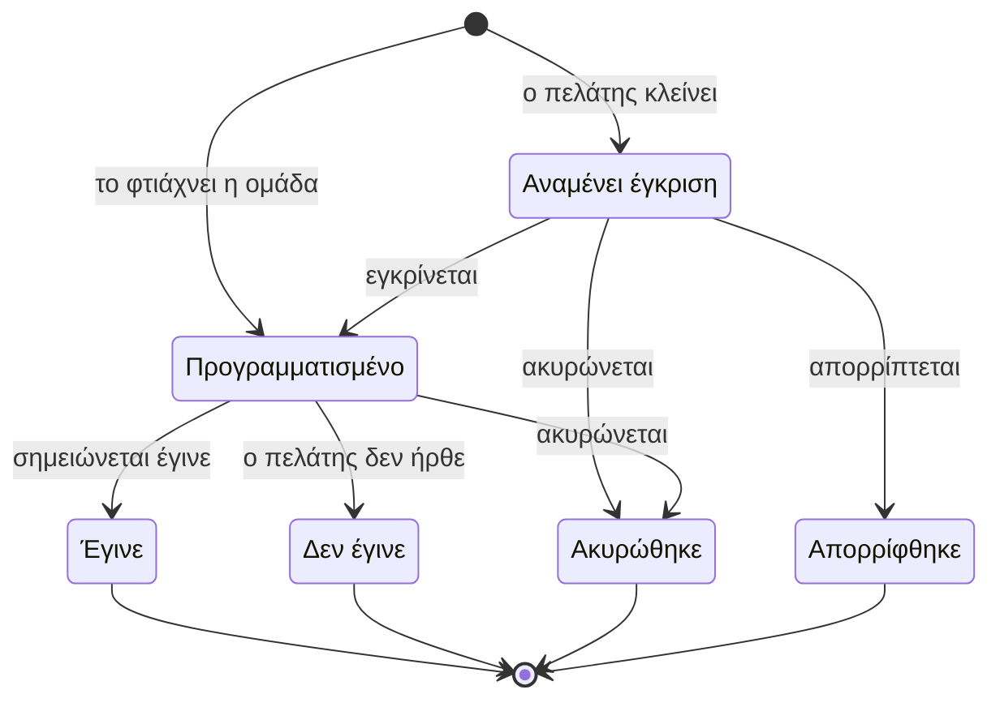
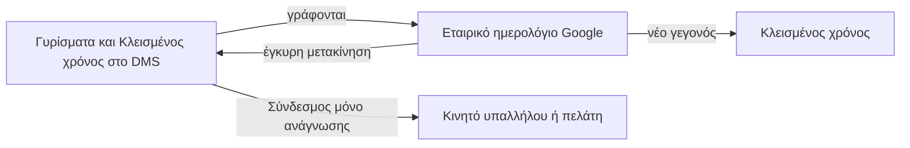

# Γυρίσματα και ημερολόγιο

> **👁️ Με μια ματιά**
> Ο πελάτης κλείνει μόνος του Γύρισμα μέσα στο Ωράριο κρατήσεων και στη Χωρητικότητα που ορίζει ο admin. Το Γύρισμα δεσμεύει Παροχή και ώρα από την πρώτη στιγμή και περιμένει έγκριση. Η ομάδα ορίζει Συνεργείο και Εξοπλισμό, στέλνει Δελτίο, και μετά το Γύρισμα σημειώνει «έγινε» με τις πραγματικές ώρες.
> Όλοι οι κανόνες (έγκριση, ακύρωση, ορίζοντας, σύγκρουση εξοπλισμού) είναι επιλογές του admin και όχι κώδικας.
> Ένα Ημερολόγιο δείχνει στον καθένα μόνο ό,τι του αναλογεί. Το Εταιρικό ημερολόγιο Google το επεξεργάζονται μόνο όσοι έχουν το Δικαίωμα. Οι υπόλοιποι παίρνουν Σύνδεσμο ημερολογίου μόνο για ανάγνωση.
> Σε σχέση με σήμερα: μία μόνο διαδρομή κράτησης (όχι τρεις), καμία ώρα ή χωρητικότητα γραμμένη μέσα στο σύστημα, και ξεκάθαροι κανόνες για ακύρωση και για το πότε ένα Γύρισμα «έγινε».

## 🚦 Πότε ξεκινά

| Πότε | Πώς γεννιέται το Γύρισμα |
|---|---|
| Ο πελάτης κλείνει από τον χώρο του, μέσα στις Παροχές της Περιόδου | Ξεκινά «αναμένει έγκριση» και δεσμεύει Παροχή και διαθεσιμότητα αμέσως |
| Η ομάδα το δημιουργεί για λογαριασμό του πελάτη | Φτιάχνεται μέσα στο DMS, πάντα σε μία Παραγωγή |
| Η ομάδα μετατρέπει Κλεισμένο χρόνο σε Γύρισμα | Το σύστημα ζητά να διαλέξει Παραγωγή |
| Ο πελάτης δεν μπορεί να κλείσει μόνος του (π.χ. δεν έχει Παροχή) | Στέλνει Αίτημα τύπου «Γύρισμα» και η ομάδα το αναλαμβάνει |

Γύρισμα **δεν** δημιουργείται ποτέ από το Google. Δημιουργείται μόνο μέσα στο DMS.

## 👥 Ποιος συμμετέχει

| Ρόλος | Τι κάνει |
|---|---|
| Χρήστης πελάτη | Διαλέγει μέρα, διάρκεια και ώρα έναρξης. Μεταθέτει ή ακυρώνει μέσα στο Όριο ακύρωσης. Δεν βλέπει άτομα της ομάδας |
| Όποιος έχει το Δικαίωμα «Εγκρίνει Γυρίσματα» | Εγκρίνει ή απορρίπτει (η απόρριψη θέλει λόγο). Η έγκριση δεν απαιτεί Συνεργείο |
| Διαχείριση | Παίρνει ειδοποίηση για κάθε νέα κράτηση πελάτη |
| Υπεύθυνος της Παραγωγής | Ενημερώνεται όταν μέλος του Συνεργείου δηλώνει «δεν μπορώ» |
| Μέλη του Συνεργείου | Παίρνουν το Δελτίο και επιβεβαιώνουν ή δηλώνουν «δεν μπορώ» με λόγο |
| Υπάλληλος | Καταχωρεί τον δικό του Κλεισμένο χρόνο. Βλέπει τα Γυρίσματά του στον Σύνδεσμο ημερολογίου |
| Όποιος έχει το Δικαίωμα «Αμφίδρομο ημερολόγιο Google» | Δουλεύει μέσα στο Εταιρικό ημερολόγιο στο Google (αρχικά ο Ιδιοκτήτης και η Διαχείριση) |
| Admin | Ρυθμίζει Ωράριο, Χωρητικότητα, Κανόνες γυρισμάτων, Εξοπλισμό. Επιβεβαιώνει τις Πραγματικές ώρες |

Το Δικαίωμα «Αμφίδρομο ημερολόγιο Google» δεν είναι βαθμίδα admin. Το δίνει ο Ρόλος, όπως κάθε Δικαίωμα.

## 🪜 Βήματα

**Α. Κράτηση από τον πελάτη**
1. **Πελάτης:** ανοίγει τη σελίδα κράτησης. Βλέπει μόνο μέρες και ώρες που το Ωράριο κρατήσεων έχει ανοιχτές και όπου η Χωρητικότητα δεν έχει γεμίσει.
2. **Πελάτης:** διαλέγει μέρα, διάρκεια (από τις επιτρεπτές) και ώρα έναρξης (σε βήματα που έχει ορίσει ο admin).
3. **Σύστημα:** ελέγχει την ελάχιστη προειδοποίηση, τον ορίζοντα και τις Παροχές της Περιόδου. Αν όλα ταιριάζουν, δημιουργεί Γύρισμα «αναμένει έγκριση» στην Παραγωγή της Περιόδου. Δεσμεύει Παροχή και ώρα.
4. **Σύστημα:** ειδοποιεί τη Διαχείριση και γράφει το Γύρισμα στο Εταιρικό ημερολόγιο, με σήμανση ότι περιμένει έγκριση.

**Β. Έγκριση**

5. **Όποιος έχει το Δικαίωμα έγκρισης:** εγκρίνει ή απορρίπτει. Στην απόρριψη γράφει λόγο.
6. **Σύστημα:** ειδοποιεί τον πελάτη. Η απόρριψη ελευθερώνει Παροχή και ώρα.
7. **Σύστημα (αν το έχει ορίσει ο admin):** αν δεν απαντήσει κανείς σε Χ ώρες, εγκρίνει ή απορρίπτει αυτόματα.

**Γ. Προετοιμασία από την ομάδα**

8. **Υπεύθυνος της Παραγωγής ή όποιος έχει το Δικαίωμα:** ορίζει Συνεργείο, από λίστα ατόμων ή από Πρότυπο συνεργείου.
9. **Ίδιος:** δεσμεύει Εξοπλισμό, από το μητρώο ή από Πρότυπο εξοπλισμού.
10. **Ίδιος (ή αυτόματα, αν το έχει ορίσει ο admin):** στέλνει το Δελτίο γυρίσματος στο Συνεργείο.
11. **Κάθε μέλος του Συνεργείου:** επιβεβαιώνει ή δηλώνει «δεν μπορώ» με λόγο.

**Δ. Η ημέρα και μετά**

12. **Σύστημα:** στέλνει υπενθύμιση μία μέρα πριν στο Συνεργείο και στον πελάτη.
13. **Ομάδα:** μετά το Γύρισμα σημειώνει «έγινε», με τις πραγματικές ώρες, ή «δεν έγινε» αν ο πελάτης δεν ήρθε. Αν ο admin το έχει ορίσει, το «έγινε» μπαίνει αυτόματα στη λήξη.
14. **Σύστημα:** το «έγινε» καταναλώνει Παροχή, προτείνει τις Πραγματικές ώρες και, όπου ισχύει, γεννά Τιμολογητέο.

## 🔄 Καταστάσεις

Οι καταστάσεις είναι σταθερές. Ο admin δεν φτιάχνει δικές του, γιατί από αυτές εξαρτώνται η κατανάλωση Παροχής, τα Τιμολογητέα και οι ειδοποιήσεις. Αυτό που αλλάζει ο admin είναι οι κανόνες με τους οποίους το Γύρισμα περνά από τη μία στην άλλη.

| Κατάσταση | Τι σημαίνει | Πώς βγαίνει |
|---|---|---|
| **Αναμένει έγκριση** | Ο πελάτης έκλεισε. Η Παροχή και η ώρα είναι δεσμευμένες | Έγκριση → προγραμματισμένο. Απόρριψη (με λόγο, από άνθρωπο ή αυτόματα) → απορρίφθηκε. Ακύρωση → ακυρώθηκε |
| **Προγραμματισμένο** | Εγκρίθηκε, ή το έφτιαξε η ομάδα. Έχει ή περιμένει Συνεργείο και Εξοπλισμό | «Έγινε», «δεν έγινε» ή ακύρωση |
| **Έγινε** | Έγινε. Έχει πραγματικές ώρες. Η Παροχή καταναλώθηκε. Είναι ορόσημο Τιμολογητέου | Τελική |
| **Δεν έγινε** | Ο πελάτης δεν ήρθε. Η Παροχή καίγεται ή όχι, όπως ορίζουν οι Όροι της Συμφωνίας | Τελική |
| **Ακυρώθηκε** | Ακυρώθηκε από τον πελάτη (μέσα στο Όριο ακύρωσης) ή από την ομάδα | Τελική. Η Παροχή επιστρέφει ή καίγεται, δες «Πολιτική πελάτη» |
| **Απορρίφθηκε** | Η κράτηση δεν εγκρίθηκε. Η Παροχή και η ώρα ελευθερώθηκαν | Τελική |

## 📏 Κανόνες γυρισμάτων (γενικοί, από τον admin)

Ισχύουν για όλη την εταιρεία. Ο admin διαλέγει ανάμεσα σε σταθερές επιλογές και δεν περιγράφει λογική. Η τρίτη στήλη δείχνει τι έρχεται ρυθμισμένο στο πρώτο στήσιμο.

| Θέμα | Επιλογές | Αρχική τιμή |
|---|---|---|
| **Έγκριση κράτησης πελάτη** | Χρειάζεται ή όχι | Χρειάζεται |
| **Αν δεν απαντήσει κανείς σε Χ ώρες** | Τίποτα, αυτόματη έγκριση ή αυτόματη απόρριψη | Τίποτα |
| **Μέγιστος ορίζοντας κράτησης** | Πόσες μέρες μπροστά μπορεί να κλείσει ο πελάτης | 60 μέρες |
| **Κράτηση εκτός Περιόδου** | Επιτρέπεται ή όχι | Μόνο μέσα στην Περίοδο |
| **Μετάθεση από τον πελάτη** | Ξαναθέλει έγκριση ή όχι | Ξαναθέλει |
| **Σύγκρουση Εξοπλισμού** | Προειδοποιεί ή μπλοκάρει | Προειδοποιεί |
| **Ο πελάτης βλέπει τον Εξοπλισμό** | Ναι ή όχι | Όχι |
| **Αποστολή Δελτίου** | Με το χέρι ή αυτόματα | Με το χέρι |
| **Αλλαγή μετά την αποστολή** | Μηδενίζει ή όχι τις επιβεβαιώσεις των μελών | Μηδενίζει |
| **Σήμανση «έγινε»** | Με το χέρι ή αυτόματα στη λήξη | Με το χέρι, με τις πραγματικές ώρες |

Η αυτόματη έγκριση και το αυτόματο «έγινε» επιτρέπονται ως ρύθμιση. Δεν είναι ο μόνος τρόπος, γιατί το «έγινε» γεννά Τιμολογητέο και χρειάζεται συνειδητή επιλογή.

**Δελτίο γυρίσματος.** Είναι η σύνοψη του Γυρίσματος: πού, πότε, ποιοι, εξοπλισμός και shot list. Κάθε μέλος απαντά ξεχωριστά. Το «δεν μπορώ» (με λόγο) ειδοποιεί τον Υπεύθυνο της Παραγωγής, αλλά **δεν αλλάζει το Γύρισμα**. Αν αλλάξει το πού, το πότε ή το ποιοι μετά την αποστολή, βγαίνει νέα έκδοση του Δελτίου.

## 🧾 Πολιτική πελάτη στους Όρους Συμφωνίας

Η πολιτική ακύρωσης είναι εμπορικός όρος που διαπραγματεύεται κάθε πελάτης. Γι' αυτό ζει στους Όρους της Συμφωνίας και όχι στους γενικούς Κανόνες. Έρχεται από τις προεπιλογές του admin, αλλάζει όσο η Συμφωνία είναι πρόταση και παγώνει με την υπογραφή.

| Όρος | Τι σημαίνει | Αρχική τιμή |
|---|---|---|
| **Ελάχιστη προειδοποίηση κράτησης** | Πόσο νωρίτερα πρέπει να κλείσει ο πελάτης | 48 ώρες |
| **Όριο ακύρωσης** | Πόσες ώρες πριν το Γύρισμα μπορεί ο πελάτης να το μεταθέσει ή να το ακυρώσει μόνος του | 48 ώρες |
| **Αργή ακύρωση** | Καίει ή όχι Παροχή | Καίει |
| **«Δεν έγινε» (no-show)** | Καίει ή όχι Παροχή | Καίει |

- **Μέσα στο Όριο:** ο πελάτης μεταθέτει ή ακυρώνει μόνος του. Η Παροχή επιστρέφει.
- **Μετά το Όριο:** ο πελάτης μπορεί μόνο να ζητήσει ακύρωση από την ομάδα. Αν η ομάδα τη δεχτεί, ισχύει ό,τι λένε οι Όροι για την αργή ακύρωση.
- **Όταν ακυρώνει η ίδια η ομάδα:** η Παροχή επιστρέφει πάντα.
- Ένας όρος πιο ευνοϊκός για τον πελάτη από την προεπιλογή (π.χ. μικρότερο Όριο ακύρωσης) είναι Παρέκκλιση, όπως κάθε όρος χειρότερος για την εταιρεία.

## 🎬 Παροχές: πώς ένα Γύρισμα τις καταναλώνει

Ο admin ορίζει **ανά είδος Παροχής** τον Τρόπο μέτρησης και την προεπιλεγμένη διάρκεια. Η γραμμή της Συμφωνίας αλλάζει τη διάρκεια για τον συγκεκριμένο πελάτη. Οι τρεις τρόποι είναι σταθεροί. Τα είδη, τα ονόματα και οι αριθμοί δεν είναι.

| Τρόπος μέτρησης | Πώς μετράει | Παράδειγμα (φανταστικό) |
|---|---|---|
| **Ανά Γύρισμα** | 1 για κάθε Γύρισμα, μέσα σε ανώτατη διάρκεια | Παροχή «2 Γυρίσματα», ανώτατη διάρκεια 3 ώρες. Γύρισμα 3 ωρών = 1 Γύρισμα |
| **Ανά ώρα** | Όσες ώρες κράτησε | Παροχή «10 ώρες γυρίσματος». Γύρισμα 4 ωρών = 4 ώρες, μένουν 6 |
| **Ανά μέρα** | 1 για κάθε ημερολογιακή μέρα με Γύρισμα | Παροχή «3 μέρες». Δύο Γυρίσματα την ίδια μέρα = 1 μέρα |

- **Δέσμευση:** η Παροχή δεσμεύεται από τη στιγμή της κράτησης.
- **Κατανάλωση:** γίνεται με το «έγινε».
- **Ελευθέρωση:** επιστρέφει σε απόρριψη, σε ακύρωση μέσα στο Όριο και σε ακύρωση από την ομάδα.
- **Καύση:** η Παροχή θεωρείται χρησιμοποιημένη στην αργή ακύρωση και στο «δεν έγινε», αν το λένε οι Όροι.
- **Υπέρβαση:** ό,τι ξεπερνά το όριο του Τρόπου μέτρησης είναι έξτρα και τιμολογείται με την τιμή της Υπηρεσίας στη Συμφωνία.
- **Αχρησιμοποίητη Παροχή:** ακολουθεί τους Όρους της Συμφωνίας (χάνεται ή περνά στην επόμενη Περίοδο).

## 👷 Συνεργείο και Εξοπλισμός

Τα ορίζει **η ομάδα**, ποτέ ο πελάτης. Ο πελάτης βλέπει μόνο Χωρητικότητα.

| | Τι είναι | Πώς ελέγχεται |
|---|---|---|
| **Χωρητικότητα** | Πόσα Γυρίσματα μπορούν να γίνονται ταυτόχρονα, όπως τη βλέπει ο πελάτης. Μία προεπιλογή από τον admin, με αλλαγή ανά μέρα | Μια ώρα γεμίζει όταν τα Γυρίσματα που την επικαλύπτουν, και όσα αναμένουν έγκριση, φτάσουν τη Χωρητικότητα |
| **Συνεργείο** | Τα άτομα ενός συγκεκριμένου Γυρίσματος | Η διαθεσιμότητα ατόμων μετρά **μόνο στην ανάθεση**: δύο Γυρίσματα την ίδια ώρα επιτρέπονται αν δεν έχουν κοινά άτομα |
| **Εξοπλισμός** | Το μητρώο αντικειμένων της εταιρείας, από τον admin | Αν το ίδιο αντικείμενο δεσμευτεί σε επικαλυπτόμενα Γυρίσματα, το σύστημα προειδοποιεί ή μπλοκάρει, όπως ορίζουν οι Κανόνες γυρισμάτων |
| **Πρότυπα** | Αποθηκευμένος συνδυασμός ατόμων (Πρότυπο συνεργείου) ή αντικειμένων (Πρότυπο εξοπλισμού) | Γρήγορη ανάθεση ή δέσμευση |

**Ο αριθμός ατόμων του Συνεργείου μετρά στις Πραγματικές ώρες.** Οι Πραγματικές ώρες γυρίσματος μιας Παραγωγής προτείνονται από τα Γυρίσματά της ως *διάρκεια × άτομα συνεργείου*. Για παράδειγμα, ένα Γύρισμα 3 ωρών με 3 άτομα δίνει πρόταση 9 ωρών. Ο admin τις επιβεβαιώνει ή τις διορθώνει. Έτσι το πραγματικό κόστος της Παραγωγής βγαίνει από τον χρόνο της ομάδας και όχι από τη διάρκεια στο ημερολόγιο. Οι ώρες είναι εσωτερικές: ο πελάτης βλέπει Παροχές, όχι ώρες, και μόνο όποιος «Διαχειρίζεται κόστος» τις αλλάζει.

## 🚫 Κλεισμένος χρόνος και αργίες

**Κλεισμένος χρόνος.** Είναι διάστημα που μπλοκάρει τη διαθεσιμότητα συγκεκριμένων μελών της ομάδας, χωρίς να είναι Γύρισμα (π.χ. γιατρός, συνάντηση).
- Τον καταχωρεί το ίδιο το μέλος στο DMS. Αυτό το δικαίωμα το έχει πάντα κάθε μέλος της ομάδας.
- Γεννιέται και από νέο γεγονός του Εταιρικού ημερολογίου. Γίνεται Κλεισμένος χρόνος για τους προσκεκλημένους, ή για τον δημιουργό αν δεν έχει προσκεκλημένους.
- Μπορεί να μετατραπεί σε Γύρισμα μέσα στο DMS.
- Στο v1 η διαθεσιμότητα των υπαλλήλων είναι τόσο σωστή όσο ο Κλεισμένος χρόνος που καταχωρούν οι ίδιοι. Το σύστημα δεν διαβάζει τα προσωπικά τους ημερολόγια. Αργότερα: ανάγνωση της προσωπικής διαθεσιμότητας από το Google.

**Αργίες.** Οι επίσημες ελληνικές αργίες είναι αυτόματα κλειστές στο Ωράριο κρατήσεων, εκτός αν ο admin ανοίξει κάποια ως εξαίρεση. Οι ίδιες αργίες δεν μετρούν ως εργάσιμες στα Παραδοτέα.

## 📅 Ημερολόγιο και Google

Το **Ημερολόγιο** του DMS είναι μία όψη με Γυρίσματα, προθεσμίες και Κλεισμένο χρόνο. Δεν είναι πηγή δεδομένων. Ο καθένας βλέπει μόνο ό,τι του αναλογεί.

### Εταιρικό ημερολόγιο: αμφίδρομο, μόνο για όσους έχουν το Δικαίωμα

Υπάρχει **ένα** κοινό Εταιρικό ημερολόγιο Google. Αμφίδρομο με το DMS είναι μόνο αυτό. Δεν συνδέεται κανένα προσωπικό ημερολόγιο.

| Τι γίνεται | Τι κάνει το σύστημα |
|---|---|
| **Από το DMS στο Google** | Γράφονται όλα τα Γυρίσματα (όσα αναμένουν έγκριση με σήμανση) και ο Κλεισμένος χρόνος. Δεν γράφονται προθεσμίες Παραδοτέων. Το Συνεργείο δεν προσκαλείται, γιατί βλέπει τα Γυρίσματά του από τον Σύνδεσμό του |
| **Νέο γεγονός στο Google** | Γίνεται Κλεισμένος χρόνος, **ποτέ Γύρισμα**. Για να γίνει Γύρισμα, χρησιμοποιείται το «Μετατροπή σε Γύρισμα» μέσα στο DMS |
| **Μετακίνηση Γυρίσματος στο Google** | Περνά μόνο αν είναι έγκυρη: το Συνεργείο είναι ελεύθερο και η νέα ώρα πέφτει στην ίδια Περίοδο. Τότε ενημερώνονται το Συνεργείο και ο πελάτης. Αλλιώς το DMS επαναφέρει την ώρα και ειδοποιεί με τον λόγο |
| **Διαγραφή Γυρίσματος στο Google** | **Δεν το ακυρώνει.** Το DMS ζητά επιβεβαίωση με λόγο. Αν δεν έρθει μέσα στην προθεσμία (αρχικά 24 ώρες), το γεγονός ξαναμπαίνει στο Google |
| **Μετακίνηση ή διαγραφή Κλεισμένου χρόνου** | Γίνεται ελεύθερα |

**Το Google δεν παρακάμπτει τους κανόνες του DMS.** Η ακύρωση ενός Γυρίσματος θέλει λόγο και επηρεάζει την Παροχή της Περιόδου. Ένα Γύρισμα χρειάζεται Παραγωγή, Πελάτη και έλεγχο Δικαιώματος, που το Google δεν γνωρίζει. Γι' αυτό ό,τι γίνεται εκεί περνά πάντα από τον έλεγχο του DMS.

### Σύνδεσμος ημερολογίου: μόνο ανάγνωση, για όλους τους υπόλοιπους

Όλοι οι υπόλοιποι (υπάλληλοι και Χρήστες πελάτη) παίρνουν προσωπικό Σύνδεσμο για το ημερολόγιο του κινητού τους.

| Ποιος | Τι βλέπει |
|---|---|
| **Υπάλληλος** | Τα Γυρίσματα όπου είναι στο Συνεργείο, τον Κλεισμένο χρόνο του και τις προθεσμίες των Παραδοτέων που του έχουν ανατεθεί |
| **Χρήστης πελάτη** | Μόνο τα Γυρίσματα του Πελάτη του. Χωρίς προθεσμίες και χωρίς εσωτερικές σημειώσεις |

Ο Χρήστης ανανεώνει τον Σύνδεσμο όποτε θέλει. Ο Σύνδεσμος παύει να λειτουργεί όταν ο Χρήστης απενεργοποιηθεί. Ο υπάλληλος έχει πάντα Σύνδεσμο, χωρίς να χρειάζεται Δικαίωμα.

## 🔔 Ειδοποιήσεις

Όλες είναι Αυτοματισμοί πάνω σε σταθερό κατάλογο Γεγονότων. Ο admin τις ανάβει, τις σβήνει και αλλάζει κανάλι, παραλήπτες και κείμενο. Εδώ φαίνονται όσες έρχονται ενεργές από την αρχή.

| Πότε | Ποιος παίρνει | Πώς |
|---|---|---|
| Ανοίγει Περίοδος, 5 μέρες πριν | Πελάτης («κλείσε Γύρισμα») | email |
| Ο πελάτης έκλεισε Γύρισμα (αναμένει έγκριση) | Διαχείριση | Ειδοποίηση |
| Γύρισμα εγκρίθηκε ή απορρίφθηκε | Πελάτης | email |
| Εκδόθηκε Δελτίο γυρίσματος | Συνεργείο (για επιβεβαίωση) | email |
| Μια μέρα πριν το Γύρισμα | Συνεργείο και πελάτης | email |
| Γύρισμα μετακινήθηκε (έγκυρη μετακίνηση) | Συνεργείο και πελάτης | email |
| Μετακίνηση απορρίφθηκε | Διαχείριση, με τον λόγο | Ειδοποίηση |
| Γύρισμα διαγράφηκε από το Google, θέλει επιβεβαίωση | Όποιος το διέγραψε | Ειδοποίηση και email |
| Μέλος δήλωσε «δεν μπορώ» | Υπεύθυνος της Παραγωγής | Το κανάλι το ορίζει ο admin |

Ο κατάλογος έχει και τα Γεγονότα: Γύρισμα ακυρώθηκε, ζητήθηκε ακύρωση μετά το Όριο, Γύρισμα δεν σημειώθηκε ως «έγινε», και η αναμονή έγκρισης ξεπέρασε τις Χ ώρες. Δεν έρχονται με έτοιμο Αυτοματισμό: τον φτιάχνει ο admin αν θέλει, και ορίζει ο ίδιος τους παραλήπτες.

## ⚠️ Εξαιρέσεις

| Τι πάει στραβά | Τι γίνεται |
|---|---|
| Ο πελάτης θέλει ώρα που η Χωρητικότητα έχει γεμίσει | Η ώρα δεν εμφανίζεται ως διαθέσιμη. Το γέμισμα μετρά και τα Γυρίσματα που αναμένουν έγκριση |
| Ο πελάτης δεν έχει άλλη Παροχή | Δεν κλείνει μόνος του. Στέλνει Αίτημα και η ομάδα αποφασίζει |
| Κανείς δεν απαντά στην έγκριση | Ό,τι έχει ορίσει ο admin: τίποτα, αυτόματη έγκριση ή αυτόματη απόρριψη |
| Ο πελάτης ζητά ακύρωση μετά το Όριο | Η ομάδα αποφασίζει. Αν δεχτεί, ισχύουν οι Όροι για την αργή ακύρωση |
| Ο πελάτης δεν εμφανίζεται | «Δεν έγινε». Η Παροχή καίγεται ή όχι, όπως λένε οι Όροι |
| Ακυρώνει η ομάδα | Η Παροχή επιστρέφει πάντα |
| Μέλος του Συνεργείου δηλώνει «δεν μπορώ» | Ο Υπεύθυνος της Παραγωγής ειδοποιείται. Το Γύρισμα μένει όπως είναι ώσπου να αποφασίσει η ομάδα |
| Ίδιο αντικείμενο Εξοπλισμού σε δύο Γυρίσματα | Προειδοποίηση ή μπλοκάρισμα, όπως ορίζει ο admin |
| Δύο Γυρίσματα την ίδια ώρα με κοινό άτομο | Δεν επιτρέπεται η ανάθεση του ίδιου ατόμου και στα δύο |
| Μετακίνηση στο Google με απασχολημένο Συνεργείο ή άλλη Περίοδο | Το DMS επαναφέρει την ώρα και ειδοποιεί |
| Διαγραφή στο Google χωρίς επιβεβαίωση | Το γεγονός ξαναμπαίνει μετά την προθεσμία (αρχικά 24 ώρες) |
| Αλλαγή στο Δελτίο μετά την αποστολή | Νέα έκδοση, και οι επιβεβαιώσεις μηδενίζονται αν το ορίζουν οι Κανόνες |

## ⚙️ Τι ρυθμίζει ο admin

Όλα από τη σελίδα Ρυθμίσεων, ενότητα Γυρίσματα, χωρίς προγραμματιστή. Η αλλαγή ισχύει μόνο **προς τα εμπρός**: ό,τι έχει ήδη κλειστεί ή υπογραφεί δεν αλλάζει. Πριν την αποθήκευση το σύστημα δείχνει πόσα υπάρχοντα στοιχεία αφορά. Κάθε αλλαγή γράφεται στο ίχνος ενεργειών (ποιος, πότε, πριν και μετά).

| Τι | Πού |
|---|---|
| Ωράριο κρατήσεων: εβδομαδιαίο πρόγραμμα, εξαιρέσεις ανά μέρα, επιτρεπτές διάρκειες, βήμα έναρξης | Ρυθμίσεις |
| Χωρητικότητα: προεπιλογή και αλλαγή ανά μέρα | Ρυθμίσεις |
| Αργίες: άνοιγμα μιας αργίας ως εξαίρεση | Ρυθμίσεις |
| Κανόνες γυρισμάτων (ο πίνακας παραπάνω) | Ρυθμίσεις |
| Τρόπος μέτρησης και προεπιλεγμένη διάρκεια ανά είδος Παροχής | Ρυθμίσεις |
| Προεπιλογές των Όρων Συμφωνίας (προειδοποίηση, Όριο ακύρωσης, αργή ακύρωση, no-show) | Ρυθμίσεις |
| Τρεις ρυθμίσεις Google: τι γίνεται το νέο γεγονός (Κλεισμένος χρόνος ή αγνοείται), προθεσμία επιβεβαίωσης διαγραφής, αν γράφονται στο Google όσα αναμένουν έγκριση | Ρυθμίσεις |
| Μητρώο Εξοπλισμού και Πρότυπα εξοπλισμού | Μητρώο Εξοπλισμού |
| Αυτοματισμοί και κείμενα ειδοποιήσεων | Αυτοματισμοί |
| Ποιος έχει «Εγκρίνει Γυρίσματα» και «Αμφίδρομο ημερολόγιο Google» | Ρόλοι |

Οι υπόλοιποι κανόνες του Ημερολογίου προστατεύουν την ακεραιότητα των δεδομένων και **δεν ρυθμίζονται**: η μετακίνηση που βγάζει Συνεργείο από την Περίοδο απορρίπτεται πάντα, και το Google δεν δημιουργεί Γύρισμα ποτέ. Μια τιμή λίστας που έχει χρησιμοποιηθεί (π.χ. είδος Παροχής) δεν διαγράφεται. Αποσύρεται και μένει στα παλιά στοιχεία.

## 🙋 Τι βλέπει ο πελάτης

- Σελίδα κράτησης με μέρες και ώρες από το Ωράριο και τη Χωρητικότητα. Δεν βλέπει άτομα της ομάδας.
- Τα Γυρίσματά του με την κατάσταση: αναμένει έγκριση, προγραμματισμένο, έγινε, δεν έγινε, ακυρώθηκε, απορρίφθηκε.
- Δυνατότητα μετάθεσης ή ακύρωσης μέσα στο Όριο ακύρωσης. Μετά το Όριο, μόνο αίτημα ακύρωσης.
- Τον Εξοπλισμό, μόνο αν ο admin το έχει επιτρέψει (αρχικά όχι).
- Τα Γυρίσματά του στο ημερολόγιο του κινητού του, μέσω Συνδέσμου μόνο για ανάγνωση. Χωρίς προθεσμίες και εσωτερικές σημειώσεις.
- Email για έγκριση ή απόρριψη, μετακίνηση, υπενθύμιση μία μέρα πριν και υπενθύμιση πριν ανοίξει η Περίοδος.
- Δεν βλέπει ώρες δουλειάς ούτε κόστος. Βλέπει Παροχές.

## 🔗 Πού ακουμπά άλλες ροές

| Ροή | Σημείο επαφής |
|---|---|
| Κατάλογος, Συμφωνία και κόστος | Οι Παροχές, οι Όροι (πολιτική ακύρωσης), οι Εκτιμώμενες και οι Πραγματικές ώρες |
| Η ραχοκοκαλιά | Η κράτηση είναι Γύρισμα «αναμένει έγκριση». Το Γύρισμα ανήκει σε Παραγωγή |
| Τιμολόγηση και εισπράξεις | Το «έγινε» είναι ορόσημο Τιμολογητέου: δόση εφάπαξ Συμφωνίας ή έξτρα πέρα από τις Παροχές |
| Παραδοτέα | Οι αργίες δεν μετρούν ως εργάσιμες. Η προθεσμία ενός Παραδοτέου φαίνεται στον Σύνδεσμο του ανατεθειμένου |
| Μηνύματα και Αιτήματα | Αίτημα τύπου «Γύρισμα» όταν ο πελάτης δεν μπορεί να κλείσει μόνος του |
| Ειδοποιήσεις και Αυτοματισμοί | Όλα τα Γεγονότα του πίνακα ειδοποιήσεων |

## 📖 Σενάρια

**1. Κανονική κράτηση: Καφέ Αθηνά.**
Η Παροχή της Περιόδου είναι «2 Γυρίσματα», ανά Γύρισμα, με ανώτατη διάρκεια 3 ώρες. Η Μαρία από το Καφέ Αθηνά κλείνει Τρίτη 14:00–17:00. Η ώρα φαίνεται ελεύθερη γιατί η Χωρητικότητα της μέρας είναι 2 και υπάρχει 1 Γύρισμα. Το Γύρισμα γίνεται «αναμένει έγκριση» και δεσμεύει 1 από τις 2 Παροχές. Η Διαχείριση ειδοποιείται και το εγκρίνει την ίδια μέρα. Ο πελάτης παίρνει email. Η ομάδα βάζει Συνεργείο 3 ατόμων με Πρότυπο συνεργείου, δεσμεύει κάμερα και φώτα, και στέλνει Δελτίο. Και οι τρεις επιβεβαιώνουν. Την Τρίτη μετά το Γύρισμα σημειώνεται «έγινε». Η Παροχή καταναλώνεται (μένει 1) και το σύστημα προτείνει 9 Πραγματικές ώρες (3 ώρες × 3 άτομα). Ο admin τις επιβεβαιώνει.

**2. Αργή ακύρωση: Γυμναστήριο Κίνηση.**
Το Όριο ακύρωσης στη Συμφωνία είναι 48 ώρες και η αργή ακύρωση καίει Παροχή. Ο πελάτης θέλει να ακυρώσει 20 ώρες πριν. Το σύστημα δεν του επιτρέπει να ακυρώσει μόνος του. Στέλνει αίτημα ακύρωσης. Η ομάδα το δέχεται, το Γύρισμα γίνεται «ακυρώθηκε» και η Παροχή θεωρείται χρησιμοποιημένη. Αν είχε ακυρώσει 3 μέρες πριν, η Παροχή θα είχε επιστρέψει αυτόματα. Σε άλλη περίπτωση η ομάδα ακυρώνει λόγω βλάβης στον εξοπλισμό: τότε η Παροχή επιστρέφει πάντα.

**3. Το Google δεν παρακάμπτει τους κανόνες: Ζαχαροπλαστείο Μέλι.**
Η Ελένη, που έχει το Δικαίωμα αμφίδρομου ημερολογίου, σέρνει στο Google ένα Γύρισμα του Ζαχαροπλαστείου Μέλι σε ώρα όπου ο κάμεραμαν έχει Κλεισμένο χρόνο (ραντεβού με γιατρό). Η μετακίνηση δεν είναι έγκυρη. Το DMS επαναφέρει την παλιά ώρα και ειδοποιεί τη Διαχείριση με τον λόγο. Αργότερα η Ελένη σβήνει στο Google ένα άλλο Γύρισμα. Δεν ακυρώνεται τίποτα. Το DMS τής ζητά λόγο ακύρωσης. Αν δεν απαντήσει σε 24 ώρες, το γεγονός ξαναμπαίνει. Την ίδια μέρα προσθέτει στο Google «Συνάντηση με προμηθευτή» με δύο προσκεκλημένους. Γίνεται Κλεισμένος χρόνος για τους δύο, όχι Γύρισμα.

**4. Μέτρηση ανά ώρα και ανά μέρα.**
Στο Ζαχαροπλαστείο Μέλι η Παροχή «Φωτογράφιση» μετριέται ανά μέρα. Δύο Γυρίσματα την ίδια μέρα, πρωί και απόγευμα, καταναλώνουν 1 μέρα. Σε άλλη Συμφωνία η Παροχή «10 ώρες γυρίσματος» μετριέται ανά ώρα. Ένα Γύρισμα 4 ωρών αφήνει 6 ώρες. Αν ο πελάτης ζητήσει 7 ώρες όταν μένουν 6, η μία ώρα που περισσεύει είναι έξτρα και τιμολογείται με την τιμή της Υπηρεσίας.

✅ Κανόνες που θα ελέγχονται

- **Δεδομένου ότι** ο πελάτης κλείνει Γύρισμα μέσα στις Παροχές της Περιόδου, **όταν** η κράτηση γίνεται, **τότε** το Γύρισμα ξεκινά «αναμένει έγκριση» και δεσμεύει Παροχή και ώρα αμέσως.
- **Δεδομένου ότι** ένα Γύρισμα απορρίπτεται, **όταν** η απόρριψη γίνεται από άνθρωπο, **τότε** χρειάζεται λόγο και η Παροχή και η ώρα ελευθερώνονται.
- **Δεδομένου ότι** μια ώρα έχει φτάσει τη Χωρητικότητα (μαζί με όσα αναμένουν έγκριση), **όταν** ο πελάτης ψάχνει ώρα, **τότε** η ώρα δεν είναι διαθέσιμη.
- **Δεδομένου ότι** ο πελάτης δεν βλέπει άτομα, **όταν** κλείνει, **τότε** κρίνεται μόνο με Ωράριο και Χωρητικότητα και όχι με το ποιος είναι ελεύθερος.
- **Δεδομένου ότι** δύο Γυρίσματα συμπίπτουν στην ώρα, **όταν** έχουν κοινό άτομο στο Συνεργείο, **τότε** η ανάθεση αυτού του ατόμου δεν επιτρέπεται.
- **Δεδομένου ότι** ο πελάτης ακυρώνει μέσα στο Όριο ακύρωσης, **όταν** πατά ακύρωση, **τότε** ακυρώνεται και η Παροχή επιστρέφει.
- **Δεδομένου ότι** ο πελάτης είναι έξω από το Όριο ακύρωσης, **όταν** θέλει να ακυρώσει, **τότε** μπορεί μόνο να ζητήσει ακύρωση από την ομάδα.
- **Δεδομένου ότι** ακυρώνει η ομάδα, **όταν** το Γύρισμα ακυρώνεται, **τότε** η Παροχή επιστρέφει πάντα.
- **Δεδομένου ότι** ένα Γύρισμα σημειώνεται «έγινε», **όταν** καταχωρούνται οι ώρες, **τότε** καταναλώνεται Παροχή με τον Τρόπο μέτρησης του είδους της και ο αριθμός ατόμων του Συνεργείου μπαίνει στις προτεινόμενες Πραγματικές ώρες.
- **Δεδομένου ότι** μέλος του Συνεργείου δηλώνει «δεν μπορώ», **όταν** απαντά, **τότε** ειδοποιείται ο Υπεύθυνος της Παραγωγής και το Γύρισμα δεν αλλάζει.
- **Δεδομένου ότι** γίνεται αλλαγή σε πού, πότε ή ποιοι μετά την αποστολή του Δελτίου, **όταν** αποθηκεύεται, **τότε** βγαίνει νέα έκδοση του Δελτίου.
- **Δεδομένου ότι** κάποιος διαγράφει ένα Γύρισμα στο Google, **όταν** περάσει η προθεσμία χωρίς επιβεβαίωση με λόγο, **τότε** το γεγονός ξαναμπαίνει και το Γύρισμα δεν ακυρώνεται.
- **Δεδομένου ότι** ένα νέο γεγονός μπαίνει στο Google, **όταν** το DMS το διαβάζει, **τότε** γίνεται Κλεισμένος χρόνος και ποτέ Γύρισμα.
- **Δεδομένου ότι** ένας υπάλληλος ή Χρήστης πελάτη δεν έχει το Δικαίωμα αμφίδρομου ημερολογίου, **όταν** θέλει να βλέπει το ημερολόγιο στο κινητό, **τότε** παίρνει Σύνδεσμο μόνο για ανάγνωση με ό,τι του αναλογεί, και ο Σύνδεσμος παύει να λειτουργεί όταν απενεργοποιηθεί.

## ❓ Ανοιχτά ερωτήματα

Τα παρακάτω δεν προκύπτουν από τις πηγές και χρειάζονται απόφαση:

1. **Ποιος σημειώνει «έγινε» και «δεν έγινε»:** ποιο Δικαίωμα απαιτείται και ποιος καταχωρεί τις ώρες του «έγινε». Στις πηγές υπάρχει μόνο το Δικαίωμα έγκρισης.
2. **Αυτόματο «έγινε» στη λήξη:** ποιες ώρες καταχωρούνται (π.χ. οι προγραμματισμένες) δεν ορίζεται.
3. **Διόρθωση λάθους:** αν ένα «έγινε» ή «δεν έγινε» που μπήκε κατά λάθος μπορεί να αναιρεθεί, μιας και το «έγινε» γεννά Τιμολογητέο. Στις πηγές οι τελικές καταστάσεις δεν έχουν έξοδο.
4. **Ποιοι ειδοποιούνται** για τα Γεγονότα: Γύρισμα ακυρώθηκε, ζητήθηκε ακύρωση μετά το Όριο, Γύρισμα δεν σημειώθηκε ως «έγινε», αναμονή έγκρισης πέρα από Χ ώρες. Ο αρχικός κατάλογος Αυτοματισμών δεν τα καλύπτει.
5. **Αργή ακύρωση και ακύρωση ομάδας:** διαβάσαμε ότι αν η ομάδα δεχτεί αίτημα του πελάτη μετά το Όριο, ισχύουν οι Όροι (καίει Παροχή), ενώ αν ακυρώσει από δική της πρωτοβουλία η Παροχή επιστρέφει πάντα. Οι πηγές δεν το ξεχωρίζουν ρητά.
6. **Γύρισμα που φτιάχνει η ομάδα:** γράφουμε ότι ξεκινά «προγραμματισμένο», γιατί η κατάσταση «αναμένει έγκριση» ορίζεται για κράτηση πελάτη. Δεν αναφέρεται ρητά.
7. **Ακύρωση όσο αναμένει έγκριση:** διαβάσαμε ότι ο πελάτης την ακυρώνει με τους ίδιους κανόνες. Δεν αναφέρεται ρητά.
8. **Κράτηση χωρίς έγκριση:** αν ο admin σβήσει την έγκριση, δεν ορίζεται αν το Γύρισμα περνά από «αναμένει έγκριση» ή γίνεται απευθείας «προγραμματισμένο».
9. **Κράτηση εκτός Περιόδου** (όταν ο admin την επιτρέψει) και **εφάπαξ Συμφωνία:** δεν ορίζεται από ποια Παροχή καταναλώνεται το Γύρισμα και ποια είναι η «Περίοδος» στις εφάπαξ Συμφωνίες.
10. **Μετάθεση από τον πελάτη:** δεν ορίζεται τι κρατά το Ωράριο και η Παροχή (παλιά ή νέα ώρα) όσο περιμένει νέα έγκριση.
11. **Κλεισμένος χρόνος στην ανάθεση:** δεν ορίζεται αν ένα άτομο με Κλεισμένο χρόνο μπλοκάρεται ή απλώς προειδοποιείται όταν μπαίνει σε Συνεργείο.
12. **Αριθμός ατόμων συνεργείου:** η πηγή για το κόστος λέει ότι το Γύρισμα αποκτά «αριθμό ατόμων συνεργείου». Δεν ορίζεται τι γίνεται όταν το Συνεργείο δεν έχει ακόμα ανατεθεί, ούτε αν ο αριθμός είναι ξεχωριστό πεδίο από τη λίστα ατόμων.
13. **Google και τελικές καταστάσεις:** δεν ορίζεται τι γίνεται με το γεγονός στο Google όταν το Γύρισμα απορρίπτεται, ακυρώνεται ή γίνεται.
14. **Ποιος μπορεί να κάνει «Μετατροπή σε Γύρισμα»:** δεν ορίζεται Δικαίωμα.
15. **Διαγραφή στο Google και ακύρωση:** διαβάσαμε ότι η επιβεβαίωση με λόγο ακυρώνει το Γύρισμα από την ομάδα, άρα η Παροχή επιστρέφει. Δεν αναφέρεται ρητά.
16. **Δελτίο και πελάτης:** δεν ορίζεται αν ο πελάτης βλέπει το Δελτίο.

**Σημείο προς έλεγχο στις πηγές:** το ερώτημα για το ημερολόγιο έκανε αρχικά πρόταση να ενημερώνονται οι προσκεκλημένοι. Η τελική απόφαση λέει ότι το Συνεργείο δεν προσκαλείται και βλέπει τα Γυρίσματα από τον Σύνδεσμό του. Ισχύει η τελική απόφαση. Επίσης το λεξικό δίνει ως παράδειγμα Δικαιώματος το «Εγκρίνει κράτηση», ενώ οι αποφάσεις ονομάζουν το Δικαίωμα «Εγκρίνει Γυρίσματα». Εδώ χρησιμοποιείται το δεύτερο.

Πηγές

- ADR 0010: Οι καταστάσεις του Γυρίσματος είναι σταθερές, οι κανόνες μετάβασης τους ορίζει ο admin
- ADR 0005: Το Google είναι όψη ενός Εταιρικού ημερολογίου, όχι πηγή
- ADR 0017: Το κόστος βγαίνει από ώρες, τις πραγματικές τις γράφει ο admin (αριθμός ατόμων συνεργείου, Πραγματικές ώρες)
- ADR 0015: Οι Ρυθμίσεις ζουν σε ένα μέρος, ισχύουν προς τα εμπρός (αργίες, μόνο προς τα εμπρός, αρχικές τιμές)
- Συμπληρωματικά: ADR 0002 (η κράτηση είναι Γύρισμα), ADR 0006 (Αυτοματισμοί και Γεγονότα), ADR 0007 (Εύρος, Σύνδεσμος ημερολογίου και Κλεισμένος χρόνος ως βασικά), ADR 0008 (Όροι Συμφωνίας), ADR 0016 (σύνδεση με το Google)
- Issue #20: Γυρίσματα: διαθεσιμότητα, έγκριση κράτησης, Συνεργείο, Δελτίο
- Issue #13: Κανόνες αμφίδρομου ημερολογίου
- Issue #14: αρχικός κατάλογος Γεγονότων και Αυτοματισμών (πίνακας ειδοποιήσεων)
- CONTEXT.md, ενότητα «Γυρίσματα και ημερολόγιο» (και όροι Παροχή, Τρόπος μέτρησης, Όροι Συμφωνίας, Πραγματικές ώρες, Τιμολογητέο)

