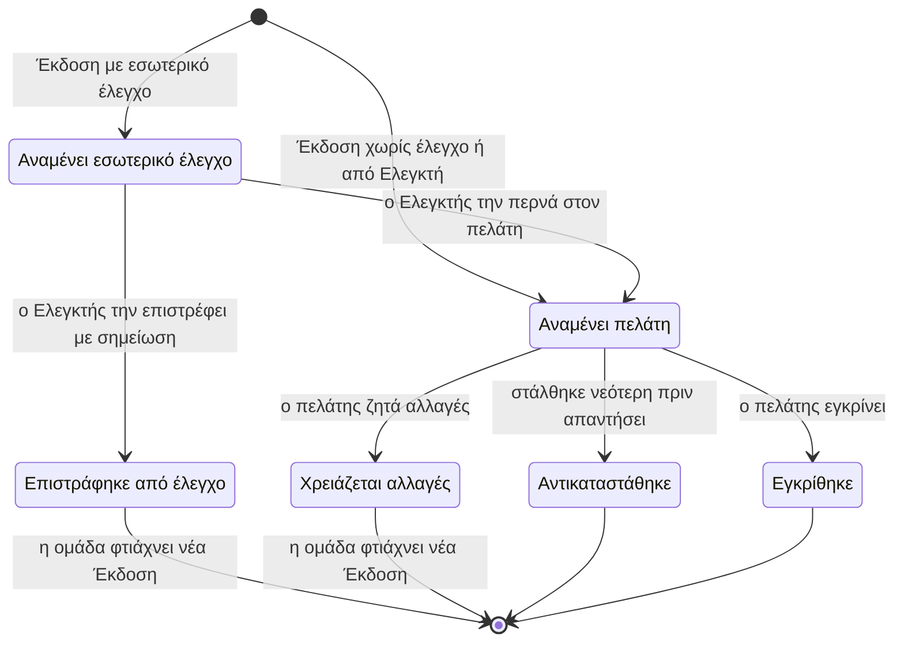

# Παραδοτέα και εγκρίσεις

> **👁️ Με μια ματιά**
> Εδώ η δουλειά γίνεται κάτι που ο πελάτης βλέπει, σχολιάζει και εγκρίνει. Η ομάδα φτιάχνει Παραδοτέα μέσα σε μια Παραγωγή, και κάθε Παραδοτέο έχει Εκδόσεις (v1, v2…) που είναι **link** σε αρχείο έξω από το σύστημα, όχι ανεβασμένο αρχείο.
> Η έγκριση του πελάτη είναι **οριστική** και δεν υπάρχει σιωπηρή έγκριση. Αν ο πελάτης θέλει αλλαγή μετά την έγκριση, κάνει Αίτημα και η ομάδα αποφασίζει αν είναι γύρος, χρεώνεται ή γίνεται νέο Παραδοτέο.
> Σε σχέση με σήμερα: υπάρχει όριο αλλαγών ανά είδος δουλειάς, εσωτερικός έλεγχος πριν φτάσει κάτι στον πελάτη, προθεσμίες που δεν μετρούν όσο περιμένουμε τον πελάτη, και μία ουρά για την ομάδα.

## 🚦 Πότε ξεκινά

| Τι συμβαίνει | Τι ανοίγει αυτόματα |
|---|---|
| Υπογράφεται **εφάπαξ** Συμφωνία | Μία Παραγωγή, με τα Παραδοτέα της στημένα από την υπογραφή |
| Ανοίγει μια **Περίοδος** μηνιαίας Συμφωνίας | Μία νέα Παραγωγή για εκείνη την Περίοδο |
| Η εταιρεία θέλει δική της δουλειά (π.χ. showreel) | Εσωτερική Παραγωγή, χωρίς Πελάτη και χωρίς Συμφωνία (τη φτιάχνει άνθρωπος) |

Κάθε Παραγωγή πελάτη ανήκει σε **μία** Συμφωνία. Το κάθε Παραδοτέο φτιάχνεται μόνο από την ομάδα, ποτέ από τον πελάτη. Ο πελάτης το ζητά με Αίτημα (βλ. «Μηνύματα και Αιτήματα»).

## 👥 Ποιος συμμετέχει

| Ρόλος | Τι κάνει |
|---|---|
| **Υπεύθυνος Παραγωγής** | Απαντά για την Παραγωγή. Παίρνει τις ειδοποιήσεις για τις απαντήσεις του πελάτη. Αποφασίζει τα Αιτήματα αλλαγής μετά την έγκριση. |
| **Ανατεθειμένος** | Ο ένας άνθρωπος που έχει αναλάβει ένα Παραδοτέο. Δουλεύει το κομμάτι και προσθέτει τις Εκδόσεις του. |
| **Μέλος Παραγωγής** | Κάθε μέλος της ομάδας που δουλεύει στην Παραγωγή. Βλέπει τα Γυρίσματα, τα Παραδοτέα και τα Μηνύματα με την ετικέτα της (αν το Δικαίωμά του έχει Εύρος «όσα με αφορούν»). |
| **Ελεγκτής** | Όποιος έχει το Δικαίωμα «Ελέγχει Παραδοτέα». Κάνει τον εσωτερικό έλεγχο και στέλνει τις δικές του Εκδόσεις απευθείας στον πελάτη. |
| **Όποιος παραδίδει χειροκίνητα** | Όποιος έχει το αντίστοιχο Δικαίωμα. Κλείνει μια Παραγωγή ως παραδομένη χωρίς να έχουν εγκριθεί όλα, με υποχρεωτικό σχόλιο. |
| **Admin (Διαχείριση)** | Ορίζει τους Κανόνες Παραδοτέων και τις προθεσμίες. Όποιος «Διαχειρίζεται κόστος» (αρχικά μόνο ο Ιδιοκτήτης) γράφει τις Πραγματικές ώρες. |
| **Χρήστης πελάτη με «Εγκρίνει Παραδοτέα»** | Εγκρίνει μια Έκδοση ή τη στέλνει για αλλαγές. Το Δικαίωμα το έχει ο Ρόλος «Πλήρης». |

### Η Παραγωγή και τα Μέλη της

- Ο **Υπεύθυνος** της Παραγωγής είναι πάντα Μέλος της.
- Ένας συνάδελφος γίνεται Μέλος **αυτόματα**: μόλις του ανατεθεί εργασία, Παραδοτέο ή θέση σε Συνεργείο Γυρίσματος της Παραγωγής. Μπορεί να προστεθεί και **με το χέρι**.
- Όταν κάποιος αφαιρεθεί από Μέλος, χάνει αμέσως την πρόσβαση στην Παραγωγή και σε ό,τι ανήκει σε αυτήν.
- Η κατάσταση της Παραγωγής **προκύπτει** από τα Γυρίσματα, τις εργασίες και τα Παραδοτέα της. Δεν τη γράφει κανείς με το χέρι.
- Ο ρόλος «Παραγωγή» δεν βλέπει ποσά. Όποιος βλέπει μια Παραγωγή χωρίς το Δικαίωμα για ποσά, τη βλέπει χωρίς νούμερα.

## 🪜 Βήματα

1. **Ανοίγει η Παραγωγή.** Υπεύθυνος: το σύστημα (αυτόματα, βλ. «Πότε ξεκινά»).
2. **Ορίζονται Υπεύθυνος και Μέλη.** Υπεύθυνος: όποιος έχει το Δικαίωμα στις Παραγωγές. Τα Μέλη προστίθενται και με την ανάθεση.
3. **Δημιουργείται το Παραδοτέο.** Υπεύθυνος: η ομάδα. Διαλέγει το είδος Παροχής, τον Ανατεθειμένο και, αν θέλει, αλλάζει την προθεσμία που προτείνει το σύστημα. **Τη στιγμή της δημιουργίας δεσμεύεται Παροχή του είδους του** και το Παραδοτέο δένεται για πάντα με την Περίοδο της οποίας την Παροχή κατανάλωσε. Αν η Περίοδος δεν έχει άλλη Παροχή του είδους, το σύστημα δεν μπλοκάρει: προειδοποιεί και ρωτά «έξτρα με χρέωση» (γεννά Τιμολογητέο με την τιμή της Υπηρεσίας στη Συμφωνία) ή «χωρίς χρέωση» (με υποχρεωτικό λόγο, στο ίχνος ενεργειών). Ο Ανατεθειμένος ειδοποιείται.
4. **Προστίθεται Έκδοση.** Υπεύθυνος: ο Ανατεθειμένος. Η Έκδοση είναι link (Google Drive, Vimeo ή YouTube). Το σύστημα δεν κρατά το αρχείο.
5. **Εσωτερικός έλεγχος** (αν το ορίζουν οι Κανόνες Παραδοτέων). Υπεύθυνος: ο Ελεγκτής. Ο πελάτης δεν βλέπει την Έκδοση σε αυτό το στάδιο. Ο Ελεγκτής τη στέλνει στον πελάτη ή την **επιστρέφει** στον Ανατεθειμένο με υποχρεωτική σημείωση. Η Έκδοση ενός Ελεγκτή δεν περνά από έλεγχο.
6. **Αποστολή στον πελάτη.** Υπεύθυνος: όποιος έχει το Δικαίωμα να στέλνει Εκδόσεις στον πελάτη. Ο πελάτης παίρνει email (απαραίτητο, δεν σβήνεται) και το Παραδοτέο γράφει «αναμένει πελάτη».
7. **Ο πελάτης σχολιάζει.** Υπεύθυνος: ο Χρήστης πελάτη. Σε Vimeo ή YouTube ο χρόνος μέσα στο video μπαίνει μόνος του· σε Drive τον γράφει όποιος σχολιάζει. Η ομάδα μπορεί να γράψει και **εσωτερικά** σχόλια, που ο πελάτης δεν βλέπει.
8. **Ο πελάτης απαντά.** Υπεύθυνος: Χρήστης πελάτη με «Εγκρίνει Παραδοτέα». Εγκρίνει ή ζητά αλλαγές. Αν είναι δύο, **ισχύει η πρώτη απάντηση**.
9. **Αν ζητήθηκαν αλλαγές:** ο Υπεύθυνος Παραγωγής ειδοποιείται, το Παραδοτέο γυρίζει «σε εργασία», μπαίνει νέα προθεσμία για την ομάδα (σε εργάσιμες, από τους Κανόνες Παραδοτέων) και ο Ανατεθειμένος φτιάχνει νέα Έκδοση. Επιστροφή στο βήμα 4.
10. **Αν εγκρίθηκε:** η έγκριση είναι οριστική. Ο πελάτης βλέπει τα **Τελικά αρχεία** (αν η ομάδα δεν ορίσει άλλο, είναι το link της εγκεκριμένης Έκδοσης). Ό,τι γέννησε η έγκριση (π.χ. Τιμολογητέο «Παραγωγή παραδόθηκε») μένει όπως είναι.
11. **Η Παραγωγή γίνεται παραδομένη.** Υπεύθυνος: το σύστημα, όταν εγκριθούν όλα τα Παραδοτέα της· ή η ομάδα με το χέρι, με υποχρεωτικό σχόλιο. Ο πελάτης παίρνει email.
12. **Καταγράφονται οι Πραγματικές ώρες.** Υπεύθυνος: όποιος «Διαχειρίζεται κόστος». Το σύστημα υπενθυμίζει μόλις η Παραγωγή γίνει παραδομένη. Οι ώρες γυρίσματος έρχονται προτεινόμενες από τα Γυρίσματα (διάρκεια × άτομα συνεργείου)· ο admin τις επιβεβαιώνει ή τις διορθώνει και γράφει τις ώρες μοντάζ. Όσο λείπουν, η Παραγωγή γράφει «χωρίς πραγματικές ώρες» και **δεν μετρά ως μηδενικό κόστος**.

### Όριο αλλαγών

Κάθε είδος Παροχής έχει όριο στους γύρους «χρειάζεται αλλαγές» ανά Παραδοτέο (π.χ. reel 1 γύρος, εταιρικό video 3 γύροι). Είναι Όρος της Συμφωνίας.

- Ο πελάτης βλέπει έναν μετρητή γύρων.
- Πριν ζητήσει γύρο **πέρα από το όριο**, προειδοποιείται ότι ο γύρος χρεώνεται.
- Η ομάδα αποφασίζει αν θα γεννηθεί Τιμολογητέο «έξτρα αναθεώρηση».

### Αλλαγή μετά την έγκριση

Ο πελάτης την ζητά από τη σελίδα του Παραδοτέου με το κουμπί «Ζητώ αλλαγή». Γίνεται **Αίτημα** (είδος «αλλαγή μετά την έγκριση») και μπαίνει στην ίδια ουρά με τα άλλα Αιτήματα. Η έγκριση **δεν σβήνεται**. Ο Υπεύθυνος Παραγωγής διαλέγει:

| Επιλογή | Τι γίνεται |
|---|---|
| **Δεκτό ως γύρος** | Το Παραδοτέο ξανανοίγει με νέα Έκδοση και ο γύρος μετράει στο Όριο αλλαγών. |
| **Χρεώνεται** | Το Παραδοτέο ξανανοίγει και γεννιέται Τιμολογητέο έξτρα. |
| **Νέο Παραδοτέο** | Φτιάχνεται άλλο Παραδοτέο, που δεσμεύει δική του Παροχή. Το παλιό μένει εγκεκριμένο. |

## 🔄 Καταστάσεις

Οι καταστάσεις είναι **σταθερές**. Ο admin δεν φτιάχνει δικές του, γιατί από αυτές εξαρτώνται η Παροχή, τα Τιμολογητέα και οι ειδοποιήσεις. Ο admin ρυθμίζει μόνο τους κανόνες γύρω τους.

Το διάγραμμα δείχνει τον κύκλο μιας **Έκδοσης**. Το Παραδοτέο παίρνει την κατάστασή του από την τελευταία Έκδοση.

### Έκδοση

| Κατάσταση | Τι σημαίνει | Πώς βγαίνει |
|---|---|---|
| **Αναμένει εσωτερικό έλεγχο** | Η ομάδα την ελέγχει πριν τη δει ο πελάτης. Ο πελάτης δεν τη βλέπει. | Ο Ελεγκτής την περνά στον πελάτη ή την επιστρέφει. |
| **Επιστράφηκε από έλεγχο** | Ο Ελεγκτής δεν την έστειλε και έγραψε σημείωση. Ο πελάτης δεν τη βλέπει και δεν μετρά γύρος. | Τέλος. Η ομάδα φτιάχνει νέα Έκδοση. |
| **Αναμένει πελάτη** | Ο πελάτης την έχει και δεν έχει απαντήσει. | Εγκρίνεται, ζητούνται αλλαγές, ή αντικαθίσταται από νεότερη. |
| **Εγκρίθηκε** | Ο πελάτης την έδωσε οριστικά. | Τέλος. Μόνο Αίτημα αλλαγής μπορεί να ξανανοίξει το Παραδοτέο, με **νέα** Έκδοση. |
| **Χρειάζεται αλλαγές** | Ο πελάτης ζήτησε διορθώσεις. | Η ομάδα φτιάχνει νέα Έκδοση. |
| **Αντικαταστάθηκε** | Στάλθηκε νεότερη Έκδοση πριν απαντήσει ο πελάτης. | Τέλος. Μένει στο ιστορικό. |

### Παραδοτέο

| Κατάσταση | Τι σημαίνει | Πώς βγαίνει |
|---|---|---|
| **Σε εργασία** | Καμία Έκδοση δεν έχει φτάσει στον πελάτη, ή η τελευταία είναι «χρειάζεται αλλαγές», σε έλεγχο ή επιστράφηκε από έλεγχο. | Στέλνεται Έκδοση στον πελάτη, ή το Παραδοτέο ακυρώνεται. |
| **Αναμένει πελάτη** | Η τελευταία Έκδοση περιμένει απάντηση. | Ο πελάτης εγκρίνει ή ζητά αλλαγές, ή το Παραδοτέο ακυρώνεται. |
| **Εγκρίθηκε** | Η τελευταία Έκδοση εγκρίθηκε. | Τέλος, εκτός αν ένα Αίτημα αλλαγής το ξανανοίξει («δεκτό ως γύρος» ή «χρεώνεται»). |
| **Ακυρώθηκε** | Η ομάδα το ακύρωσε, με δηλωμένο λόγο. | Τέλος. Η ομάδα δηλώνει αν η Παροχή **καταναλώθηκε** ή **επιστρέφει** στην επόμενη Περίοδο. |

### Παραγωγή

| Κατάσταση | Τι σημαίνει | Πώς βγαίνει |
|---|---|---|
| **Ανοιχτή** | Υπάρχει ακόμα δουλειά: Γυρίσματα, εργασίες ή Παραδοτέα. Μένει ανοιχτή και μετά το τέλος της Περιόδου, μέχρι να παραδοθεί ή να ακυρωθεί και το τελευταίο Παραδοτέο της. | Γίνεται παραδομένη. |
| **Παραδομένη** | Όλα τα μη ακυρωμένα Παραδοτέα εγκρίθηκαν και δεν μένει ανοιχτό Γύρισμα (αυτόματα), ή η ομάδα την έκλεισε με σχόλιο. | Ξαναγίνεται ανοιχτή μόνο αν ένα Αίτημα αλλαγής ξανανοίξει Παραδοτέο της. Ενεργοποιείται η υπενθύμιση για Πραγματικές ώρες. |
| **Ακυρωμένη** | Η ομάδα την ακύρωσε με λόγο, πριν γίνει οποιαδήποτε δουλειά (κανένα εγκεκριμένο Παραδοτέο, κανένα Γύρισμα «έγινε»). | Τέλος. |

### Προθεσμία και καθυστέρηση

- Κάθε Παραδοτέο έχει **δική του προθεσμία**. Προεπιλογή ανά είδος Παροχής από τον admin, που η ομάδα αλλάζει ανά Παραδοτέο. Μετριέται από το Γύρισμα που έγινε ή από τη δημιουργία.
- Το Παραδοτέο είναι **καθυστερημένο μόνο όταν η καθυστέρηση οφείλεται σε εμάς**. Όσο «αναμένει πελάτη», δεν τρέχει καθυστέρηση.
- Η ένδειξη καθυστέρησης είναι **εσωτερική**. Ο πελάτης δεν τη βλέπει.
- Μετά το τέλος μιας Περιόδου ισχύει η **Περίοδος χάριτος** της Συμφωνίας: ανοιχτή δουλειά δεν θεωρείται ακόμα καθυστερημένη.
- Οι επίσημες αργίες δεν μετρούν ως εργάσιμες.

### Η ουρά της ομάδας

Η ομάδα δουλεύει από **μία ουρά**, κατά προθεσμία, με τρεις όψεις:

| Όψη | Τι δείχνει |
|---|---|
| **Για μένα** | Παραδοτέα που έχω αναλάβει και περιμένουν εμένα. |
| **Προς έλεγχο** | Εκδόσεις που περιμένουν εσωτερικό έλεγχο. |
| **Στον πελάτη** | Εκδόσεις που περιμένουν τον πελάτη, με τις **μέρες αναμονής**. |

Ανοιχτά Παραδοτέα δεν μεταφέρονται στον επόμενο μήνα: η Περίοδος κρατά ό,τι δεσμεύτηκε, και η ομάδα βλέπει τα πάντα στην ίδια ουρά.

## 🔔 Ειδοποιήσεις

Όλα είναι Αυτοματισμοί πάνω σε σταθερά Γεγονότα. Ο admin τα αλλάζει (βλ. παρακάτω). Ο πίνακας δείχνει τι έρχεται ενεργό από την αρχή.

| Πότε | Ποιος παίρνει | Πώς |
|---|---|---|
| Ανατέθηκε Παραδοτέο | Όποιος το ανέλαβε | Ειδοποίηση |
| Έκδοση αναμένει εσωτερικό έλεγχο | Όσοι έχουν «Ελέγχει Παραδοτέα» | Ειδοποίηση |
| Έκδοση επιστράφηκε από έλεγχο | Ο Ανατεθειμένος | Ειδοποίηση |
| Νέα Έκδοση προς έγκριση | Ο πελάτης (όλοι οι Χρήστες πελάτη του Πελάτη) | Email, απαραίτητο |
| Η Έκδοση αναμένει τον πελάτη 3 ημέρες και 7 ημέρες | Ο πελάτης | Email |
| Η Έκδοση αναμένει τον πελάτη 3 ημέρες και 7 ημέρες | Ο Υπεύθυνος Παραγωγής | Ειδοποίηση |
| Ο πελάτης ανέφερε link που δεν ανοίγει | Ο Ανατεθειμένος και ο Υπεύθυνος Παραγωγής | Ειδοποίηση |
| Ο πελάτης ενέκρινε ή ζήτησε αλλαγές | Ο Υπεύθυνος Παραγωγής | Ειδοποίηση |
| Προθεσμία Παραδοτέου: 2 μέρες πριν | Ο Ανατεθειμένος | Ειδοποίηση |
| Προθεσμία Παραδοτέου: την ημέρα | Ο Ανατεθειμένος και ο Υπεύθυνος Παραγωγής | Ειδοποίηση |
| Ξεπεράστηκε το Όριο αλλαγών | Ο Υπεύθυνος Παραγωγής | Ειδοποίηση |
| Αίτημα αλλαγής μετά την έγκριση | Μπαίνει στην ουρά Αιτημάτων (βλ. «Μηνύματα και Αιτήματα») | Ειδοποίηση για νέο Αίτημα |
| Παραγωγή παραδόθηκε | Ο πελάτης | Email |
| Παραγωγή παραδόθηκε χωρίς Πραγματικές ώρες | Μόνο όσοι βλέπουν κόστος | Ειδοποίηση |
| Γεννήθηκε Τιμολογητέο (έγκριση, έξτρα αναθεώρηση, έξτρα Παραδοτέο) | Όσοι έχουν «Καταχωρεί Τιμολόγια» και Λογιστής | Ειδοποίηση |

Δεν υπάρχει **σιωπηρή έγκριση**: οι υπενθυμίσεις 3 και 7 ημερών δεν εγκρίνουν τίποτα, απλώς θυμίζουν.

## ⚠️ Εξαιρέσεις

| Τι πάει στραβά | Τι γίνεται |
|---|---|
| Ο πελάτης δεν απαντά | Στέλνονται υπενθυμίσεις στις 3 και 7 μέρες. Το Παραδοτέο μένει «αναμένει πελάτη» και δεν θεωρείται δικό μας ότι αργεί. Δεν εγκρίνεται ποτέ μόνο του. |
| Δύο Χρήστες πελάτη απαντούν διαφορετικά | Ισχύει η **πρώτη** απάντηση. |
| Στέλνεται νεότερη Έκδοση πριν απαντήσει ο πελάτης | Η προηγούμενη γίνεται «αντικαταστάθηκε». |
| Η Περίοδος δεν έχει άλλη Παροχή του είδους | Προειδοποίηση και επιλογή: έξτρα με χρέωση (Τιμολογητέο) ή χωρίς χρέωση με λόγο. Ποτέ μπλοκάρισμα. |
| Ο πελάτης ζητά γύρο πέρα από το Όριο αλλαγών | Προειδοποιείται ότι χρεώνεται. Η ομάδα αποφασίζει αν γεννηθεί Τιμολογητέο «έξτρα αναθεώρηση». |
| Ο πελάτης θέλει αλλαγή μετά την έγκριση | Αίτημα αλλαγής μετά την έγκριση: «δεκτό ως γύρος», «χρεώνεται» ή «νέο Παραδοτέο». Η έγκριση και ό,τι γέννησε μένουν. |
| Ένα Παραδοτέο δεν χρειάζεται πια | Ακυρώνεται με λόγο. Η ομάδα δηλώνει αν η Παροχή καταναλώθηκε ή επιστρέφει στην επόμενη Περίοδο. |
| Η Παραγωγή πρέπει να κλείσει χωρίς να εγκριθούν όλα | Η ομάδα την παραδίδει χειροκίνητα, με υποχρεωτικό σχόλιο. |
| Η Παραγωγή παραδόθηκε και λείπουν οι ώρες | Ειδοποίηση σε όσους βλέπουν κόστος. Η Παραγωγή μένει «χωρίς πραγματικές ώρες» και δεν μετρά ως μηδενικό κόστος. |
| Αφαιρείται ένα Μέλος από την Παραγωγή | Χάνει αμέσως πρόσβαση στην Παραγωγή και στα Παραδοτέα της. |
| Ο Υπεύθυνος απενεργοποιείται | Ό,τι είχε επιστρέφει για νέα ανάθεση. |
| Ένα Αίτημα αλλαγής ξανανοίγει Παραδοτέο παραδομένης Παραγωγής | Η Παραγωγή ξαναγίνεται ανοιχτή. Το Τιμολογητέο της παράδοσης και το email δεν ξαναβγαίνουν. |
| Σε Drive το σχόλιο δεν έχει χρόνο μέσα στο video | Τον γράφει όποιος σχολιάζει. |

## ⚙️ Τι ρυθμίζει ο admin

Δύο επίπεδα, όπως και στα Γυρίσματα:

**Όροι Συμφωνίας** (ανά πελάτη, παγώνουν με την υπογραφή)
- Το **Όριο αλλαγών** ανά είδος Παροχής. Έρχεται από προεπιλογή του admin και αλλάζει ελεύθερα όσο η Συμφωνία είναι πρόταση. Πιο χαλαρός όρος από την προεπιλογή είναι Παρέκκλιση.
- Η **Περίοδος χάριτος**.

**Κανόνες Παραδοτέων** (γενικοί, για όλη την εταιρεία)
- Αν μια Έκδοση θέλει **εσωτερικό έλεγχο** πριν φτάσει στον πελάτη.
- Σε πόσες **εργάσιμες** είναι η νέα προθεσμία της ομάδας μετά από «χρειάζεται αλλαγές».

**Άλλα**

| Τι | Πού ζει |
|---|---|
| Προεπιλεγμένη προθεσμία Παραδοτέου ανά είδος Παροχής | Ρυθμίσεις |
| Είδη Παροχής και μονάδα τους | Ρυθμίσεις |
| Οι υπενθυμίσεις (πότε, σε ποιον, με ποιο κείμενο), οι ημέρες αναμονής, η ειδοποίηση προθεσμίας | Αυτοματισμοί |
| Ποιος εγκρίνει (πελάτης), ποιος ελέγχει, ποιος ανεβάζει, ποιος στέλνει, ποιος ακυρώνει, ποιος γράφει ώρες | Ρόλοι και Δικαιώματα |
| Ποιος «Διαχειρίζεται κόστος» (αρχικά μόνο ο Ιδιοκτήτης) | Ρόλοι |
| Πολλαπλασιαστές, όριο Υπέρβασης κόστους | Ρυθμίσεις κόστους |

**Προεπιλογές στο πρώτο στήσιμο:** με εσωτερικό έλεγχο· υπενθύμιση στον πελάτη στις 3 και 7 μέρες αναμονής· προθεσμία reel 5, βίντεο 10, φωτογραφία 3, επεισόδιο 5 εργάσιμες· νέα προθεσμία μετά από «χρειάζεται αλλαγές» 2 εργάσιμες.

**Πάντα προς τα εμπρός:** αν ο admin αλλάξει έναν κανόνα, ισχύει από την επόμενη ενέργεια. Ό,τι έχει ήδη εγκριθεί ή υπογραφεί δεν αλλάζει.

**Σταθερά, δεν αλλάζουν από τον admin:** οι καταστάσεις, ο κατάλογος Γεγονότων και το ότι η έγκριση είναι οριστική.

## 🙋 Τι βλέπει ο πελάτης

- Τα Παραδοτέα του **από τη δημιουργία τους**, ομαδοποιημένα ανά Περίοδο.
- Ένα τμήμα **«Περιμένουν εσένα»** με ό,τι αναμένει απάντησή του.
- Μετρητές: **Παροχές** (τι απομένει στην Περίοδο) και **γύροι αλλαγών** (πόσοι έχουν χρησιμοποιηθεί από το όριο).
- Εναλλαγή ανάμεσα στις **Εκδόσεις** ενός Παραδοτέου.
- Σχόλια πάνω στην Έκδοση, με χρόνο μέσα στο video.
- Το κουμπί **«Ζητώ αλλαγή»** πάνω σε ήδη εγκεκριμένο Παραδοτέο.
- Τα **Τελικά αρχεία** μετά την έγκριση.
- Προειδοποίηση ότι ένας γύρος **χρεώνεται**, όταν ζητά πέρα από το όριο.

Δεν βλέπει: Εκδόσεις που αναμένουν εσωτερικό έλεγχο, εσωτερικά σχόλια, την ένδειξη καθυστέρησης, τις ώρες, το κόστος και το περιθώριο. Δεν έχει κουμπί «νέο Παραδοτέο»: ζητά νέο με Μήνυμα, γιατί η ομάδα πρέπει να κρίνει πρώτα αν χωράει στις Παροχές του.

## 🔗 Πού ακουμπά άλλες ροές

| Ροή | Η σχέση |
|---|---|
| **Συμφωνία και Περίοδος** | Η Περίοδος δίνει την Παροχή. Το Παραδοτέο την δεσμεύει με τη δημιουργία και μένει για πάντα στην Περίοδό του. Το Όριο αλλαγών είναι Όρος της Συμφωνίας. |
| **Γυρίσματα** | Ένα Γύρισμα που έγινε ξεκινά την προθεσμία. Τα Μέλη του Συνεργείου γίνονται Μέλη Παραγωγής. Οι ώρες γυρίσματος προτείνονται από τα Γυρίσματα. |
| **Μηνύματα και Αιτήματα** | Ο πελάτης ζητά νέο Παραδοτέο ή αλλαγή μετά την έγκριση με Αίτημα. Τα σχόλια πάνω σε video **δεν** είναι Μηνύματα: είναι Σχόλια Έκδοσης. |
| **Τιμολόγηση** | Η παράδοση της Παραγωγής είναι ορόσημο Τιμολογητέου. Μια έξτρα αναθεώρηση ή μια αλλαγή που «χρεώνεται» γεννά Τιμολογητέο. |
| **Κόστος και κερδοφορία** | Οι Πραγματικές ώρες της παραδομένης Παραγωγής συγκρίνονται με τις εκτιμώμενες. Μια Υπέρβαση κόστους βάζει σήμα στην Παραγωγή και ειδοποιεί εσωτερικά, ποτέ τον πελάτη. |
| **Ειδοποιήσεις** | Όλες οι υπενθυμίσεις είναι Αυτοματισμοί πάνω σε σταθερά Γεγονότα. |

Αργότερα: κουμπί «νέο Παραδοτέο» για τον πελάτη, αφού αποδειχθεί ότι χρειάζεται.

## 📖 Σενάρια

### 1. Reel του Καφέ Αθηνά, από την αρχή ως το τέλος
Το Καφέ Αθηνά έχει μηνιαία Συμφωνία με 8 reels ανά Περίοδο, και έχει ήδη 6 Παραδοτέα στην Περίοδο του Νοεμβρίου. Η ομάδα δημιουργεί το έβδομο, «Reel νέου καφέ». Εκείνη τη στιγμή δεσμεύεται Παροχή, και στον μετρητή απομένει 1.
Ο μοντέρ προσθέτει την v1 ως link στο Drive. Επειδή ο εσωτερικός έλεγχος είναι ενεργός, η Έκδοση γράφει «αναμένει εσωτερικό έλεγχο» και ο πελάτης δεν τη βλέπει. Ο Ελεγκτής τη βλέπει στην όψη «Προς έλεγχο» και τη στέλνει. Ο πελάτης παίρνει email. Η υπεύθυνη του Καφέ Αθηνά, με τον Ρόλο «Πλήρης», την εγκρίνει την ίδια μέρα. Το Παραδοτέο γίνεται «εγκρίθηκε» και ο πελάτης βλέπει τα Τελικά αρχεία.
Όταν εγκριθεί και το τελευταίο Παραδοτέο, η Παραγωγή γίνεται παραδομένη και ο πελάτης παίρνει email. Ο admin παίρνει υπενθύμιση για Πραγματικές ώρες. Βλέπει προτεινόμενες 6 ώρες γυρίσματος (3 ώρες × 2 άτομα), τις επιβεβαιώνει και γράφει 5 ώρες μοντάζ.

### 2. Αλλαγές πέρα από το όριο στο Γυμναστήριο Κίνηση
Το reel έχει Όριο αλλαγών 1 γύρο. Ο πελάτης ζητά αλλαγές στην v1 (γύρος 1 από 1). Η ομάδα φτιάχνει την v2, με νέα προθεσμία 2 εργάσιμες. Ο πελάτης θέλει και δεύτερο γύρο. Πριν τον στείλει, το σύστημα τον προειδοποιεί ότι χρεώνεται. Τον στέλνει. Η ομάδα αποφασίζει να τον χρεώσει και γεννιέται Τιμολογητέο «έξτρα αναθεώρηση», που ειδοποιεί όσους καταχωρούν Τιμολόγια και τον Λογιστή.

### 3. Αλλαγή μετά την έγκριση στο Ζαχαροπλαστείο Μέλι
Ο πελάτης έχει εγκρίνει το video για τα Χριστούγεννα. Τρεις μέρες αργότερα θέλει άλλο τίτλο. Από τη σελίδα του Παραδοτέου πατά «Ζητώ αλλαγή». Μπαίνει Αίτημα αλλαγής μετά την έγκριση. Η Υπεύθυνη Παραγωγής βλέπει ότι είναι μικρή αλλαγή και το δέχεται **ως γύρος**: το Παραδοτέο ξανανοίγει με νέα Έκδοση. Η παλιά έγκριση και το Τιμολογητέο που είχε γεννηθεί μένουν. Αν ζητούσε ολόκληρο νέο video, θα το έκρινε «νέο Παραδοτέο» ή «χρεώνεται».

### 4. Ο πελάτης που δεν απαντά
Το Καφέ Αθηνά έχει την v1 «αναμένει πελάτη» και δεν απαντά. Την 3η μέρα στέλνεται email στον πελάτη και Ειδοποίηση στον Υπεύθυνο. Την 7η το ίδιο. Στην όψη «Στον πελάτη» η ομάδα βλέπει 7 μέρες αναμονής, αλλά το Παραδοτέο δεν εμφανίζεται καθυστερημένο για εμάς. Δεν εγκρίνεται μόνο του. Ο Υπεύθυνος παίρνει τηλέφωνο.

✅ Κανόνες που θα ελέγχονται

- **Δεδομένου ότι** η ομάδα δημιουργεί ένα Παραδοτέο, **όταν** αποθηκεύεται, **τότε** δεσμεύεται αμέσως Παροχή του είδους του και το Παραδοτέο ανήκει για πάντα στην Περίοδο της οποίας την Παροχή κατανάλωσε.
- **Δεδομένου ότι** η Περίοδος δεν έχει άλλη Παροχή του είδους, **όταν** η ομάδα δημιουργεί Παραδοτέο, **τότε** το σύστημα ρωτά «έξτρα με χρέωση» ή «χωρίς χρέωση», και το δεύτερο θέλει λόγο.
- **Δεδομένου ότι** είναι Χρήστης πελάτη, **όταν** προσπαθεί να δημιουργήσει Παραδοτέο, **τότε** δεν μπορεί· το ζητά με Αίτημα.
- **Δεδομένου ότι** μια Έκδοση προστίθεται, **όταν** δίνεται κάτι εκτός από link, **τότε** δεν γίνεται δεκτό: το σύστημα δεν φιλοξενεί αρχεία Παραδοτέων.
- **Δεδομένου ότι** ο εσωτερικός έλεγχος είναι ενεργός, **όταν** ένας Ανατεθειμένος χωρίς το Δικαίωμα «Ελέγχει Παραδοτέα» προσθέτει Έκδοση, **τότε** αυτή γράφει «αναμένει εσωτερικό έλεγχο» και ο πελάτης δεν τη βλέπει.
- **Δεδομένου ότι** ο Ελεγκτής προσθέτει Έκδοση, **όταν** την αποθηκεύει, **τότε** πηγαίνει απευθείας στον πελάτη.
- **Δεδομένου ότι** δύο Χρήστες πελάτη με «Εγκρίνει Παραδοτέα» βλέπουν την ίδια Έκδοση, **όταν** ο ένας απαντά, **τότε** ισχύει η πρώτη απάντηση.
- **Δεδομένου ότι** μια Έκδοση έχει εγκριθεί, **όταν** κάποιος ζητά να την αλλάξει, **τότε** η έγκριση δεν σβήνεται και μπαίνει Αίτημα αλλαγής μετά την έγκριση.
- **Δεδομένου ότι** στάλθηκε νεότερη Έκδοση, **όταν** ο πελάτης δεν έχει απαντήσει στην προηγούμενη, **τότε** η προηγούμενη γίνεται «αντικαταστάθηκε».
- **Δεδομένου ότι** ένα Παραδοτέο αναμένει πελάτη, **όταν** περάσουν 3 και 7 μέρες (ή όσες ορίζει ο admin), **τότε** στέλνονται υπενθυμίσεις και το Παραδοτέο δεν εγκρίνεται μόνο του.
- **Δεδομένου ότι** ένα Παραδοτέο αναμένει πελάτη, **όταν** περνά η προθεσμία του, **τότε** δεν εμφανίζεται καθυστερημένο.
- **Δεδομένου ότι** ο πελάτης έχει εξαντλήσει το Όριο αλλαγών, **όταν** ζητά νέο γύρο, **τότε** προειδοποιείται ότι χρεώνεται και η ομάδα αποφασίζει αν γεννηθεί Τιμολογητέο.
- **Δεδομένου ότι** εγκρίθηκαν όλα τα Παραδοτέα μιας Παραγωγής, **όταν** εγκριθεί το τελευταίο, **τότε** η Παραγωγή γίνεται παραδομένη αυτόματα. Χωρίς αυτό, κλείνει μόνο με το χέρι και με υποχρεωτικό σχόλιο.
- **Δεδομένου ότι** μια Παραγωγή έγινε παραδομένη, **όταν** λείπουν οι Πραγματικές ώρες, **τότε** ειδοποιούνται όσοι βλέπουν κόστος και η Παραγωγή δεν μετρά ως μηδενικό κόστος.
- **Δεδομένου ότι** ένας Χρήστης δεν έχει το Δικαίωμα «Διαχειρίζεται κόστος», **όταν** προσπαθεί να γράψει Πραγματικές ώρες, **τότε** δεν μπορεί.

## 🧩 Λεπτομέρειες κανόνων: Παραγωγή

Γράφτηκαν με το ticket [Παραγωγές](https://github.com/ntontischris/dmsfinal/issues/72), πάνω στις οθόνες G1–G3 του prototype. Ελέγχθηκαν με έναν Ιδιοκτήτη χωρίς ομάδα: τίποτα δεν περιμένει δεύτερο άνθρωπο.

**Ποιος κάνει τι**

| Ενέργεια | Ποιος | Σημείωση |
|---|---|---|
| Βλέπει Παραγωγές | Ιδιοκτήτης, Διαχείριση (όλες) · Παραγωγή (όπου είναι Μέλος) · πελάτης (τις δικές του, ανάγνωση) | Πωλήσεις και Λογιστής δεν έχουν τις οθόνες. Ο πελάτης δεν βλέπει Εσωτερικές Παραγωγές |
| Αλλάζει Υπεύθυνο, Μέλη, Εργασίες, παραδίδει χειροκίνητα | Όποιος «διαχειρίζεται Παραγωγές»: Ιδιοκτήτης, Διαχείριση, Παραγωγή για όσες την αφορούν | Η χειροκίνητη παράδοση θέλει υποχρεωτικό σχόλιο |
| Φτιάχνει Εσωτερική Παραγωγή, ακυρώνει Παραγωγή | Ιδιοκτήτης, Διαχείριση | Οι Παραγωγές πελάτη δεν φτιάχνονται με το χέρι |
| Βλέπει ποσά (τιμή, Τιμολογητέα της Παραγωγής) | Όποιος «Βλέπει ποσά» | Η Παραγωγή τη βλέπει χωρίς νούμερα |
| Βλέπει κόστος, ώρες, περιθώριο, σήματα κόστους (G3) | Όποιος «Βλέπει κόστος και κερδοφορία» | |
| Γράφει Πραγματικές ώρες | Μόνο όποιος «Διαχειρίζεται κόστος» (αρχικά ο Ιδιοκτήτης) | Κανόνες στο [κεφ. 3.3](03-catalogue-agreement-cost.md#πραγματικές-ώρες-τιμή-και-σήμα-ανά-παραγωγή) |

**Γέννηση και Υπεύθυνος**
- Η Παραγωγή μιας νέας Περιόδου παίρνει Υπεύθυνο και Μέλη από την Παραγωγή της προηγούμενης Περιόδου.
- Η πρώτη Παραγωγή μιας Συμφωνίας παίρνει Υπεύθυνο αυτόματα αν μόνο ένας Χρήστης «διαχειρίζεται Παραγωγές» με Εύρος «όλα» (ο ένας άνθρωπος). Αλλιώς μένει «χωρίς Υπεύθυνο» και φαίνεται έτσι στη λίστα μέχρι να οριστεί.
- Η Παραγωγή της επόμενης Περιόδου ανοίγει νωρίτερα αν κλειστεί Γύρισμα μέσα σε αυτήν.
- Η Εσωτερική Παραγωγή έχει τίτλο, Υπεύθυνο και, αν θέλει ο υπεύθυνος κόστους, εκτίμηση ωρών.

**Εργασία**
- Μια απλή εσωτερική δουλειά της Παραγωγής (π.χ. «άδειες μουσικής»): τίτλος, ένας Ανατεθειμένος, προαιρετική προθεσμία, έγινε ή όχι. Καμία άλλη κατάσταση.
- Ο πελάτης δεν τη βλέπει. Δεν εμποδίζει την παράδοση. Η ανάθεση κάνει τον Ανατεθειμένο Μέλος και τον ειδοποιεί (Γεγονός «Ανατέθηκε εργασία ή Παραδοτέο»).

**Μέλη**
- Ο Υπεύθυνος δεν αφαιρείται· αλλάζει πρώτα ο Υπεύθυνος.
- Αν αφαιρεθεί Μέλος με ανοιχτές αναθέσεις (εργασίες, Παραδοτέα, θέσεις σε Συνεργείο ανοιχτών Γυρισμάτων), πηγαίνουν στον Υπεύθυνο. Η πρόσβαση χάνεται αμέσως.

**Παράδοση, ξανάνοιγμα, ακύρωση** (ερωτήματα #7, #8)
- Αυτόματη παράδοση: όταν υπάρχει τουλάχιστον ένα Παραδοτέο, όλα τα **μη ακυρωμένα** έχουν εγκριθεί και δεν μένει ανοιχτό Γύρισμα. Τα ακυρωμένα Παραδοτέα δεν εμποδίζουν. Οι ανοιχτές Εργασίες δεν εμποδίζουν.
- Αν όλα τα Παραδοτέα ακυρώθηκαν, η Παραγωγή κλείνει μόνο χειροκίνητα, με σχόλιο, ή ακυρώνεται.
- Αν ένα Αίτημα αλλαγής ξανανοίξει Παραδοτέο («δεκτό ως γύρος» ή «χρεώνεται»), η Παραγωγή ξαναγίνεται ανοιχτή. Όταν ξαναπαραδοθεί, το Τιμολογητέο της παράδοσης και το email «Παραγωγή παραδόθηκε» δεν ξαναβγαίνουν. Οι Πραγματικές ώρες μένουν· όποιος «Διαχειρίζεται κόστος» τις συμπληρώνει αν χρειαστεί.
- Το «νέο Παραδοτέο» δεσμεύει Παροχή της τρέχουσας Περιόδου, οπότε μπαίνει στην Παραγωγή της και η παλιά μένει παραδομένη.
- Ακύρωση: μόνο αν δεν έχει γίνει δουλειά (κανένα εγκεκριμένο Παραδοτέο, κανένα Γύρισμα «έγινε»), με λόγο. Αλλιώς κλείνει με χειροκίνητη παράδοση. Η Λύση μιας Συμφωνίας δεν ακυρώνει μόνη της την ανοιχτή Παραγωγή: η ομάδα αποφασίζει.

**Εσωτερική Παραγωγή** (ερώτημα #11)
- Δεν έχει Πελάτη, Συμφωνία, Παροχή, Όριο αλλαγών ούτε Τιμολογητέα.
- Κάθε Έκδοση περνά από εσωτερικό έλεγχο, και την έγκριση τη δίνει όποιος «Ελέγχει Παραδοτέα» με «Εγκρίνω». Στον έναν άνθρωπο, ο Ιδιοκτήτης εγκρίνει τη δική του δουλειά. Η έγκριση είναι οριστική, όπως του πελάτη.
- Συζητιέται μόνο με Εσωτερικά Μηνύματα.

**Τι βλέπει ο πελάτης στη Σελίδα Παραγωγής**
- Παροχές της Περιόδου, Γυρίσματα, Παραδοτέα με «Περιμένουν εσένα» και μετρητή γύρων, τον Υπεύθυνο ως επαφή, και πότε παραδόθηκε.
- Ένα Παραδοτέο σε εσωτερικό έλεγχο του φαίνεται απλώς «σε εργασία». Δεν βλέπει Εργασίες, Μέλη, προθεσμίες, καθυστέρηση, ίχνος ή ποσά.

## 🧩 Λεπτομέρειες κανόνων: Παραδοτέα

Γράφτηκαν με το ticket [Παραδοτέα και Εγκρίσεις](https://github.com/ntontischris/dmsfinal/issues/74), πάνω στις οθόνες H1–H4 του prototype. Ελέγχθηκαν με έναν Ιδιοκτήτη χωρίς ομάδα: ο Ιδιοκτήτης είναι Ελεγκτής, οπότε η δική του Έκδοση πάει κατευθείαν στον πελάτη.

**Ποιος κάνει τι**

| Ενέργεια | Ποιος | Σημείωση |
|---|---|---|
| Βλέπει την ουρά και τη Σελίδα Παραδοτέου (H1, H2) | Ιδιοκτήτης, Διαχείριση (όλα) · Παραγωγή (όπου είναι Μέλος) | Η Παραγωγή δεν έχει την όψη «Προς έλεγχο» |
| Δημιουργεί Παραδοτέο, προσθέτει και στέλνει Έκδοση, διορθώνει link, αλλάζει Ανατεθειμένο και προθεσμία, ακυρώνει | Ιδιοκτήτης, Διαχείριση, Παραγωγή για όσα την αφορούν | Ακύρωση όχι σε εγκεκριμένο |
| Ελέγχει: στέλνει ή επιστρέφει Έκδοση· εγκρίνει στην Εσωτερική Παραγωγή | Όποιος «Ελέγχει Παραδοτέα» (Ιδιοκτήτης, Διαχείριση) | |
| Αποφασίζει Αίτημα αλλαγής μετά την έγκριση | Ο Υπεύθυνος Παραγωγής, ή Ιδιοκτήτης και Διαχείριση | Το «χρεώνεται» μόνο όποιος «Βλέπει ποσά» |
| Αποφασίζει τη χρέωση γύρου πέρα από το Όριο αλλαγών | Όποιος «Βλέπει ποσά» (Ιδιοκτήτης, Διαχείριση) | Ερώτημα #12 |
| Εγκρίνει, ζητά αλλαγές, ζητά αλλαγή μετά την έγκριση (H3, H4) | Χρήστης πελάτη με «Εγκρίνει Παραδοτέα» (Ρόλος «Πλήρης») | Ισχύει η πρώτη απάντηση |

**Εσωτερικός έλεγχος** (ερώτημα #1)
- Ο Ελεγκτής έχει δύο επιλογές: **«Στέλνω στον πελάτη»** ή **«Επιστρέφω»**, με υποχρεωτική σημείωση που βλέπει μόνο η ομάδα.
- Η Έκδοση που επιστρέφεται γίνεται **«επιστράφηκε από έλεγχο»**: νέα σταθερή κατάσταση Έκδοσης, αόρατη στον πελάτη. Δεν μετρά γύρο και δεν αλλάζει την προθεσμία· η καθυστέρηση συνεχίζει να τρέχει, γιατί είναι δική μας. Το Παραδοτέο μένει «σε εργασία», ξαναμπαίνει στο «Για μένα» του Ανατεθειμένου, και εκείνος ειδοποιείται (Γεγονός 54).
- Όσο μια Έκδοση «αναμένει εσωτερικό έλεγχο», το Παραδοτέο δεν δείχνει καθυστέρηση: περιμένει τον Ελεγκτή, και φαίνεται στην όψη «Προς έλεγχο» με το πόσο περιμένει.
- Στην Εσωτερική Παραγωγή ο Ελεγκτής πατά «Εγκρίνω» αντί για «Στέλνω».

**Ειδοποιήσεις** (ερωτήματα #2, #3)
- «Έκδοση αναμένει εσωτερικό έλεγχο» → όσοι «Ελέγχουν Παραδοτέα». «Ξεπεράστηκε το Όριο αλλαγών» → Υπεύθυνος Παραγωγής. Και τα δύο είναι ενεργά από την αρχή.
- Ο «υπεύθυνος» στις ειδοποιήσεις: η προθεσμία πάει στον **Ανατεθειμένο** (2 μέρες πριν και την ημέρα), και την ημέρα και στον **Υπεύθυνο Παραγωγής**. Η αναμονή 3 και 7 ημερών πάει στον **Υπεύθυνο Παραγωγής**, που μιλά με τον πελάτη.
- Δύο νέα Γεγονότα: 54 «Έκδοση επιστράφηκε από τον εσωτερικό έλεγχο» (→ Ανατεθειμένος) και 55 «Ο πελάτης ανέφερε link που δεν ανοίγει» (→ Ανατεθειμένος και Υπεύθυνος Παραγωγής).

**Προθεσμία** (ερωτήματα #5, #6)
- Ένα Παραδοτέο μπορεί να δεθεί με **ένα Γύρισμα** της ίδιας Παραγωγής. Η φόρμα προτείνει το πιο πρόσφατο. Τότε η προθεσμία μετρά σε εργάσιμες από τη μέρα που το Γύρισμα σημειώθηκε «έγινε». Ως τότε γράφει «μετά το Γύρισμα της ηη/μμ», χωρίς ημερομηνία, και δεν αργεί ποτέ. Χωρίς Γύρισμα, ή αν το Γύρισμα ακυρωθεί ή δεν γίνει, μετρά από τη δημιουργία.
- Η ομάδα αλλάζει την ημερομηνία ανά Παραδοτέο. Η αλλαγή γράφεται στο ίχνος.
- Προεπιλογές στο πρώτο στήσιμο, όλες συμπληρωμένες (όχι «εκκρεμεί»): προθεσμία reel 5, βίντεο 10, φωτογραφία 3, επεισόδιο 5 εργάσιμες· νέα προθεσμία μετά από «χρειάζεται αλλαγές» 2 εργάσιμες· Όριο αλλαγών από τους προεπιλεγμένους Όρους (reel 2, βίντεο 2, φωτογραφία 1, επεισόδιο 1). Ο admin τα αλλάζει.

**Καμία έγκριση για λογαριασμό του πελάτη** (ερώτημα #9)
- Η ομάδα δεν μπορεί να καταγράψει έγκριση, ούτε τηλεφωνική. Ζητά από τον πελάτη να πατήσει το κουμπί του email, ή, αν πρέπει να κλείσει η δουλειά, παραδίδει την Παραγωγή χειροκίνητα με σχόλιο (π.χ. «εγκρίθηκε τηλεφωνικά 12/9»).
- Το Παραδοτέο μένει «αναμένει πελάτη» στο ιστορικό. Βγαίνει από την ουρά και οι υπενθυμίσεις σταματούν όταν κλείσει η Παραγωγή.

**Link που δεν ανοίγει** (ερώτημα #10)
- Δεκτά μόνο links Google Drive, Vimeo ή YouTube. Η φόρμα θυμίζει να ανοίγει σε «όποιον έχει τον σύνδεσμο».
- Ο πελάτης έχει «Το link δεν ανοίγει». Γράφει Σχόλιο Έκδοσης με σήμα, που φαίνεται και στην ουρά, και ειδοποιεί (Γεγονός 55). Οι μέρες αναμονής δεν σταματούν.
- Η ομάδα διορθώνει το link της τελευταίας Έκδοσης χωρίς νέα Έκδοση: ίδιος αριθμός, ίδια κατάσταση και σχόλια, γραμμή στο ίχνος. Ο πελάτης δεν παίρνει νέο email.

**Χρέωση γύρου πέρα από το όριο** (ερώτημα #12)
- Πριν ζητήσει γύρο πέρα από το Όριο αλλαγών, ο πελάτης προειδοποιείται ότι μπορεί να χρεωθεί και επιβεβαιώνει.
- Η δουλειά δεν περιμένει: το Παραδοτέο γίνεται αμέσως «σε εργασία» με νέα προθεσμία.
- Η απόφαση εκκρεμεί για όποιον «Βλέπει ποσά», στη Σελίδα Παραδοτέου και πάνω από την ουρά: **«Χρεώνεται»** γεννά Τιμολογητέο «έξτρα αναθεώρηση» με την τιμή της Συμφωνίας, **«Χωρίς χρέωση»** θέλει λόγο. Η Παραγωγή βλέπει μόνο ότι η απόφαση εκκρεμεί, χωρίς ποσά.
- Στο Αίτημα αλλαγής μετά την έγκριση, ο Υπεύθυνος Παραγωγής χωρίς «Βλέπει ποσά» διαλέγει «δεκτό ως γύρος» ή «νέο Παραδοτέο». Το «χρεώνεται» το παίρνει όποιος βλέπει ποσά.

**Η ουρά (H1)**
- «Για μένα»: ό,τι περιμένει τον Ανατεθειμένο, δηλαδή καμία Έκδοση ακόμα, επιστροφή από τον έλεγχο, ή αλλαγές που ζήτησε ο πελάτης. Ο Ιδιοκτήτης και η Διαχείριση το βλέπουν και για όλη την ομάδα.
- «Προς έλεγχο»: μόνο για όποιον «Ελέγχει Παραδοτέα».
- «Στον πελάτη»: πρώτα όσα περιμένουν περισσότερες μέρες, με τις υπενθυμίσεις που στάλθηκαν.
- Ακυρωμένα Παραδοτέα και Παραδοτέα κλεισμένων Παραγωγών δεν μπαίνουν στην ουρά.

**Τι βλέπει ο πελάτης (H3, H4)**
- Μόνο Εκδόσεις που του στάλθηκαν. Ό,τι είναι σε έλεγχο ή επιστράφηκε, του φαίνεται «σε εργασία».
- Μετά την πρώτη απάντηση, ο δεύτερος Χρήστης πελάτη βλέπει ποιος απάντησε και πότε, και δεν έχει πια κουμπιά.
- Τελικά αρχεία μετά την έγκριση, και «Ζητώ αλλαγή» με το αίτημά του σε αναμονή μέχρι να το κρίνει η ομάδα.

## ❓ Ανοιχτά ερωτήματα

*Όλα κλείστηκαν: τα #7, #8 και #11 με το ticket [Παραγωγές](https://github.com/ntontischris/dmsfinal/issues/72) («Λεπτομέρειες κανόνων: Παραγωγή»), τα #1, #2, #3, #5, #6, #9, #10 και #12 με το ticket [Παραδοτέα και Εγκρίσεις](https://github.com/ntontischris/dmsfinal/issues/74) («Λεπτομέρειες κανόνων: Παραδοτέα»).*

Πηγές

- ADR 0011: Το Παραδοτέο είναι link· η έγκριση είναι οριστική (καταστάσεις, Όριο αλλαγών, Κανόνες Παραδοτέων, προεπιλογές, Γεγονότα, ουρά, όψη πελάτη).
- ADR 0002: Η ραχοκοκαλιά (Παραγωγή ανά Συμφωνία ή ανά Περίοδο, Παραδοτέο στην Περίοδό του). Μερικώς αντικαταστάθηκε από το ADR 0004 (Χρέωση → Τιμολογητέο).
- ADR 0017: Κόστος από ώρες, Πραγματικές ώρες, Γεγονός «Παραγωγή παραδομένη χωρίς πραγματικές ώρες».
- ADR 0006 και issue #14: κατάλογος Γεγονότων και αρχικοί Αυτοματισμοί (14–19).
- ADR 0007 και issue #16: Δικαιώματα, Εύρος, «με αφορά», Μέλος Παραγωγής.
- ADR 0010, 0015: μοτίβο «σταθερές καταστάσεις, κανόνες από τον admin», ρυθμίσεις προς τα εμπρός.
- Issue #21: Παραδοτέα και εγκρίσεις.
- CONTEXT.md, ενότητα «Παραγωγή» (Παραγωγή, Εσωτερική Παραγωγή, Μέλος Παραγωγής, Παραδοτέο, Έκδοση, Σχόλιο Έκδοσης, Όριο αλλαγών, Αίτημα αλλαγής μετά την έγκριση, Τελικά αρχεία, Κανόνες Παραδοτέων), και όροι Περίοδος, Περίοδος χάριτος, Πραγματικές ώρες.

