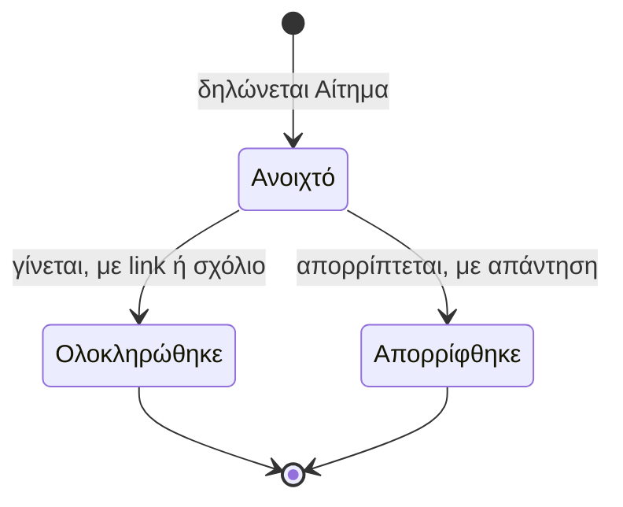

# Μηνύματα και Αιτήματα

> **👁️ Με μια ματιά**
> Κάθε Πελάτης έχει **μία** Συνομιλία με την ομάδα. Όλη η γραπτή επικοινωνία γίνεται εκεί, και κάθε Μήνυμα μπορεί να φέρει την **ετικέτα μιας Παραγωγής**, που ορίζει ποιος το βλέπει.
> Η ομάδα γράφει και **Εσωτερικά Μηνύματα** μέσα στην ίδια Συνομιλία, που ο πελάτης δεν βλέπει.
> Ένα **Αίτημα** είναι ένα Μήνυμα που ζητά κάτι να γίνει. Έχει σταθερή κατάσταση και όλα τα ανοιχτά Αιτήματα μπαίνουν σε **μία ουρά**.
> Σε σχέση με σήμερα: δεν υπάρχει πια συνομιλία ανά project, ούτε email για κάθε Μήνυμα. Το DMS ειδοποιεί για κάθε Μήνυμα, και το email έρχεται μόνο συγκεντρωτικά.

## 🚦 Πότε ξεκινά

Ξεκινά όταν κάποιος γράφει στη Συνομιλία ενός Πελάτη: από τη σελίδα **Μηνύματα** του πελάτη, από τη σελίδα του Πελάτη, από τη σελίδα μιας Παραγωγής ή από τα Εισερχόμενα της ομάδας.

Μπορεί να γράψει και ο πελάτης για κάτι που δεν έχει ακόμα Παραγωγή (π.χ. «θέλουμε ένα reel για το event»). Γι' αυτό η Συνομιλία είναι ανά Πελάτη και όχι ανά Παραγωγή. Η μηνιαία Συμφωνία θα έσπαγε τη συζήτηση σε κομμάτια κάθε Περίοδο.

Ένας Πελάτης «ανενεργός» συνεχίζει να έχει Συνομιλία: η κατάσταση είναι μόνο ένδειξη.

## 👥 Ποιος συμμετέχει

| Ρόλος | Τι κάνει |
|---|---|
| **Χρήστης πελάτη με «Βλέπει Συνομιλία»** | Διαβάζει όλη τη Συνομιλία του Πελάτη που έχει επιλέξει, εκτός από τα Εσωτερικά Μηνύματα. |
| **Χρήστης πελάτη με «Γράφει στη Συνομιλία»** | Γράφει Μηνύματα και δηλώνει Αιτήματα. Ο Ρόλος «Πλήρης» έχει και τα δύο Δικαιώματα. |
| **Υπεύθυνος Πελάτη** | Με Εύρος «όσα με αφορούν» βλέπει **ολόκληρη** τη Συνομιλία του Πελάτη του. Αναλαμβάνει Αιτήματα χωρίς ετικέτα Παραγωγής. |
| **Υπεύθυνος Παραγωγής** | Αναλαμβάνει τα Αιτήματα με την ετικέτα της Παραγωγής του. |
| **Μέλος Παραγωγής** | Με Εύρος «όσα με αφορούν» βλέπει **μόνο** τα Μηνύματα με την ετικέτα της Παραγωγής του. |
| **Μέλος ομάδας με Εύρος «όλα»** | Βλέπει όλες τις Συνομιλίες που του επιτρέπει το Δικαίωμα. |
| **Admin** | Φτιάχνει τους Αυτοματισμούς (ποιος ειδοποιείται, πότε, με ποιο κείμενο) και τους Ρόλους, δηλαδή ποιος βλέπει ή γράφει. |

Όποιος έχει Εύρος «όσα με αφορούν» δεν βλέπει τα Μηνύματα με ετικέτα άλλης Παραγωγής. Στη γενική Συνομιλία μπαίνουν τιμές και ανανεώσεις, γι' αυτό ένα Μέλος μιας Παραγωγής δεν βλέπει όλη τη Συνομιλία.

## 🪜 Βήματα

### Ένα απλό Μήνυμα

1. **Γράφεται το Μήνυμα.** Υπεύθυνος: ο αποστολέας (Χρήστης πελάτη με «Γράφει στη Συνομιλία», ή μέλος της ομάδας με Δικαίωμα). Μπορεί να έχει μικρά συνημμένα (εικόνες, PDF, έγγραφα, έως περίπου 10MB). Τα βίντεο και τα μεγάλα αρχεία στέλνονται ως link.
2. **Μπαίνει η ετικέτα Παραγωγής** (προαιρετική):
   - **Αυτόματα**, όταν γράφεις από τη σελίδα μιας Παραγωγής.
   - **Ο πελάτης** μπορεί να τη διαλέξει από τις Παραγωγές του.
   - **Η ομάδα** μπορεί να την αλλάξει.
3. **Ειδοποιούνται οι άλλοι.** Υπεύθυνος: το σύστημα (βλ. «Ειδοποιήσεις»).
4. **Ο αποδέκτης διαβάζει.** Κάθε Χρήστης βλέπει τα δικά του αδιάβαστα. Κανείς δεν βλέπει ποιος άλλος το διάβασε.
5. **Διόρθωση ή διαγραφή** από τον αποστολέα. Η διόρθωση επιτρέπεται για λίγα λεπτά και φαίνεται «διορθώθηκε». Η διαγραφή αφήνει την ένδειξη «διαγράφηκε». Ένα Μήνυμα που έγινε Αίτημα **δεν διαγράφεται**.

### Εσωτερικό Μήνυμα

1. Το μέλος της ομάδας γράφει μέσα στη Συνομιλία. Η προεπιλογή είναι «προς πελάτη». Για να γίνει εσωτερικό, το σημειώνει ρητά.
2. Το Εσωτερικό Μήνυμα **ξεχωρίζει έντονα** οπτικά. Ο πελάτης δεν το βλέπει.
3. Μπορεί να έχει **@αναφορά** σε μέλος της ομάδας. Αυτό το τραβά στη συζήτηση, ακόμα κι αν δεν το αφορά ο Πελάτης.

### Αίτημα

1. **Δηλώνεται.** Υπεύθυνος: ο πελάτης, όταν γράφει το Μήνυμά του, ή η ομάδα, που σημειώνει ένα απλό Μήνυμα ως Αίτημα. Διαλέγεται το είδος: **νέο Παραδοτέο**, **Γύρισμα** (μόνο όταν ο πελάτης δεν μπορεί να κλείσει μόνος του), **αλλαγή μετά την έγκριση** (από τη σελίδα του Παραδοτέου) ή **άλλο**.
2. **Ανατίθεται αυτόματα.** Υπεύθυνος: το σύστημα. Στον Υπεύθυνο της Παραγωγής της ετικέτας, αλλιώς στον Υπεύθυνο του Πελάτη, αλλιώς πάει στο **«Χωρίς υπεύθυνο»**.
3. **Μπαίνει στην ουρά.** Τα ανοιχτά Αιτήματα φαίνονται στην ουρά της ομάδας, μέσα στα Εισερχόμενα.
4. **Το χειρίζεται ο υπεύθυνός του.** Φτιάχνει ό,τι ζητήθηκε (Παραδοτέο, Γύρισμα…) ή το απορρίπτει.
5. **Κλείνει.** Ολοκληρώνεται με link σε ό,τι δημιουργήθηκε ή με σχόλιο· ή απορρίπτεται με απάντηση προς τον πελάτη.

Για το είδος «αλλαγή μετά την έγκριση», ο Υπεύθυνος Παραγωγής διαλέγει «δεκτό ως γύρος», «χρεώνεται» ή «νέο Παραδοτέο». Οι τρεις επιλογές είναι στο κεφάλαιο «Παραδοτέα και εγκρίσεις».

## 🔄 Καταστάσεις

Οι καταστάσεις και τα είδη του Αιτήματος είναι **σταθερά**. Ο admin δεν φτιάχνει δικά του.

| Κατάσταση | Τι σημαίνει | Πώς βγαίνει |
|---|---|---|
| **Ανοιχτό** | Ζητήθηκε κάτι και δεν έχει γίνει. Φαίνεται στην ουρά της ομάδας. | Ολοκληρώνεται ή απορρίπτεται. |
| **Ολοκληρώθηκε** | Έγινε. Έχει link σε ό,τι δημιουργήθηκε ή σχόλιο. Ο πελάτης ειδοποιείται. | Τέλος. |
| **Απορρίφθηκε** | Η ομάδα δεν το κάνει. Έχει υποχρεωτική απάντηση. Ο πελάτης ειδοποιείται. | Τέλος. |

Το «απάντησαν;» φαίνεται από την κατάσταση του Αιτήματος, όχι από ενδείξεις ανάγνωσης.

Ένα Μήνυμα έχει επίσης ενδείξεις: «διορθώθηκε» και «διαγράφηκε». Ένα απλό Μήνυμα δεν έχει κατάσταση.

### Εισερχόμενα της ομάδας

Η σελίδα που δείχνει:
- όλες τις Συνομιλίες που βλέπει ο Χρήστης, κατά τελευταίο Μήνυμα,
- τα αδιάβαστα,
- την **ουρά των ανοιχτών Αιτημάτων** (όλα μαζί, και το «Χωρίς υπεύθυνο»).

## 🔔 Ειδοποιήσεις

Όλα είναι Αυτοματισμοί πάνω σε σταθερά Γεγονότα. Ο admin αλλάζει παραλήπτες, χρονισμό και κείμενο.

| Πότε | Ποιος παίρνει | Πώς |
|---|---|---|
| Νέο Μήνυμα | Ο admin, στους Αυτοματισμούς | Ειδοποίηση, για **κάθε** Μήνυμα |
| Αδιάβαστα Μηνύματα για Χ λεπτά (προεπιλογή 15) | Ο Χρήστης που έχει τα αδιάβαστα | **Ένα συγκεντρωτικό email** |
| Νέο Αίτημα | Ο admin, στους Αυτοματισμούς | Ειδοποίηση |
| Αίτημα ανοιχτό Χ μέρες | Ο admin, στους Αυτοματισμούς | Ειδοποίηση |
| Αίτημα ολοκληρώθηκε ή απορρίφθηκε | Ο πελάτης | Ειδοποίηση ή email, όπως ορίζει ο Αυτοματισμός |
| Σε ανέφεραν (@αναφορά) | Το μέλος της ομάδας που αναφέρθηκε | Ειδοποίηση |

Σημαντικά:

- **Ειδοποίηση ανά Μήνυμα, email μόνο συγκεντρωτικό.** Email για κάθε Μήνυμα θα ήταν spam.
- Τα emails είναι **χωρίς δυνατότητα απάντησης**. Έχουν κουμπί **«Απάντησε στο DMS»**.
- Κάθε Αυτοματισμός στέλνει **μία φορά ανά περίπτωση** και καταγράφεται στο Ιστορικό αποστολών του Πελάτη.
- Ένα μέλος της ομάδας μπορεί να σβήσει όποια ειδοποίηση θέλει για τον εαυτό του. Ο πελάτης σβήνει μόνο όσες ο admin δεν έχει σημειώσει ως απαραίτητες.

## ⚠️ Εξαιρέσεις

| Τι πάει στραβά | Τι γίνεται |
|---|---|
| Το Αίτημα δεν έχει ετικέτα Παραγωγής ούτε Υπεύθυνο Πελάτη | Πάει στο «Χωρίς υπεύθυνο». |
| Ο Υπεύθυνος απενεργοποιείται | Ό,τι είχε επιστρέφει για νέα ανάθεση. |
| Ο αποστολέας κάνει λάθος | Διορθώνει για λίγα λεπτά («διορθώθηκε») ή διαγράφει («διαγράφηκε»). Δεν διαγράφεται Μήνυμα που έγινε Αίτημα. |
| Ο πελάτης θέλει να στείλει βίντεο ή μεγάλο αρχείο | Στέλνει link. Ανεβαίνουν μόνο μικρά αρχεία. |
| Ο πελάτης θέλει να κλείσει Γύρισμα και δεν γίνεται μόνος του | Δηλώνει Αίτημα είδους «Γύρισμα». |
| Το Μέλος μιας Παραγωγής αφαιρείται | Χάνει αμέσως πρόσβαση στα Μηνύματα με την ετικέτα της. |
| Κάποιος απαντά στο email | Δεν δουλεύει. Το email δεν δέχεται απαντήσεις· ο πελάτης πατά «Απάντησε στο DMS». |
| Ένας Χρήστης πελάτη ανήκει σε πολλούς Πελάτες | Βλέπει τη Συνομιλία του Πελάτη που έχει επιλέξει εκείνη τη στιγμή. |
| Ο πελάτης σχολιάζει πάνω σε video | Δεν είναι Μήνυμα. Είναι Σχόλιο Έκδοσης και ζει στο Παραδοτέο. |

## ⚙️ Τι ρυθμίζει ο admin

| Τι | Πού ζει |
|---|---|
| Ποιος ειδοποιείται για κάθε Γεγονός, πότε, με ποιο κανάλι και κείμενο (ελληνικό και αγγλικό) | Αυτοματισμοί |
| Πόσα λεπτά αδιαβάστων πριν το συγκεντρωτικό email (προεπιλογή 15) | Αυτοματισμοί |
| Πόσες μέρες ανοιχτό Αίτημα πριν ειδοποιηθεί κάποιος | Αυτοματισμοί |
| Ποιος βλέπει ή γράφει στις Συνομιλίες, και με ποιο Εύρος | Ρόλοι και Δικαιώματα |
| Ποιος πελάτης βλέπει ή γράφει («Βλέπει Συνομιλία», «Γράφει στη Συνομιλία») | Ρόλοι πελάτη |
| Η διεύθυνση της εταιρείας που εμφανίζεται ως απάντηση στα emails | Αυτοματισμοί |

**Σταθερά, δεν αλλάζουν από τον admin:** το ότι υπάρχει μία Συνομιλία ανά Πελάτη, τα είδη και οι καταστάσεις του Αιτήματος, το ότι δεν υπάρχουν ενδείξεις «το είδε ο Χ», και το ότι ο πελάτης δεν βλέπει ποτέ Εσωτερικά Μηνύματα.

**Πάντα προς τα εμπρός:** μια αλλαγή σε Αυτοματισμό ισχύει από το επόμενο Γεγονός. Ό,τι έχει ήδη σταλεί δεν αλλάζει.

## 🙋 Τι βλέπει ο πελάτης

- Τη σελίδα **«Μηνύματα»**, με όλη τη Συνομιλία του Πελάτη που έχει επιλέξει (αν έχει «Βλέπει Συνομιλία»), **εκτός** από τα Εσωτερικά Μηνύματα.
- Τα δικά του αδιάβαστα.
- Τη δυνατότητα να διαλέξει ετικέτα Παραγωγής όταν γράφει, ή να γράψει χωρίς.
- Επιλογή να δηλώσει το Μήνυμα ως Αίτημα.
- Την κατάσταση των Αιτημάτων του: ανοιχτό, ολοκληρώθηκε (με link ή σχόλιο) ή απορρίφθηκε (με απάντηση).
- Το κουμπί **«Ζητώ αλλαγή»** στη σελίδα ενός εγκεκριμένου Παραδοτέου, που δημιουργεί Αίτημα.

Δεν βλέπει: Εσωτερικά Μηνύματα, ποιος από την ομάδα διάβασε τι, ούτε ποιος είναι @αναφερόμενος σε εσωτερική συζήτηση.

## 🔗 Πού ακουμπά άλλες ροές

| Ροή | Η σχέση |
|---|---|
| **Παραδοτέα και εγκρίσεις** | Ο πελάτης ζητά νέο Παραδοτέο με Αίτημα. Η αλλαγή μετά την έγκριση είναι είδος Αιτήματος και μπαίνει στην ίδια ουρά. Τα Σχόλια Έκδοσης **δεν** είναι Μηνύματα. |
| **Γυρίσματα** | Αίτημα «Γύρισμα» υπάρχει μόνο όταν ο πελάτης δεν μπορεί να κλείσει μόνος του. |
| **Παραγωγή** | Η ετικέτα Παραγωγής ορίζει ποιος βλέπει το Μήνυμα και ποιος αναλαμβάνει το Αίτημα. Η σελίδα της Παραγωγής δείχνει τη Συνομιλία φιλτραρισμένη στην ετικέτα της. |
| **Πελάτες και Πωλήσεις** | Η Συνομιλία φαίνεται και στη σελίδα του Πελάτη. Ο Υπεύθυνος Πελάτη βλέπει όλη τη Συνομιλία. |
| **Ειδοποιήσεις και Αυτοματισμοί** | Όλες οι ειδοποιήσεις είναι Αυτοματισμοί πάνω σε σταθερά Γεγονότα. |
| **Ρόλοι και δικαιώματα** | Το Εύρος καθορίζει ποιος βλέπει ποιο μέρος της Συνομιλίας. |

Αργότερα: απάντηση με Reply στο email, και συνομιλίες μόνο μέσα στην ομάδα (π.χ. Slack, WhatsApp).

## 📖 Σενάρια

### 1. Το reel για το event (Καφέ Αθηνά)
Η υπεύθυνη του Καφέ Αθηνά γράφει από τη σελίδα «Μηνύματα»: «Θέλουμε ένα reel για το event της Παρασκευής». Δεν έχει Παραγωγή που να ταιριάζει, οπότε δεν βάζει ετικέτα. Το δηλώνει ως Αίτημα **νέο Παραδοτέο**. Επειδή δεν υπάρχει ετικέτα, ανατίθεται στον Υπεύθυνο του Πελάτη. Εκείνος ειδοποιείται, κρίνει ότι χωράει στις Παροχές της Περιόδου, δημιουργεί το Παραδοτέο και κλείνει το Αίτημα ως **ολοκληρώθηκε**, με link στο νέο Παραδοτέο. Ο πελάτης ειδοποιείται.

### 2. Εσωτερική συζήτηση (Γυμναστήριο Κίνηση)
Στην Παραγωγή του Γυμναστηρίου Κίνηση, ο μοντέρ γράφει με ετικέτα της Παραγωγής: «Το υλικό από το δεύτερο γύρισμα έχει θόρυβο». Ο Υπεύθυνος Παραγωγής απαντά με **Εσωτερικό Μήνυμα**, που ξεχωρίζει οπτικά και δεν φαίνεται στον πελάτη, και @αναφέρει τον ηχολήπτη. Ο ηχολήπτης ειδοποιείται «σε ανέφεραν» και μπαίνει στη συζήτηση. Ο πελάτης βλέπει μόνο όσα στάλθηκαν «προς πελάτη».

### 3. Τι βλέπει ένα Μέλος Παραγωγής (Ζαχαροπλαστείο Μέλι)
Ο μοντέρ είναι Μέλος της Παραγωγής του Ζαχαροπλαστείου Μέλι, με Εύρος «όσα με αφορούν». Βλέπει τα Μηνύματα με την ετικέτα αυτής της Παραγωγής. Δεν βλέπει το Μήνυμα όπου ο πελάτης ρωτά για την ανανέωση της Συμφωνίας, γιατί δεν έχει ετικέτα. Αυτό το βλέπει μόνο ο Υπεύθυνος του Πελάτη.

### 4. Ο πελάτης που δεν είναι online
Ο πελάτης στέλνει 3 Μηνύματα στη σειρά στη Συνομιλία. Η ομάδα απαντά και ο πελάτης παίρνει 3 Ειδοποιήσεις μέσα στο DMS, μία για κάθε Μήνυμα. Αν δεν τα ανοίξει για 15 λεπτά (η προεπιλογή), παίρνει **ένα** email με σύνοψη και κουμπί «Απάντησε στο DMS». Δεν χρειάζεται να απαντήσει στο ίδιο το email.

### 5. Λάθος Μήνυμα (Καφέ Αθηνά)
Η ομάδα στέλνει στο Καφέ Αθηνά Μήνυμα με λάθος ώρα. Ο αποστολέας το διορθώνει σε λίγα λεπτά και στη Συνομιλία φαίνεται «διορθώθηκε». Αν το είχε διαγράψει, θα έμενε η ένδειξη «διαγράφηκε». Αν ο πελάτης το είχε κάνει Αίτημα, δεν θα διαγραφόταν.

✅ Κανόνες που θα ελέγχονται

- **Δεδομένου ότι** ένας Πελάτης υπάρχει, **όταν** κάποιος γράφει, **τότε** το Μήνυμα μπαίνει στη μία και μοναδική Συνομιλία του Πελάτη.
- **Δεδομένου ότι** κάποιος γράφει από τη σελίδα μιας Παραγωγής, **όταν** στέλνει το Μήνυμα, **τότε** παίρνει αυτόματα την ετικέτα της Παραγωγής.
- **Δεδομένου ότι** ένας Χρήστης ομάδας έχει Εύρος «όσα με αφορούν» και είναι Μέλος μιας Παραγωγής, **όταν** ανοίγει τη Συνομιλία, **τότε** βλέπει μόνο τα Μηνύματα με την ετικέτα της, και όχι τα Μηνύματα χωρίς ετικέτα.
- **Δεδομένου ότι** ένας Χρήστης είναι Υπεύθυνος ενός Πελάτη με Εύρος «όσα με αφορούν», **όταν** ανοίγει τη Συνομιλία του, **τότε** τη βλέπει ολόκληρη.
- **Δεδομένου ότι** ένα Μέλος αφαιρείται από την Παραγωγή, **όταν** ανοίξει τη Συνομιλία, **τότε** δεν βλέπει πια τα Μηνύματα με την ετικέτα της.
- **Δεδομένου ότι** ένα Μήνυμα είναι Εσωτερικό, **όταν** ο πελάτης ανοίγει τη Συνομιλία, **τότε** δεν το βλέπει, ανεξάρτητα από τα Δικαιώματά του.
- **Δεδομένου ότι** ένας Χρήστης πελάτη έχει μόνο «Βλέπει Συνομιλία», **όταν** προσπαθεί να γράψει ή να δηλώσει Αίτημα, **τότε** δεν μπορεί.
- **Δεδομένου ότι** ένα Αίτημα έχει ετικέτα Παραγωγής, **όταν** δηλώνεται, **τότε** ανατίθεται στον Υπεύθυνο της Παραγωγής· αν δεν έχει ετικέτα, στον Υπεύθυνο του Πελάτη· αν δεν υπάρχει, πάει στο «Χωρίς υπεύθυνο».
- **Δεδομένου ότι** ένα Αίτημα είναι ανοιχτό, **όταν** κλείνει, **τότε** γίνεται ολοκληρώθηκε (με link ή σχόλιο) ή απορρίφθηκε (με απάντηση)· δεν κλείνει χωρίς το ένα από τα δύο.
- **Δεδομένου ότι** ένα Μήνυμα έγινε Αίτημα, **όταν** ο αποστολέας προσπαθεί να το διαγράψει, **τότε** δεν επιτρέπεται.
- **Δεδομένου ότι** ένας Χρήστης έχει αδιάβαστα Μηνύματα, **όταν** περάσουν Χ λεπτά χωρίς να τα διαβάσει, **τότε** παίρνει ένα μόνο συγκεντρωτικό email, όχι ένα ανά Μήνυμα.
- **Δεδομένου ότι** ο πελάτης διαβάζει ένα Μήνυμα, **όταν** κοιτάζει η ομάδα, **τότε** δεν υπάρχει ένδειξη ότι το διάβασε.
- **Δεδομένου ότι** ένα email στάλθηκε από το σύστημα, **όταν** ο παραλήπτης προσπαθεί να απαντήσει, **τότε** η απάντηση δεν φτάνει στη Συνομιλία· ο παραλήπτης χρησιμοποιεί το κουμπί «Απάντησε στο DMS».

## ❓ Ανοιχτά ερωτήματα

1. **Παραλήπτες που λείπουν.** Τα Γεγονότα «νέο Μήνυμα», «νέο Αίτημα» και «Αίτημα ανοιχτό Χ μέρες» υπάρχουν στον κατάλογο, αλλά οι πηγές δεν λένε ποιος παίρνει την ειδοποίηση από την αρχή (π.χ. όσοι βλέπουν το Μήνυμα εκτός του αποστολέα; ο Υπεύθυνος στον οποίο ανατίθεται το Αίτημα; και ποιος για το «Χωρίς υπεύθυνο»;). Επίσης δεν ορίζεται η προεπιλογή «Χ μέρες».
2. **Τι βλέπει ο @αναφερόμενος.** Η @αναφορά τον τραβά στη συζήτηση ακόμα κι αν δεν αφορά τον Πελάτη. Δεν ορίζεται αν βλέπει μόνο εκείνο το Μήνυμα ή ολόκληρη τη Συνομιλία. Δεν ορίζεται επίσης ποιοι βλέπουν ένα Εσωτερικό Μήνυμα που έχει ετικέτα Παραγωγής (μόνο οι Υπεύθυνοι, ή και τα Μέλη).
3. **Δικαίωμα για Εσωτερικά Μηνύματα.** Δεν ορίζεται αν η ομάδα χρειάζεται ξεχωριστό Δικαίωμα για να γράφει Εσωτερικά Μηνύματα, ή αν αρκεί να έχει δικαίωμα να γράφει στη Συνομιλία.
4. **Ο πελάτης και οι μη απαραίτητες ειδοποιήσεις.** Δεν ορίζεται αν οι ειδοποιήσεις Μηνυμάτων και το συγκεντρωτικό email είναι «απαραίτητες» ή αν ο πελάτης μπορεί να τις σβήσει.
5. **Χρόνος διόρθωσης και όριο συνημμένων.** Λέγεται «λίγα λεπτά» για τη διόρθωση και «περίπου 10MB» για τα συνημμένα. Δεν προσδιορίζεται ο ακριβής αριθμός και αν είναι Ρύθμιση που αλλάζει ο admin.
6. **Ποιος αναλαμβάνει από το «Χωρίς υπεύθυνο».** Οι πηγές λένε ότι το Αίτημα πάει εκεί, αλλά όχι ποιος έχει την ευθύνη να το αναθέσει.
7. **Πώς κλείνει ένα Αίτημα.** Δεν ορίζεται αν το κλείνει πάντα άνθρωπος, ή αν κλείνει αυτόματα όταν δημιουργηθεί το Παραδοτέο ή το Γύρισμα που ζητήθηκε.

Πηγές

- ADR 0012: Μία Συνομιλία ανά Πελάτη· το Αίτημα είναι Μήνυμα με κατάσταση.
- Issue #33: Μηνύματα, συνομιλία ομάδας–πελάτη και αιτήματα.
- ADR 0006: Αυτοματισμοί και σταθερός κατάλογος Γεγονότων.
- ADR 0007: Εύρος και «με αφορά».
- ADR 0011: Αίτημα αλλαγής μετά την έγκριση και τρεις εκβάσεις.
- CONTEXT.md, ενότητα «Επικοινωνία» (Συνομιλία, Μήνυμα, Εσωτερικό Μήνυμα, Αίτημα, Εισερχόμενα, Ειδοποίηση, Αυτοματισμός, Μήνυμα συστήματος), και οι όροι Με αφορά, Μέλος Παραγωγής, Σχόλιο Έκδοσης.
- Αντίφαση: στο issue #16 (ADR 0007) τα Δικαιώματα ομάδας για Μηνύματα λέγονταν «Συνομιλεί με πελάτη» και «Εσωτερικό κανάλι Παραγωγής». Το νεότερο ADR 0012 τα αντικαθιστά με «Βλέπει/Διαχειρίζεται Συνομιλίες» με Εύρος και το Εσωτερικό Μήνυμα μέσα στην ίδια Συνομιλία. Ισχύει το ADR 0012.

