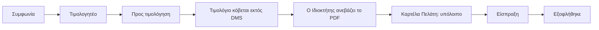
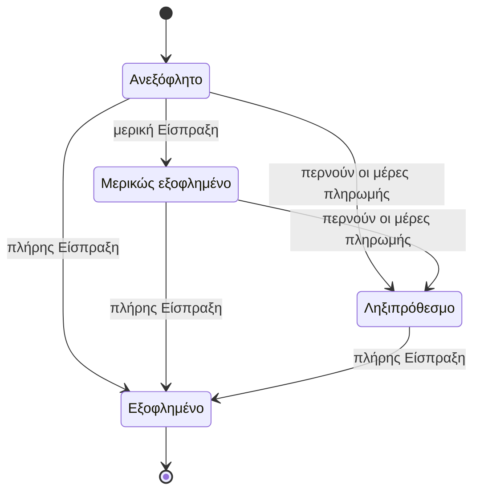

# Τιμολογητέα, Τιμολόγια και Εισπράξεις

> **👁️ Με μια ματιά**
> Η Συμφωνία γεννά αυτόματα **Τιμολογητέα**: εσωτερικές υπενθυμίσεις ότι πρέπει να κοπεί τιμολόγιο. (Στο παλιό σύστημα λεγόταν «Χρέωση» και φαινόταν στον πελάτη ως οφειλή. Τώρα δεν φαίνεται.)
> Το **Τιμολόγιο** κόβεται **έξω από το DMS**, από τον λογιστή ή άλλο εργαλείο, και ανεβαίνει ως PDF. Το ανεβάζει όποιος έχει το Δικαίωμα «Καταχωρεί Τιμολόγια»: αρχικά μόνο ο Ιδιοκτήτης, που μπορεί να το δώσει και σε άλλον Ρόλο.
> **Μόνο το Τιμολόγιο δημιουργεί οφειλή.** Ο πελάτης χρωστά όσα γράφει η Καρτέλα του, ποτέ πριν από το τιμολόγιο.
> Οι **Εισπράξεις** εξοφλούν πρώτα τα παλαιότερα Τιμολόγια, χωρίς αντιστοίχιση με το χέρι.
> Το DMS δεν εκδίδει τιμολόγια και δεν στέλνει τίποτα στην ΑΑΔΕ. Αυτό είναι για αργότερα.

## 🚦 Πότε ξεκινά

| Στιγμή | Τι γίνεται |
|---|---|
| **Γεννιέται Τιμολογητέο** | Σε ορόσημο εφάπαξ Συμφωνίας (υπογραφή, ημερομηνία, Γύρισμα έγινε, Παραγωγή παραδόθηκε). Στην αρχή κάθε Περιόδου μηνιαίας Συμφωνίας. Όταν υπάρχει έξτρα πέρα από τις Παροχές. Επίσης για ρήτρα λύσης και για έξτρα αναθεώρηση, όταν το αποφασίσει η ομάδα. |
| **Ανεβαίνει Τιμολόγιο** | Όποτε ο Ιδιοκτήτης καταχωρεί ένα παραστατικό που κόπηκε έξω από το DMS. |
| **Μπαίνει Είσπραξη** | Όποτε μπαίνουν χρήματα από πελάτη. |

## 👥 Ποιος συμμετέχει

| Ρόλος | Τι κάνει |
|---|---|
| **Σύστημα** | Γεννά τα Τιμολογητέα, διαβάζει το PDF και προσυμπληρώνει, υπολογίζει «Προς τιμολόγηση», υπόλοιπο και ληξιπρόθεσμα, στέλνει ειδοποιήσεις. |
| **Λογιστής** | Κόβει το τιμολόγιο στο δικό του εργαλείο. Βλέπει τα οικονομικά και τα ποσά, μόνο για ανάγνωση. Παίρνει ειδοποίηση για κάθε νέο Τιμολογητέο. Αν ο Ιδιοκτήτης του δώσει το Δικαίωμα «Καταχωρεί Τιμολόγια», ανεβάζει και ο ίδιος τα Τιμολόγια. Κάνει εξαγωγή δεδομένων, π.χ. ανά τρίμηνο. |
| **Ιδιοκτήτης** | Καταχωρεί Τιμολόγια (αρχικά ο μόνος, μέχρι να δώσει το Δικαίωμα σε άλλον Ρόλο) (τιμολόγιο, απόδειξη, πιστωτικό). Αλλάζει φορολογικά στοιχεία, λογαριασμούς τραπέζης και ΦΠΑ. |
| **Διαχείριση** | Καταχωρεί Εισπράξεις. Παίρνει ειδοποίηση για κάθε ληξιπρόθεσμο. Βλέπει τη λίστα «Προς τιμολόγηση» και την Καρτέλα κάθε πελάτη. Δεν ανεβάζει Τιμολόγια. |
| **Πωλήσεις** | Βλέπει ποσά στις Συμφωνίες που τον αφορούν. Δεν βλέπει Οικονομικά (Καρτέλα, Τιμολόγια). |
| **Παραγωγή** | Δεν βλέπει ποσά. |
| **Πελάτης** (Πλήρης) | Βλέπει την Καρτέλα του και τα Τιμολόγιά του. Δεν βλέπει Τιμολογητέα. |

## 🪜 Βήματα

| # | Βήμα | Υπεύθυνος |
|---|---|---|
| 1 | Η Συμφωνία γεννά Τιμολογητέο και ειδοποιεί όσους καταχωρούν Τιμολόγια και τον Λογιστή. Το ποσό μπαίνει στο «Προς τιμολόγηση» του Πελάτη. | Σύστημα |
| 2 | Κόβει το τιμολόγιο έξω από το DMS και στέλνει το PDF. | Λογιστής ή άλλο εργαλείο |
| 3 | Ανεβάζει το PDF στον λογαριασμό του Πελάτη. Το σύστημα προσυμπληρώνει είδος, αριθμό, ημερομηνία, ποσά και, αν υπάρχει, ΜΑΡΚ. | Ιδιοκτήτης |
| 4 | Ελέγχει τα πεδία και επιβεβαιώνει. Αν τα ποσά δεν ταιριάζουν, βγαίνει προειδοποίηση, όχι μπλοκάρισμα. | Ιδιοκτήτης |
| 5 | Το Τιμολόγιο καλύπτει τα Τιμολογητέα του Πελάτη, ξεκινώντας από τα παλαιότερα. Το «Προς τιμολόγηση» μικραίνει. | Σύστημα |
| 6 | Το Τιμολόγιο ανεβάζει το υπόλοιπο της Καρτέλας. Ο πελάτης παίρνει email με το PDF και το βλέπει στην Καρτέλα του. | Σύστημα |
| 7 | Μπαίνουν χρήματα: καταχωρεί την Είσπραξη (RF/IBAN, μετρητά κ.λπ.). Επιτρέπονται μερικές πληρωμές. | Διαχείριση |
| 8 | Η Είσπραξη εξοφλεί πρώτα τα παλαιότερα Τιμολόγια και το υπόλοιπο πέφτει. | Σύστημα |
| 9 | Αν περάσουν οι μέρες πληρωμής χωρίς εξόφληση, το Τιμολόγιο φαίνεται ληξιπρόθεσμο και στέλνονται ειδοποιήσεις. | Σύστημα |
| 10 | Αν ένα Τιμολόγιο ήταν λάθος, καταχωρείται πιστωτικό, δεμένο με το Τιμολόγιο που διορθώνει. Μειώνει την οφειλή. | Ιδιοκτήτης |

### Τι είναι τι

| Όρος | Τι είναι | Τι δεν είναι |
|---|---|---|
| **Τιμολογητέο** | Ποσό που πρέπει πλέον να τιμολογηθεί, για συγκεκριμένο λόγο. Εσωτερική υπενθύμιση προς τη Διαχείριση. | Δεν είναι οφειλή. Ο πελάτης δεν το βλέπει. |
| **Προς τιμολόγηση** | Τα Τιμολογητέα ενός Πελάτη που δεν έχουν καλυφθεί ακόμα από Τιμολόγια. | Δεν είναι το υπόλοιπο του πελάτη. |
| **Τιμολόγιο** | Το φορολογικό παραστατικό: τιμολόγιο, απόδειξη παροχής υπηρεσιών ή πιστωτικό. | Δεν εκδίδεται από το DMS. Δεν δένεται με συγκεκριμένο Τιμολογητέο. |
| **Είσπραξη** | Χρήματα που μπήκαν από πελάτη. | Δεν είναι Τζίρος. |
| **Καρτέλα Πελάτη** | Η χρονολογική κίνηση: Τιμολόγια (χρέωση) και Εισπράξεις (κατάθεση), με τρέχον υπόλοιπο. | Δεν βγαίνει από Τιμολογητέα. |
| **Τζίρος** | Τα καθαρά ποσά των Τιμολογίων μείον τα πιστωτικά, κατά ημερομηνία έκδοσης. | Δεν είναι Είσπραξη ούτε Τιμολογητέο. |

**Υπόλοιπο = Τιμολόγια − πιστωτικά − Εισπράξεις.**

### Γιατί δεν υπάρχει αντιστοίχιση με το χέρι

Δεν δένουμε κάθε Τιμολόγιο και κάθε Είσπραξη με συγκεκριμένα Τιμολογητέα. Θα ήταν περιττά σύνθετο. Η Καρτέλα με το υπόλοιπο αρκεί: τα Τιμολόγια καλύπτουν τα Τιμολογητέα από το παλαιότερο και οι Εισπράξεις εξοφλούν τα Τιμολόγια από το παλαιότερο.

## 🔄 Καταστάσεις

Οι καταστάσεις προκύπτουν αυτόματα. Κανείς δεν γράφει «ληξιπρόθεσμο» με το χέρι.

| Κατάσταση | Τι σημαίνει | Πώς βγαίνει |
|---|---|---|
| **Τιμολογητέο: ανοιχτό** | Δεν έχει καλυφθεί ακόμα (ή καλύφθηκε μόνο εν μέρει) από Τιμολόγια. Φαίνεται στο «Προς τιμολόγηση». | Τα Τιμολόγια του Πελάτη το καλύπτουν, ξεκινώντας από τα παλαιότερα Τιμολογητέα. |
| **Τιμολογητέο: κλειστό** | Καλύφθηκε. | Τελική κατάσταση. |
| **Τιμολόγιο: ανεξόφλητο** | Καταχωρήθηκε και έχει ανεβάσει το υπόλοιπο. | Είσπραξη ή περνούν οι μέρες πληρωμής. |
| **Τιμολόγιο: μερικώς εξοφλημένο** | Μπήκε μέρος του ποσού. | Εξόφληση ή ληξιπρόθεσμο. |
| **Τιμολόγιο: ληξιπρόθεσμο** | Πέρασαν οι μέρες πληρωμής της Συμφωνίας χωρίς εξόφληση. | Πλήρης Είσπραξη. |
| **Τιμολόγιο: εξοφλημένο** | Καλύφθηκε πλήρως. | Τελική κατάσταση. |
| **Πιστωτικό** | Δεμένο με το Τιμολόγιο που διορθώνει. Μειώνει την οφειλή. | Τελική κατάσταση. |

## 🔔 Ειδοποιήσεις

| Πότε | Ποιος παίρνει | Πώς |
|---|---|---|
| Γεννήθηκε Τιμολογητέο | Όσοι έχουν «Καταχωρεί Τιμολόγια» και Λογιστής | Ειδοποίηση μέσα στο σύστημα |
| Καταχωρήθηκε Τιμολόγιο | Ο πελάτης (όλοι οι Χρήστες πελάτη του Πελάτη) | Email με το PDF. Είναι απαραίτητο: ο πελάτης δεν το σβήνει. |
| Τιμολόγιο ληξιπρόθεσμο | Ο πελάτης | Email την ημέρα που γίνεται ληξιπρόθεσμο |
| Τιμολόγιο ληξιπρόθεσμο | Διαχείριση | Ειδοποίηση μέσα στο σύστημα |
| Καταχωρήθηκε Είσπραξη | Κανείς από την αρχή | Διαθέσιμη. Ο admin μπορεί να τη στήσει. |

Ο admin αλλάζει παραλήπτες, χρονισμό (μέρες πριν ή μετά) και κείμενο σε κάθε Αυτοματισμό, και τον ανάβει ή τον σβήνει. Το κείμενο έχει ελληνικά και αγγλικά.

## ⚠️ Εξαιρέσεις

| Τι γίνεται όταν… | Τι ισχύει |
|---|---|
| **Ξεχαστεί ένα τιμολόγιο** | Ο πελάτης φαίνεται να μη χρωστά, γιατί η οφειλή υπάρχει μόνο με Τιμολόγιο. Το αντίβαρο: η ειδοποίηση κάθε Τιμολογητέου και η λίστα «Προς τιμολόγηση». |
| **Τα ποσά του PDF δεν ταιριάζουν** | Προειδοποίηση. Δεν μπλοκάρει. |
| **Το PDF έχει λάθος** | Καταχωρείται πιστωτικό, δεμένο με το Τιμολόγιο που διορθώνει. |
| **Η Είσπραξη είναι μικρότερη από το Τιμολόγιο** | Επιτρέπεται. Το Τιμολόγιο γίνεται μερικώς εξοφλημένο. |
| **Μπαίνει Είσπραξη με πολλά ανεξόφλητα** | Εξοφλείται πρώτα το παλαιότερο. Ο χρήστης δεν διαλέγει. |
| **Ένα Τιμολόγιο καλύπτει πολλά Τιμολογητέα** | Επιτρέπεται. Δεν υπάρχει δέσιμο ένα προς ένα. |
| **Η Συμφωνία λύνεται πρόωρα** | Δεν γεννιούνται νέα Τιμολογητέα. Όσα γεννήθηκαν μένουν. Αν η Συμφωνία έχει ρήτρα, γεννιέται Τιμολογητέο λύσης. |
| **Κάποιος δεν έχει «Βλέπει ποσά»** | Δεν βλέπει τιμές, Τιμολογητέα ή οφειλές. Η βάση δεν του τα δίνει καθόλου, όχι μόνο η οθόνη. |
| **Ο Λογιστής θέλει να ανεβάσει τιμολόγιο** | Δεν μπορεί. Είναι μόνο για ανάγνωση. Στέλνει το PDF στον Ιδιοκτήτη. |
| **Αλλάζει ο ΦΠΑ ή ο λογαριασμός τραπέζης** | Το αλλάζει μόνο ο Ιδιοκτήτης, γιατί μια αλλαγή IBAN στέλνει τα χρήματα αλλού. |

## ⚙️ Τι ρυθμίζει ο admin

| Τι | Πού ζει | Ποιος |
|---|---|---|
| Μέρες πληρωμής (ληξιπρόθεσμο): δύο σετ προεπιλογών, μηνιαίες και εφάπαξ, αλλάζουν ανά Συμφωνία | Ρυθμίσεις, Όροι Συμφωνίας | «Διαχειρίζεται Ρυθμίσεις» |
| Δόσεις σε ορόσημα για την εφάπαξ, προκαταβολή | Όροι Συμφωνίας | «Διαχειρίζεται Ρυθμίσεις» |
| Αυτοματισμοί: παραλήπτες, χρονισμός, κείμενο | Αυτοματισμοί | «Διαχειρίζεται Αυτοματισμούς» |
| Ποσοστό ΦΠΑ | Ρυθμίσεις | Μόνο ο Ιδιοκτήτης |
| Φορολογικά στοιχεία και λογαριασμοί τραπέζης | Ρυθμίσεις, Στοιχεία εταιρείας | Μόνο ο Ιδιοκτήτης |
| Ποιος Ρόλος βλέπει Οικονομικά, καταχωρεί Εισπράξεις, εξάγει δεδομένα | Ρόλοι | Μόνο ο Ιδιοκτήτης |

Μια αλλαγή ισχύει μόνο προς τα εμπρός. Δεν αλλάζουν Συμφωνίες που έχουν ήδη υπογραφεί.

**Σταθερά, δεν ρυθμίζονται:** ότι μόνο το Τιμολόγιο δημιουργεί οφειλή, ότι οι Εισπράξεις εξοφλούν από το παλαιότερο και ότι τα είδη παραστατικού είναι τιμολόγιο, απόδειξη και πιστωτικό.

## 🙋 Τι βλέπει ο πελάτης

- Την **Καρτέλα** του: Τιμολόγια, Εισπράξεις και τρέχον υπόλοιπο.
- Τα **Τιμολόγιά** του, με το PDF.
- Τα στοιχεία πληρωμής της εταιρείας (λογαριασμός τραπέζης) στην Καρτέλα.
- Email με το PDF κάθε φορά που καταχωρείται Τιμολόγιο, και email όταν ένα Τιμολόγιο γίνεται ληξιπρόθεσμο.
- **Δεν** βλέπει Τιμολογητέα, ούτε το «Προς τιμολόγηση». Δεν βλέπει οφειλή πριν από το τιμολόγιο.

## 🔗 Πού ακουμπά άλλες ροές

| Ροή | Πώς συνδέεται |
|---|---|
| Κατάλογος, Συμφωνία και κόστος | Οι τιμές, οι δόσεις και οι μέρες πληρωμής έρχονται από τη Συμφωνία. Βλ. [Κατάλογος, Συμφωνία, κόστος και περιθώριο](03-catalogue-agreement-cost.md). Ο Λογιστής βλέπει ποσά αλλά όχι κόστος και κερδοφορία. |
| Πωλήσεις | Η υπογραφή της Συμφωνίας είναι ορόσημο για Τιμολογητέο. |
| Γυρίσματα | Το «έγινε» ενός Γυρίσματος είναι ορόσημο Τιμολογητέου. |
| Παραγωγές και Παραδοτέα | Το «παραδόθηκε» μιας Παραγωγής είναι ορόσημο. Μια έξτρα αναθεώρηση μπορεί να γεννήσει Τιμολογητέο, αν το αποφασίσει ο Υπεύθυνος της Παραγωγής. |
| Μηνιαίες Συμφωνίες | Κάθε Περίοδος γεννά Τιμολογητέο στην αρχή της. Οι συνδρομές με κάρτα δεν υπάρχουν στο v1. |
| Αυτοματισμοί | Τέσσερα Γεγονότα της ροής: Τιμολογητέο, Τιμολόγιο, ληξιπρόθεσμο, Είσπραξη. |
| Αναφορές | Ο Τζίρος και οι εξαγωγές του Λογιστή βγαίνουν από τα Τιμολόγια. |
| Ρυθμίσεις | ΦΠΑ, Στοιχεία εταιρείας, προεπιλογές Όρων. |

**Αργότερα:** έκδοση τιμολογίων μέσα από το DMS με πιστοποιημένο πάροχο και διαβίβαση στο myDATA της ΑΑΔΕ. Το προαιρετικό πεδίο ΜΑΡΚ υπάρχει ήδη, ώστε η μετάβαση να γίνει ομαλά. Πάροχος πληρωμής με κάρτα επίσης αργότερα.

## 📖 Σενάρια

*Ονόματα και νούμερα φανταστικά. Οι τιμές των Συμφωνιών είναι χωρίς ΦΠΑ, και ο ΦΠΑ είναι 24%.*

### Σενάριο 1: Ένας κανονικός μήνας

Το Καφέ Αθηνά έχει μηνιαία Συμφωνία 1.300 € τον μήνα, με πληρωμή σε 20 μέρες.

1. **1 Ιουνίου:** ανοίγει η Περίοδος και γεννιέται Τιμολογητέο 1.300 €. Ο Ιδιοκτήτης και ο Λογιστής παίρνουν ειδοποίηση. Το «Προς τιμολόγηση» του Καφέ Αθηνά δείχνει 1.300 €. Η Καρτέλα του πελάτη δείχνει υπόλοιπο 0 €.
2. **3 Ιουνίου:** ο Λογιστής κόβει το τιμολόγιο και στέλνει το PDF στον Ιδιοκτήτη.
3. Ο Ιδιοκτήτης το ανεβάζει. Το σύστημα προσυμπληρώνει: τιμολόγιο, αριθμός 87, ημερομηνία 3 Ιουνίου, καθαρό 1.300 €, ΦΠΑ 312 €, σύνολο 1.612 €. Ο Ιδιοκτήτης επιβεβαιώνει.
4. Το «Προς τιμολόγηση» πέφτει στα 0 €. Η Καρτέλα δείχνει υπόλοιπο **1.612 €**. Ο πελάτης παίρνει email με το PDF.
5. **18 Ιουνίου:** μπαίνει Είσπραξη 1.612 €, την καταχωρεί η Διαχείριση. Το Τιμολόγιο γίνεται εξοφλημένο και το υπόλοιπο 0 €.

### Σενάριο 2: Εφάπαξ Συμφωνία με δόσεις και ένα έξτρα

Το Ζαχαροπλαστείο Μέλι υπέγραψε εφάπαξ Συμφωνία 2.400 €, σε δύο δόσεις: 50% στην υπογραφή και 50% στην παράδοση.

1. **Υπογραφή:** γεννιέται Τιμολογητέο 1.200 €. Ο Ιδιοκτήτης ανεβάζει Τιμολόγιο με καθαρό 1.200 €, ΦΠΑ 288 €, σύνολο 1.488 €. Η Καρτέλα δείχνει 1.488 €. Ο πελάτης πληρώνει 1.488 € και το υπόλοιπο γίνεται 0 €.
2. **Στη δουλειά:** ο πελάτης ζητά ένα έξτρα reel. Η Συμφωνία έχει την Υπηρεσία «έξτρα reel» με τιμή 150 €. Γεννιέται Τιμολογητέο έξτρα 150 €.
3. **Η Παραγωγή παραδόθηκε:** γεννιέται Τιμολογητέο 1.200 € για τη δεύτερη δόση. Το «Προς τιμολόγηση» δείχνει **1.350 €** (1.200 € + 150 €).
4. Ο Ιδιοκτήτης ανεβάζει ένα Τιμολόγιο: καθαρό 1.350 €, ΦΠΑ 324 €, σύνολο 1.674 €. Καλύπτει και τα δύο Τιμολογητέα, το παλαιότερο πρώτα. Το «Προς τιμολόγηση» πέφτει στα 0 €.
5. Συνολικά τιμολογήθηκαν 1.200 € + 1.350 € = 2.550 € καθαρά: η Συμφωνία των 2.400 € και το έξτρα των 150 €.

### Σενάριο 3: Εισπράξεις, ληξιπρόθεσμο και πιστωτικό

Το Γυμναστήριο Κίνηση έχει μηνιαία Συμφωνία 1.100 € τον μήνα, με πληρωμή σε 15 μέρες. Κάθε Τιμολόγιο είναι 1.100 € + 264 € ΦΠΑ = **1.364 €**.

| Ημερομηνία | Τι γίνεται | Υπόλοιπο |
|---|---|---|
| 2 Μαΐου | Τιμολόγιο Α, 1.364 € | 1.364 € |
| 17 Μαΐου | Το Τιμολόγιο Α γίνεται ληξιπρόθεσμο. Email στον πελάτη, ειδοποίηση στη Διαχείριση. | 1.364 € |
| 2 Ιουνίου | Τιμολόγιο Β, 1.364 € | 2.728 € |
| 10 Ιουνίου | Είσπραξη 1.364 €. Εξοφλεί το παλαιότερο: το Α. | 1.364 € |
| 17 Ιουνίου | Το Β γίνεται ληξιπρόθεσμο. Email στον πελάτη, ειδοποίηση στη Διαχείριση. | 1.364 € |
| 20 Ιουνίου | Μερική Είσπραξη 500 € | 864 € |
| 25 Ιουνίου | Πιστωτικό 100 € + 24 € ΦΠΑ = 124 €, δεμένο με το Β (η τιμή είχε γραφτεί λάθος) | 740 € |

**Τζίρος Ιουνίου για αυτόν τον πελάτη:** καθαρό Τιμολόγιο 1.100 € − πιστωτικό 100 € = **1.000 €**. Οι Εισπράξεις δεν μπαίνουν στον Τζίρο.

### Σενάριο 4: Το ξεχασμένο τιμολόγιο

Την 1η Ιουλίου γεννιέται Τιμολογητέο 1.300 € για το Καφέ Αθηνά. Ο Ιδιοκτήτης και ο Λογιστής ειδοποιούνται, αλλά το τιμολόγιο δεν ανεβαίνει.

- Στις 25 Ιουλίου η Καρτέλα του πελάτη δείχνει υπόλοιπο **0 €**. Ο πελάτης δεν βλέπει τίποτα και δεν χρωστά.
- Η λίστα «Προς τιμολόγηση» δείχνει 1.300 € για το Καφέ Αθηνά. Η Διαχείριση το βλέπει, ρωτά τον Λογιστή και ζητά να ανέβει.
- Μόλις ανέβει το Τιμολόγιο, το «Προς τιμολόγηση» πέφτει στα 0 € και το υπόλοιπο γίνεται 1.612 €.

✅ Κανόνες που θα ελέγχονται

- **Δεδομένου ότι** μια Συμφωνία φτάνει σε ορόσημο ή ανοίγει Περίοδος, **όταν** γεννιέται Τιμολογητέο, **τότε** ειδοποιούνται όσοι καταχωρούν Τιμολόγια και ο Λογιστής, και το ποσό μπαίνει στο «Προς τιμολόγηση» του Πελάτη. Το υπόλοιπο του πελάτη δεν αλλάζει.
- **Δεδομένου ότι** υπάρχει Τιμολογητέο, **όταν** ο πελάτης ανοίγει την Καρτέλα του, **τότε** δεν το βλέπει.
- **Δεδομένου ότι** ένα Τιμολόγιο κόπηκε έξω από το DMS, **όταν** το ανεβάζει ο Ιδιοκτήτης και επιβεβαιώνει τα πεδία, **τότε** το Τιμολόγιο καταχωρείται και ανεβάζει το υπόλοιπο του πελάτη.
- **Δεδομένου ότι** ένας Χρήστης δεν είναι Ιδιοκτήτης, **όταν** προσπαθεί να καταχωρήσει Τιμολόγιο, **τότε** το σύστημα δεν το επιτρέπει, ακόμα κι αν είναι Λογιστής ή Διαχείριση.
- **Δεδομένου ότι** τα ποσά που διάβασε το σύστημα από το PDF δεν ταιριάζουν, **όταν** ο Ιδιοκτήτης επιβεβαιώνει, **τότε** βγαίνει προειδοποίηση και η καταχώρηση συνεχίζει.
- **Δεδομένου ότι** ένα Τιμολόγιο καταχωρείται, **όταν** υπάρχουν ανοιχτά Τιμολογητέα του Πελάτη, **τότε** τα καλύπτει ξεκινώντας από τα παλαιότερα και το «Προς τιμολόγηση» μικραίνει.
- **Δεδομένου ότι** μπαίνει Είσπραξη, **όταν** ο Πελάτης έχει περισσότερα ανεξόφλητα Τιμολόγια, **τότε** εξοφλείται πρώτα το παλαιότερο, και επιτρέπονται μερικές πληρωμές.
- **Δεδομένου ότι** ένα Τιμολόγιο είναι ανεξόφλητο, **όταν** περάσουν οι μέρες πληρωμής της Συμφωνίας, **τότε** γίνεται ληξιπρόθεσμο αυτόματα και στέλνονται οι αντίστοιχοι Αυτοματισμοί.
- **Δεδομένου ότι** καταχωρείται πιστωτικό, **όταν** το δένουμε με ένα Τιμολόγιο, **τότε** το υπόλοιπο και ο Τζίρος μειώνονται.
- **Δεδομένου ότι** υπολογίζεται ο Τζίρος, **όταν** επιλεγεί μια περίοδος, **τότε** μετρούν τα καθαρά ποσά των Τιμολογίων μείον τα πιστωτικά, κατά ημερομηνία έκδοσης, και όχι οι Εισπράξεις.
- **Δεδομένου ότι** ένας Χρήστης δεν έχει «Βλέπει ποσά», **όταν** ανοίγει Συμφωνία, Τιμολογητέο ή οφειλή, **τότε** δεν παίρνει κανένα ποσό, ούτε στα δεδομένα που λαμβάνει.
- **Δεδομένου ότι** το DMS δεν εκδίδει Τιμολόγια στο v1, **όταν** καταχωρείται ένα Τιμολόγιο, **τότε** δεν στέλνεται τίποτα στην ΑΑΔΕ από το DMS. Το ΜΑΡΚ είναι προαιρετικό πεδίο.

## ❓ Ανοιχτά ερωτήματα

1. **Με ποιο ποσό καλύπτεται ένα Τιμολογητέο:** καθαρό ή με ΦΠΑ; Οι τιμές των Συμφωνιών είναι χωρίς ΦΠΑ, ενώ το υπόλοιπο και οι Εισπράξεις είναι με ΦΠΑ. Στα σενάρια υποθέσαμε ότι καλύπτει το καθαρό ποσό. Τι γίνεται όταν το Τιμολόγιο είναι μεγαλύτερο ή μικρότερο από τα ανοιχτά Τιμολογητέα;
2. **Από πότε μετρούν οι μέρες πληρωμής:** από την ημερομηνία έκδοσης ή από την καταχώριση; Και ένα μερικώς εξοφλημένο Τιμολόγιο γίνεται ληξιπρόθεσμο για το υπόλοιπό του; Στο Σενάριο 3 οι μέρες μετρούν από την ημερομηνία έκδοσης.
3. **«Αν τα ποσά δεν ταιριάζουν»:** ταιριάζουν με τι; Μεταξύ τους (καθαρό, ΦΠΑ, σύνολο) ή με το «Προς τιμολόγηση»;
4. **Email προς πελάτη με κάθε καταχώριση:** η απόφαση το ορίζει απαραίτητο. Μπορεί ο Ιδιοκτήτης να το παραλείψει όταν καταχωρεί μια διόρθωση ή ένα πιστωτικό;
6. **Διόρθωση λάθους καταχώρισης:** εκτός από το πιστωτικό, μπορεί ο Ιδιοκτήτης να διορθώσει ή να ακυρώσει ένα Τιμολόγιο που ανέβηκε λάθος, και πώς;
7. **Προκαταβολή:** τι γίνεται με μια Είσπραξη που μπαίνει πριν υπάρξει Τιμολόγιο; Η προκαταβολή είναι προεπιλογή στους Όρους, αλλά δεν περιγράφεται πώς φαίνεται στην Καρτέλα.
8. **Τρόποι είσπραξης:** οι RF/IBAN, μετρητά κ.λπ. είναι λίστα που αλλάζει ο admin ή σταθερή επιλογή;
9. **Συνεχής έλεγχος για το «Προς τιμολόγηση»:** αν ένα Τιμολογητέο μένει ανοιχτό πολλές μέρες, υπάρχει επαναλαμβανόμενη υπενθύμιση ή μόνο η αρχική ειδοποίηση;

**Αντιφάσεις στις πηγές που λύθηκαν με το νεότερο.**
- Η απόφαση για την τιμολόγηση λέει ότι η Διαχείριση και ο Λογιστής ανεβάζουν και διορθώνουν Τιμολόγια. Το Μοντέλο δικαιωμάτων (νεότερο) λέει ότι **μόνο ο Ιδιοκτήτης** καταχωρεί Τιμολόγια και ότι ο Λογιστής είναι μόνο για ανάγνωση. Λύθηκε στο κλείσιμο των ανοιχτών ερωτημάτων: είναι κανονικό Δικαίωμα, αρχικά μόνο του Ιδιοκτήτη, που το δίνει σε όποιον Ρόλο θέλει. Η ειδοποίηση «Γεννήθηκε Τιμολογητέο» πάει σε όσους έχουν το Δικαίωμα και στον Λογιστή.
- Οι μέρες πληρωμής πρώτα ορίζονταν «από τον Κατάλογο». Πλέον είναι Όρος Συμφωνίας, με δύο σετ προεπιλογών στις Ρυθμίσεις.
- Η συζήτηση για την τιμολόγηση ανέφερε κουμπί «Αποστολή» που στέλνει το PDF στον πελάτη. Ο κατάλογος Γεγονότων (νεότερος) στέλνει το email αυτόματα με την καταχώριση. Ισχύει το νεότερο.

Πηγές

- ADR 0004: Το Τιμολόγιο δημιουργεί την οφειλή· στο v1 κόβεται έξω από το DMS
- ADR 0007: Τα Δικαιώματα έχουν Εύρος (Βλέπει ποσά, Καταχωρεί Τιμολόγια και Εισπράξεις)
- ADR 0002: Η ραχοκοκαλιά (αντικαθίσταται εν μέρει από το ADR 0004)
- ADR 0006: Οι Αυτοματισμοί είναι κανόνες του admin πάνω σε σταθερό κατάλογο Γεγονότων
- ADR 0008: Όροι Συμφωνίας (μέρες πληρωμής)
- ADR 0015: Ρυθμίσεις (ΦΠΑ και λογαριασμοί μόνο από τον Ιδιοκτήτη)
- Issue #11: Τιμολόγηση και myDATA
- Issue #14: Επικοινωνία και Αυτοματισμοί (κατάλογος Γεγονότων)
- Issue #16: Μοντέλο δικαιωμάτων (έτοιμοι Ρόλοι)
- Issue #18: Κατάλογος και όροι Συμφωνίας
- `CONTEXT.md`, ενότητα «Εμπορικά»

