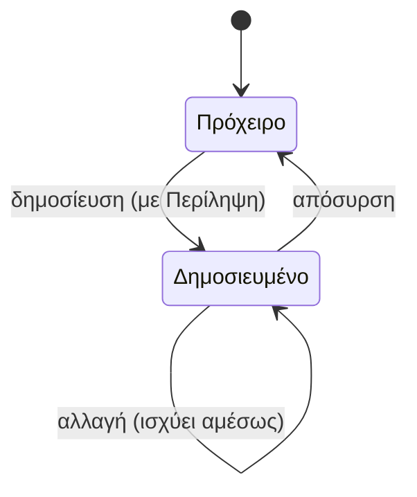
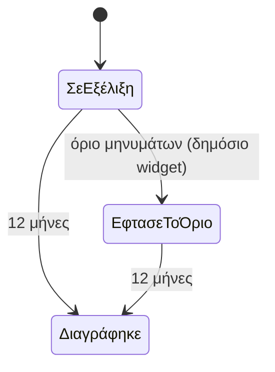

# Γνώση, εκπαίδευση και Βοηθός

> **👁️ Με μια ματιά**
> Η εταιρεία αποκτά **μία** Γνώση: Άρθρα και Αρχεία σε Ενότητες, για την ομάδα, για τους πελάτες ή για όλους.
> Στο παλιό σύστημα η γνώση ζούσε σε τέσσερα σημεία και οι τιμές δεν συμφωνούσαν. Τώρα υπάρχει ένα μέρος, και **καμία τιμή δεν γράφεται μέσα του**: για τιμές υπάρχει μόνο ο Κατάλογος.
> Ο **Βοηθός** απαντά μόνο όταν βρίσκει πηγή, στη γλώσσα αυτού που ρωτά. Αν δεν βρει, λέει «δεν ξέρω» και η ερώτηση πηγαίνει στη λίστα των Αναπάντητων, ώστε να φανεί τι λείπει από τη Γνώση.
> Ο ίδιος Βοηθός δουλεύει μέσα στο σύστημα και στην Ιστοσελίδα, με αυστηρά όρια για να μη γίνει πηγή εξόδων ή κατάχρησης.

## 🚦 Πότε ξεκινά

| Ροή | Ξεκινά όταν… |
|---|---|
| Γράφω Γνώση | Κάποιος με το Δικαίωμα «Γνώση: Διαχειρίζεται» φτιάχνει ή αλλάζει ένα στοιχείο. |
| Ρωτώ τον Βοηθό | Ένας Χρήστης (ομάδας ή πελάτη) ή ένας Επισκέπτης ανοίγει τον Βοηθό και γράφει ερώτηση. |
| Βελτιώνω τη Γνώση | Η ερώτηση έμεινε χωρίς πηγή και μπήκε στις Αναπάντητες ερωτήσεις. |
| Καθαρισμός | Μια Συζήτηση Βοηθού συμπληρώνει 12 μήνες. |

Δεν υπάρχουν μαθήματα, quiz ή υποχρεωτική ανάγνωση στο v1. Με μικρή ομάδα, η ένταξη ενός νέου ανθρώπου γίνεται από άνθρωπο σε άνθρωπο.

## 👥 Ποιος συμμετέχει

| Ρόλος | Τι κάνει |
|---|---|
| Όποιος διαχειρίζεται τη Γνώση (στους έτοιμους Ρόλους: η Διαχείριση και ο Ιδιοκτήτης) | Γράφει, αλλάζει, δημοσιεύει και αποσύρει Άρθρα και Αρχεία. Φτιάχνει τις Ενότητες. Ορίζει το Κοινό. Βλέπει όλες τις Συζητήσεις Βοηθού και τις Αναπάντητες ερωτήσεις. |
| Χρήστης ομάδας | Διαβάζει τα δημοσιευμένα στοιχεία που έχουν Κοινό κάποιον από τους Ρόλους του. Το δικαίωμα αυτό το έχει πάντα, δεν χρειάζεται Ρόλο. Ρωτά τον Βοηθό. |
| Χρήστης πελάτη | Διαβάζει τα στοιχεία που έχουν Κοινό τον Ρόλο του. Ρωτά τον Βοηθό. Αν ο Βοηθός δεν ξέρει, τον παραπέμπει στη Συνομιλία με την ομάδα. |
| Επισκέπτης | Ρωτά τον Βοηθό της Ιστοσελίδας. Αν ο Βοηθός δεν ξέρει ή αν φτάσει το όριο, τον παραπέμπει στη φόρμα ενδιαφέροντος. |
| Βοηθός | Ψάχνει, απαντά με πηγές, καταγράφει τις Αναπάντητες. Δεν δημιουργεί τίποτα (π.χ. Ευκαιρία). |
| Σύστημα | Ενημερώνει αυτόματα ό,τι ξέρει ο Βοηθός όταν δημοσιεύεται, αλλάζει ή αποσύρεται ένα στοιχείο. Σβήνει τις παλιές Συζητήσεις. |

## 🪜 Βήματα

### Α. Γράφω και δημοσιεύω ένα στοιχείο

1. **Διαχείριση Γνώσης:** διαλέγει Ενότητα (ή φτιάχνει νέα, με μία πρόταση για το τι περιέχει).
2. **Διαχείριση Γνώσης:** γράφει ένα **Άρθρο** (κείμενο, εικόνες, links, π.χ. σε βίντεο) ή ανεβάζει ένα **Αρχείο** (PDF, παρουσίαση, template). Ένα FAQ είναι απλώς ένα σύντομο Άρθρο.
3. **Διαχείριση Γνώσης:** γράφει την **Περίληψη** (1–2 γραμμές). Χωρίς Περίληψη δεν γίνεται δημοσίευση.
4. **Διαχείριση Γνώσης:** διαλέγει το **Κοινό**: έναν ή περισσότερους Ρόλους (ομάδας ή πελάτη) ή «δημόσιο».
5. **Διαχείριση Γνώσης:** δημοσιεύει. Δεν υπάρχει έγκριση από δεύτερο άνθρωπο· όποιος διαχειρίζεται τη Γνώση βλέπει και γράφει πρόχειρα και δημοσιευμένα.
6. **Σύστημα:** ο Βοηθός μαθαίνει το στοιχείο αυτόματα. Δεν υπάρχει κουμπί «Seed» όπως στο παλιό σύστημα. Το ίδιο γίνεται σε κάθε αλλαγή. Όταν το στοιχείο αποσυρθεί, ο Βοηθός το ξεχνά.

Κανόνας περιεχομένου: **η Γνώση γράφεται μία φορά, στα ελληνικά**, και δεν γράφει τιμές. Όπου χρειάζεται τιμή, γράφει «δείτε τον Κατάλογο».

### Β. Ο Βοηθός απαντά

1. **Χρήστης ή Επισκέπτης:** γράφει την ερώτηση.
2. **Βοηθός:** διαβάζει πρώτα τον «χάρτη» (Ενότητες και Περιλήψεις) και ανοίγει μόνο όσα στοιχεία χρειάζεται. Βλέπει **μόνο** ό,τι επιτρέπεται να δει αυτός που ρωτά: τα δημοσιευμένα στοιχεία του Κοινού του, μαζί με τα δημόσια Πακέτα και τους Τομείς.
3. **Βοηθός:** αν βρει πηγή, απαντά στη γλώσσα του ερωτώντα και **δείχνει τις πηγές**.
4. **Βοηθός:** αν δεν βρει πηγή, λέει ότι δεν ξέρει:
   - στον Επισκέπτη προτείνει τη φόρμα ενδιαφέροντος,
   - στον Χρήστη πελάτη προτείνει τη Συνομιλία με την ομάδα.
5. **Σύστημα:** η ερώτηση χωρίς πηγή μπαίνει στις **Αναπάντητες ερωτήσεις**.
6. **Σύστημα:** η Συζήτηση αποθηκεύεται, ως δημόσια, πελάτη ή ομάδας.

Μια σταθερή ένδειξη κάτω από τον Βοηθό λέει στον χρήστη ότι οι Συζητήσεις κρατιούνται και τις βλέπει η εταιρεία.

### Γ. Βελτιώνω τη Γνώση

1. **Διαχείριση Γνώσης:** ανοίγει τη λίστα Αναπάντητων ερωτήσεων.
2. **Διαχείριση Γνώσης:** αποφασίζει τι λείπει: νέο Άρθρο, αλλαγή σε υπάρχον ή αλλαγή του Κοινού.
3. **Διαχείριση Γνώσης:** δημοσιεύει (βήματα Α1–Α6). Την επόμενη φορά ο Βοηθός θα έχει πηγή.

Πριν από τον Βοηθό, η εταιρεία δεν ήξερε τι ρωτούν οι πελάτες της. Εδώ το βλέπει: ο Βοηθός μετατρέπει κάθε «δεν ξέρω» σε εργασία.

### Δ. Καθαρισμός

1. **Σύστημα:** κάθε Συζήτηση Βοηθού που συμπληρώνει 12 μήνες διαγράφεται αυτόματα. Κανείς δεν χρειάζεται να το θυμάται.

## 🔄 Καταστάσεις

### Στοιχείο Γνώσης

| Κατάσταση | Τι σημαίνει | Πώς βγαίνει |
|---|---|---|
| Πρόχειρο | Το βλέπουν μόνο όσοι διαχειρίζονται τη Γνώση. Ο Βοηθός δεν το ξέρει. | Δημοσίευση, αν έχει Περίληψη και Κοινό. |
| Δημοσιευμένο | Το βλέπει το Κοινό του και ο Βοηθός το χρησιμοποιεί ως πηγή. | Απόσυρση (γυρίζει σε Πρόχειρο). Οι αλλαγές ισχύουν αμέσως. |

### Συζήτηση Βοηθού

| Κατάσταση | Τι σημαίνει | Πώς βγαίνει |
|---|---|---|
| Σε εξέλιξη | Ο χρήστης ρωτά και ο Βοηθός απαντά. | Όριο μηνυμάτων (μόνο στο δημόσιο widget) ή 12 μήνες. |
| Έφτασε το όριο | Ο Επισκέπτης δεν παίρνει άλλες απαντήσεις και βλέπει τη φόρμα. | 12 μήνες. |
| Διαγράφηκε | Η Συζήτηση δεν υπάρχει πια. | Τελική. |

Οι Αναπάντητες ερωτήσεις είναι **λίστα**, όχι διαδικασία με καταστάσεις. Πώς φεύγει μια ερώτηση από τη λίστα δεν έχει οριστεί (βλ. Ανοιχτά ερωτήματα).

## 🔔 Ειδοποιήσεις

Το κεφάλαιο δεν προσθέτει Γεγονότα στον αρχικό κατάλογο των Αυτοματισμών. Ό,τι ακολουθεί είναι είτε λίστα είτε μήνυμα στην οθόνη.

| Πότε | Ποιος παίρνει | Πώς |
|---|---|---|
| Ο Βοηθός δεν βρήκε πηγή | Όποιος διαχειρίζεται τη Γνώση | Στη λίστα Αναπάντητων ερωτήσεων. Καμία Ειδοποίηση. |
| Ο Επισκέπτης έφτασε το όριο του widget | Ο Επισκέπτης | Βλέπει τη φόρμα ενδιαφέροντος στη θέση της απάντησης. |
| Εξαντλήθηκε το μηνιαίο πλαφόν δαπάνης του Βοηθού | Ο admin (Διαχείριση) | Ειδοποίηση μέσα στο σύστημα. Ο Επισκέπτης βλέπει τη φόρμα. |
| Δημοσιεύτηκε ή αποσύρθηκε στοιχείο | Κανείς | Καμία ειδοποίηση. |

## ⚠️ Εξαιρέσεις

| Τι πάει στραβά | Τι γίνεται |
|---|---|
| Στοιχείο χωρίς Περίληψη | Δεν δημοσιεύεται. Μένει πρόχειρο. |
| Ο Βοηθός δεν βρίσκει πηγή | Δεν μαντεύει. Λέει «δεν ξέρω», παραπέμπει (φόρμα ή Συνομιλία) και καταγράφει την ερώτηση. |
| Ρωτούν τιμή | Ο Βοηθός απαντά μόνο από τα **δημόσια Πακέτα** του Καταλόγου, όπως φαίνονται εκεί. Αν το Πακέτο δεν είναι δημόσιο ή δεν δείχνει τιμή, δεν υπάρχει τιμή να πει. |
| Ρωτούν για προσωπικά δεδομένα (π.χ. «πόσο χρωστάω;») | Ο Βοηθός δεν έχει πρόσβαση σε δεδομένα του χρήστη στο v1. Δεν ξέρει, και παραπέμπει κανονικά. |
| Ο Επισκέπτης ρωτά κάτι άσχετο με τη Devre Media | Το δημόσιο widget απαντά μόνο για τη Devre Media. |
| Κάποιος αλλάζει το Κοινό ενός στοιχείου | Ισχύει στην επόμενη ερώτηση: όσοι δεν το βλέπουν πια, δεν το βλέπει ούτε ο Βοηθός γι' αυτούς. |
| Χρήστης ρωτά κάτι που βρίσκεται σε στοιχείο άλλου Κοινού | Ο Βοηθός δεν το χρησιμοποιεί, ούτε το αναφέρει ως πηγή. Αν δεν υπάρχει άλλη πηγή, λέει «δεν ξέρω». |
| Κατάχρηση του δημόσιου widget | Βλ. την ενότητα «Προστασία από κατάχρηση» παρακάτω. |

### Προστασία από κατάχρηση (δημόσιο widget)

Το δημόσιο widget είναι ανοιχτό σε όλο τον κόσμο και κάθε απάντηση έχει κόστος. Γι' αυτό υπάρχουν πέντε φράγματα, το ένα πίσω από το άλλο:

| # | Φράγμα | Τι σημαίνει με απλά λόγια |
|---|---|---|
| 1 | Όριο ταχύτητας ανά διεύθυνση | Η ίδια διεύθυνση δεν μπορεί να στείλει πάνω από 20 αιτήματα το λεπτό. |
| 2 | Έλεγχος «είσαι άνθρωπος;» | Πριν ξεκινήσει η Συζήτηση, ένας αθόρυβος έλεγχος κόβει τα αυτόματα προγράμματα. |
| 3 | Όριο μηνυμάτων | Κάθε Συζήτηση και κάθε διεύθυνση έχουν μέγιστο αριθμό μηνυμάτων. Τα νούμερα τα ορίζει ο admin. Όταν φτάσουν, ο Επισκέπτης βλέπει τη φόρμα. |
| 4 | Όριο μεγέθους | Η ερώτηση δεν ξεπερνά τους 1.000 χαρακτήρες και η απάντηση είναι σύντομη. |
| 5 | Μηνιαίο πλαφόν δαπάνης | Όταν εξαντληθεί το ποσό που έχει οριστεί για τον μήνα, ο Βοηθός σταματά στην Ιστοσελίδα, ο Επισκέπτης βλέπει τη φόρμα και ο admin ειδοποιείται. |

Στη χειρότερη περίπτωση, ο Επισκέπτης καταλήγει εκεί που θέλουμε ούτως ή άλλως: στη φόρμα ενδιαφέροντος. Η δαπάνη δεν ξεφεύγει ποτέ πάνω από το πλαφόν.

Όλες οι κλήσεις προς την τεχνητή νοημοσύνη περνούν από **μία** πύλη της εταιρείας, με μετρητή και πλαφόν, και όχι από κλειδιά διάσπαρτα σε πολλά σημεία. Οι πάροχοι που επεξεργάζονται τις ερωτήσεις είναι εξωτερικοί (μερικοί στις ΗΠΑ, με συμβατικές εγγυήσεις). Η βάση και τα αρχεία μένουν στην ΕΕ και οι πάροχοι αναφέρονται στην πολιτική απορρήτου.

## ⚙️ Τι ρυθμίζει ο admin

| Τι | Πού | Σημείωση |
|---|---|---|
| Ενότητες: ονόματα, πρόταση περιγραφής, σειρά | Στο module Γνώση | Λίστα ενός επιπέδου. Δεν υπάρχουν υποενότητες. |
| Άρθρα και Αρχεία | Στο module Γνώση | Πρόχειρο ή δημοσιευμένο, με υποχρεωτική Περίληψη. |
| Κοινό ανά στοιχείο | Στο module Γνώση | Ρόλοι (ομάδας ή πελάτη) ή «δημόσιο». Αλλάζει όποτε θέλει. |
| Ποιος διαχειρίζεται τη Γνώση | Στους Ρόλους | Με το Δικαίωμα «Γνώση: Διαχειρίζεται» (Εύρος «όλα»). Το δίνει ο Ιδιοκτήτης σε όποιον Ρόλο θέλει. |
| Όριο μηνυμάτων ανά Συζήτηση και ανά διεύθυνση (δημόσιο widget) | Από τον admin | Τα νούμερα δεν είναι γραμμένα στο σύστημα. |
| Ποια Πακέτα και Τομείς είναι δημόσια, και αν δείχνουν τιμή | Στον Κατάλογο και στο περιεχόμενο της Ιστοσελίδας | Ο Βοηθός μαθαίνει τιμή μόνο από εκεί. Βλ. κεφάλαιο Ιστοσελίδα. |

**Δεν** ρυθμίζει ο admin: ποιο μοντέλο τεχνητής νοημοσύνης χρησιμοποιείται. Είναι απόφαση ποιότητας, θέλει δοκιμή, και την αλλάζει ο developer. Επίσης δεν ρυθμίζονται από τον admin οι σταθερές προστασίες της παραπάνω λίστας (βλ. Ανοιχτά ερωτήματα).

## 🙋 Τι βλέπει ο πελάτης

- Ο Χρήστης πελάτη βλέπει **μόνο** στοιχεία με Κοινό τον Ρόλο του (π.χ. «Πλήρης»), και ποτέ εσωτερική Γνώση της ομάδας.
- Ο Βοηθός είναι διαθέσιμος παντού μέσα στον λογαριασμό του.
- Κάθε απάντηση έχει πηγές που μπορεί να ανοίξει.
- Αν ο Βοηθός δεν ξέρει, ο πελάτης παραπέμπεται στη Συνομιλία με την ομάδα.
- Κάτω από τον Βοηθό βλέπει τη σταθερή ένδειξη ότι οι Συζητήσεις κρατιούνται 12 μήνες και τις βλέπει η εταιρεία.
- Ο Επισκέπτης, στην Ιστοσελίδα, βλέπει το δημόσιο widget: απαντά μόνο για τη Devre Media και, όταν δεν ξέρει ή όταν φτάσει το όριο, δείχνει τη φόρμα.

## 🔗 Πού ακουμπά άλλες ροές

| Ροή | Σύνδεση |
|---|---|
| Κατάλογος | Οι τιμές έχουν μία πηγή. Ο Βοηθός διαβάζει πάντα τα δημόσια Πακέτα και τους Τομείς. Η Γνώση δεν γράφει τιμές. |
| Ιστοσελίδα | Το widget είναι σε όλες τις σελίδες. Δεν δημιουργεί Ευκαιρία: οδηγεί στη φόρμα, που είναι η μοναδική είσοδος. |
| Μηνύματα | Για τον Χρήστη πελάτη, το «δεν ξέρω» καταλήγει στη Συνομιλία. |
| Ρόλοι και Δικαιώματα | Το Κοινό βγαίνει από τους Ρόλους. Η διαχείριση Γνώσης είναι Δικαίωμα. Η ανάγνωση είναι βασικό δικαίωμα κάθε Χρήστη ομάδας. |
| Πωλήσεις | Η ερώτηση που μένει αναπάντητη στον Επισκέπτη γίνεται, όταν αυτός συμπληρώσει τη φόρμα, Ευκαιρία με τη συνηθισμένη διαδρομή. |
| Ρυθμίσεις | Η Γνώση δεν είναι Ρύθμιση: ζει στο δικό της module. |
| Υγεία συστήματος | Η διαγραφή Συζητήσεων και η ενημέρωση του Βοηθού είναι αυτόματες εργασίες· αν κολλήσουν, φαίνονται εκεί. |

Αργότερα: μαθήματα, quiz και υποχρεωτική ανάγνωση. Αργότερα επίσης: Βοηθός με πρόσβαση στα δεδομένα του χρήστη (π.χ. «πότε είναι το επόμενο Γύρισμά μου;»), και ζωντανή ενσωμάτωση Πακέτου μέσα σε Άρθρο.

## 📖 Σενάρια

**1. Νέος οδηγός για πελάτες.** Η Διαχείριση γράφει το Άρθρο «Πώς κλείνω Γύρισμα» στην Ενότητα «Οδηγοί πελάτη» («Ό,τι χρειάζεται ένας πελάτης για να δουλεύει με το σύστημα»). Βάζει Περίληψη δύο γραμμών και Κοινό τον Ρόλο «Πλήρης». Δημοσιεύει. Το ίδιο απόγευμα, ο Χρήστης πελάτη του «Καφέ Αθηνά» ρωτά τον Βοηθό «πώς ζητάω Γύρισμα;» και παίρνει βήματα με πηγή το Άρθρο. Ο Χρήστης πελάτη του «Γυμναστήριο Κίνηση» έχει άλλο Ρόλο και δεν θα το δει, ούτε θα το χρησιμοποιήσει ο Βοηθός γι' αυτόν.

**2. Ο Επισκέπτης ρωτά τιμή.** Ένας Επισκέπτης στο `/en` ρωτά «how much is a podcast package?». Ο Βοηθός βρίσκει το δημόσιο Πακέτο «Podcast Start» με «από 250 € + ΦΠΑ» (φανταστικό νούμερο) και απαντά στα αγγλικά, με πηγή τη σελίδα του Πακέτου. Ο Επισκέπτης ρωτά και «δουλεύετε Κυριακές;». Δεν υπάρχει πηγή. Ο Βοηθός λέει ότι δεν ξέρει και δείχνει τη φόρμα. Η ερώτηση πάει στις Αναπάντητες. Την άλλη μέρα η Διαχείριση τη βλέπει, γράφει σύντομο δημόσιο Άρθρο για τα ωράρια, και από εκεί και πέρα ο Βοηθός απαντά.

**3. Ο πελάτης ρωτά κάτι δικό του.** Ο Χρήστης πελάτη του «Ζαχαροπλαστείο Μέλι» ρωτά «πόσο χρωστάμε;». Ο Βοηθός δεν έχει πρόσβαση σε δεδομένα πελάτη. Λέει ότι δεν ξέρει και προτείνει να γράψει στη Συνομιλία με την ομάδα. Η ερώτηση καταγράφεται στις Αναπάντητες. Η ομάδα βλέπει ότι πολλοί ρωτούν το ίδιο και γράφει Άρθρο «Πού βλέπω το υπόλοιπό μου».

**4. Κατάχρηση.** Ένα αυτόματο πρόγραμμα στέλνει εκατοντάδες ερωτήσεις στο widget από μία διεύθυνση. Ο έλεγχος «είσαι άνθρωπος;» κόβει τις περισσότερες. Όσες περάσουν, σταματούν στο όριο ανά διεύθυνση και στο όριο μηνυμάτων, και μετά βλέπουν τη φόρμα. Αν παρ' όλα αυτά ξοδευτεί το μηνιαίο πλαφόν, ο Βοηθός κλείνει για τους Επισκέπτες και ο admin παίρνει Ειδοποίηση.

✅ Κανόνες που θα ελέγχονται

- **Δεδομένου ότι** ένα στοιχείο Γνώσης δεν έχει Περίληψη, **όταν** κάποιος προσπαθεί να το δημοσιεύσει, **τότε** το σύστημα δεν το επιτρέπει.
- **Δεδομένου ότι** ένα στοιχείο είναι πρόχειρο, **όταν** ρωτά οποιοσδήποτε τον Βοηθό, **τότε** το στοιχείο δεν χρησιμοποιείται ως πηγή.
- **Δεδομένου ότι** ένα στοιχείο έχει Κοινό τον Ρόλο Χ, **όταν** ρωτά Χρήστης χωρίς τον Ρόλο Χ, **τότε** ο Βοηθός δεν το χρησιμοποιεί και δεν το αναφέρει ως πηγή.
- **Δεδομένου ότι** ένα στοιχείο έχει Κοινό «δημόσιο», **όταν** ρωτά ένας Επισκέπτης, **τότε** ο Βοηθός μπορεί να το χρησιμοποιήσει.
- **Δεδομένου ότι** ένας Χρήστης ομάδας δεν διαχειρίζεται τη Γνώση, **όταν** ανοίγει τη Γνώση, **τότε** βλέπει μόνο δημοσιευμένα στοιχεία των Ρόλων του.
- **Δεδομένου ότι** ο Βοηθός βρήκε πηγή, **όταν** απαντά, **τότε** δείχνει τις πηγές και απαντά στη γλώσσα του ερωτώντα.
- **Δεδομένου ότι** ο Βοηθός δεν βρήκε πηγή, **όταν** απαντά σε Επισκέπτη, **τότε** λέει ότι δεν ξέρει, προτείνει τη φόρμα και καταγράφει Αναπάντητη ερώτηση.
- **Δεδομένου ότι** ο Βοηθός δεν βρήκε πηγή, **όταν** απαντά σε Χρήστη πελάτη, **τότε** λέει ότι δεν ξέρει, προτείνει τη Συνομιλία και καταγράφει Αναπάντητη ερώτηση.
- **Δεδομένου ότι** μια τιμή δεν υπάρχει στα δημόσια Πακέτα, **όταν** κάποιος ρωτά για αυτή, **τότε** ο Βοηθός δεν δίνει τιμή.
- **Δεδομένου ότι** ο Βοηθός δεν δημιουργεί τίποτα, **όταν** ένας Επισκέπτης δείξει ενδιαφέρον, **τότε** δεν γεννιέται Ευκαιρία μέχρι να συμπληρωθεί η φόρμα.
- **Δεδομένου ότι** ένας Επισκέπτης έφτασε το όριο μηνυμάτων ή εξαντλήθηκε το πλαφόν δαπάνης, **όταν** γράφει στο widget, **τότε** βλέπει τη φόρμα αντί για απάντηση.
- **Δεδομένου ότι** μια Συζήτηση Βοηθού συμπλήρωσε 12 μήνες, **όταν** τρέξει ο καθαρισμός, **τότε** διαγράφεται.
- **Δεδομένου ότι** ένα στοιχείο αποσύρθηκε, **όταν** ρωτά οποιοσδήποτε, **τότε** ο Βοηθός δεν το χρησιμοποιεί πια.

## ❓ Ανοιχτά ερωτήματα

1. **Πώς κλείνει μια Αναπάντητη ερώτηση;** Οι πηγές λένε μόνο ότι μπαίνει σε λίστα «ώστε να φανεί τι λείπει». Δεν ορίζουν αν σημειώνεται ως «λύθηκε», αν σβήνεται, ή αν φεύγει μόνη της όταν δημοσιευτεί σχετικό στοιχείο. Χωρίς απάντηση, η λίστα μεγαλώνει διαρκώς.
2. **Τι σημαίνει «απόσυρση» στοιχείου Γνώσης;** Το κεφάλαιο υποθέτει ότι αποσυρμένο = πρόχειρο. Δεν ορίζεται αν υπάρχει και πλήρης διαγραφή.
3. **Διαβάζει ο Βοηθός μέσα στα Αρχεία (PDF, παρουσιάσεις) ή μόνο τον τίτλο και την Περίληψη;** Δεν προκύπτει από τις πηγές. Επηρεάζει πόσο πολύτιμο είναι να ανεβαίνουν Αρχεία αντί για Άρθρα.
4. **Πού ρυθμίζονται τα όρια μηνυμάτων του widget;** Η σελίδα Ρυθμίσεων δεν έχει ενότητα για Γνώση και η Γνώση δεν είναι Ρύθμιση. Το «τα ορίζει ο admin» χρειάζεται συγκεκριμένο σημείο.
5. **Είναι σταθερά τα όρια 20 αιτήματα το λεπτό, 1.000 χαρακτήρες ανά ερώτηση και το μέγεθος της απάντησης;** Είναι γραμμένα στο ADR ως τιμές, όχι ως Ρυθμίσεις. Ο κανόνας «τίποτα hardcoded» ίσως τα θέλει ρυθμιζόμενα. Το πλαφόν δαπάνης ζει στον λογαριασμό του παρόχου και όχι στο DMS.
6. **Ποιος και πώς ειδοποιείται όταν εξαντληθεί το πλαφόν;** Ο κατάλογος των 24 Γεγονότων δεν έχει τέτοιο Γεγονός. Ο «admin» δεν ορίζεται (Ιδιοκτήτης ή όποιος διαχειρίζεται Ρυθμίσεις;).
7. **Ο Χρήστης ομάδας που ρωτά και δεν παίρνει απάντηση, πού παραπέμπεται;** Ορίζονται μόνο Επισκέπτης (φόρμα) και Χρήστης πελάτη (Συνομιλία).
8. **Τι βλέπει ο Επισκέπτης όταν πέσει στο όριο ταχύτητας ανά διεύθυνση ή αποτύχει ο έλεγχος «είσαι άνθρωπος»;** Ορίζεται μόνο για τα όρια μηνυμάτων και το πλαφόν.
9. **Από πότε μετρούν τους 12 μήνες;** Από την έναρξη της Συζήτησης ή από το τελευταίο μήνυμα. Και: διαγράφονται μαζί και οι Αναπάντητες ερωτήσεις, που περιέχουν το κείμενο του χρήστη;
10. **Έχουν οι Επισκέπτες δικό τους μέρος για δημόσια Γνώση;** Ο χάρτης σελίδων της Ιστοσελίδας δεν έχει σελίδα Γνώσης, άρα ένα δημόσιο στοιχείο φτάνει στον Επισκέπτη μόνο μέσω του Βοηθού.
11. **Η ανάγνωση της Γνώσης είναι βασικό δικαίωμα ή Δικαίωμα «Γνώση: Βλέπει»;** Το ADR για τη Γνώση αναφέρει «Βλέπει/Διαχειρίζεται», ενώ ο κατάλογος Δικαιωμάτων έχει μόνο «Διαχειρίζεται Γνώση» και βάζει την ανάγνωση στα βασικά. Το κεφάλαιο ακολουθεί τον κατάλογο.

Πηγές

- ADR 0014: ο Βοηθός απαντά μόνο με πηγές από μία Γνώση σε επίπεδα.
- ADR 0016: ενσωματώσεις, ανάκτηση Γνώσης, προστασία του δημόσιου widget.
- ADR 0013: ο Βοηθός της Ιστοσελίδας (δημόσια Γνώση, οδηγεί στη φόρμα).
- ADR 0007 (βασικά δικαιώματα) και ADR 0015 (η Γνώση δεν είναι Ρύθμιση).
- Issue #39 (Γνώση και Βοηθός), #40 (έρευνα ενσωματώσεων), #41 (επιλογή παρόχων), #16 (κατάλογος Δικαιωμάτων), #14 (κατάλογος Γεγονότων).
- `CONTEXT.md`, ενότητες «Γνώση» και «Άνθρωποι και πρόσβαση».

