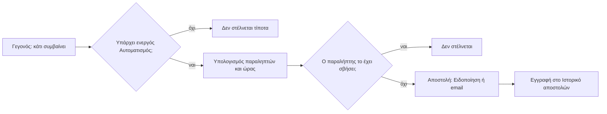

# Ειδοποιήσεις και Αυτοματισμοί

> **👁️ Με μια ματιά**
> Το σύστημα γνωρίζει ένα **σταθερό κατάλογο Γεγονότων** (π.χ. «υπογράφηκε Συμφωνία», «Τιμολόγιο ληξιπρόθεσμο»). Πάνω σε κάθε Γεγονός ο admin φτιάχνει όσους **Αυτοματισμούς** θέλει: ποιος ενημερώνεται, με Ειδοποίηση ή με email, πότε και με ποιο κείμενο, στα ελληνικά και στα αγγλικά.
> Σήμερα τα email είναι τέσσερα, γραμμένα στον κώδικα, με σταθερή ημερομηνία («στις 25 του μήνα») και χωρίς ρύθμιση. Στο νέο σύστημα η υπενθύμιση γυρίσματος ακολουθεί το άνοιγμα της Περιόδου κάθε πελάτη, και μια δεύτερη υπενθύμιση προστίθεται χωρίς προγραμματιστή.
> Τα email χωρίς τα οποία το σύστημα δεν δουλεύει (πρόσκληση, κωδικός υπογραφής) είναι χωριστά, πάντα ενεργά. Ό,τι στάλθηκε, και ό,τι απέτυχε, φαίνεται στο Ιστορικό αποστολών και στην Υγεία συστήματος.

## 🔔 Πώς δουλεύει

| Έννοια | Τι είναι | Ποιος την ορίζει |
|---|---|---|
| **Γεγονός** | Κάτι που συμβαίνει στο σύστημα, με ή χωρίς ημερομηνία. Ο κατάλογος είναι σταθερός. | Το σύστημα. Νέο Γεγονός θέλει προγραμματιστή. |
| **Αυτοματισμός** | Κανόνας πάνω σε ένα Γεγονός: κανάλι, παραλήπτες, χρονισμός, κείμενο. Ένα Γεγονός έχει όσους Αυτοματισμούς θέλεις, και ο καθένας ανάβει ή σβήνει ξεχωριστά. | Ο admin. Νέος Αυτοματισμός πάνω σε υπάρχον Γεγονός δεν θέλει προγραμματιστή. |
| **Απαραίτητος ή όχι** | Σημάδι του Αυτοματισμού που λέει αν ο πελάτης μπορεί να τον σβήσει για τον εαυτό του. | Ο admin. |

Δεν υπάρχουν συνθήκες («αν η Συμφωνία είναι πάνω από Χ») ούτε αλυσίδες («μετά το email στείλε και άλλο»). Ένας πλήρης builder με τέτοιες δυνατότητες είναι για αργότερα.

### Κανάλια

| Κανάλι | Τι είναι |
|---|---|
| **Ειδοποίηση** | Το καμπανάκι και η σελίδα ειδοποιήσεων μέσα στο DMS. Τη στέλνει το σύστημα, όχι άνθρωπος. |
| **Email** | Στέλνεται από τον ενιαίο δρόμο αποστολής (βλ. κεφάλαιο Ενσωματώσεις). |

Ένας Αυτοματισμός έχει **ένα** κανάλι. Αν θες και Ειδοποίηση και email για το ίδιο Γεγονός, φτιάχνεις δύο Αυτοματισμούς.
Αργότερα: web push, SMS και Viber. Το email φτάνει ήδη στο κινητό.

### Παραλήπτες

| Τρόπος ορισμού | Τι σημαίνει | Παράδειγμα |
|---|---|---|
| **Σε σχέση με το Γεγονός** | «Ο πελάτης», «το Συνεργείο», «ο υπεύθυνος», «όποιος έκανε την ενέργεια». | Γύρισμα μετακινήθηκε → Συνεργείο και πελάτης |
| **Όσοι έχουν ένα Δικαίωμα** | Όλοι οι Χρήστες που έχουν το Δικαίωμα, όποιος κι αν είναι ο Ρόλος τους. | Νέο ενδιαφέρον → όσοι έχουν Δικαίωμα Πωλήσεων |
| **Συγκεκριμένοι Χρήστες ομάδας** | Ονομαστική λίστα. | Η Μαρία και ο Νίκος της ομάδας |
| **Ο Επισκέπτης της φόρμας** | Ο μόνος που δεν είναι Χρήστης και παίρνει email. | «Λάβαμε το αίτημά σας» |

- **«Ο πελάτης»** σημαίνει **όλους** τους Χρήστες πελάτη του Πελάτη, χωρίς φίλτρο ανά Δικαίωμα. Αν ένας Πελάτης αποκτήσει δεύτερο Χρήστη, οι Αυτοματισμοί δουλεύουν χωρίς καμία αλλαγή. Στην πράξη ξεκινάμε με έναν.
- Τα **Εξωτερικά μέλη συνεργείου** δεν έχουν λογαριασμό και δεν παίρνουν τίποτα.

### Χρονισμός

| Είδος Γεγονότος | Πότε φεύγει | Παράδειγμα |
|---|---|---|
| **Στιγμιαίο** | Αμέσως (μέσα σε περίπου ένα λεπτό). | Υπογράφηκε Συμφωνία |
| **Με ημερομηνία** | Χ μέρες πριν ή μετά την ημερομηνία, σε ώρα αποστολής που ορίζει ο admin. Η ώρα είναι πάντα ώρα Ελλάδας. | Λήγει Συμφωνία: email −30 μέρες |
| **Αναμονής** | Αφού περάσει ένα διάστημα χωρίς ενέργεια: Χ λεπτά, ώρες ή μέρες. | Έκδοση αναμένει πελάτη: 3 και 7 μέρες |

- Οι υπενθυμίσεις «Χ μέρες πριν» ετοιμάζονται από ημερήσιο έλεγχο του συστήματος.
- Αν η ημερομηνία ενός Γεγονότος **αλλάξει**, η αποστολή που περιμένει υπολογίζεται ξανά. Μια υπενθύμιση γυρίσματος ακολουθεί το Γύρισμα όταν μετακινηθεί.
- Η υπενθύμιση γυρίσματος ακολουθεί το **άνοιγμα της Περιόδου κάθε Συμφωνίας**, όχι μια σταθερή ημερομηνία του μήνα.

### Γλώσσα και κείμενο

- Κάθε μήνυμα φεύγει στη **γλώσσα του παραλήπτη**.
- Ο admin γράφει **ελληνικό και αγγλικό κείμενο** με μεταβλητές (π.χ. όνομα Πελάτη, ημερομηνία Γυρίσματος).
- Αν λείπει το αγγλικό, στέλνεται το ελληνικό.

### Μία φορά ανά περίπτωση

Ο ίδιος Αυτοματισμός δεν στέλνει **δύο φορές** το ίδιο μήνυμα στον ίδιο παραλήπτη για την ίδια περίπτωση ενός Γεγονότος. Αν κάτι αποτύχει, η αποστολή ξαναδοκιμάζεται με καθυστέρηση, χωρίς διπλό αποτέλεσμα.

## 📋 Ο κατάλογος των Γεγονότων

Ο κατάλογος έχει **53 Γεγονότα** σε έξι ομάδες. Τα πρώτα 24 ήρθαν με τον αρχικό κατάλογο· τα υπόλοιπα προστέθηκαν από τις αποφάσεις για τις Πωλήσεις, τα Γυρίσματα, τα Παραδοτέα, τα Μηνύματα, το κόστος και την Υγεία συστήματος. Ο κατάλογος μπορεί να μεγαλώσει ακόμα, αφού τον συμπληρώνει κάθε νέα περιοχή του συστήματος.

**Υπόμνημα:** ✅ ενεργός Αυτοματισμός από την αρχή · ➖ διαθέσιμο, κανένας ενεργός · ❓ ο αρχικός Αυτοματισμός ή ο παραλήπτης δεν έχει οριστεί ακόμα (βλ. Ανοιχτά ερωτήματα).

### Α. Πωλήσεις και Συμφωνίες

| # | Γεγονός | Είδος | Αρχικός Αυτοματισμός |
|---|---|---|---|
| 1 | Νέα Ευκαιρία από φόρμα ενδιαφέροντος | στιγμιαίο | ✅ Ειδοποίηση → όσοι έχουν Δικαίωμα Πωλήσεων (τον Υπεύθυνο ή όσους αναθέτουν) · ✅ email «λάβαμε το αίτημά σας» → Επισκέπτης |
| 2 | Ο πελάτης άνοιξε τον Σύνδεσμο πρότασης | στιγμιαίο | ✅ Ειδοποίηση → υπεύθυνος Ευκαιρίας |
| 3 | Λήγει ο Σύνδεσμος πρότασης | με ημερομηνία | ✅ Ειδοποίηση, −2 μέρες → υπεύθυνος |
| 4 | Υπογράφηκε Συμφωνία | στιγμιαίο | ✅ email με PDF → πελάτης (**απαραίτητο**) · ✅ Ειδοποίηση → Διαχείριση |
| 5 | Λήγει Συμφωνία | με ημερομηνία | ✅ email, −30 μέρες → πελάτης · ✅ Ειδοποίηση → Διαχείριση |
| 6 | Ζητήθηκε Έγκριση πρότασης | στιγμιαίο | ✅ Ειδοποίηση → όσοι έχουν Δικαίωμα «Παρεκκλίνει από τον Κατάλογο» |
| 7 | Εγκρίθηκε ή απορρίφθηκε η Έγκριση πρότασης | στιγμιαίο | ✅ Ειδοποίηση · παραλήπτης ❓ |
| 8 | Ο πελάτης ζήτησε αλλαγές στην πρόταση | στιγμιαίο | ✅ Ειδοποίηση → υπεύθυνος |
| 9 | Ο πελάτης απέρριψε την πρόταση | στιγμιαίο | ✅ Ειδοποίηση · παραλήπτης ❓ |
| 10 | Έληξε η πρόταση | με ημερομηνία | ✅ Ειδοποίηση · παραλήπτης ❓ (ο υπεύθυνος αποφασίζει Παράταση ή απώλεια) |
| 11 | Πέρασε το Επόμενο βήμα μιας Ευκαιρίας | με ημερομηνία | ✅ Ειδοποίηση → υπεύθυνος |

### Β. Περίοδοι και Γυρίσματα

| # | Γεγονός | Είδος | Αρχικός Αυτοματισμός |
|---|---|---|---|
| 12 | Ανοίγει Περίοδος | με ημερομηνία | ✅ email την ημέρα → πελάτης (ανανέωση Περιόδου) · ✅ email, −5 μέρες → πελάτης («κλείσε γύρισμα») |
| 13 | Ο πελάτης έκλεισε Γύρισμα (αναμένει έγκριση) | στιγμιαίο | ✅ Ειδοποίηση → Διαχείριση |
| 14 | Γύρισμα εγκρίθηκε ή απορρίφθηκε | στιγμιαίο | ✅ email → πελάτης |
| 15 | Εκδόθηκε Δελτίο γυρίσματος | στιγμιαίο | ✅ email → Συνεργείο (για επιβεβαίωση) |
| 16 | Ημέρα Γυρίσματος | με ημερομηνία | ✅ email, −1 μέρα → Συνεργείο και πελάτης |
| 17 | Γύρισμα μετακινήθηκε στο Google | στιγμιαίο | ✅ email → Συνεργείο και πελάτης |
| 18 | Γύρισμα διαγράφηκε από το Google, θέλει επιβεβαίωση | στιγμιαίο | ✅ Ειδοποίηση και email → όποιος το διέγραψε |
| 19 | Μετακίνηση στο Google απορρίφθηκε | στιγμιαίο | ✅ Ειδοποίηση → Διαχείριση, με τον λόγο |
| 20 | Γύρισμα μετατέθηκε μέσα στο DMS | στιγμιαίο | ❓ |
| 21 | Γύρισμα ακυρώθηκε | στιγμιαίο | ❓ |
| 22 | Ο πελάτης ζήτησε ακύρωση μετά το Όριο ακύρωσης | στιγμιαίο | ❓ |
| 23 | Μέλος του Συνεργείου δήλωσε «δεν μπορώ» | στιγμιαίο | ✅ Ειδοποίηση → Υπεύθυνος της Παραγωγής |
| 24 | Γύρισμα δεν σημειώθηκε ως «έγινε» | αναμονής | ❓ |
| 25 | Η αναμονή έγκρισης Γυρίσματος ξεπέρασε Χ ώρες | αναμονής | ❓ |

### Γ. Παραδοτέα

| # | Γεγονός | Είδος | Αρχικός Αυτοματισμός |
|---|---|---|---|
| 26 | Ανατέθηκε εργασία ή Παραδοτέο | στιγμιαίο | ✅ Ειδοποίηση → όποιος το ανέλαβε |
| 27 | Νέα Έκδοση προς έγκριση | στιγμιαίο | ✅ email → πελάτης (**απαραίτητο**) |
| 28 | Ο πελάτης ζήτησε αλλαγές ή ενέκρινε Έκδοση | στιγμιαίο | ✅ Ειδοποίηση → υπεύθυνος Παραγωγής |
| 29 | Προθεσμία Παραδοτέου | με ημερομηνία | ✅ Ειδοποίηση, −2 μέρες και την ημέρα → υπεύθυνος |
| 30 | Παραγωγή παραδόθηκε | στιγμιαίο | ✅ email → πελάτης |
| 31 | Έκδοση αναμένει εσωτερικό έλεγχο | στιγμιαίο | ❓ |
| 32 | Έκδοση αναμένει πελάτη Χ μέρες | αναμονής | ✅ email → πελάτης και Ειδοποίηση → υπεύθυνος, στις 3 και στις 7 μέρες |
| 33 | Ξεπεράστηκε το Όριο αλλαγών | στιγμιαίο | ❓ |
| 34 | Αίτημα αλλαγής μετά την έγκριση | στιγμιαίο | ❓ |

### Δ. Οικονομικά και κόστος

| # | Γεγονός | Είδος | Αρχικός Αυτοματισμός |
|---|---|---|---|
| 35 | Γεννήθηκε Τιμολογητέο | στιγμιαίο | ✅ Ειδοποίηση → Διαχείριση και Λογιστής |
| 36 | Καταχωρήθηκε Τιμολόγιο | στιγμιαίο | ✅ email με PDF → πελάτης (**απαραίτητο**) |
| 37 | Τιμολόγιο ληξιπρόθεσμο | με ημερομηνία | ✅ email την ημέρα → πελάτης · ✅ Ειδοποίηση → Διαχείριση |
| 38 | Καταχωρήθηκε Είσπραξη | στιγμιαίο | ➖ διαθέσιμο, κανένας ενεργός |
| 39 | Χαμηλό περιθώριο πρότασης | στιγμιαίο | ✅ Ειδοποίηση → μόνο όσοι βλέπουν κόστος |
| 40 | Υπέρβαση κόστους Παραγωγής | στιγμιαίο | ✅ Ειδοποίηση → μόνο όσοι βλέπουν κόστος |
| 41 | Παραγωγή παραδομένη χωρίς πραγματικές ώρες | στιγμιαίο | ✅ Ειδοποίηση → μόνο όσοι βλέπουν κόστος |

### Ε. Επικοινωνία και πελάτες

| # | Γεγονός | Είδος | Αρχικός Αυτοματισμός |
|---|---|---|---|
| 42 | Αργία | με ημερομηνία | ✅ email ευχών → ενεργοί **και** ανενεργοί Πελάτες (**μη απαραίτητο**) |
| 43 | Ο πελάτης προσκάλεσε συνάδελφο | στιγμιαίο | ✅ Ειδοποίηση → Διαχείριση |
| 44 | Νέο Μήνυμα | στιγμιαίο | ✅ Ειδοποίηση · παραλήπτης ❓ |
| 45 | Αδιάβαστα Μηνύματα για Χ λεπτά | αναμονής | ✅ ένα συγκεντρωτικό email (προεπιλογή 15 λεπτά) · παραλήπτης ❓ |
| 46 | Νέο Αίτημα | στιγμιαίο | ❓ |
| 47 | Αίτημα ανοιχτό Χ μέρες | αναμονής | ❓ |
| 48 | Αίτημα ολοκληρώθηκε ή απορρίφθηκε | στιγμιαίο | ❓ (προς τον πελάτη) |
| 49 | Σε ανέφεραν σε Εσωτερικό Μήνυμα | στιγμιαίο | ❓ (προς το μέλος που αναφέρθηκε) |

### ΣΤ. Υγεία συστήματος

| # | Γεγονός | Είδος | Αρχικός Αυτοματισμός |
|---|---|---|---|
| 50 | Προγραμματισμένη εργασία δεν έτρεξε | στιγμιαίο | Ειδοποίηση · παραλήπτης ❓ |
| 51 | Αποστολή απέτυχε οριστικά | στιγμιαίο | Ειδοποίηση · παραλήπτης ❓ |
| 52 | Ο συγχρονισμός του Google σταμάτησε | στιγμιαίο | Ειδοποίηση · παραλήπτης ❓ |
| 53 | Γεγονός κόλλησε (δεν επεξεργάστηκε) | στιγμιαίο | Ειδοποίηση · παραλήπτης ❓ |

Οι τέσσερις αυτές Ειδοποιήσεις είναι για όποιον φροντίζει το σύστημα, δηλαδή τον Ιδιοκτήτη και τον admin.

**Σημειώσεις στον κατάλογο**
- Τα Γεγονότα 3 και 10 (λήγει / έληξε η πρόταση), 17 και 20, 27 και 32, 34 και 46 μοιάζουν, αλλά μένουν χωριστά γιατί στέλνονται σε άλλη στιγμή ή για άλλο λόγο. Αν θα ενωθούν, είναι ανοιχτό ερώτημα.
- Οι **αργίες** είναι οι 13 επίσημες ελληνικές, μαζί με όσες εξαρτώνται από το Πάσχα. Το σύστημα τις υπολογίζει μόνο του. Ο admin σβήνει ή προσθέτει όποιες θέλει. Οι ευχές πάνε σε ενεργούς και ανενεργούς Πελάτες, όχι σε υποψήφιους.
- Η Παραγωγή «χωρίς πραγματικές ώρες» δεν μετρά στα σύνολα ως μηδενικό κόστος, γι' αυτό το Γεγονός 41 υπενθυμίζει να καταχωρηθούν.

## 📨 Μηνύματα συστήματος

Είναι email χωρίς τα οποία το σύστημα δεν λειτουργεί. **Δεν είναι Αυτοματισμοί.** Είναι πάντα ενεργά, δεν έχουν διακόπτη και ο admin αλλάζει **μόνο το κείμενό τους**. Ο λόγος: ένα κουμπί στις ρυθμίσεις δεν πρέπει να μπορεί να σπάσει την είσοδο ή την υπογραφή.

| Μήνυμα | Πότε φεύγει | Ιδιαιτερότητα |
|---|---|---|
| **Πρόσκληση** | Όταν προσκαλείται Χρήστης ομάδας ή πελάτη. Μετά την υπογραφή προσκαλείται και ο Υπογράφων, ως Χρήστης πελάτη με Ρόλο «Πλήρης». | Η είσοδος είναι μόνο με πρόσκληση. |
| **Σύνδεσμος εισόδου** | Όταν ο Χρήστης ζητά είσοδο με σύνδεσμο. | Φεύγει στη γλώσσα του Χρήστη. |
| **Επαναφορά κωδικού** | Όταν ο Χρήστης ξεχάσει τον κωδικό. | Φεύγει με το κείμενο του admin, στη γλώσσα του Χρήστη. |
| **Κωδικός υπογραφής** | Όταν ο Υπογράφων επιβεβαιώνει την υπογραφή. | Ένας κωδικός ανά 60 δευτερόλεπτα και πέντε ανά ώρα για κάθε Σύνδεσμο πρότασης. |
| **Αποστολή Συνδέσμου πρότασης** | Όταν η ομάδα στέλνει πρόταση. | Κάθε παραλήπτης παίρνει τον δικό του σύνδεσμο. Η πρόταση βγαίνει στη γλώσσα του Πελάτη. |

Όλα τα Μηνύματα συστήματος γράφονται και αυτά στο Ιστορικό αποστολών.

## 🙋 Τι μπορεί να σβήσει ο πελάτης

| Ποιος | Τι σβήνει για τον εαυτό του |
|---|---|
| **Χρήστης πελάτη** | **Μόνο** τους Αυτοματισμούς που ο admin έχει σημειώσει ως μη απαραίτητους (π.χ. ευχές αργιών). Τα απαραίτητα (π.χ. Τιμολόγιο, Συμφωνία με PDF, νέα Έκδοση) δεν σβήνουν. |
| **Μέλος της ομάδας** | **Οποιονδήποτε** Αυτοματισμό, για τον εαυτό του. |
| **Επισκέπτης** | Τίποτα. Παίρνει μόνο το email «λάβαμε το αίτημά σας». |

- Κάθε email μη απαραίτητου Αυτοματισμού έχει **σύνδεσμο διακοπής**.
- Το σβήσιμο ισχύει μόνο για τον ίδιο τον άνθρωπο, όχι για τους άλλους Χρήστες του Πελάτη.
- Τα Μηνύματα συστήματος δεν σβήνουν από κανέναν.

Ο πελάτης βλέπει επίσης τις Ειδοποιήσεις του μέσα στο DMS, και όλα τα emails στη γλώσσα του. Δεν βλέπει εσωτερικά Γεγονότα όπως Τιμολογητέο, κόστος ή περιθώριο.

## ✉️ Απαντήσεις στα emails

- Ο αποστολέας είναι πάντα μια διεύθυνση `noreply`. Η εταιρεία ορίζει μία **διεύθυνση απάντησης**, ώστε όποιος πατήσει «Απάντηση» να φτάνει σε άνθρωπο.
- Τα emails των Μηνυμάτων έχουν κουμπί «Απάντησε στο DMS». Η απάντηση με Reply μέσα στο email είναι για αργότερα.

## 🧾 Ιστορικό αποστολών

Η καταγραφή κάθε Ειδοποίησης και email που στάλθηκε, ή θα σταλεί:

| Τι φαίνεται | Παράδειγμα |
|---|---|
| Τι στάλθηκε | «Τιμολόγιο ΤΠΥ-0042, email με PDF» |
| Σε ποιον | Ο Χρήστης πελάτη του Πελάτη |
| Πότε (ή πότε προγραμματίζεται) | Τρίτη 09:00 |
| Αν απέτυχε | «Απέτυχε: ξεπεράστηκε το όριο αποστολών» |

- Φαίνεται και **ανά Πελάτη**, στη σελίδα του: πολύ χρήσιμο στην ερώτηση «σου στείλαμε το τιμολόγιο;».
- Δεν είναι το ίδιο με τη **Δραστηριότητα** (το ιστορικό μιας Ευκαιρίας, όπου η ομάδα καταγράφει κλήσεις και σημειώσεις).
- Μια αποστολή που αποτυγχάνει ξαναδοκιμάζεται με καθυστέρηση. Οι αποστολές που τελικά απέτυχαν μπαίνουν σε λίστα «απέτυχαν».

## 🩺 Υγεία συστήματος

Η σελίδα όπου ο Ιδιοκτήτης και ο admin βλέπουν αν δουλεύουν τα αυτόματα του DMS:

| Τι δείχνει | Τι σημαίνει όταν κοκκινίσει |
|---|---|
| Πότε έτρεξε τελευταία κάθε προγραμματισμένη εργασία | Σταμάτησαν οι υπενθυμίσεις ή οι αυτόματες ενέργειες της ημέρας. |
| Ποιες αποστολές απέτυχαν | Κάποιος πελάτης ή συνάδελφος δεν πήρε ένα μήνυμα. |
| Αν συγχρονίζει το Google | Το Εταιρικό ημερολόγιο δεν ενημερώνεται. |
| Αν κόλλησαν Γεγονότα | Κάτι συνέβη στο σύστημα και δεν έφτασε στους Αυτοματισμούς. |

- Ό,τι κοκκινίσει **στέλνει Ειδοποίηση**, ώστε να μη χρειάζεται να ανοίγει κανείς τη σελίδα.
- Ένας ξεχωριστός έλεγχος απέξω επισκέπτεται τακτικά το σύστημα, ώστε να φανεί αν δεν απαντά καθόλου.
- Ειδοποίηση φεύγει και όταν εξαντληθεί το μηνιαίο πλαφόν του Βοηθού (βλ. κεφάλαιο Ενσωματώσεις).

## ⚠️ Εξαιρέσεις

| Τι πάει στραβά | Τι γίνεται |
|---|---|
| Ένα email δεν φεύγει (π.χ. όριο αποστολών) | Γράφεται ως «απέτυχε» στο Ιστορικό, ξαναδοκιμάζεται με καθυστέρηση και, αν δεν περάσει, ειδοποιείται ο admin. |
| Αλλάζει η ημερομηνία ενός Γυρίσματος ή μιας Συμφωνίας | Οι υπενθυμίσεις που περιμένουν υπολογίζονται ξανά για τη νέα ημερομηνία. |
| Λείπει το αγγλικό κείμενο | Στέλνεται το ελληνικό. |
| Ο παραλήπτης είναι Εξωτερικό μέλος συνεργείου | Δεν παίρνει τίποτα, γιατί δεν έχει λογαριασμό. |
| Δύο φορές το ίδιο Γεγονός για την ίδια περίπτωση | Ο Αυτοματισμός στέλνει μία φορά ανά παραλήπτη. |
| Ο πελάτης έχει γίνει ανενεργός | Οι Χρήστες του συνεχίζουν να συνδέονται και να επικοινωνούν. Οι ευχές των αργιών τους φτάνουν κανονικά. |
| Χρειάζεται Γεγονός που δεν υπάρχει στον κατάλογο | Θέλει προγραμματιστή. Ο admin δεν φτιάχνει Γεγονότα. |

**Σημείωση:** οι ευχές των αργιών φεύγουν στους Χρήστες όλων των ενεργών και ανενεργών Πελατών την ίδια μέρα. Αν οι παραλήπτες πλησιάσουν το ημερήσιο όριο του δωρεάν πλάνου αποστολής, η εταιρεία πρέπει να έχει ήδη περάσει σε επί πληρωμή πλάνο (βλ. κεφάλαιο Ενσωματώσεις).

## ⚙️ Τι ρυθμίζει ο admin

Χρειάζεται το Δικαίωμα «Διαχειρίζεται Αυτοματισμούς και Μηνύματα συστήματος».

| Τι αλλάζει | Παράδειγμα |
|---|---|
| Ανάβει ή σβήνει κάθε Αυτοματισμό | Σβήνει τις ευχές για το Πάσχα. |
| Προσθέτει Αυτοματισμό πάνω σε υπάρχον Γεγονός | Δεύτερη υπενθύμιση γυρίσματος, την ημέρα του Γυρίσματος. |
| Αλλάζει κανάλι | Ειδοποίηση αντί για email. |
| Αλλάζει παραλήπτες | Η Διαχείριση και ο Λογιστής για κάθε Τιμολογητέο. |
| Αλλάζει χρονισμό και ώρα αποστολής | Λήξη Συμφωνίας: −45 μέρες αντί για −30, στις 09:00. |
| Γράφει ή αλλάζει το κείμενο, ελληνικό και αγγλικό | Νέα διατύπωση στο email του Τιμολογίου. |
| Σημειώνει έναν Αυτοματισμό ως απαραίτητο ή όχι | Οι ευχές μένουν μη απαραίτητες. |
| Ορίζει τη διεύθυνση απάντησης | Μια κοινή διεύθυνση της εταιρείας. |
| Αλλάζει το κείμενο των Μηνυμάτων συστήματος | Φιλικότερη πρόσκληση. |
| Προσθέτει ή σβήνει αργίες ευχών | Προσθέτει τη γιορτή της πόλης. |
| Αλλάζει το Χ στα Γεγονότα αναμονής | Συγκεντρωτικό email αδιάβαστων μετά από 30 λεπτά αντί για 15. |

**Δεν αλλάζει:** ο κατάλογος των Γεγονότων, τα κανάλια, και το ότι τα Μηνύματα συστήματος είναι πάντα ενεργά.

## 🔗 Πού ακουμπά άλλες ροές

| Ροή | Σύνδεση |
|---|---|
| Πωλήσεις | Γεγονότα 1–11: φόρμα, Σύνδεσμος πρότασης, υπογραφή, λήξη. |
| Γυρίσματα και ημερολόγιο | Γεγονότα 12–25, και οι αλλαγές που έρχονται από το Google. |
| Παραδοτέα | Γεγονότα 26–34: Εκδόσεις, προθεσμίες, αναμονή πελάτη. |
| Τιμολόγια και εισπράξεις | Γεγονότα 35–38, με email και PDF προς τον πελάτη. |
| Κατάλογος, Συμφωνία και κόστος | Γεγονότα 39–41, μόνο προς όσους βλέπουν κόστος. |
| Μηνύματα και Αιτήματα | Γεγονότα 44–49, και το συγκεντρωτικό email αδιάβαστων. |
| Ρυθμίσεις | Οι αργίες και η διεύθυνση απάντησης. |
| Ενσωματώσεις | Ο δρόμος αποστολής των email, ο συγχρονισμός Google, τα όρια. |

## 📖 Σενάρια

**1. Δεύτερη υπενθύμιση για το «Καφέ Αθηνά».**
Το Γύρισμα του «Καφέ Αθηνά» είναι την Πέμπτη στις 10:00. Σήμερα το Συνεργείο και ο πελάτης παίρνουν email την Τετάρτη. Η Διαχείριση προσθέτει έναν δεύτερο Αυτοματισμό στο ίδιο Γεγονός: Ειδοποίηση την Πέμπτη στις 07:30 προς το Συνεργείο. Δεν χρειάστηκε προγραμματιστής. Αν το Γύρισμα μετακινηθεί για την Παρασκευή, και οι δύο υπενθυμίσεις μετακινούνται μαζί του.

**2. Οι ευχές και το τιμολόγιο του «Γυμναστήριο Κίνηση».**
Ο Χρήστης πελάτη του «Γυμναστήριο Κίνηση» δεν θέλει ευχές για το Πάσχα και πατά «διακοπή» στο email. Παύει να παίρνει ευχές. Όταν στο τέλος του μήνα καταχωρείται Τιμολόγιο, το email με το PDF φτάνει κανονικά, γιατί ο Αυτοματισμός είναι σημειωμένος ως απαραίτητος. Ο συνάδελφός του στο ίδιο Γυμναστήριο συνεχίζει να παίρνει τις ευχές.

**3. Το email που δεν έφυγε στο «Ζαχαροπλαστείο Μέλι».**
Την ημέρα που το Τιμολόγιο του «Ζαχαροπλαστείο Μέλι» γίνεται ληξιπρόθεσμο, το email δεν φεύγει: ξεπεράστηκε το όριο αποστολών της ημέρας. Στο Ιστορικό αποστολών, στη σελίδα του Πελάτη, η γραμμή γράφει «απέτυχε». Το σύστημα ξαναδοκιμάζει αργότερα. Αν και πάλι δεν περάσει, η Υγεία συστήματος κοκκινίζει και ο admin παίρνει Ειδοποίηση, πριν ο πελάτης προλάβει να ρωτήσει γιατί δεν ενημερώθηκε.

**4. Υπενθύμιση ανά πελάτη, όχι «στις 25».**
Η μηνιαία Συμφωνία του «Καφέ Αθηνά» ανοίγει Περίοδο στις 12 κάθε μήνα. Ο Αυτοματισμός «−5 μέρες» στέλνει στον πελάτη την υπενθύμιση «κλείσε γύρισμα» στις 7. Μια άλλη Συμφωνία με Περίοδο που ανοίγει την 1η κάθε μήνα παίρνει την υπενθύμισή της πέντε μέρες νωρίτερα, στο τέλος του προηγούμενου μήνα. Δεν υπάρχει καμία κοινή ημερομηνία.

✅ Κανόνες που θα ελέγχονται

- **Δεδομένου ότι** ένας Αυτοματισμός είναι ενεργός, **όταν** συμβεί το Γεγονός του, **τότε** στέλνεται μήνυμα σε κάθε παραλήπτη, με το κανάλι και το κείμενο που όρισε ο admin.
- **Δεδομένου ότι** ένας Αυτοματισμός είναι σβησμένος, **όταν** συμβεί το Γεγονός, **τότε** δεν στέλνεται τίποτα, και οι άλλοι Αυτοματισμοί του ίδιου Γεγονότος δουλεύουν κανονικά.
- **Δεδομένου ότι** ένας Αυτοματισμός έχει παραλήπτη «ο πελάτης», **όταν** ο Πελάτης έχει τρεις Χρήστες πελάτη, **τότε** και οι τρεις παίρνουν το μήνυμα.
- **Δεδομένου ότι** ένας Αυτοματισμός έχει ημερομηνία και Χ μέρες, **όταν** αλλάξει η ημερομηνία του Γεγονότος πριν την αποστολή, **τότε** η αποστολή γίνεται με βάση τη νέα ημερομηνία.
- **Δεδομένου ότι** ένας Αυτοματισμός έχει ήδη στείλει σε έναν παραλήπτη για μια περίπτωση, **όταν** το Γεγονός της ίδιας περίπτωσης ξανασυμβεί, **τότε** δεν στέλνεται δεύτερη φορά.
- **Δεδομένου ότι** ο παραλήπτης έχει γλώσσα αγγλικά και λείπει το αγγλικό κείμενο, **όταν** φεύγει το μήνυμα, **τότε** φεύγει το ελληνικό.
- **Δεδομένου ότι** ένας Αυτοματισμός είναι σημειωμένος ως απαραίτητος, **όταν** ένας Χρήστης πελάτη προσπαθεί να τον σβήσει, **τότε** δεν μπορεί, ενώ ένα μέλος της ομάδας μπορεί να σβήσει οποιονδήποτε Αυτοματισμό για τον εαυτό του.
- **Δεδομένου ότι** ένα Μήνυμα συστήματος είναι πάντα ενεργό, **όταν** ο admin αλλάζει τις ρυθμίσεις, **τότε** μπορεί να αλλάξει μόνο το κείμενό του και όχι να το σβήσει.
- **Δεδομένου ότι** κάθε Ειδοποίηση ή email φεύγει, **όταν** ολοκληρωθεί η αποστολή ή αποτύχει, **τότε** υπάρχει γραμμή στο Ιστορικό αποστολών, ορατή και στη σελίδα του Πελάτη.
- **Δεδομένου ότι** ένα email αποτυγχάνει οριστικά, **όταν** περάσουν οι επαναλήψεις, **τότε** φαίνεται ως «απέτυχε» και ειδοποιείται ο admin.
- **Δεδομένου ότι** το Γεγονός αφορά κόστος ή περιθώριο, **όταν** φτιάχνεται η Ειδοποίηση, **τότε** την παίρνουν μόνο όσοι έχουν το Δικαίωμα να βλέπουν κόστος.
- **Δεδομένου ότι** ο παραλήπτης είναι Εξωτερικό μέλος συνεργείου, **όταν** συμβεί ένα Γεγονός για το Συνεργείο, **τότε** δεν παίρνει μήνυμα.

## ❓ Ανοιχτά ερωτήματα

1. **Αρχικοί Αυτοματισμοί και παραλήπτες:** για πολλά από τα Γεγονότα που προστέθηκαν μετά τον αρχικό κατάλογο (σημειωμένα ❓) οι πηγές λένε μόνο ότι το Γεγονός υπάρχει. Δεν ορίζουν ποιος ειδοποιείται, με ποιο κανάλι και αν είναι ενεργό από την αρχή. Ισχύει και για τα τέσσερα Γεγονότα Υγείας συστήματος (λογικοί παραλήπτες: Ιδιοκτήτης και admin).
2. **Ποια emails είναι «απαραίτητα»:** ρητά το είναι μόνο η Συμφωνία με PDF, η νέα Έκδοση και το Τιμολόγιο, και μη απαραίτητες οι ευχές. Για τα υπόλοιπα emails προς πελάτη (λήξη Συμφωνίας, Περίοδος, εγκρίσεις Γυρίσματος, ληξιπρόθεσμο Τιμολόγιο) δεν ορίζεται.
3. **Μεταβλητές κειμένου:** δεν υπάρχει λίστα με τις μεταβλητές που μπορεί να βάλει ο admin στο κείμενο.
4. **Αρχικά κείμενα:** οι αρχικοί Αυτοματισμοί και τα Μηνύματα συστήματος χρειάζονται κείμενο στα ελληνικά και στα αγγλικά από την πρώτη μέρα. Δεν ορίζεται ποιος τα γράφει ούτε πότε.
5. **Ποιος βλέπει το Ιστορικό αποστολών**, και για πόσο διατηρείται. Φαίνεται και ανά Πελάτη, αλλά δεν ορίζεται Δικαίωμα ούτε αν το βλέπει και ο ίδιος ο πελάτης.
6. **Ενοποίηση παρόμοιων Γεγονότων:** λήγει / έληξε η πρόταση, μετακινήθηκε στο Google / μετατέθηκε στο DMS, νέα Έκδοση / Έκδοση αναμένει πελάτη, Αίτημα αλλαγής μετά την έγκριση / νέο Αίτημα. Τα κρατήσαμε χωριστά, όπως τα έγραψαν οι αποφάσεις.
7. **Ο υπεύθυνος λείπει:** για Αυτοματισμούς με παραλήπτη «ο υπεύθυνος» δεν ορίζεται τι γίνεται όταν δεν υπάρχει Υπεύθυνος (π.χ. Ευκαιρία στο «Χωρίς υπεύθυνο», ή Υπεύθυνος που απενεργοποιήθηκε).
8. **Πόσες φορές «ανοίγει» ο Σύνδεσμος πρότασης:** το Γεγονός 2 στέλνει μία φορά ανά περίπτωση. Δεν ορίζεται αν κάθε νέο άνοιγμα είναι νέα περίπτωση ή μόνο το πρώτο.
9. **Πλαφόν του Βοηθού:** η εξάντλησή του ειδοποιεί τον admin (κεφάλαιο Ενσωματώσεις), αλλά δεν υπάρχει αντίστοιχο ονομασμένο Γεγονός στον κατάλογο.

Πηγές

- ADR 0006: Οι Αυτοματισμοί είναι κανόνες πάνω σε σταθερό κατάλογο Γεγονότων
- ADR 0018: Γεγονότα και Ιστορικό αποστολών, Υγεία συστήματος (Consequences: τα Γεγονότα Υγείας)
- ADR 0017: τα τρία Γεγονότα κόστους
- ADR 0009, 0010, 0011, 0012: Γεγονότα που προστέθηκαν από Πωλήσεις, Γυρίσματα, Παραδοτέα, Μηνύματα
- ADR 0005: οι αλλαγές από το Google, οι μετακινήσεις και οι διαγραφές Γυρισμάτων
- ADR 0016: ενιαίος δρόμος αποστολής και Μηνύματα συστήματος
- Issue #14: αρχικός κατάλογος 24 Γεγονότων (με τα σχόλιά του)
- Issue #19, #33: Γεγονότα Πωλήσεων και Μηνυμάτων
- CONTEXT.md, ενότητα «Επικοινωνία»

