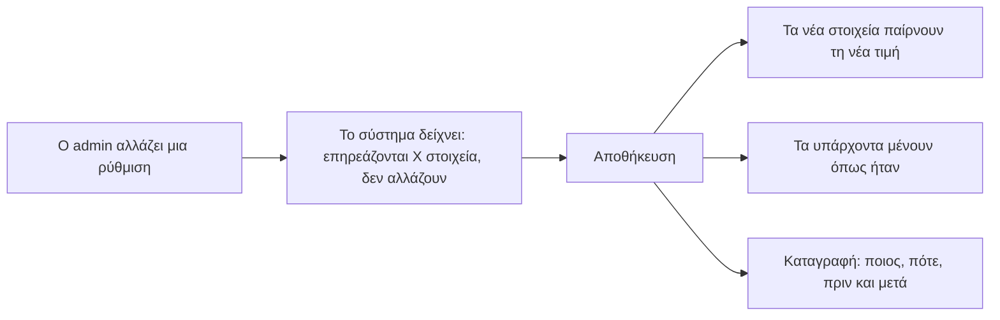
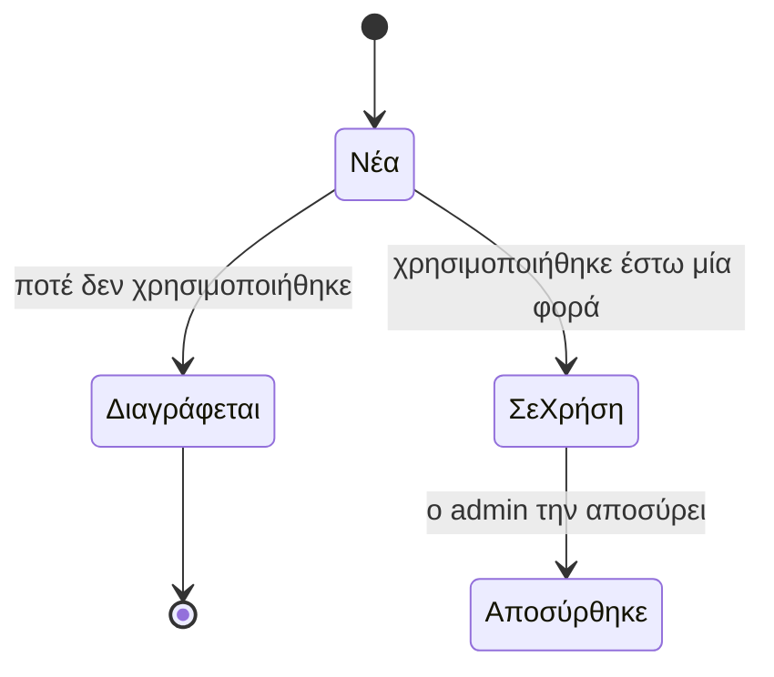

# Ρυθμίσεις και δυναμική ρύθμιση

> **👁️ Με μια ματιά**
> Ό,τι ορίζει πώς συμπεριφέρεται το σύστημα (λίστες, κανόνες, προεπιλογές) το αλλάζει ο admin ο ίδιος, την ώρα που το σύστημα τρέχει, χωρίς προγραμματιστή. Όλα ζουν σε **μία σελίδα Ρυθμίσεων** με ενότητες.
> Μια αλλαγή ισχύει **μόνο προς τα εμπρός**: ό,τι έχει ήδη γίνει (υπογεγραμμένοι όροι, κλεισμένα Γυρίσματα) δεν αλλάζει. Μια τιμή λίστας που έχει χρησιμοποιηθεί δεν σβήνεται, **αποσύρεται**.
> Μόνο ο Ιδιοκτήτης αλλάζει ό,τι μετακινεί χρήματα ή δικαιώματα: ΑΦΜ και ΔΟΥ, λογαριασμούς τραπέζης, ΦΠΑ, Ρόλους.
> Το σύστημα δεν ανοίγει σε πελάτες μέχρι να συμπληρωθούν τα «εκκρεμεί» του ελέγχου ετοιμότητας.

**Ποιος είναι ο «admin» σε αυτό το κεφάλαιο:** όποιος έχει το Δικαίωμα «Διαχειρίζεται Ρυθμίσεις». Αρχικά το έχει ο Ρόλος Διαχείριση και ο Ιδιοκτήτης, που έχει πάντα όλα τα Δικαιώματα.

## ⚙️ Τι είναι Ρύθμιση και τι όχι

| Είδος | Τι περιλαμβάνει | Παράδειγμα |
|---|---|---|
| **Λίστες** | Πηγή, Λόγος απώλειας, Στάδια, είδη Δραστηριότητας, είδη Παροχής, κατηγορίες Εξόδων | «Από πού ήρθε η Ευκαιρία;» |
| **Κανόνες** | Κανόνες γυρισμάτων, Κανόνες Παραδοτέων, Ωράριο κρατήσεων, Χωρητικότητα, Τρόπος μέτρησης | «Η κράτηση πελάτη θέλει έγκριση» |
| **Προεπιλογές** | Όροι Συμφωνίας, Ισχύς πρότασης, προθεσμίες, Όρια αλλαγών, Στοιχεία εταιρείας | «Η πρόταση ισχύει 14 μέρες» |

Ό,τι *έχει* η επιχείρηση δεν είναι Ρύθμιση, και μένει στο δικό του module: Κατάλογος, Εξοπλισμός, Αυτοματισμοί και Μηνύματα συστήματος, Γνώση, Ρόλοι, περιεχόμενο Ιστοσελίδας.

Η **ώρα** είναι πάντα ώρα Ελλάδας και δεν ρυθμίζεται.

## 📋 Τι αλλάζει ο admin, και πού ζει

Η σελίδα Ρυθμίσεων έχει έξι ενότητες: **Εταιρεία, Πωλήσεις, Συμφωνίες, Γυρίσματα, Παραδοτέα, Οικονομικά**. Κάθε module έχει συντόμευση «⚙» προς τη δική του ενότητα. Τη σελίδα τη βλέπει **μόνο όποιος μπορεί να την αλλάξει**· οι άλλοι βλέπουν τις τιμές εκεί όπου τις χρησιμοποιούν.

### Εταιρεία

| Ρύθμιση | Πού ζει | Ποιος την αλλάζει | Παράδειγμα |
|---|---|---|---|
| Επωνυμία, διακριτικός τίτλος, διεύθυνση, τηλέφωνο, email, λογότυπο | Ρυθμίσεις › Εταιρεία | admin | Νέο τηλέφωνο γραφείου στις νέες Συμφωνίες |
| Υπογράφων εταιρείας (όνομα και ιδιότητα) | Ρυθμίσεις › Εταιρεία | admin | Αλλάζει ο εκπρόσωπος που υπογράφει για την εταιρεία |
| ΑΦΜ, ΔΟΥ | Ρυθμίσεις › Εταιρεία | **Μόνο Ιδιοκτήτης** | Αλλαγή έδρας |
| Λογαριασμοί τραπέζης (ένας προεπιλεγμένος) | Ρυθμίσεις › Εταιρεία | **Μόνο Ιδιοκτήτης** | Νέος προεπιλεγμένος λογαριασμός |
| Συντελεστής ΦΠΑ (αρχικά 24%, αλλάζει ανά γραμμή Συμφωνίας) | Ρυθμίσεις › Εταιρεία | **Μόνο Ιδιοκτήτης** | Αλλαγή του γενικού ποσοστού |
| ΓΕΜΗ | Ρυθμίσεις › Εταιρεία | admin | |
| Βοηθός: όριο μηνυμάτων του δημόσιου widget ανά Συζήτηση και ανά διεύθυνση τη μέρα (αρχικά 15 και 40) | Ρυθμίσεις › Εταιρεία › Βοηθός | admin | Πολλοί Επισκέπτες φτάνουν το όριο πριν συμπληρώσουν τη φόρμα |
| Βοηθός: μηνιαίο πλαφόν δαπάνης AI (αρχικά 30 δολάρια) και μερίδιο του δημόσιου widget (αρχικά 80%) | Ρυθμίσεις › Εταιρεία › Βοηθός | **Μόνο Ιδιοκτήτης** | Ανεβαίνει το πλαφόν σε μήνα καμπάνιας |

### Πωλήσεις

| Ρύθμιση | Πού ζει | Ποιος την αλλάζει | Παράδειγμα |
|---|---|---|---|
| Νέες Ευκαιρίες από τη φόρμα πάνε σε | Ρυθμίσεις › Πωλήσεις | admin | Συγκεκριμένο πρόσωπο (αρχικά ο Ιδιοκτήτης) ή ουρά «Χωρίς υπεύθυνο» |
| Στάδια του pipeline | Ρυθμίσεις › Πωλήσεις | admin | Αρχικά: Νέα, Πρώτη επαφή, Συνάντηση, Πρόταση, Διαπραγμάτευση. Δεν περιλαμβάνουν το κερδισμένη ή χαμένη. |
| Πηγή | Ρυθμίσεις › Πωλήσεις | admin | Αρχικά: Ιστοσελίδα, Instagram, Facebook, Σύσταση, Τηλέφωνο, Άλλο |
| Λόγος απώλειας | Ρυθμίσεις › Πωλήσεις | admin | Αρχικά: Τιμή, Δεν απάντησε, Επέλεξε άλλον, Όχι τώρα, Εκτός αντικειμένου |
| Είδη Δραστηριότητας | Ρυθμίσεις › Πωλήσεις | admin | Αρχικά: Κλήση, Email, Συνάντηση, Σημείωση |
| Ισχύς πρότασης (μέρες) | Ρυθμίσεις › Πωλήσεις | admin, και ανά πρόταση | Από 14 σε 21 μέρες για τις νέες προτάσεις |

### Συμφωνίες

| Ρύθμιση | Πού ζει | Ποιος την αλλάζει | Παράδειγμα |
|---|---|---|---|
| **Όροι Συμφωνίας**, δύο σετ προεπιλογών (μηνιαίες και εφάπαξ): μέρες πληρωμής, αχρησιμοποίητες Παροχές, Περίοδος χάριτος, διάρκεια και Ανανέωση, ρήτρα λύσης, δόσεις σε ορόσημα (μόνο εφάπαξ) | Ρυθμίσεις › Συμφωνίες | admin | Μέρες πληρωμής 30 αντί για 15 |
| Πολιτική Γυρισμάτων του πελάτη μέσα στους Όρους: ελάχιστη προειδοποίηση, Όριο ακύρωσης, αν η αργή ακύρωση και το «δεν έγινε» καίνε Παροχή | Ρυθμίσεις › Συμφωνίες | admin, και ανά Συμφωνία | Όριο ακύρωσης 24 ώρες αντί για 48 |
| Όριο αλλαγών ανά είδος Παροχής | Ρυθμίσεις › Συμφωνίες | admin | reel: 1 γύρος · εταιρικό video: 3 |
| Προεπιλογές τιμολόγησης: προκαταβολή, τυπική έκπτωση πρώτων μηνών | Ρυθμίσεις › Συμφωνίες | admin | Η τυπική έκπτωση δεν είναι Παρέκκλιση· μεγαλύτερη είναι |
| Είδη Παροχής και μονάδες τους | Ρυθμίσεις › Συμφωνίες | admin | Γύρισμα, reel, φωτογραφία, επεισόδιο podcast |
| Τρόπος μέτρησης ανά είδος Παροχής και προεπιλεγμένη διάρκεια | Ρυθμίσεις › Συμφωνίες | admin | Το Γύρισμα μετρά «ανά ώρα» |
| Προθεσμία Παραδοτέου ανά είδος Παροχής | Ρυθμίσεις › Παραδοτέα | admin | reel: 5 εργάσιμες από το Γύρισμα |

Ο **Τρόπος μέτρησης** έχει τρεις σταθερές επιλογές: ανά Γύρισμα, ανά ώρα, ανά μέρα. Ό,τι ξεπερνά το όριο είναι έξτρα. Τα είδη, τα ονόματα και οι αριθμοί αλλάζουν ελεύθερα.

### Γυρίσματα

| Ρύθμιση | Πού ζει | Ποιος την αλλάζει | Παράδειγμα |
|---|---|---|---|
| **Κανόνες γυρισμάτων** (πίνακας παρακάτω) | Ρυθμίσεις › Γυρίσματα | admin | Η μετάθεση να μη θέλει νέα έγκριση |
| **Ωράριο κρατήσεων**: εβδομαδιαίο πρόγραμμα (ανοιχτές μέρες, ώρα ανοίγματος και κλεισίματος), εξαιρέσεις ανά μέρα, επιτρεπτές διάρκειες, βήμα ώρας έναρξης | Ρυθμίσεις › Γυρίσματα | admin | Κλειστό το Σάββατο, ανοιχτό 09:00–17:00 τις καθημερινές |
| **Χωρητικότητα**: πόσα Γυρίσματα γίνονται ταυτόχρονα, προεπιλογή και ανά μέρα | Ρυθμίσεις › Γυρίσματα | admin | 2 ταυτόχρονα, 1 την Παρασκευή |
| Αργίες: ανοίγει ως εξαίρεση μια αργία που το σύστημα κλείνει μόνο του | Ρυθμίσεις › Γυρίσματα | admin | Ανοιχτό Σάββατο του Πάσχα |
| Πρότυπα συνεργείου και εξοπλισμού | Γυρίσματα, Εξοπλισμός | Η ομάδα, με το Δικαίωμα του module | «Ο συνδυασμός του Νίκου και της Μαρίας» |
| Κανόνες ημερολογίου Google: τι γίνεται ένα νέο γεγονός από το Google (Κλεισμένος χρόνος ή τίποτα), προθεσμία επιβεβαίωσης διαγραφής (αρχικά 24 ώρες), αν γράφονται στο Google τα Γυρίσματα που αναμένουν έγκριση (αρχικά ναι) | Ρυθμίσεις › Γυρίσματα | admin | Προθεσμία 12 ώρες |

**Οι επιλογές των Κανόνων γυρισμάτων.** Ο admin διαλέγει ανάμεσα σε λίγες σταθερές επιλογές, δεν γράφει λογική.

| Κανόνας | Επιλογές | Αρχική τιμή |
|---|---|---|
| Η κράτηση πελάτη θέλει έγκριση | ναι · όχι | ναι |
| Αν δεν απαντήσει κανείς σε Χ ώρες | τίποτα · αυτόματη έγκριση · αυτόματη απόρριψη | τίποτα |
| Μέγιστος ορίζοντας κράτησης | αριθμός ημερών | 60 μέρες |
| Κράτηση εκτός Περιόδου | επιτρέπεται · όχι | μόνο μέσα στην Περίοδο |
| Η μετάθεση ξαναθέλει έγκριση | ναι · όχι | ναι |
| Σύγκρουση εξοπλισμού | προειδοποιεί · μπλοκάρει | προειδοποιεί |
| Ο πελάτης βλέπει τον εξοπλισμό | ναι · όχι | όχι |
| Δελτίο γυρίσματος: αποστολή, επιβεβαίωση, μηδενισμός επιβεβαιώσεων σε αλλαγή | με το χέρι ή αυτόματα · επιβεβαίωση ανά μέλος | με το χέρι, ανά μέλος, μηδενίζεται |
| Το «έγινε» μπαίνει | με το χέρι · αυτόματα στη λήξη | με το χέρι, με τις πραγματικές ώρες |

### Παραδοτέα

| Ρύθμιση | Πού ζει | Ποιος την αλλάζει | Παράδειγμα |
|---|---|---|---|
| **Κανόνες Παραδοτέων**: εσωτερικός έλεγχος πριν φτάσει η Έκδοση στον πελάτη (αρχικά ναι) | Ρυθμίσεις › Παραδοτέα | admin | Χωρίς εσωτερικό έλεγχο για τα reels |
| Νέα προθεσμία της ομάδας μετά από «χρειάζεται αλλαγές», σε εργάσιμες | Ρυθμίσεις › Παραδοτέα | admin | 2 εργάσιμες |
| Προθεσμία Παραδοτέου ανά είδος Παροχής (πάνω) | Ρυθμίσεις › Παραδοτέα | admin | |

Οι υπενθυμίσεις στον πελάτη (στις 3 και 7 μέρες αναμονής) δεν είναι Ρύθμιση. Είναι Αυτοματισμοί (βλ. κεφάλαιο Ειδοποιήσεις).

### Οικονομικά

| Ρύθμιση | Πού ζει | Ποιος την αλλάζει | Παράδειγμα |
|---|---|---|---|
| Κατηγορίες Εξόδων, Έξοδα και ανάλυση σε υπο-γραμμές | Ρυθμίσεις › Οικονομικά | Όποιος «Διαχειρίζεται κόστος» | Νέα κατηγορία «Συνδρομές λογισμικού» |
| Αναμενόμενες παραγωγικές ώρες του μήνα | Ρυθμίσεις › Οικονομικά | Όποιος «Διαχειρίζεται κόστος» | 320 ώρες αντί για 352 |
| Πολλαπλασιαστές του Εύρους τιμής (ελάχιστη, στόχος, μέγιστη) | Ρυθμίσεις › Οικονομικά | Όποιος «Διαχειρίζεται κόστος» | 1,3 / 1,6 / 2,0 |
| Όριο υπέρβασης κόστους | Ρυθμίσεις › Οικονομικά | Όποιος «Διαχειρίζεται κόστος» | +20% πάνω από την εκτίμηση |
| Εκτιμώμενες ώρες Καταλόγου και γραμμής Συμφωνίας | Κατάλογος και Συμφωνία | Όποιος «Διαχειρίζεται κόστος» | Το Πακέτο «βασικό» θέλει 6 ώρες γυρίσματος και 10 μοντάζ |
| Προεπιλεγμένο περιθώριο (τιμή-στόχος) | Ρυθμίσεις › Οικονομικά | admin | Στόχος 35% |
| Τρόποι είσπραξης (λίστα· όσοι χρησιμοποιήθηκαν αποσύρονται) | Ρυθμίσεις › Οικονομικά | «Διαχειρίζεται Ρυθμίσεις» | Νέος τρόπος «IRIS» |

Το «Διαχειρίζεται κόστος» είναι χωριστό Δικαίωμα από το «Διαχειρίζεται Ρυθμίσεις», γιατί τα έξοδα περιέχουν μισθούς. Αρχικά το έχει μόνο ο Ιδιοκτήτης, που μπορεί να το δώσει σε έναν Ρόλο. Όποιος δεν το έχει, βλέπει τη γραμμή με τις ώρες του Καταλόγου.
Το **ελάχιστο περιθώριο** δεν έχει δική του ρύθμιση: βγαίνει από τον ελάχιστο πολλαπλασιαστή.

### Ό,τι αλλάζει ο admin χωρίς προγραμματιστή, αλλά όχι από τη σελίδα Ρυθμίσεων

| Τι | Πού ζει | Ποιος | Παράδειγμα |
|---|---|---|---|
| Πακέτα και Υπηρεσίες, τιμές, σήμανση «δημόσιο» | Κατάλογος | Δικαίωμα Διαχειρίζεται Κατάλογο | Νέο μηνιαίο Πακέτο |
| Εξοπλισμός και Κατηγορίες εξοπλισμού | Εξοπλισμός | Δικαίωμα Διαχειρίζεται απόθεμα | Νέο drone στο μητρώο |
| Αυτοματισμοί και Μηνύματα συστήματος | Αυτοματισμοί | Δικαίωμα Διαχειρίζεται Αυτοματισμούς | Δεύτερη υπενθύμιση γυρίσματος |
| Ενότητες, Κοινό, Άρθρα και Αρχεία της Γνώσης | Γνώση | Δικαίωμα Διαχειρίζεται Γνώση | Νέο Άρθρο μόνο για την Παραγωγή |
| Όρια μηνυμάτων του δημόσιου Βοηθού, ανά Συζήτηση και ανά διεύθυνση σύνδεσης | Ο Βοηθός | admin | |
| Τομείς, Δουλειές, case studies, λογότυπα πελατών, Ομάδα στην Ιστοσελίδα | Ιστοσελίδα | Δικαίωμα Ιστοσελίδα: Διαχειρίζεται | Νέα Δουλειά με Συναίνεση δημοσίευσης |
| Ρόλοι (πακέτα Δικαιωμάτων) | Ομάδα και Πρόσβαση | **Μόνο Ιδιοκτήτης** | Νέος Ρόλος «Μοντέρ» |

### Τι δεν αλλάζει χωρίς προγραμματιστή

- ο κατάλογος των Γεγονότων και των Δικαιωμάτων,
- οι καταστάσεις του Γυρίσματος, του Παραδοτέου, της Έκδοσης και του Αιτήματος, και η Έκβαση της Ευκαιρίας,
- οι τρεις Τρόποι μέτρησης και οι επιλογές κάθε κανόνα,
- τα είδη του Αιτήματος (νέο Παραδοτέο, Γύρισμα, αλλαγή μετά την έγκριση, άλλο),
- το μοντέλο AI του Βοηθού (το αλλάζει ο προγραμματιστής, γιατί είναι απόφαση ποιότητας που θέλει δοκιμή),
- οι κανόνες του ημερολογίου που προστατεύουν τα δεδομένα (π.χ. ένα νέο γεγονός από το Google δεν γίνεται ποτέ Γύρισμα).

## 🔄 Οι αλλαγές ισχύουν μόνο προς τα εμπρός

| Είδος ρύθμισης | Πότε ισχύει η αλλαγή | Παράδειγμα |
|---|---|---|
| **Προεπιλογή** | Αντιγράφεται όταν δημιουργείται ένα στοιχείο. Ό,τι υπάρχει ήδη κρατά την παλιά τιμή. | Νέα προεπιλογή Ορίου ακύρωσης: μόνο οι νέες Συμφωνίες. Οι υπογεγραμμένες μένουν. |
| **Κανόνας** | Ελέγχεται στην επόμενη ενέργεια. | Νέο Ωράριο: ισχύει στην επόμενη κράτηση. Όσα έχουν κλειστεί δεν αλλάζουν. |
| **Κόστος ώρας** | Από τον τρέχοντα μήνα και μετά. Οι κλεισμένοι μήνες δεν αλλάζουν. | Μια αύξηση μισθού δεν αλλάζει την κερδοφορία του περασμένου Μαρτίου. |

**Γιατί:** μια αναδρομική αλλαγή θα άλλαζε υπογεγραμμένους όρους και κλεισμένα Γυρίσματα χωρίς να το ξέρει ο πελάτης.

## 🗃️ Απόσυρση αντί για διαγραφή

| Κατάσταση | Τι σημαίνει | Πώς βγαίνει |
|---|---|---|
| **Νέα** | Μόλις προστέθηκε στη λίστα, δεν έχει χρησιμοποιηθεί. | Διαγράφεται ελεύθερα, ή χρησιμοποιείται. |
| **Σε χρήση** | Έχει χρησιμοποιηθεί έστω μία φορά και φαίνεται στις νέες επιλογές. | Αποσύρεται. |
| **Αποσύρθηκε** | Φεύγει από τις νέες επιλογές, αλλά μένει στα παλιά στοιχεία και μετριέται στις αναφορές. | Δεν ξαναμπαίνει αυτόματα. Ο admin την ξαναπροσθέτει με το χέρι. |

- Η **μετονομασία** περνά παντού.
- Μια αναφορά όπως «από πού ήρθαν οι πελάτες πέρσι» μετρά και τις αποσυρμένες τιμές.
- **Ειδική περίπτωση, τα Στάδια:** ένα Στάδιο αποσύρεται μόνο αφού οι ανοιχτές Ευκαιρίες του μεταφερθούν σε άλλο, γιατί μια ανοιχτή Ευκαιρία δεν μπορεί να μένει σε Στάδιο που δεν υπάρχει.
- Κάθε λίστα έχει σειρά και ετικέτα ανά γλώσσα.

## 🌐 Γλώσσα και ιστορικό

- Οι τιμές που φτάνουν σε **πελάτη ή στο κοινό** έχουν υποχρεωτικά ελληνικά και αγγλικά. Οι εσωτερικές λίστες έχουν μόνο ελληνικά.
- **Ιστορικό:** κάθε αλλαγή γράφεται στο ίχνος ενεργειών, με ποιος, πότε και πριν → μετά. Δεν υπάρχουν εκδόσεις Ρυθμίσεων ούτε κουμπί επαναφοράς. Αν χρειαστεί η παλιά τιμή, ξαναμπαίνει με το χέρι, και το ίχνος λέει ποια ήταν.
- **Αργίες:** οι επίσημες ελληνικές αργίες κλείνουν αυτόματα το Ωράριο κρατήσεων, εκτός αν ο admin ανοίξει κάποια. Δεν μετράνε ως εργάσιμες στις προθεσμίες των Παραδοτέων.

## 🔐 Ό,τι αλλάζει μόνο ο Ιδιοκτήτης

| Τι | Γιατί μόνο ο Ιδιοκτήτης |
|---|---|
| ΑΦΜ και ΔΟΥ | Είναι φορολογικά στοιχεία, και εμφανίζονται στις Συμφωνίες και στην Καρτέλα Πελάτη. |
| Λογαριασμοί τραπέζης | Μια αλλαγή IBAN στέλνει τα χρήματα αλλού. |
| Συντελεστής ΦΠΑ | Είναι φορολογικό στοιχείο. |
| Ρόλοι (νέοι ή αλλαγές στα Δικαιώματά τους) | Ορίζουν ποιος βλέπει τι. |
| Πλαφόν δαπάνης AI και μερίδιο του δημόσιου widget | Είναι χρήματα που φεύγουν κάθε μήνα. |
| Συνδρομές και ενσωματώσεις | Κοστίζουν και συνδέουν εξωτερικούς παρόχους (βλ. κεφάλαιο Ενσωματώσεις). |

Όλα τα υπόλοιπα της σελίδας Ρυθμίσεων τα αλλάζει όποιος έχει το «Διαχειρίζεται Ρυθμίσεις». Ένα Δικαίωμα ανά ενότητα θα φούσκωνε τον κατάλογο χωρίς διαφορετικό ρίσκο, γι' αυτό υπάρχει ένα μόνο, με δύο εξαιρέσεις: τα στοιχεία πληρωμής (Ιδιοκτήτης) και το κόστος («Διαχειρίζεται κόστος»).

## ✅ Έλεγχος ετοιμότητας (πρώτο στήσιμο)

Το σύστημα ξεκινά με **προτεινόμενες τιμές**. Ό,τι δεν μπορεί να έχει προεπιλογή εμφανίζεται ως **«εκκρεμεί»**. Μέχρι να συμπληρωθούν, το σύστημα δεν ανοίγει σε πελάτες. Πριν την ημέρα αλλαγής ο έλεγχος πρέπει να βγαίνει **χωρίς κανένα «εκκρεμεί»**.

| ☐ | Τι | Ποιος το συμπληρώνει | Γιατί δεν έχει προεπιλογή |
|---|---|---|---|
| ☐ | Στοιχεία εταιρείας: επωνυμία, ΑΦΜ, ΔΟΥ, ΓΕΜΗ, διεύθυνση, τηλέφωνο, email, λογότυπο, Υπογράφων εταιρείας | Ιδιοκτήτης (ΑΦΜ, ΔΟΥ) · admin (τα υπόλοιπα) | Είναι η ταυτότητα της εταιρείας |
| ☐ | Λογαριασμοί τραπέζης, με έναν προεπιλεγμένο | Ιδιοκτήτης | Εμφανίζονται στις εντολές πληρωμής |
| ☐ | Ωράριο κρατήσεων | admin | Εξαρτάται από το πρόγραμμα της ομάδας |
| ☐ | Νομικά κείμενα: Πολιτική απορρήτου (με τη λίστα των παρόχων), cookies, Όροι χρήσης, όροι υπογραφής | Σχέδιο από την ομάδα ανάπτυξης, έγκριση από την εταιρεία, έλεγχος από δικηγόρο | Θέλουν έλεγχο από δικηγόρο |
| ☐ | Κατάλογος: Πακέτα, Υπηρεσίες, τιμές | admin | Οι τιμές είναι εμπορική απόφαση |
| ☐ | Έξοδα και ώρες: ο πρώτος μήνας Κόστους ώρας | Όποιος «Διαχειρίζεται κόστος» | Τα έξοδα του παλιού συστήματος γίνονται ο πρώτος μήνας· μένουν «εκκρεμεί» μέχρι να ελεγχθούν |
| ☐ | Άρθρα Γνώσης | Όποιος διαχειρίζεται τη Γνώση | Γράφονται από την ομάδα |
| ☐ | Τελικές τιμές ταυτότητας (χρώματα, γραμματοσειρές) | Η εταιρεία, μετά το πρωτότυπο των οθονών | Κλειδώνουν στο πρωτότυπο |

**Τιμές που έρχονται έτοιμες και απλώς ελέγχονται:** Στάδια, Πηγές, οι αρχικές τιμές των Κανόνων γυρισμάτων και Παραδοτέων, ΦΠΑ 24%, οι δύο προεπιλογές Όρων, οι αρχικοί Αυτοματισμοί.

## ⚠️ Εξαιρέσεις

| Τι συμβαίνει | Τι γίνεται |
|---|---|
| Ο admin αλλάζει μια ρύθμιση που αφορά υπάρχοντα στοιχεία | Πριν την αποθήκευση φαίνεται πόσα στοιχεία αφορά. Αλλάζουν μόνο τα νέα. |
| Ο admin προσπαθεί να σβήσει τιμή που χρησιμοποιήθηκε | Δεν σβήνεται, αποσύρεται. |
| Ο admin προσπαθεί να αποσύρει Στάδιο με ανοιχτές Ευκαιρίες | Πρώτα μεταφέρονται οι Ευκαιρίες σε άλλο Στάδιο. |
| Κάποιος άλλος εκτός του Ιδιοκτήτη προσπαθεί να αλλάξει IBAN, ΑΦΜ ή ΦΠΑ | Δεν επιτρέπεται, ούτε στην οθόνη ούτε στα δεδομένα. |
| Λάθος αλλαγή που πρέπει να αναιρεθεί | Δεν υπάρχει επαναφορά. Η παλιά τιμή ξαναμπαίνει με το χέρι, και το ίχνος ενεργειών λέει ποια ήταν. |
| Ένα στοιχείο δίγλωσσο λείπει στα αγγλικά | Για τιμές που φτάνουν σε πελάτη ή στο κοινό, η αποθήκευση απαιτεί και τις δύο γλώσσες. |

## 🔗 Πού ακουμπά άλλες ροές

| Ροή | Σύνδεση |
|---|---|
| Πωλήσεις | Πού πάνε οι νέες Ευκαιρίες, Στάδια, Πηγές, Λόγοι απώλειας, Είδη Δραστηριότητας, Ισχύς πρότασης |
| Κατάλογος, Συμφωνία και κόστος | Όροι, Παροχές, Εύρος τιμής, έξοδα |
| Γυρίσματα και ημερολόγιο | Κανόνες γυρισμάτων, Ωράριο, Χωρητικότητα, αργίες |
| Παραδοτέα | Κανόνες Παραδοτέων, προθεσμίες, Όρια αλλαγών |
| Ειδοποιήσεις και Αυτοματισμοί | Ό,τι αφορά μηνύματα δεν είναι Ρύθμιση, ζει στους Αυτοματισμούς |
| Ενσωματώσεις | Συνδρομές και ενσωματώσεις: μόνο Ιδιοκτήτης |

## 📖 Σενάρια

**1. Η Ισχύς πρότασης.** Ο admin αλλάζει την προεπιλεγμένη Ισχύ πρότασης από 14 σε 21 μέρες. Πριν την αποθήκευση το σύστημα λέει «επηρεάζονται 3 ανοιχτές προτάσεις, δεν αλλάζουν». Οι τρεις ανοιχτές προτάσεις, ανάμεσά τους και του «Καφέ Αθηνά», μένουν με 14 μέρες. Η επόμενη πρόταση ξεκινά με 21.

**2. Η Πηγή που αποσύρθηκε.** Η Πηγή «Instagram» έχει χρησιμοποιηθεί σε 40 Ευκαιρίες. Η εταιρεία τη μετονομάζει σε «Instagram και Facebook» και η αλλαγή φαίνεται παντού. Αργότερα την αποσύρει: δεν εμφανίζεται πια στις νέες Ευκαιρίες, αλλά η αναφορά «από πού ήρθαν οι πελάτες πέρσι» εξακολουθεί να τις μετρά. Μια Πηγή που προστέθηκε κατά λάθος και δεν χρησιμοποιήθηκε ποτέ σβήνεται κανονικά.

**3. Το Όριο ακύρωσης.** Η εταιρεία αλλάζει την προεπιλογή του Ορίου ακύρωσης από 48 σε 24 ώρες. Η Συμφωνία του «Γυμναστήριο Κίνηση», που έχει ήδη υπογραφεί, κρατά τις 48 ώρες. Η επόμενη Συμφωνία παίρνει 24. Αν κάποιο μέλος της εταιρείας δώσει σε νέα πρόταση πιο χαλαρούς όρους από την προεπιλογή, αυτό είναι Παρέκκλιση.

**4. Η αλλαγή IBAN.** Ο λογιστής του «Ζαχαροπλαστείο Μέλι» έχει νέο λογαριασμό και ζητά να αλλάξουν τα στοιχεία πληρωμής. Η Διαχείριση δεν μπορεί να το κάνει. Το κάνει ο Ιδιοκτήτης, και το ίχνος ενεργειών γράφει ποιος, πότε και από ποιον λογαριασμό σε ποιον.

**5. Το Στάδιο που φεύγει.** Η εταιρεία θέλει να αποσύρει το Στάδιο «Διαπραγμάτευση». Έχει 5 ανοιχτές Ευκαιρίες. Το σύστημα ζητά πρώτα να μεταφερθούν και οι 5 σε άλλο Στάδιο, π.χ. «Πρόταση στάλθηκε». Μετά το Στάδιο αποσύρεται.

✅ Κανόνες που θα ελέγχονται

- **Δεδομένου ότι** ο admin αλλάζει μια προεπιλογή, **όταν** δημιουργείται νέο στοιχείο (π.χ. Συμφωνία), **τότε** παίρνει τη νέα τιμή, ενώ τα υπάρχοντα στοιχεία κρατούν την παλιά.
- **Δεδομένου ότι** ο admin αλλάζει έναν κανόνα, **όταν** γίνει η επόμενη ενέργεια, **τότε** ελέγχεται με τον νέο κανόνα και ό,τι έγινε πριν δεν αλλάζει.
- **Δεδομένου ότι** μια αλλαγή αφορά υπάρχοντα στοιχεία, **όταν** ο admin πάει να την αποθηκεύσει, **τότε** το σύστημα δείχνει πόσα στοιχεία αφορά και ότι δεν θα αλλάξουν.
- **Δεδομένου ότι** μια τιμή λίστας έχει χρησιμοποιηθεί έστω μία φορά, **όταν** ο admin την αφαιρεί, **τότε** αποσύρεται και δεν σβήνεται, και μένει στα παλιά στοιχεία και στις αναφορές.
- **Δεδομένου ότι** μια τιμή λίστας δεν χρησιμοποιήθηκε ποτέ, **όταν** ο admin την αφαιρεί, **τότε** σβήνεται.
- **Δεδομένου ότι** ένα Στάδιο έχει ανοιχτές Ευκαιρίες, **όταν** ο admin πάει να το αποσύρει, **τότε** πρώτα πρέπει να μεταφερθούν οι Ευκαιρίες σε άλλο Στάδιο.
- **Δεδομένου ότι** μια τιμή μετονομάζεται, **όταν** την κοιτάμε σε παλιά στοιχεία και αναφορές, **τότε** φαίνεται με το νέο όνομα παντού.
- **Δεδομένου ότι** ένας Χρήστης δεν είναι Ιδιοκτήτης, **όταν** προσπαθεί να αλλάξει ΑΦΜ, ΔΟΥ, λογαριασμούς τραπέζης ή ΦΠΑ, **τότε** η αλλαγή απορρίπτεται, ακόμα κι αν η οθόνη τον αφήσει να τη δοκιμάσει.
- **Δεδομένου ότι** ένας Χρήστης δεν έχει το Δικαίωμα αλλαγής Ρυθμίσεων, **όταν** ανοίγει το σύστημα, **τότε** δεν βλέπει τη σελίδα Ρυθμίσεων, αλλά βλέπει τις τιμές εκεί όπου χρησιμοποιούνται.
- **Δεδομένου ότι** μια τιμή φτάνει σε πελάτη ή στο κοινό, **όταν** αποθηκεύεται, **τότε** έχει ελληνικά και αγγλικά.
- **Δεδομένου ότι** γίνεται οποιαδήποτε αλλαγή Ρύθμισης, **όταν** αποθηκεύεται, **τότε** γράφεται στο ίχνος ενεργειών ποιος, πότε και πριν → μετά.
- **Δεδομένου ότι** υπάρχει έστω ένα «εκκρεμεί» στον έλεγχο ετοιμότητας, **όταν** πάμε να ανοίξουμε το σύστημα σε πελάτες, **τότε** δεν ανοίγει.

## ❓ Ανοιχτά ερωτήματα

1. **ΓΕΜΗ:** οι πηγές λένε ότι «τα φορολογικά στοιχεία» τα αλλάζει μόνο ο Ιδιοκτήτης και ονομάζουν ρητά ΑΦΜ και ΔΟΥ. Δεν ορίζεται αν το ΓΕΜΗ είναι κι αυτό μόνο για τον Ιδιοκτήτη.
2. **«Admin» και «Διαχείριση»:** η απόφαση για το κόστος μιλά για προεπιλογή «μόνο στον ρόλο Admin». Στο μοντέλο Ρόλων δεν υπάρχει βαθμίδα Admin, μόνο ο έτοιμος Ρόλος Διαχείριση. Το γράψαμε ως Διαχείριση και Ιδιοκτήτης.
3. **Πού ζουν μερικές ρυθμίσεις:** οι ρυθμίσεις του ημερολογίου Google (νέο γεγονός, προθεσμία διαγραφής, Γυρίσματα που αναμένουν έγκριση) και τα όρια μηνυμάτων του δημόσιου Βοηθού ορίζονται ως «ρυθμίσεις του admin», αλλά δεν έχουν ενότητα ούτε Δικαίωμα. Το ίδιο ισχύει για τη διεύθυνση απάντησης των emails (ζει στους Αυτοματισμούς ή στα Στοιχεία εταιρείας;). *Τα όρια του Βοηθού κλείστηκαν με το ticket [Γνώση και Βοηθός](https://github.com/ntontischris/dmsfinal/issues/82): Ρυθμίσεις › Εταιρεία › Βοηθός· τα όρια μηνυμάτων με «Διαχειρίζεται Ρυθμίσεις», το πλαφόν και το μερίδιο του widget μόνο ο Ιδιοκτήτης.*
*Το #4 (αρχικά είδη Παροχής) και το #5 κλείστηκαν με το ticket [Κατάλογος και Τιμολόγηση](https://github.com/ntontischris/dmsfinal/issues/61): τα πέντε αρχικά είδη Παροχής είναι Γύρισμα (ανά Γύρισμα, έως 4 ώρες), reel, βίντεο, φωτογραφία, επεισόδιο podcast· δύο γλώσσες θέλουν μόνο ό,τι βλέπει πελάτης ή Επισκέπτης, δηλαδή το όνομα και η σύντομη περιγραφή των δημόσιων Πακέτων και τα είδη Παροχής. Η εσωτερική περιγραφή και οι Υπηρεσίες γράφονται μόνο στα ελληνικά. Οι αρχικές λίστες Πωλήσεων ορίστηκαν στο ticket [Πελάτες και Πωλήσεις](https://github.com/ntontischris/dmsfinal/issues/59).*

6. **Ο έλεγχος ετοιμότητας:** δεν ορίζεται αν είναι οθόνη μέσα στο σύστημα ή λίστα ελέγχου στο σχέδιο στησίματος, ούτε τι ακριβώς εμποδίζει το «δεν ανοίγει σε πελάτες» (π.χ. προσκλήσεις, σύνδεσμοι).
7. **Ενότητα κάθε ρύθμισης:** η τοποθέτηση κάθε ρύθμισης σε ενότητα (π.χ. Όριο αλλαγών στις Συμφωνίες, προθεσμία Παραδοτέου στα Παραδοτέα) είναι δική μας επιλογή. Οι πηγές ορίζουν μόνο τις ενότητες.
8. **Αρχικά κείμενα και διεύθυνση απάντησης:** χρειάζονται από την πρώτη μέρα, αλλά δεν είναι στη λίστα των «εκκρεμεί».
9. **Ρυθμίσεις που εφαρμόστηκε ο γενικός κανόνας:** για το ΓΕΜΗ, τους κανόνες του ημερολογίου Google (στην ενότητα Γυρίσματα) και τα όρια μηνυμάτων του δημόσιου Βοηθού, στο κεφάλαιο γράφεται «admin», δηλαδή όποιος έχει το «Διαχειρίζεται Ρυθμίσεις». Δεν έχει οριστεί ρητά ούτε η ενότητα ούτε το Δικαίωμα για κάθε μία. Το ΓΕΜΗ μπορεί να χρειάζεται μόνο τον Ιδιοκτήτη, όπως το ΑΦΜ και η ΔΟΥ.

Πηγές

- ADR 0015: Οι Ρυθμίσεις ζουν σε ένα μέρος, ισχύουν μόνο προς τα εμπρός, οι τιμές σε χρήση αποσύρονται
- ADR 0001: Ρόλοι και Ιδιοκτήτης (ρόλοι, συνδρομές, ενσωματώσεις μόνο Ιδιοκτήτης)
- ADR 0005: ρυθμίσεις ημερολογίου Google
- ADR 0006: Αυτοματισμοί και αργίες
- ADR 0008: Όροι Συμφωνίας ως προεπιλογές, ΦΠΑ
- ADR 0010: Κανόνες γυρισμάτων, Ωράριο, Χωρητικότητα, αρχικές τιμές
- ADR 0011: Κανόνες Παραδοτέων, Όριο αλλαγών, προθεσμίες
- ADR 0013: περιεχόμενο Ιστοσελίδας
- ADR 0014: όρια Βοηθού και Γνώση
- ADR 0017: κόστος, έξοδα, πολλαπλασιαστές, Δικαίωμα «Διαχειρίζεται κόστος»
- ADR 0018: ίχνος ενεργειών, αρχικές τιμές στο seed
- Issue #37: Ρυθμίσεις
- Issue #16: Δικαιώματα και «μόνο Ιδιοκτήτης»
- docs/setup-and-cutover.md: αρχικό περιεχόμενο και «εκκρεμεί»
- CONTEXT.md, ενότητα «Ρυθμίσεις»

