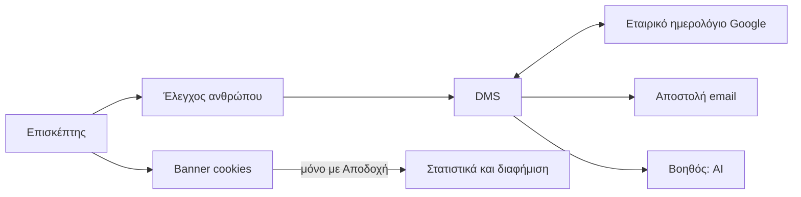

# Ενσωματώσεις

> **👁️ Με μια ματιά**
> Το σύστημα μιλά με εξωτερικά εργαλεία σε **πέντε σημεία**: το Εταιρικό ημερολόγιο της Google, την αποστολή email, το AI του Βοηθού, τα στατιστικά και τη διαφήμιση του site (μόνο με συναίνεση) και την προστασία των δημόσιων φορμών από κατάχρηση.
> Η σύνδεση με το Google και με το AI γίνεται χωρίς κλειδιά που μπορούν να χαθούν ή να μείνουν ανοιχτά για πάντα. Όλα τα email φεύγουν από **έναν** δρόμο. Κάθε κλήση AI περνά από **μία** πύλη, με μηνιαίο πλαφόν.
> Το email της εταιρείας δεν επηρεάζεται: τα αυτόματα μηνύματα φεύγουν από δική τους διεύθυνση, σε ξεχωριστό υποτομέα.
> Αν ένα εργαλείο πέσει, το υπόλοιπο DMS συνεχίζει, και το πρόβλημα φαίνεται στην Υγεία συστήματος.

## 👥 Ποιος αλλάζει τι

| Τι | Ποιος |
|---|---|
| Ποιος πάροχος και ποιος τρόπος σύνδεσης, και οι συνδρομές (π.χ. αναβάθμιση πλάνου email) | **Μόνο ο Ιδιοκτήτης** |
| Το κείμενο των emails και οι Αυτοματισμοί | Όποιος διαχειρίζεται Αυτοματισμούς |
| Το μοντέλο AI του Βοηθού | Ο προγραμματιστής, όχι ο admin |
| Η επεξεργασία του Εταιρικού ημερολογίου μέσα στο Google | Όσοι έχουν το Δικαίωμα «Αμφίδρομο ημερολόγιο Google» (αρχικά ο Ιδιοκτήτης και η Διαχείριση) |

Σημείωση για τα κόστη: οι τιμές παρακάτω είναι οι **δημοσιευμένες τιμές των παρόχων**, όπως καταγράφηκαν στην έρευνα. Δεν είναι τιμές ή κόστη της Devre Media.

## 📅 Google Calendar

| | |
|---|---|
| **Τι κάνει για την εταιρεία** | Το Εταιρικό ημερολόγιο (το ένα κοινό ημερολόγιο Google) δείχνει στο κινητό και στον υπολογιστή όλα τα Γυρίσματα και τον Κλεισμένο χρόνο της ομάδας. Όσοι έχουν το Δικαίωμα το επεξεργάζονται και στο Google. Οι υπόλοιποι παίρνουν Σύνδεσμο ημερολογίου μόνο για ανάγνωση. |
| **Τι δεδομένα περνούν** | **Προς το Google:** όλα τα Γυρίσματα (και όσα αναμένουν έγκριση, με σήμανση) και ο Κλεισμένος χρόνος της ομάδας. Δεν γράφονται προθεσμίες Παραδοτέων. Το Συνεργείο δεν προσκαλείται στο Google. **Από το Google:** αλλαγές στο Εταιρικό ημερολόγιο, και ποιοι είναι προσκεκλημένοι σε κάθε γεγονός. |
| **Κόστος περίπου** | Το Google δίνει δωρεάν 1.000.000 αιτήματα την ημέρα, και η εταιρεία είχε ήδη Google Workspace. Το Google έχει αναγγείλει χρεώσεις για υπέρβαση, αργότερα μέσα στο 2026. Δεν υπάρχει άλλη χρέωση για τη σύνδεση στις πηγές. |
| **Αν πέσει** | Το DMS μένει η πηγή αλήθειας: το Google είναι απλώς όψη. Αν χαθεί μια ειδοποίηση αλλαγής από το Google, ένας έλεγχος κάθε 15 λεπτά τη βρίσκει. Οι αλλαγές του DMS που δεν γράφτηκαν μπαίνουν σε ουρά και γράφονται με τη σειρά μόλις επανέλθει· σε σύγκρουση κρατιέται η αλλαγή του DMS. Αν ο συγχρονισμός μείνει κάτω πάνω από 1 ώρα, η Υγεία συστήματος κοκκινίζει και ο admin παίρνει Ειδοποίηση. |

**Πώς συνδέεται, χωρίς να εξαρτάται από άνθρωπο**
- Το σύστημα συνδέεται με έναν **λογαριασμό-ρομπότ** (όχι με λογαριασμό υπαλλήλου). Το Εταιρικό ημερολόγιο μοιράζεται σε αυτόν με δικαίωμα αλλαγών. Δεν έχει πρόσβαση στα προσωπικά ημερολόγια κανενός.
- Δεν υπάρχει κλειδί που να μένει ανοιχτό για πάντα: η σύνδεση πιστοποιείται από το σύστημα φιλοξενίας. Αν ένας συνεργάτης φύγει ή ανακαλέσει την πρόσβασή του, ο συγχρονισμός συνεχίζει.
- Το Google ειδοποιεί το σύστημα για κάθε αλλαγή. Αυτή η ειδοποίηση λήγει κάθε λίγες μέρες και ανανεώνεται αυτόματα. Ανεξάρτητα, ένας έλεγχος κάθε 15 λεπτά κάνει την ίδια δουλειά. Αν το Google πει ότι ο συγχρονισμός χάθηκε, γίνεται πλήρης επανασυγχρονισμός.
- Το σύστημα **δεν στέλνει προσκλήσεις** μέσα από το Google.

**Οι κανόνες που κρατά το σύστημα απέναντι στο Google**

| Τι γίνεται στο Google | Τι κάνει το DMS |
|---|---|
| Νέο γεγονός | Γίνεται Κλεισμένος χρόνος για τα προσκεκλημένα μέλη της ομάδας, ή για όποιον το δημιούργησε αν δεν έχει προσκεκλημένους. Δεν γίνεται ποτέ Γύρισμα. |
| Μετακίνηση Γυρίσματος | Περνά αν το Συνεργείο είναι ελεύθερο και η νέα ώρα πέφτει στην ίδια Περίοδο. Αλλιώς το DMS επαναφέρει την ώρα στο Google και ειδοποιεί με τον λόγο. |
| Διαγραφή Γυρίσματος | Δεν το ακυρώνει. Το DMS ζητά επιβεβαίωση με λόγο· αν δεν έρθει μέσα στην προθεσμία (αρχικά 24 ώρες), το γεγονός ξαναμπαίνει στο Google. |
| Μετακίνηση ή διαγραφή Κλεισμένου χρόνου | Επιτρέπεται ελεύθερα. |

## ✉️ Email

| | |
|---|---|
| **Τι κάνει για την εταιρεία** | Στέλνει όλα τα αυτόματα emails: Αυτοματισμούς, Μηνύματα συστήματος (πρόσκληση, είσοδος, επαναφορά κωδικού, κωδικός υπογραφής, Σύνδεσμος πρότασης). Κάθε email γράφεται στο Ιστορικό αποστολών. |
| **Τι δεδομένα περνούν** | Η διεύθυνση και το όνομα του παραλήπτη, το κείμενο του μηνύματος και τα συνημμένα PDF (π.χ. Συμφωνία, Τιμολόγιο). Η υπηρεσία αποστολής κρατά τον λογαριασμό και τα αρχεία καταγραφής στις ΗΠΑ, με τυπικές συμβατικές ρήτρες. |
| **Κόστος περίπου** | Αρχικά το δωρεάν πλάνο: έως 3.000 emails τον μήνα και όριο 100 την ημέρα. Η επί πληρωμή εκδοχή κοστίζει περίπου 20 δολάρια τον μήνα για 50.000 emails. Η εταιρεία περνά σε αυτήν όταν οι αποστολές πλησιάσουν τις ~70 την ημέρα. |
| **Αν πέσει** | Ένα email που δεν φεύγει (και λόγω ορίου) γράφεται «απέτυχε» στο Ιστορικό, ξαναδοκιμάζεται με καθυστέρηση, και αν δεν περάσει ειδοποιείται ο admin. Επειδή όλα τα emails περνούν από έναν δρόμο, αν ο δρόμος πέσει δεν φεύγει κανένα, ούτε οι προσκλήσεις και οι σύνδεσμοι εισόδου. Η είσοδος με κωδικό ή με Google δεν εξαρτάται από email. |

**Πώς φεύγουν**
- Κάθε email φεύγει από ένα ενιαίο σημείο αποστολής. Η υπηρεσία ταυτοποίησης του συστήματος φτιάχνει τον κωδικό ή τον σύνδεσμο εισόδου, αλλά **δεν στέλνει ποτέ τίποτα μόνη της**. Το στέλνουμε εμείς, με το κείμενο του admin και στη γλώσσα του παραλήπτη.
- Αποστολέας: διεύθυνση `noreply` στον υποτομέα `mail.devremedia.com`, με δική του φήμη. Οι ρυθμίσεις επιβεβαίωσης αποστολέα (SPF, DKIM, DMARC) μπαίνουν στον πάροχο του domain (SiteGround), **μόνο** για αυτόν τον υποτομέα.
- Η απάντηση πηγαίνει σε διεύθυνση της εταιρείας που ορίζει ο admin.

### Το email της εταιρείας δεν επηρεάζεται

| Τι | Γιατί |
|---|---|
| Τα εισερχόμενα και εξερχόμενα της εταιρείας (Google Workspace) | Οι ρυθμίσεις παράδοσης της εταιρικής αλληλογραφίας δεν αλλάζουν ποτέ. |
| Η φήμη του εταιρικού email | Τα αυτόματα μηνύματα φεύγουν από ξεχωριστό υποτομέα με δική του φήμη. Ακόμα κι αν ένα αυτόματο email θεωρηθεί spam, δεν αγγίζει το Gmail της εταιρείας. |
| Το site και οι ρυθμίσεις του domain | Οι νέες εγγραφές μπαίνουν μόνο στον υποτομέα. Πριν από κάθε αλλαγή γίνεται αντίγραφο όλων των υπαρχουσών εγγραφών. |

## 🤖 AI (ο Βοηθός)

| | |
|---|---|
| **Τι κάνει για την εταιρεία** | Ο Βοηθός απαντά σε ερωτήσεις από τη Γνώση και από τα δημόσια Πακέτα και Τομείς του Καταλόγου, με πηγές. Την ίδια αναζήτηση χρησιμοποιεί και η αναζήτηση Γνώσης των ανθρώπων. Το AI προσυμπληρώνει επίσης τα στοιχεία ενός Τιμολογίου που ανεβαίνει ως PDF (ο χρήστης επιβεβαιώνει). |
| **Τι δεδομένα περνούν** | Η ερώτηση (έως 1.000 χαρακτήρες), τα αποσπάσματα Γνώσης που επιτρέπεται να δει όποιος ρωτά, και τα δημόσια Πακέτα και Τομείς. Όταν δημοσιεύεται ή αλλάζει στοιχείο Γνώσης, το κείμενό του στέλνεται για να φτιαχτεί το ευρετήριο αναζήτησης. Για τα Τιμολόγια: το PDF που ανεβαίνει. Πάροχοι: OpenAI (απαντήσεις και ευρετήριο), Voyage (κατάταξη αποτελεσμάτων). |
| **Κόστος περίπου** | Υπάρχει **πλαφόν 30 δολάρια τον μήνα** στην πύλη AI. |
| **Αν πέσει** | Δεν υπάρχει εναλλακτικό μοντέλο. Ο Βοηθός δεν απαντά, και το υπόλοιπο σύστημα δουλεύει κανονικά. Αν εξαντληθεί το πλαφόν, ο Επισκέπτης βλέπει τη φόρμα ενδιαφέροντος. Όσοι «Βλέπουν Υγεία συστήματος» παίρνουν Ειδοποίηση και email στο 80% και στο 100% (Γεγονός 57). |

**Πώς συνδέεται**
- Κάθε κλήση AI περνά από **μία πύλη AI** του συστήματος φιλοξενίας, χωρίς κλειδί ανά πάροχο. Αλλαγή μοντέλου σημαίνει αλλαγή μίας γραμμής, όχι νέο λογαριασμό.
- Τα μοντέλα ορίζονται σε ένα αρχείο ρυθμίσεων AI. Τα αλλάζει ο προγραμματιστής, γιατί η επιλογή μοντέλου είναι απόφαση ποιότητας που θέλει δοκιμή.
- Η περιοχή επεξεργασίας «μόνο ΕΕ» μένει έτοιμη για όταν την υποστηρίξει το μοντέλο συζήτησης. Προς το παρόν η επεξεργασία γίνεται χωρίς περιορισμό περιοχής.
- Η αναζήτηση βρίσκει πρώτα τα σχετικά αποσπάσματα (με νόημα και με ελληνικές λέξεις), κρατά μόνο όσα επιτρέπεται να δει όποιος ρωτά, τα ταξινομεί και στέλνει μία κλήση με ζωντανή απάντηση. Τα δημόσια Πακέτα και οι Τομείς μπαίνουν πάντα.
- Το ευρετήριο ενημερώνεται **αυτόματα** με κάθε δημοσίευση ή αλλαγή, και σβήνεται όταν ένα στοιχείο αποσύρεται. Αν αλλάξει το μοντέλο ευρετηρίου, ξαναφτιάχνονται όλα.

### Προστασία του δημόσιου Βοηθού από κατάχρηση

Ο Βοηθός της Ιστοσελίδας κοστίζει σε κάθε ερώτηση, γι' αυτό έχει πέντε επίπεδα προστασίας:

| # | Επίπεδο | Τι κάνει |
|---|---|---|
| 1 | Όριο αιτημάτων | Έως 20 ανά λεπτό ανά διεύθυνση σύνδεσης. |
| 2 | Έλεγχος ανθρώπου | Στην έναρξη της Συζήτησης Βοηθού. |
| 3 | Όρια μηνυμάτων | Ανά Συζήτηση και ανά διεύθυνση σύνδεσης. |
| 4 | Μέγεθος | Ερώτηση έως 1.000 χαρακτήρες και απάντηση έως 800 «κομμάτια» κειμένου. |
| 5 | Μηνιαίο πλαφόν | 30 δολάρια. Μετά, ο Επισκέπτης βλέπει τη φόρμα και ο admin ειδοποιείται. |

## 📊 Στατιστικά και διαφήμιση (με συναίνεση)

| | |
|---|---|
| **Τι κάνει για την εταιρεία** | Το Google Analytics μετρά τις επισκέψεις στο site και το Meta Pixel (εργαλείο διαφήμισης της Meta) μετρά τις διαφημίσεις. Η φόρμα κρατά επίσης στην Ευκαιρία από ποια διαφήμιση ή σύνδεσμο ήρθε ο Επισκέπτης (εσωτερικά δεδομένα, δεν στέλνονται πουθενά). |
| **Τι δεδομένα περνούν** | Μόνο **μετά την Αποδοχή**: στοιχεία περιήγησης στο Google και στη Meta, ανά κατηγορία συναίνεσης (Απαραίτητα, Στατιστικά, Marketing). Πριν την Αποδοχή δεν φορτώνει κανένας κώδικας παρακολούθησης. |
| **Κόστος περίπου** | Το εργαλείο των cookies είναι δωρεάν (ανοιχτός κώδικας). |
| **Αν πέσει** | Αν το banner δεν φορτώσει, δεν υπάρχει Αποδοχή, άρα δεν φορτώνει τίποτα. Το site και η φόρμα δουλεύουν κανονικά. |

**Πώς γίνεται η συναίνεση**
- Ίσα κουμπιά **Αποδοχή** και **Απόρριψη**, στο ίδιο επίπεδο και με την ίδια εμφάνιση. Δεν υπάρχει προεπιλεγμένο κουτάκι ούτε «τοίχος» που μπλοκάρει τον Επισκέπτη.
- Κάθε επιλογή γράφεται σε **αρχείο συναινέσεων**, με ημερομηνία και έκδοση πολιτικής.
- Δεν χρησιμοποιείται εξωτερικό εργαλείο διαχείρισης συναίνεσης, ώστε να μην υπάρχει ένας ακόμα πάροχος που βλέπει τους Επισκέπτες.

## 🛡️ Προστασία των δημόσιων φορμών

Όπου μια δημόσια ενέργεια στέλνει email σε όποια διεύθυνση δοθεί, ή κοστίζει, ζητείται **έλεγχος ανθρώπου** (Turnstile της Cloudflare, χωρίς να χρειάζεται το site να περνά από την Cloudflare).

| Πού | Πώς |
|---|---|
| Φόρμα ενδιαφέροντος και έναρξη του Βοηθού | Έλεγχος ανθρώπου με δική μας επαλήθευση |
| Είσοδος, σύνδεσμος εισόδου, επαναφορά κωδικού | Ο ενσωματωμένος έλεγχος της υπηρεσίας ταυτοποίησης |
| Κωδικός υπογραφής | **Χωρίς** έλεγχο ανθρώπου, γιατί πάει μόνο στον Υπογράφοντα. Έχει όριο: 1 ανά 60 δευτερόλεπτα και 5 ανά ώρα, για κάθε Σύνδεσμο πρότασης. |

| | |
|---|---|
| **Τι δεδομένα περνούν** | Η Cloudflare χρησιμοποιεί cookies που η ίδια χαρακτηρίζει «απολύτως απαραίτητα». |
| **Κόστος περίπου** | Δωρεάν. Το όριο αιτημάτων ανά διεύθυνση μπαίνει στην υπηρεσία φιλοξενίας (πλάνο Pro). |

## 🌍 Δεδομένα εκτός ΕΕ

- Η **βάση, τα αρχεία και οι υπολογισμοί** μένουν στην ΕΕ.
- Η επεξεργασία από πάροχους με έδρα στις ΗΠΑ γίνεται δεκτή, με συμβάσεις προστασίας δεδομένων και τυπικές συμβατικές ρήτρες.
- Η **Πολιτική απορρήτου** αναφέρει τους παρόχους που επεξεργάζονται δεδομένα: φιλοξενία και βάση δεδομένων (δύο πάροχοι), OpenAI, Voyage, Resend, Google, Cloudflare και Meta. Η λίστα πρέπει να υπάρχει πριν το σύστημα ανοίξει σε πελάτες (βλ. έλεγχο ετοιμότητας στο κεφάλαιο Ρυθμίσεις).
- Εργαλεία καταγραφής σφαλμάτων τρέχουν στην ΕΕ και αφαιρούν προσωπικά δεδομένα πριν αποθηκεύσουν.

## 🔗 Τι δεν είναι σύνδεση

| Τι | Πώς δουλεύει στο v1 |
|---|---|
| Παραδοτέα (Google Drive, Vimeo, YouTube) | Το DMS κρατά μόνο το link. Δεν φιλοξενεί αρχεία. |
| Τιμολόγια | Εκδίδονται έξω από το DMS και ανεβαίνουν ως PDF. Δεν υπάρχει διαβίβαση στην ΑΑΔΕ. |
| Gmail | Δεν υπάρχει σύνδεση για ιστορικό επικοινωνίας. |
| Πληρωμή με κάρτα, SMS, Viber, web push | Αργότερα. |

Η είσοδος γίνεται με κωδικό, με σύνδεσμο ή με λογαριασμό Google, **μόνο με πρόσκληση**. Ένας λογαριασμός Google μπαίνει μόνο αν το email του έχει προσκληθεί.

## ⚠️ Εξαιρέσεις

| Τι συμβαίνει | Τι γίνεται |
|---|---|
| Χάνεται μια ειδοποίηση αλλαγής από το Google | Την πιάνει ο έλεγχος των 15 λεπτών. |
| Το Google ζητά πλήρη επανασυγχρονισμό | Γίνεται αυτόματα. |
| Το email δεν φεύγει | «Απέτυχε» στο Ιστορικό, επανάληψη, ειδοποίηση admin. |
| Εξαντλείται το πλαφόν του AI | Ο Επισκέπτης βλέπει τη φόρμα, ο admin ειδοποιείται. |
| Κάποιος δοκιμάζει να ξαναζητά κωδικό υπογραφής συνέχεια | Μπλοκάρεται μετά τον 1 ανά 60 δευτερόλεπτα και τους 5 ανά ώρα. |
| Επισκέπτης απορρίπτει τα cookies | Δεν φορτώνει κανένας κώδικας στατιστικών ή διαφήμισης. |
| Αλλάζει το μοντέλο ευρετηρίου | Ξαναφτιάχνονται όλα τα ευρετήρια της Γνώσης. |

## 📖 Σενάρια

**1. Το Γύρισμα που «διαγράφηκε» από το κινητό.** Η Μαρία της Διαχείρισης σβήνει κατά λάθος στο Google Calendar το Γύρισμα του «Καφέ Αθηνά». Το DMS δεν το ακυρώνει. Ζητά από τη Μαρία επιβεβαίωση με λόγο, μέσα σε 24 ώρες. Δεν απαντά, και το Γύρισμα ξαναμπαίνει στο ημερολόγιο.

**2. Το πλαφόν του Βοηθού.** Μια ανάρτηση του «Ζαχαροπλαστείο Μέλι» φέρνει πολλούς Επισκέπτες στο site, και ο Βοηθός μιλά όλο τον μήνα. Στο τέλος του μήνα εξαντλείται το πλαφόν των 30 δολαρίων. Οι νέοι Επισκέπτες βλέπουν τη φόρμα ενδιαφέροντος αντί για τον Βοηθό, και ο admin παίρνει Ειδοποίηση. Δεν χάνεται κανένας πελάτης, γιατί η φόρμα είναι η πόρτα εισόδου.

**3. Το email που δεν χωρά στο δωρεάν πλάνο.** Την ημέρα του Πάσχα οι ευχές φεύγουν προς πολλούς Χρήστες πελάτη και το ημερήσιο όριο των 100 emails ξεπερνιέται. Τα τελευταία γράφονται «απέτυχε» στο Ιστορικό αποστολών και ο admin παίρνει Ειδοποίηση. Ο Ιδιοκτήτης αναβαθμίζει το πλάνο, κάτι που μόνο αυτός μπορεί να κάνει.

**4. Το «Γυμναστήριο Κίνηση» και τα cookies.** Ένας επισκέπτης του site του «Γυμναστήριο Κίνηση» πατά «Απόρριψη» στο banner. Το Google Analytics και το Meta Pixel δεν φορτώνουν ποτέ. Ο ίδιος επισκέπτης συμπληρώνει τη φόρμα ενδιαφέροντος κανονικά, και η επιλογή του γράφεται στο αρχείο συναινέσεων.

✅ Κανόνες που θα ελέγχονται

- **Δεδομένου ότι** ένα νέο γεγονός δημιουργείται στο Εταιρικό ημερολόγιο Google, **όταν** το διαβάζει το DMS, **τότε** γίνεται Κλεισμένος χρόνος και ποτέ Γύρισμα.
- **Δεδομένου ότι** μετακινείται ένα Γύρισμα στο Google, **όταν** το Συνεργείο είναι ελεύθερο και η νέα ώρα είναι στην ίδια Περίοδο, **τότε** η μετακίνηση περνά και ενημερώνονται Συνεργείο και πελάτης.
- **Δεδομένου ότι** μετακινείται ένα Γύρισμα στο Google με μη έγκυρο τρόπο, **όταν** το DMS το ελέγχει, **τότε** επαναφέρει την ώρα στο Google και ειδοποιεί με τον λόγο.
- **Δεδομένου ότι** διαγράφεται ένα Γύρισμα στο Google, **όταν** δεν έρθει επιβεβαίωση μέσα στην προθεσμία, **τότε** το γεγονός ξαναμπαίνει στο Google και το Γύρισμα δεν ακυρώνεται.
- **Δεδομένου ότι** το Google δεν στέλνει ειδοποίηση για μια αλλαγή, **όταν** περάσουν το πολύ 15 λεπτά, **τότε** ο τακτικός έλεγχος την ανακαλύπτει.
- **Δεδομένου ότι** φεύγει οποιοδήποτε email του συστήματος, **όταν** φεύγει, **τότε** περνά από τον ενιαίο δρόμο αποστολής και γράφεται στο Ιστορικό αποστολών.
- **Δεδομένου ότι** ένα αυτόματο email φεύγει, **όταν** φεύγει, **τότε** ο αποστολέας είναι η διεύθυνση noreply του ξεχωριστού υποτομέα και όχι η διεύθυνση της εταιρείας.
- **Δεδομένου ότι** μια κλήση AI γίνεται, **όταν** γίνεται, **τότε** περνά από την ενιαία πύλη AI και μετράει στο μηνιαίο πλαφόν.
- **Δεδομένου ότι** εξαντλείται το μηνιαίο πλαφόν, **όταν** ένας Επισκέπτης ζητά τον Βοηθό, **τότε** βλέπει τη φόρμα ενδιαφέροντος και ο admin έχει ήδη ειδοποιηθεί.
- **Δεδομένου ότι** ο Επισκέπτης δεν έχει πατήσει Αποδοχή, **όταν** φορτώνει μια σελίδα, **τότε** δεν φορτώνει κανένας κώδικας στατιστικών ή διαφήμισης.
- **Δεδομένου ότι** ο Επισκέπτης κάνει μια επιλογή στο banner, **όταν** την αποθηκεύει, **τότε** γράφεται στο αρχείο συναινέσεων με ημερομηνία και έκδοση πολιτικής.
- **Δεδομένου ότι** ζητείται κωδικός υπογραφής, **όταν** ο ίδιος Σύνδεσμος πρότασης τον ζητήσει δεύτερη φορά μέσα σε 60 δευτερόλεπτα ή έκτη μέσα σε μία ώρα, **τότε** το αίτημα απορρίπτεται.

## ❓ Ανοιχτά ερωτήματα

1. **Τιμολόγια και AI:** το AI προσυμπληρώνει τα στοιχεία από το PDF και κάθε κλήση AI περνά από την ενιαία πύλη, αλλά οι πηγές δεν λένε ποιο μοντέλο ή ποιος πάροχος διαβάζει τα Τιμολόγια ούτε αν το PDF περνά από παρόχους στις ΗΠΑ. Πρέπει να μπει στην Πολιτική απορρήτου.
2. **Όροι δεδομένων των παρόχων AI:** η έρευνα κατέγραψε διατήρηση και εκπαίδευση δεδομένων μόνο για έναν άλλο πάροχο, όχι για τους OpenAI και Voyage που επιλέχθηκαν.
3. **Πραγματικό κόστος AI και ποιον καλύπτει το πλαφόν:** υπάρχει μόνο το πλαφόν των 30 δολαρίων. Οι εκτιμήσεις της έρευνας αφορούν άλλα μοντέλα και δεν μετρήθηκαν σε ελληνικό κείμενο. Δεν ορίζεται αν το πλαφόν είναι κοινό για κάθε χρήση AI (Βοηθός ομάδας και πελάτη, ανάγνωση Τιμολογίων) ή μόνο για το δημόσιο Βοηθό, και τι σταματά όταν εξαντληθεί.
4. **Αν πέσει το AI ή ο έλεγχος ανθρώπου:** δεν ορίζεται τι βλέπει ο Επισκέπτης (πιθανώς η φόρμα, όπως στο πλαφόν) ούτε αν μπορεί να στείλει φόρμα όταν δεν δουλεύει ο έλεγχος ανθρώπου.
5. ~~**Αν πέσει το Google**~~ — κλείστηκε με το ticket [Ημερολόγιο](https://github.com/ntontischris/dmsfinal/issues/70): οι αλλαγές του DMS μπαίνουν σε ουρά και γράφονται με τη σειρά μόλις επανέλθει· σε σύγκρουση κρατιέται η αλλαγή του DMS· μετά από 1 ώρα η Υγεία συστήματος κοκκινίζει (κεφ. 3.4, «Ημερολόγιο, Κλεισμένος χρόνος, διαγραφές από το Google»).
6. **Εργαλείο καταγραφής σφαλμάτων:** η Πολιτική απορρήτου πρέπει να έχει λίστα παρόχων, αλλά η λίστα της απόφασης δεν περιέχει το εργαλείο καταγραφής σφαλμάτων που ορίζεται αλλού. Δεν ορίζεται αν προστίθεται.
7. **Ευχές αργιών και όριο email:** δεν ορίζεται πώς κατανέμονται οι ευχές όταν οι παραλήπτες ξεπερνούν το ημερήσιο όριο του δωρεάν πλάνου. Το όριο των ~70 την ημέρα για την αναβάθμιση μπορεί να μην αρκεί σε μέρες αργίας.
8. **Κόστος Analytics και Meta Pixel:** δεν υπάρχει στις πηγές.
9. **Δεδομένα που ελέγχει η Cloudflare (Turnstile):** οι πηγές δεν περιγράφουν τι ακριβώς ελέγχει η Cloudflare, ούτε τι γίνεται όταν δεν δουλεύει ο έλεγχος ανθρώπου στις δημόσιες φόρμες (βλ. και ερώτημα 4). Η περιγραφή στο κεφάλαιο περιορίζεται σε όσα είναι γνωστά, δηλαδή ότι χρησιμοποιεί cookies που η ίδια χαρακτηρίζει «απολύτως απαραίτητα».

Πηγές

- ADR 0016: Οι ενσωματώσεις συνδέονται χωρίς κλειδιά, τα emails φεύγουν από έναν δρόμο, κάθε AI περνά από μία πύλη
- ADR 0005: Το Google είναι όψη ενός Εταιρικού ημερολογίου
- ADR 0006: Κανάλια, αποστολέας, Μηνύματα συστήματος
- ADR 0001: Μόνο ο Ιδιοκτήτης αλλάζει συνδρομές και ενσωματώσεις
- ADR 0003: Είσοδος μόνο με πρόσκληση, υπογραφή
- ADR 0004: AI στα Τιμολόγια
- ADR 0013: Ιστοσελίδα, UTM, cookies, Turnstile στη φόρμα
- ADR 0014: Βοηθός και όρια
- ADR 0018: Υγεία συστήματος, καταγραφή σφαλμάτων
- Issue #41: Ενσωματώσεις, επιλογή παρόχων
- Issue #40: έρευνα (τιμές, όρια, GDPR)
- Issue #4: υποδομή και κόστος
- docs/setup-and-cutover.md: υποτομέας αποστολής, δεν αλλάζουν τα MX

