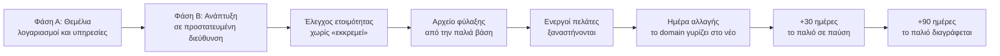

# Τεχνική βάση και μετάβαση

> **👁️ Με μια ματιά**
> Αυτό το κεφάλαιο εξηγεί, χωρίς τεχνικές λέξεις, τι κάνει το σύστημα για να είναι **ασφαλές** και **αξιόπιστο**, πόσο κοστίζει να τρέχει κάθε μήνα και πώς γίνεται η **αλλαγή από το παλιό στο νέο**. Η ασφάλεια δεν στηρίζεται στις οθόνες: η βάση αρνείται να δώσει στοιχεία σε όποιον δεν έχει δικαίωμα, ακόμα κι αν υπάρχει λάθος σε μια οθόνη. Η αλλαγή γίνεται κατευθείαν, σε τρεις φάσεις, χωρίς μεταφορά δεδομένων: το νέο σύστημα ξεκινά καθαρό και οι ενεργοί πελάτες ξαναστήνονται με το χέρι. Τι πρέπει να ετοιμάσει ο Ιδιοκτήτης πριν την ημέρα της αλλαγής φαίνεται στην ενότητα «Τι χρειάζεται από τον Ιδιοκτήτη».

## 🔒 Ασφάλεια

### Η βάση ελέγχει ποιος βλέπει τι

Στο παλιό σύστημα ο έλεγχος γινόταν στις οθόνες, ανά ρόλο. Στο νέο γίνεται **μέσα στη βάση**, σε κάθε ανάγνωση:

| Τι ελέγχει η βάση | Τι σημαίνει για την εταιρεία |
|---|---|
| Το **Δικαίωμα** του Χρήστη | Αν δεν έχεις «Βλέπει Συμφωνίες», δεν παίρνεις Συμφωνίες, όποια οθόνη κι αν ανοίξεις. |
| Το **Εύρος**: όλα ή όσα με αφορούν | Ένας πωλητής παίρνει μόνο τους Πελάτες του. Αν δύο Ρόλοι διαφωνούν, κερδίζει το ευρύτερο. |
| Το **«με αφορά»** | Υπολογίζεται τη στιγμή που ζητείται. Αν αφαιρέσεις κάποιον από Υπεύθυνο ή από Μέλος Παραγωγής, χάνει την πρόσβαση αμέσως. |
| Ο **επιλεγμένος Πελάτης** (για Χρήστες πελάτη) | Ένας Χρήστης πελάτη βλέπει μόνο τον Πελάτη που έχει διαλέξει εκείνη τη στιγμή. Δεν υπάρχει τρόπος να δει άλλον. |

Οι έλεγχοι ισχύουν σε κάθε ενέργεια Χρήστη. Οι αυτόματες εργασίες του συστήματος και ο συγχρονισμός με το Google δουλεύουν με ειδική πρόσβαση, που επιτρέπεται μόνο σε αυτές και πάντα με γραπτή αιτιολόγηση.

### Τα ποσά και το κόστος είναι κλειδωμένα χωριστά

Κάθε στοιχείο έχει τρία επίπεδα, και καθένα έχει δικό του κλείδωμα:

| Επίπεδο | Ποιος το βλέπει | Παράδειγμα |
|---|---|---|
| **Περιεχόμενο** | Όποιος έχει το Δικαίωμα του module | Ποιες γραμμές έχει μια Συμφωνία, ποιες Παροχές |
| **Ποσά** | Όποιος έχει «Βλέπει ποσά» | Τιμές, Τιμολογητέα, οφειλές, σε όλο το σύστημα |
| **Κόστος** | Όποιος έχει «Βλέπει κόστος και κερδοφορία» | Εκτιμώμενο κόστος, περιθώριο, Πραγματικές ώρες |

Όποιος δεν έχει το αντίστοιχο Δικαίωμα **δεν λαμβάνει καθόλου** τα νούμερα. Δεν κρύβονται απλώς από την οθόνη. Ένας editor που βλέπει μια Παραγωγή βλέπει τη δουλειά, όχι την τιμή της Συμφωνίας. Ένας αυτόματος έλεγχος απαγορεύει να μπει ποσό σε στοιχείο «περιεχομένου», ώστε να μην ξεφύγει κάτι κατά λάθος.

### Ίχνος ενεργειών

- Κάθε αλλαγή σε στοιχείο του συστήματος γράφεται: **ποιος, πότε, πριν → μετά**.
- Το ίχνος **δεν σβήνεται και δεν διορθώνεται**. Μόνο προστίθενται νέες εγγραφές.
- Οι αλλαγές σε ποσά και κόστος φαίνονται μόνο σε όποιον έχει τα αντίστοιχα Δικαιώματα.
- Το ίχνος βλέπουν ο Ιδιοκτήτης και η Διαχείριση. Εκεί φαίνονται και οι αλλαγές στις Ρυθμίσεις.

### Είσοδος και υπογραφή

- **Είσοδος μόνο με πρόσκληση.** Η εγγραφή είναι κλειστή. Ένας λογαριασμός Google μπαίνει μόνο αν το email του έχει προσκληθεί.
- **Οι δημόσιες φόρμες προστατεύονται** με αυτόματο έλεγχο ότι είναι άνθρωπος, και το δημόσιο widget του Βοηθού έχει πέντε επίπεδα προστασίας (βλ. «Μηνιαίο κόστος υποδομής»).
- **Ο κωδικός υπογραφής** στέλνεται μόνο στον Υπογράφοντα και έχει όριο αιτημάτων ανά Σύνδεσμο πρότασης.
- **Το PDF της υπογεγραμμένης Συμφωνίας κλειδώνει με ψηφιακό αποτύπωμα.** Αν αλλάξει έστω και ένα γράμμα μετά την υπογραφή, φαίνεται.
- **Δεν υπάρχουν κωδικοί υπηρεσιών που ισχύουν για πάντα.** Οι συνδέσεις με το Google και με το AI γίνονται χωρίς κλειδιά που μπορούν να κλαπούν και να χρησιμοποιηθούν αργότερα.

### Πού μένουν τα δεδομένα

Η βάση, τα αρχεία και οι αυτόματες εργασίες μένουν στην **Ευρώπη** (Ιρλανδία). Κάποιες υπηρεσίες που χρησιμοποιούμε επεξεργάζονται δεδομένα στις ΗΠΑ, με υπογεγραμμένες συμβάσεις προστασίας. Η Πολιτική απορρήτου του συστήματος πρέπει να τις αναφέρει **πριν ανοίξει το σύστημα σε πελάτες**.

## 🛟 Αξιοπιστία

### Αντίγραφα ασφαλείας

- Η βάση παίρνει **ημερήσια αντίγραφα και τα κρατά 7 ημέρες**. Το παλιό σύστημα δεν είχε κανένα.
- Αν χρειαστεί επαναφορά, γυρνάμε σε αντίγραφο της προηγούμενης ημέρας. Μπορεί να χαθεί η δουλειά μιας ημέρας.
- Υπάρχει προαιρετική υπηρεσία που επιτρέπει επαναφορά **σε οποιαδήποτε στιγμή**. Έχει επιπλέον κόστος (βλ. «Μηνιαίο κόστος υποδομής»).
- Οι αλλαγές στη δομή της βάσης πάνε μόνο **προς τα εμπρός**. Αν κάτι στραβώσει, διορθώνεται με νέα αλλαγή, όχι με επιστροφή.

### Ειδοποιήσεις που δεν χάνονται

| Τι εγγυάται το σύστημα | Πώς |
|---|---|
| **Κάθε Γεγονός καταγράφεται την ίδια στιγμή με την αλλαγή**, όποιος κι αν την έκανε (Χρήστης, αυτόματη εργασία, Google) | Αν η αλλαγή έγινε, το Γεγονός υπάρχει. Αν η αλλαγή δεν έγινε, δεν υπάρχει. |
| **Οι Αυτοματισμοί ελέγχονται κάθε λεπτό** | Η Ειδοποίηση φτάνει σχεδόν αμέσως. Το email φεύγει στην ώρα που όρισε ο admin. |
| **Μία αποστολή ανά περίπτωση** | Ο ίδιος Αυτοματισμός δεν στέλνει δύο φορές για το ίδιο Γεγονός. |
| **Επανάληψη όταν αποτύχει** | Μια αποτυχημένη αποστολή ξαναδοκιμάζεται με καθυστέρηση. Ό,τι αποτύχει οριστικά μπαίνει στη λίστα «απέτυχαν». |
| **Όλα στο Ιστορικό αποστολών** | Κάθε Ειδοποίηση και email, με παραλήπτη, ώρα και αποτέλεσμα. Φαίνεται και ανά Πελάτη. |
| **Τα «Χ μέρες πριν» ξαναϋπολογίζονται** | Αν αλλάξει η ημερομηνία ενός Γυρίσματος ή μιας λήξης, η εκκρεμής αποστολή μετακινείται. |

Όλα τα emails φεύγουν από **ένα σημείο** και από δικό τους subdomain (`mail.devremedia.com`), ώστε τα αυτόματα μηνύματα να μην επηρεάζουν τη φήμη του email της εταιρείας.

### Υγεία συστήματος

Μία σελίδα μέσα στο DMS, για τον Ιδιοκτήτη και τη Διαχείριση. Δείχνει:
- πότε έτρεξε τελευταία κάθε προγραμματισμένη εργασία,
- ποιες αποστολές απέτυχαν,
- αν συγχρονίζει το Google,
- αν κόλλησε κάποιο Γεγονός.

Ό,τι κοκκινίσει στέλνει **Ειδοποίηση**. Επιπλέον, ένας **εξωτερικός έλεγχος** ρωτά τακτικά αν το σύστημα απαντά, ώστε να φανεί και μια πλήρης πτώση.

### Παρακολούθηση σφαλμάτων

- Τα σφάλματα, στον περιηγητή και στην εφαρμογή, καταγράφονται αυτόματα σε υπηρεσία παρακολούθησης με ευρωπαϊκή τοποθεσία. Τα προσωπικά δεδομένα **αφαιρούνται** πριν την καταγραφή.
- Τα αρχεία καταγραφής δεν περιέχουν προσωπικά δεδομένα. Κάθε αίτημα έχει αριθμό, ώστε να βρίσκεται η αιτία.
- Τη χρήση της έχει ο developer. Η Υγεία συστήματος καλύπτει ό,τι χρειάζεται να δει η εταιρεία.

### Κάθε αλλαγή ελέγχεται πριν μπει

Τίποτα δεν μπαίνει στο σύστημα αν ένας έλεγχος είναι κόκκινος. Οι έλεγχοι είναι τέσσερις:

| Έλεγχος | Τι εξασφαλίζει |
|---|---|
| **Κανόνες πρόσβασης** | Ότι κάθε Ρόλος, με κάθε Εύρος, βλέπει ακριβώς όσα πρέπει και τίποτα παραπάνω |
| **Επιχειρησιακή λογική** | Ότι οι υπολογισμοί (υπόλοιπο, Παροχές, κόστος, ημερομηνίες) βγαίνουν σωστοί |
| **Ροές από την αρχή ως το τέλος** | Ότι η ραχοκοκαλιά, από την Ευκαιρία ως την Είσπραξη, δουλεύει πάνω σε δοκιμαστικό αντίγραφο |
| **Φρουροί του συστήματος** | Ότι ο σχεδιασμός, οι διαδρομές, οι μεταφράσεις και τα όρια ανάμεσα στα modules τηρούνται, ότι κάθε πίνακας έχει κανόνα πρόσβασης και τεστ, και ότι δεν υπάρχει στήλη ποσών σε στοιχείο περιεχομένου |

### Κάθε αλλαγή δοκιμάζεται σε δοκιμαστικό αντίγραφο

- Κάθε αλλαγή παίρνει **δικό της δοκιμαστικό αντίγραφο** του συστήματος και της βάσης, με **ψεύτικα δεδομένα**.
- Τα emails των δοκιμαστικών αντιγράφων φεύγουν μόνο σε **δοκιμαστικό γραμματοκιβώτιο**, ποτέ σε πραγματικούς ανθρώπους.
- Η παραγωγή ενημερώνεται μόνο από την εγκεκριμένη έκδοση. Δεν υπάρχει ξεχωριστό ενδιάμεσο περιβάλλον: το δοκιμαστικό αντίγραφο κάνει αυτή τη δουλειά.
- Ένα ξεχωριστό τοπικό περιβάλλον υπάρχει για τον developer.

## 💶 Μηνιαίο κόστος υποδομής

Μόνο όσα λένε οι αποφάσεις και η έρευνα. Τα ποσά είναι σε δολάρια, όπως δίνονται στις πηγές.

| Τι | Τι προσφέρει | Κόστος |
|---|---|---|
| **Φιλοξενία και βάση (πλάνα Pro)** | Ημερήσια αντίγραφα 7 ημερών, 100GB αρχεία, 500 ταυτόχρονες συνδέσεις, όλες οι αυτόματες εργασίες με ακρίβεια λεπτού | Περίπου **$45–60 τον μήνα**, χωρίς την επαναφορά σε οποιαδήποτε στιγμή |
| **Επαναφορά σε οποιαδήποτε στιγμή** | Επιστροφή της βάσης σε ακριβή ώρα | Προαιρετικό, περίπου **$100 τον μήνα** |
| **Δοκιμαστικό αντίγραφο βάσης ανά αλλαγή** | Η ασφαλής δοκιμή κάθε αλλαγής | Περίπου **$0,32 την ημέρα** για κάθε αντίγραφο όσο είναι ανοιχτό |
| **Αποστολή email** | Όλα τα email του συστήματος | **Δωρεάν** στην αρχή. Περνάμε στο επόμενο πλάνο όταν οι αποστολές πλησιάσουν τις ~70 την ημέρα |
| **Παρακολούθηση σφαλμάτων** | Καταγραφή σφαλμάτων με ευρωπαϊκή τοποθεσία | **Δωρεάν** (το ακριβότερο πλάνο κρίθηκε περιττό) |
| **AI του Βοηθού** | Απαντήσεις με πηγές, στο σύστημα και στην Ιστοσελίδα | **Ανώτατο όριο $30 τον μήνα.** Όταν εξαντληθεί, ο Επισκέπτης βλέπει τη φόρμα ενδιαφέροντος και ειδοποιείται η Διαχείριση |
| **Έλεγχος ότι ο επισκέπτης είναι άνθρωπος** | Προστασία φορμών και εισόδου | **Δωρεάν** |
| **Αυτόματοι έλεγχοι των αλλαγών** | Οι τέσσερις έλεγχοι της προηγούμενης ενότητας | **Δωρεάν** έως 2.000 λεπτά τον μήνα, όταν ο κώδικας γίνει ιδιωτικός. Τότε ελέγχεται αν αρκούν |

Τι **δεν** αλλάζει: το email της εταιρείας μένει στο Google Workspace και το domain στο SiteGround.

Το δημόσιο widget του Βοηθού προστατεύεται σε **πέντε επίπεδα**: όριο αιτημάτων ανά λεπτό και ανά διεύθυνση σύνδεσης, έλεγχος ανθρώπου στην έναρξη, όριο μηνυμάτων ανά Συζήτηση (τα νούμερα τα ορίζει ο admin), όριο μεγέθους ερώτησης και απάντησης, και το μηνιαίο ανώτατο όριο παραπάνω.

## 🪜 Φάσεις στησίματος

### Από πού ξεκινάμε

| Τι | Πού βρίσκεται σήμερα |
|---|---|
| Διευθύνσεις του domain (DNS) | SiteGround |
| `devremedia.com` και `www` | Σε φιλοξενία άλλου λογαριασμού, όπου τρέχει το παλιό σύστημα |
| Email εταιρείας | Google Workspace |
| Παλιά βάση | Δωρεάν πλάνο: χωρίς αντίγραφα ασφαλείας, κοιμάται μετά από 7 ημέρες αδράνειας |

Πρόσβαση στο SiteGround και στην παλιά φιλοξενία έχει ο developer. Πριν από **κάθε** αλλαγή στις διευθύνσεις του domain γίνεται εξαγωγή όλων των εγγραφών ως αντίγραφο. Οι εγγραφές του email της εταιρείας **δεν αλλάζουν ποτέ**.

### Φάση Α: Θεμέλια

Όλοι οι λογαριασμοί είναι στον developer, ώστε να αλλάζει και να αναβαθμίζει ελεύθερα.

| # | Τι γίνεται | Ποιος |
|---|---|---|
| 1 | Νέος χώρος φιλοξενίας (πλάνο Pro, στην Ευρώπη), συνδεδεμένος με τον κώδικα | Developer |
| 2 | Νέα βάση (πλάνο Pro, στην Ευρώπη), με δοκιμαστικό αντίγραφο ανά αλλαγή | Developer |
| 3 | Υπηρεσία παρακολούθησης σφαλμάτων με **ευρωπαϊκή τοποθεσία**. Ελέγχεται ότι υπάρχει στο δωρεάν πλάνο **πριν** δημιουργηθεί, γιατί δεν αλλάζει μετά | Developer |
| 4 | Αποστολή email από `mail.devremedia.com`. Οι εγγραφές ταυτοποίησης μπαίνουν στο SiteGround **μόνο για αυτό το subdomain**. Το site και το email της εταιρείας δεν επηρεάζονται | Developer |
| 5 | Ειδικός λογαριασμός υπηρεσίας στο Google και κοινή χρήση του Εταιρικού ημερολογίου μαζί του | Developer |
| 6 | Οι κωδικοί των υπηρεσιών μπαίνουν χωριστά για την παραγωγή και για τις δοκιμές | Developer |
| 7 | Εξωτερικός έλεγχος ότι το σύστημα απαντά | Developer |

**Ο κώδικας είναι δημόσιος όσο χτίζεται** και γίνεται ιδιωτικός όταν τελειώσει. Γι' αυτό:
- δεν μπαίνει ποτέ μέσα κανένας κωδικός (το εγγυάται αυτόματος έλεγχος),
- τα δεδομένα δοκιμών είναι μόνο ψεύτικα,
- καμία απογραφή, αρχείο φύλαξης ή περιεχόμενο πελατών δεν μπαίνει στον κώδικα.

### Φάση Β: Ανάπτυξη

- Το νέο σύστημα τρέχει σε **προσωρινή, προστατευμένη διεύθυνση**. Δεν ανοίγει σε όποιον δεν έχει πρόσβαση.
- Οι προγραμματισμένες εργασίες είναι ενεργές μόνο στην παραγωγή.
- Τα emails φεύγουν **μόνο σε εσωτερικές διευθύνσεις** μέχρι την αλλαγή. Τα δοκιμαστικά αντίγραφα στέλνουν μόνο σε δοκιμαστικό γραμματοκιβώτιο.
- Το **παλιό σύστημα συνεχίζει κανονικά** στο `devremedia.com`. Δεν χρειάζεται καμία αλλαγή του πριν την ημέρα της αλλαγής.

**Αρχικό περιεχόμενο.** Ό,τι υπάρχει ήδη στο παλιό γίνεται αρχική τιμή:

| Τι | Πώς μπαίνει |
|---|---|
| Λογότυπα της εταιρείας, γραμματοσειρές και τα γενικά κείμενα του συστήματος | Μέσα στον κώδικα |
| Τα 12 λογότυπα πελατών, οι εικόνες της αρχικής σελίδας και οι φωτογραφίες της ομάδας | Φορτώνονται στο σύστημα ως περιεχόμενο, **ποτέ στον κώδικα**. Όσα φαίνονται ήδη στο τωρινό site περνούν ως δημοσιευμένα |
| Νέα λογότυπα πελατών και νέες Δουλειές | Δημοσιεύονται μόνο με Συναίνεση δημοσίευσης |

### Φάση Γ: Ημέρα αλλαγής

**Πριν**

| # | Τι γίνεται | Ποιος |
|---|---|---|
| 1 | Ο έλεγχος ετοιμότητας βγαίνει **χωρίς κανένα «εκκρεμεί»** | Ιδιοκτήτης και Διαχείριση |
| 2 | **Αρχείο φύλαξης από την παλιά βάση, πριν από οτιδήποτε άλλο** (βλ. παρακάτω) | Developer |
| 3 | Έλεγχος ότι το αρχείο φύλαξης ανοίγει | Οι δύο εταίροι, που έχουν πρόσβαση στο αρχείο |
| 4 | Οι ενεργοί πελάτες ξαναστήνονται με το χέρι στο νέο σύστημα | Διαχείριση |

**Η αλλαγή**

| # | Τι γίνεται | Ποιος |
|---|---|---|
| 5 | Το `devremedia.com` και το `www` βγαίνουν από την παλιά φιλοξενία και μπαίνουν στη νέα | Developer |
| 6 | Στο SiteGround μπαίνει η εγγραφή επαλήθευσης και ενημερώνονται οι εγγραφές του domain με όσα δείξει η νέα φιλοξενία | Developer |
| 7 | Ενεργοποιούνται οι ανακατευθύνσεις (παρακάτω), αφαιρείται η προστασία από την παραγωγή και **ανοίγουν τα πραγματικά emails** | Developer |
| 8 | Στέλνονται προσκλήσεις στην ομάδα και στους Χρήστες πελάτη. **Οι παλιοί κωδικοί δεν ισχύουν** | Διαχείριση |
| 9 | Η ομάδα παίρνει νέο Σύνδεσμο ημερολογίου. Οι παλιές συνδρομές ημερολογίου σταματούν | Κάθε Χρήστης ομάδας |

### Το αρχείο φύλαξης της παλιάς βάσης

Φτιάχνεται **πριν από οτιδήποτε άλλο** και περιέχει:
- πλήρες αντίγραφο της παλιάς βάσης,
- όλα τα αρχεία που είχαν ανεβεί,
- πίνακες σε μορφή CSV, που ανοίγουν στο Excel, για ανθρώπους: πελάτες, συμβόλαια και συμφωνίες, τιμολόγια, πληρωμές, projects.

Φυλάσσεται στο **Google Drive της εταιρείας, με πρόσβαση μόνο στους δύο εταίρους**. Δεν μπαίνει ποτέ στον κώδικα. Ελέγχεται ότι ανοίγει πριν προχωρήσει οτιδήποτε άλλο.

### Ξεκινάμε καθαρά

Το νέο σύστημα **δεν παίρνει δεδομένα από το παλιό**. Οι λόγοι: οι πελάτες είναι λίγοι, το νέο μοντέλο διαφέρει πολύ από το παλιό, και η μεταφορά θα έφερνε μαζί της τα παλιά προβλήματα. Τα παλιά στοιχεία μένουν στο αρχείο φύλαξης.

Για τους **ενεργούς πελάτες** αυτό σημαίνει:
- ο Πελάτης και οι Χρήστες πελάτη του στήνονται ξανά με το χέρι,
- κάθε Χρήστης πελάτη παίρνει **πρόσκληση** και ορίζει νέο κωδικό,
- τα παλιά στοιχεία (τιμολόγια, πληρωμές, projects) διαβάζονται από το αρχείο φύλαξης, όχι από το νέο σύστημα.

### Οι παλιοί σύνδεσμοι

| Παλιό | Τι γίνεται |
|---|---|
| `/` | Ανοίγει η νέα Ιστοσελίδα |
| `/book` | Μόνιμη ανακατεύθυνση στη φόρμα ενδιαφέροντος |
| `/login`, `/forgot-password`, `/update-password`, `/confirm` | Μόνιμη ανακατεύθυνση στις νέες σελίδες εισόδου |
| `/admin/*`, `/client/*`, `/salesman/*`, `/employee/*` και οι εκδόσεις `-v2` | Πάνε στη σελίδα εισόδου και μετά στη «Σήμερα» |
| Παλιοί σύνδεσμοι πρότασης ή συμβολαίου, παλιοί σύνδεσμοι ημερολογίου | Σελίδα **«Ο σύνδεσμος δεν ισχύει πια»**, με στοιχεία επικοινωνίας |

Ο πίνακας των ανακατευθύνσεων είναι ένας, και ένας αυτόματος έλεγχος δοκιμάζει **κάθε γραμμή του**.

### Τι γίνεται με το παλιό σύστημα

| Πότε | Παλιά φιλοξενία | Παλιά βάση |
|---|---|---|
| **Ημέρα αλλαγής** | Χωρίς domain. Το project μένει | Μόνο για ανάγνωση |
| **+30 ημέρες** | Σε παύση | Σε παύση |
| **+90 ημέρες** | Διαγράφεται | Διαγράφεται, **μόνο αφού επιβεβαιωθεί ότι το αρχείο φύλαξης ανοίγει** |

## 📋 Τι χρειάζεται από τον Ιδιοκτήτη

Όσα δεν μπορούν να έχουν προεπιλογή εμφανίζονται ως **«εκκρεμεί»** στον έλεγχο ετοιμότητας. Μέχρι να συμπληρωθούν, το σύστημα **δεν ανοίγει σε πελάτες**.

| Τι | Ποιος το καταχωρεί | Λεπτομέρειες |
|---|---|---|
| **Στοιχεία εταιρείας** | Μόνο ο Ιδιοκτήτης (τα φορολογικά, οι λογαριασμοί τραπέζης και ο ΦΠΑ) | Επωνυμία και διακριτικός τίτλος, ΑΦΜ, ΔΟΥ, ΓΕΜΗ, διεύθυνση, τηλέφωνο, email, ένας ή περισσότεροι λογαριασμοί τραπέζης (ένας προεπιλεγμένος), λογότυπο, ΦΠΑ, Υπογράφων εταιρείας |
| **Νομικά κείμενα** | Πρώτο σχέδιο από την ομάδα ανάπτυξης, έγκριση από την εταιρεία | Πολιτική απορρήτου, cookies, Όροι χρήσης, όροι υπογραφής. Γράφονται πάνω στους πραγματικούς παρόχους, με **έλεγχο από δικηγόρο**. Η πολιτική απορρήτου πρέπει να έχει τη λίστα των υπηρεσιών που επεξεργάζονται δεδομένα |
| **Κατάλογος** | Ιδιοκτήτης ή Διαχείριση | Πακέτα και Υπηρεσίες, με τιμές, Παροχές και Εκτιμώμενες ώρες. Σημειώνεις ποια Πακέτα είναι «δημόσια» για την Ιστοσελίδα |
| **Έξοδα και ώρες** | Όποιος «Διαχειρίζεται κόστος» (προεπιλογή: μόνο η Διαχείριση) | Μηνιαία έξοδα σε κατηγορίες και αναμενόμενες παραγωγικές ώρες. Από εκεί βγαίνει το Κόστος ώρας |
| **Ωράριο κρατήσεων** | Ιδιοκτήτης ή Διαχείριση | Ανοιχτές μέρες, ώρες ανοίγματος και κλεισίματος, επιτρεπτές διάρκειες. Δεν υπάρχει λογική προεπιλογή |
| **Άρθρα Γνώσης** | Όποιος διαχειρίζεται τη Γνώση | Τα πρώτα Άρθρα, με Περίληψη και Κοινό |
| **Οι τελικές τιμές ταυτότητας** (χρώματα, γραμματοσειρές) | Η εταιρεία, μετά το prototype | Μέχρι τότε το σύστημα τρέχει με προσωρινές τιμές |
| **Οι ενεργοί πελάτες** | Διαχείριση | Στοιχεία Πελάτη, κύριο πρόσωπο επικοινωνίας και email κάθε Χρήστη πελάτη που θα προσκληθεί |

Όσα έρχονται **έτοιμα** και ο Ιδιοκτήτης μπορεί να αλλάξει αργότερα: τα Στάδια και οι Πηγές των Πωλήσεων, οι προεπιλογές των Κανόνων γυρισμάτων και Παραδοτέων, ο ΦΠΑ 24% και οι προεπιλεγμένοι Όροι Συμφωνίας.

## 🔗 Πού ακουμπά άλλες ροές

- [Ρυθμίσεις](05-settings-and-dynamic-configuration.md): ο έλεγχος ετοιμότητας και όλα τα «εκκρεμεί».
- [Ενσωματώσεις](06-integrations.md): Google, email, AI, cookies και προστασία φορμών.
- [Ειδοποιήσεις και Αυτοματισμοί](04-notifications-and-automations.md): τα Γεγονότα της Υγείας συστήματος.
- [Ρόλοι και Δικαιώματα](01-roles-and-permissions.md) και [Οδηγοί και οθόνες ανά ρόλο](08-role-guides.md): πώς φαίνονται οι κανόνες πρόσβασης στην πράξη.

## 📖 Σενάρια

**1. Το λάθος στην οθόνη.** Ένας προγραμματιστής αλλάζει τη σελίδα της Παραγωγής του «Γυμναστήριο Κίνηση» και κατά λάθος προσθέτει ένα πεδίο «τιμή Συμφωνίας». Ο Δημήτρης, editor με Ρόλο Παραγωγή, ανοίγει τη σελίδα. Το πεδίο εμφανίζεται κενό: η βάση δεν του έστειλε ποτέ το ποσό, γιατί δεν έχει «Βλέπει ποσά». Στην πράξη ο αυτόματος έλεγχος πρόσβασης θα είχε σταματήσει την αλλαγή πριν φτάσει στην παραγωγή.

**2. Ο συγχρονισμός που σταμάτησε.** Ένα βράδυ ο συγχρονισμός με το Google σταματά. Η Υγεία συστήματος κοκκινίζει και στέλνει Ειδοποίηση στους παραλήπτες που έχουν οριστεί. Το πρωί η Διαχείριση βλέπει το κόκκινο και ειδοποιεί τον developer. Όταν ο συγχρονισμός επανέλθει, ελέγχεται ξανά τι άλλαξε στο Google στο μεταξύ.

**3. Ο παλιός σύνδεσμος.** Η κα Ελένη, από το «Ζαχαροπλαστείο Μέλι», ανοίγει έναν παλιό σύνδεσμο συμβολαίου από email του προηγούμενου μήνα, την ημέρα μετά την αλλαγή. Βλέπει τη σελίδα «Ο σύνδεσμος δεν ισχύει πια», με το τηλέφωνο και το email της εταιρείας. Το Ζαχαροπλαστείο είχε ήδη ξαναστηθεί με το χέρι και η κα Ελένη έχει στη θυρίδα της την πρόσκληση για να ορίσει νέο κωδικό.

**4. Η ημέρα αλλαγής.** Την Τρίτη το πρωί ο έλεγχος ετοιμότητας δείχνει 0 «εκκρεμεί». Ο developer φτιάχνει το αρχείο φύλαξης (5 πίνακες και 1 πλήρες αντίγραφο) και το ανεβάζει στο Drive της εταιρείας. Οι δύο εταίροι το ανοίγουν και βλέπουν ότι διαβάζεται. Στις 14:00 ο developer γυρίζει το `devremedia.com` στο νέο σύστημα. Στις 14:20 φεύγουν οι προσκλήσεις σε 4 πελάτες και στην ομάδα. Το παλιό σύστημα μένει μόνο για ανάγνωση.

✅ Κανόνες που θα ελέγχονται

- **Δεδομένου ότι** ένας Χρήστης δεν έχει «Βλέπει ποσά» ή «Βλέπει κόστος και κερδοφορία», **όταν** ανοίγει οποιαδήποτε οθόνη, **τότε** δεν λαμβάνει ποτέ ποσά, κόστος, περιθώριο ή Πραγματικές ώρες, ακόμα κι αν η οθόνη έχει λάθος.
- **Δεδομένου ότι** ένας Χρήστης πελάτη έχει επιλέξει τον Πελάτη Α, **όταν** ζητά στοιχεία του Πελάτη Β, **τότε** η βάση δεν επιστρέφει τίποτα.
- **Δεδομένου ότι** ένα μέλος της ομάδας είναι Υπεύθυνος ενός Πελάτη, **όταν** αφαιρεθεί από Υπεύθυνος, **τότε** χάνει την πρόσβαση στον Πελάτη και στις Συμφωνίες του αμέσως.
- **Δεδομένου ότι** γίνεται αλλαγή σε στοιχείο ή σε Ρύθμιση, **όταν** αποθηκευτεί, **τότε** γράφεται στο ίχνος ενεργειών (ποιος, πότε, πριν → μετά) και η εγγραφή δεν σβήνεται.
- **Δεδομένου ότι** μια αλλαγή αποτυγχάνει σε κάποιον από τους τέσσερις ελέγχους, **όταν** ζητηθεί να μπει στο σύστημα, **τότε** δεν μπαίνει.
- **Δεδομένου ότι** μια αλλαγή τρέχει σε δοκιμαστικό αντίγραφο, **όταν** στέλνει emails, **τότε** φεύγουν μόνο σε δοκιμαστικό γραμματοκιβώτιο.
- **Δεδομένου ότι** μια αποστολή αποτυγχάνει, **όταν** ξαναδοκιμαστεί και πετύχει, **τότε** ο παραλήπτης τη λαμβάνει μία φορά, και το Ιστορικό αποστολών δείχνει το αποτέλεσμα.
- **Δεδομένου ότι** μια προγραμματισμένη εργασία δεν έτρεξε, **όταν** περάσει η προθεσμία της, **τότε** η Υγεία συστήματος κοκκινίζει και στέλνεται Ειδοποίηση.
- **Δεδομένου ότι** υπάρχει έστω ένα «εκκρεμεί», **όταν** ζητηθεί η ημέρα αλλαγής, **τότε** το σύστημα δεν ανοίγει σε πελάτες.
- **Δεδομένου ότι** ανοίγει παλιός σύνδεσμος πρότασης, συμβολαίου ή ημερολογίου, **όταν** έχει γίνει η αλλαγή, **τότε** φαίνεται η σελίδα «Ο σύνδεσμος δεν ισχύει πια» με στοιχεία επικοινωνίας.
- **Δεδομένου ότι** μια διαδρομή του παλιού συστήματος υπάρχει στον πίνακα ανακατευθύνσεων, **όταν** ανοιχτεί μετά την αλλαγή, **τότε** πηγαίνει στον προορισμό που ορίζει ο πίνακας, και ένας αυτόματος έλεγχος το δοκιμάζει.
- **Δεδομένου ότι** έχουν περάσει 90 ημέρες από την αλλαγή, **όταν** ζητηθεί η διαγραφή της παλιάς βάσης, **τότε** γίνεται μόνο αφού επιβεβαιωθεί ότι το αρχείο φύλαξης ανοίγει.

## ❓ Ανοιχτά ερωτήματα

1. **Επαναφορά σε οποιαδήποτε στιγμή:** θα την αναλάβει η εταιρεία (περίπου $100 τον μήνα) ή αρκούν τα ημερήσια αντίγραφα των 7 ημερών; Εκκρεμεί απόφαση προϋπολογισμού.
2. **Συνολικό μηνιαίο κόστος:** η έρευνα δίνει $45–60 για φιλοξενία και βάση. Το κόστος των δοκιμαστικών αντιγράφων (μετά την επιβεβαίωση της τιμής τους), του επόμενου πλάνου email και της χρήσης AI δεν έχει προστεθεί σε ένα συνολικό ποσό.
3. **Λογαριασμοί στον developer:** οι πηγές λένε μόνο ότι οι υπηρεσίες είναι στους λογαριασμούς του developer. Ποιος πληρώνει και πώς περνούν στην εταιρεία αν χρειαστεί;
4. **Ευρωπαϊκή τοποθεσία για την παρακολούθηση σφαλμάτων:** αν δεν υπάρχει στο δωρεάν πλάνο, δεν ορίζεται τι γίνεται. Το ακριβότερο πλάνο έχει κριθεί περιττό, αλλά αυτό ειπώθηκε για άλλο λόγο.
5. **Υγεία συστήματος:** ποιοι είναι οι αρχικοί παραλήπτες των Ειδοποιήσεων και ποιος ειδοποιείται όταν ο εξωτερικός έλεγχος δείξει ότι το σύστημα δεν απαντά; Ποιο Δικαίωμα ανοίγει τη σελίδα (το λεξικό λέει «Ιδιοκτήτης και admin»);
6. **Ημέρα αλλαγής, υπεύθυνοι:** ποιος ελέγχει ότι το αρχείο φύλαξης ανοίγει και ποιος ξαναστήνει τους ενεργούς πελάτες;
7. **Ενεργοί πελάτες και υπάρχουσα δουλειά:** πώς μπαίνει στο νέο σύστημα μια ήδη συμφωνημένη δουλειά (ενεργή Συμφωνία, Παροχές της τρέχουσας Περιόδου, υπόλοιπο στην Καρτέλα Πελάτη), αφού δεν υπάρχει μεταφορά δεδομένων; Δεν γίνεται κάθε παλιά Συμφωνία νέα υπογραφή;
8. **Έξοδα του παλιού συστήματος:** το κείμενο της απόφασης για το κόστος λέει ότι τα υπάρχοντα έξοδα μεταφέρονται ως ο πρώτος μήνας Κόστους ώρας. Το σχέδιο στησίματος και η απόφαση για την αλλαγή λένε ότι δεν μεταφέρεται κανένα δεδομένο και βάζουν τα έξοδα στα «εκκρεμεί». Ισχύει η απόφαση για το κόστος (νεότερη); Αν ναι, πώς περνούν χωρίς μεταφορά δεδομένων;
9. **Νομικός έλεγχος:** ποιος δικηγόρος και πότε; Οι πηγές ζητούν έλεγχο, χωρίς να ορίζουν υπεύθυνο.
10. **Κοινή χρήση του Εταιρικού ημερολογίου:** ποιος το μοιράζεται με το σύστημα στο Google;
11. **Ημέρα αλλαγής, ανάθεση βημάτων 3 και 4:** ο πίνακας γράφει «οι δύο εταίροι» για τον έλεγχο του αρχείου φύλαξης και «Διαχείριση» για το ξανάστημα των ενεργών πελατών, με βάση το ποιος έχει πρόσβαση και ποιος καταχωρεί τους ενεργούς πελάτες. Δεν έχει οριστεί ρητά από τις πηγές (βλ. σημείο 6). Να επιβεβαιωθεί.
12. **Τελικές τιμές ταυτότητας:** ποιος τις καταχωρεί στο σύστημα μετά το prototype, η εταιρεία ή ο developer; Ο πίνακας «Τι χρειάζεται από τον Ιδιοκτήτη» γράφει «η εταιρεία», όπως οι Ρυθμίσεις.
13. **Επαναφορά σε οποιαδήποτε στιγμή, κόστος:** το κεφάλαιο την αναφέρει ως προαιρετική υπηρεσία με επιπλέον κόστος, χωρίς να λέει αν θα ενεργοποιηθεί (βλ. σημείο 1).

Πηγές

- ADR 0018 (ένα app με modules, ασφάλεια στη βάση, δοκιμές, παρακολούθηση, περιβάλλοντα), ADR 0003 (ένα σύστημα, ένα domain, αλλαγή χωρίς παράλληλη λειτουργία), ADR 0016 (ενσωματώσεις, email, AI, προστασία widget, δεδομένα εκτός ΕΕ), ADR 0007 (Εύρος, «με αφορά», ποσά και κόστος χωριστά), ADR 0015 (Ρυθμίσεις, πρώτο στήσιμο, «εκκρεμεί»), ADR 0017 (έξοδα, Διαχειρίζεται κόστος), ADR 0013 (νομικές σελίδες, Συναίνεση δημοσίευσης).
- `docs/setup-and-cutover.md`: φάσεις Α/Β/Γ, αρχείο φύλαξης, ανακατευθύνσεις, παλιό σύστημα +30/+90.
- Issue #4 (κόστος και όρια υποδομής), #42 (αρχιτεκτονική), #43 (σχέδιο στησίματος), #10 (τι μεταφέρεται από τον παλιό κώδικα: ο παλιός κώδικας ξαναγράφεται, μόνο οι εγγραφές περιεχομένου περνούν ως αρχική τιμή).
- Λεξικό όρων για όσους θέλουν τα τεχνικά ονόματα: φιλοξενία = Vercel Pro (region `dub1`)· βάση = Supabase Pro (eu-west-1) με Branching· παρακολούθηση σφαλμάτων = Sentry (EU)· αποστολή email = Resend· ημερολόγιο = Google Calendar με service account και Workload Identity Federation· AI = Vercel AI Gateway· έλεγχος ανθρώπου = Cloudflare Turnstile· αυτόματοι έλεγχοι = GitHub Actions· αντίγραφο ασφαλείας με επαναφορά σε οποιαδήποτε στιγμή = PITR· δοκιμαστικό αντίγραφο = preview/Branch· κανόνες πρόσβασης = RLS και pgTAP· ψηφιακό αποτύπωμα = hash.
- Διαφωνία πηγών: βλ. Ανοιχτά ερωτήματα, σημείο 8 (ADR 0017 έναντι ADR 0003 και `docs/setup-and-cutover.md`).

