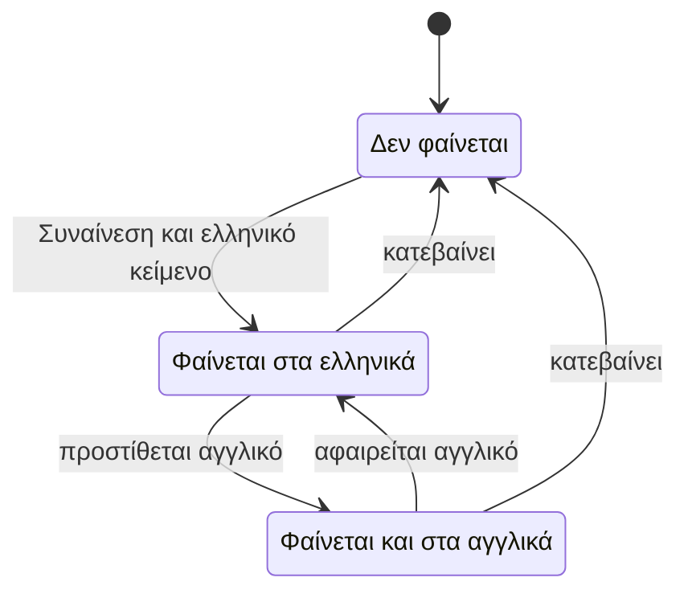
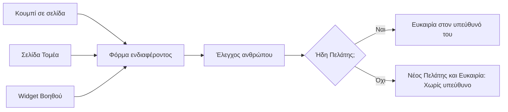

# Ιστοσελίδα και δημόσιες σελίδες

> **👁️ Με μια ματιά**
> Η Ιστοσελίδα **δεν είναι ξεχωριστό σύστημα**. Είναι το δημόσιο πρόσωπο του ίδιου DMS και ζει στο `devremedia.com`. Το σύστημα βρίσκεται πίσω από τη σελίδα εισόδου, στην ίδια διεύθυνση.
> Ό,τι αλλάζει συχνά (Τομείς, Δουλειές, λογότυπα πελατών, Ομάδα) το διαχειρίζεται η ομάδα μέσα στο DMS, χωρίς developer. Ό,τι μένει σταθερό (διάταξη, βασικά κείμενα, νομικές σελίδες) το αλλάζει ο developer.
> Οι τιμές έχουν **μία πηγή**: τον Κατάλογο. Στην Ιστοσελίδα φαίνονται μόνο τα Πακέτα που ο admin σημειώνει «δημόσια».
> Κάθε κουμπί που ζητά κάτι από την εταιρεία οδηγεί στην ίδια πόρτα: τη **φόρμα ενδιαφέροντος**. Από εκεί γεννιέται Πελάτης και Ευκαιρία.
> Στο παλιό σύστημα ήταν μία σελίδα με όλα τα κείμενα και τις τιμές γραμμένα μέσα στον κώδικα. Κάθε αλλαγή ήθελε developer.

## Ένα σύστημα, μία διεύθυνση

| Τι | Πώς είναι |
|---|---|
| Domain | Ένα: `devremedia.com`. Δεν υπάρχει ξεχωριστή διεύθυνση τύπου `app.` για το σύστημα. |
| Ιστοσελίδα | Στο `/` και στις δημόσιες σελίδες της. |
| Σύστημα | Πίσω από τη σελίδα εισόδου (`/login`). |
| Ένα σημείο εισόδου | Ο ίδιος ο Επισκέπτης, ο πελάτης και η ομάδα ξεκινούν από το ίδιο μέρος. |
| Γλώσσες | Ελληνικά (προεπιλογή) και αγγλικά (`/en/...`). |

Δεν υπάρχει άλλο εργαλείο φτιαξίματος ιστοσελίδων (τύπου Webflow ή Framer) και το παλιό σύστημα δεν μένει ζωντανό δίπλα στο νέο: δύο συστήματα θα σήμαιναν δύο αλήθειες για τον ίδιο πελάτη.

## Τι είναι δημόσιο και τι όχι

Δημόσια (χωρίς λογαριασμό) είναι μόνο τα παρακάτω.

| Δημόσιο | Τι κάνει ο Επισκέπτης |
|---|---|
| Η Ιστοσελίδα (σελίδες Τομέων, Δουλειές, τιμές, σχετικά, επικοινωνία, νομικές σελίδες) | Διαβάζει και βλέπει. |
| Η **φόρμα ενδιαφέροντος** | Ζητά προσφορά. Γεννιέται Πελάτης και Ευκαιρία. |
| Ο **Σύνδεσμος πρότασης** | Βλέπει και υπογράφει μια πρόταση, με προσωπικό σύνδεσμο που λήγει. Βλ. κεφάλαιο Πωλήσεις. |
| Η **σελίδα εισόδου** | Μπαίνει όποιος έχει προσκληθεί (κωδικός, σύνδεσμος εισόδου ή Google). Η εγγραφή είναι κλειστή. |
| Το **widget του Βοηθού** | Ρωτά και παίρνει απαντήσεις μόνο για τη Devre Media. Βλ. κεφάλαιο Γνώση και Βοηθός. |

**Δεν είναι δημόσια, και δεν θα γίνουν στο v1:**

- σελίδα πληρωμής: τα Τιμολόγια και το υπόλοιπο φαίνονται στον λογαριασμό του πελάτη και στο email (τραπεζικά στοιχεία, κωδικός πληρωμής),
- σύνδεσμος Παραδοτέου: όποιος εγκρίνει Παραδοτέο είναι Χρήστης πελάτη με λογαριασμό,
- κράτηση ραντεβού: την πρώτη επαφή την καλύπτει η ουρά «Χωρίς υπεύθυνο», χωρίς δημόσια πρόσβαση στο Ημερολόγιο.

### Χάρτης σελίδων

| Σελίδα | Διεύθυνση | Τι δείχνει |
|---|---|---|
| Αρχική | `/` | Παρουσίαση, επιλεγμένες Δουλειές, λογότυπα πελατών, κουμπί προς τη φόρμα. |
| Τομέας | `/services/[τομέας]` | Μία σελίδα ανά Τομέα, με τα συνδεδεμένα δημόσια Πακέτα. Το κουμπί ανοίγει τη φόρμα προσυμπληρωμένη. |
| Δουλειές | `/work` | Όλες οι δημοσιευμένες Δουλειές. |
| Case study | `/work/[case-study]` | Η ιστορία μιας Δουλειάς: πρόκληση, λύση, αποτέλεσμα. |
| Τιμές | `/pricing` | Τα δημόσια Πακέτα. |
| Σχετικά | `/about` | Η εταιρεία και η Ομάδα. |
| Επικοινωνία | `/contact` | Η φόρμα ενδιαφέροντος και τα στοιχεία της εταιρείας. |
| Απόρρητο, Όροι | `/privacy`, `/terms` | Νομικά κείμενα. |
| Είσοδος | `/login` | Η πόρτα προς το σύστημα. |

Κάθε σελίδα υπάρχει και στα αγγλικά με πρόθεμα `/en`. Οι διευθύνσεις είναι λατινικές και σταθερές.

## Περιεχόμενο που ζει στο DMS

Αυτά τα διαχειρίζεται η ομάδα μέσα στο σύστημα, με το Δικαίωμα «Ιστοσελίδα: Διαχειρίζεται» (Εύρος «όλα»). Το Δικαίωμα περιλαμβάνεται στον έτοιμο Ρόλο **Διαχείριση**.

| Τι | Τι είναι | Κανόνας δημοσίευσης |
|---|---|---|
| **Τομέας** | Περιοχή δουλειάς όπως παρουσιάζεται στην Ιστοσελίδα (π.χ. social media, podcast, εκδηλώσεις), με δική του σελίδα. Συνδέεται με Πακέτα και Υπηρεσίες του Καταλόγου. Δεν πουλιέται ο ίδιος. | Ελληνικά υποχρεωτικά, αγγλικά προαιρετικά. |
| **Δουλειά** | Δείγμα δουλειάς: βίντεο (Vimeo ή YouTube) με εικόνα εξώφυλλου, σε έναν ή περισσότερους Τομείς. Με ιστορία (πρόκληση, λύση, αποτέλεσμα) γίνεται **case study** με δική της σελίδα. | Δημοσιεύεται μόνο με **Συναίνεση δημοσίευσης**. |
| **Λογότυπο πελάτη** | Εικόνα στη λωρίδα αναφορών. | Δημοσιεύεται μόνο με **Συναίνεση δημοσίευσης**. |
| **Ομάδα** | Άνθρωποι και φωτογραφίες στη σελίδα «Σχετικά». | Ελληνικά υποχρεωτικά, αγγλικά προαιρετικά. |

Μια Δουλειά μπορεί να δείχνει σε Πελάτη, μόνο για **εσωτερική αναφορά**. Αυτό δεν δημοσιεύει τίποτα από τα στοιχεία του Πελάτη.

Η **Συναίνεση δημοσίευσης** είναι η δήλωση πάνω στη Δουλειά ή στο λογότυπο ότι ο πελάτης συμφώνησε να φαίνεται δημόσια. Δεν έχει σχέση με την έγκριση Παραδοτέων ούτε με τα cookies.

### Πότε φαίνεται μια καταχώριση

| Κατάσταση | Τι σημαίνει | Πώς βγαίνει |
|---|---|---|
| Δεν φαίνεται | Η καταχώριση υπάρχει στο DMS, αλλά δεν είναι στην Ιστοσελίδα (π.χ. λείπει Συναίνεση ή ελληνικό κείμενο). | Συμπλήρωση των απαιτούμενων. |
| Φαίνεται στα ελληνικά | Είναι στο `/...`. Στο `/en` δεν υπάρχει. | Προσθήκη αγγλικού ή κατέβασμα. |
| Φαίνεται και στα αγγλικά | Είναι και στα δύο. | Αφαίρεση αγγλικού ή κατέβασμα. |

Για τους Τομείς και την Ομάδα, που δεν χρειάζονται Συναίνεση, η δημοσίευση εξαρτάται μόνο από το αν η ομάδα τους έχει βάλει να φαίνονται (βλ. Ανοιχτά ερωτήματα).

### Εικόνες και βίντεο

- Οι εικόνες (εξώφυλλα, λογότυπα, φωτογραφίες Ομάδας) αποθηκεύονται στο σύστημα.
- Τα βίντεο **μένουν** στο Vimeo ή στο YouTube. Η σελίδα δείχνει πρώτα εικόνα εξώφυλλου και φορτώνει τον player μόνο όταν ο Επισκέπτης πατήσει.

## Τιμές στην Ιστοσελίδα

Οι τιμές δεν γράφονται ποτέ στην Ιστοσελίδα. Ο admin σημειώνει στον Κατάλογο ποια Πακέτα είναι **δημόσια**, και ανά Πακέτο αν δείχνει τιμή.

| Ρύθμιση Πακέτου | Τι βλέπει ο Επισκέπτης |
|---|---|
| Δημόσιο, με ένδειξη τιμής | Το Πακέτο με «από Χ € + ΦΠΑ». |
| Δημόσιο, χωρίς ένδειξη τιμής | Το Πακέτο, χωρίς τιμή. |
| Μη δημόσιο | Τίποτα. Δεν υπάρχει δεύτερη λίστα τιμών. |

Όταν ο admin αλλάζει την τιμή στον Κατάλογο, αλλάζει και η Ιστοσελίδα. Ο Βοηθός του widget απαντά για τιμές από την ίδια πηγή.

## Ένας δρόμος προς την εταιρεία: η φόρμα ενδιαφέροντος

Κάθε κουμπί «Ζητήστε προσφορά» ή «Επικοινωνήστε» οδηγεί στη φόρμα. Από τη σελίδα ενός Τομέα η φόρμα ανοίγει **προσυμπληρωμένη** με τις επιλογές του Καταλόγου που ταιριάζουν στον Τομέα. Ο Βοηθός του widget οδηγεί στην ίδια φόρμα και **δεν δημιουργεί ο ίδιος Ευκαιρία**.

Τι γίνεται όταν σταλεί η φόρμα:

1. Γεννιέται Ευκαιρία με Πηγή «Ιστοσελίδα» (αυτόματα).
2. Αν το email ή το ΑΦΜ ταιριάζει ακριβώς με υπάρχοντα Πελάτη, η Ευκαιρία μπαίνει σε αυτόν και την παίρνει ο Υπεύθυνός του.
3. Αλλιώς γεννιέται νέος Πελάτης και η Ευκαιρία πηγαίνει στην ουρά **«Χωρίς υπεύθυνο»**. Αν ο νέος Πελάτης μοιάζει με υπάρχοντα, φέρει σήμα «Πιθανό διπλό».
4. Οι παράμετροι διαφήμισης (UTM) κρατιούνται στην Ευκαιρία, ώστε να φανεί από ποια καμπάνια ήρθε.
5. Η ομάδα πωλήσεων παίρνει Ειδοποίηση, και ο Επισκέπτης παίρνει email «λάβαμε το αίτημά σας».

## Ελληνικά και αγγλικά

| Τι | Κανόνας |
|---|---|
| Γλώσσα προεπιλογής | Ελληνικά. |
| Περιεχόμενο που διαχειρίζεται η ομάδα | Ελληνικά υποχρεωτικά, αγγλικά προαιρετικά. Χωρίς αγγλικό, η καταχώριση **δεν φαίνεται** στο `/en`. |
| Σταθερά κείμενα (αρχική, σχετικά, προσέγγιση, νομικές σελίδες) | Στα αρχεία μεταφράσεων. Τα αλλάζει ο developer. Τις νομικές σελίδες τις γράφουμε εμείς και τις εγκρίνει η εταιρεία. |
| Στοιχεία εταιρείας (επωνυμία, ΑΦΜ, διεύθυνση, τηλέφωνο, email) | Έρχονται από τις Ρυθμίσεις, δεν γράφονται δεύτερη φορά. |
| Βοηθός | Απαντά στη γλώσσα του Επισκέπτη, από ελληνική πηγή. |

## Cookies και στατιστικά

Η Ιστοσελίδα μετρά επισκέψεις και διαφήμιση (Google Analytics και Meta Pixel), αλλά **μόνο με συναίνεση**.

- Όταν ανοίγει η σελίδα, εμφανίζεται banner cookies με **ίσα κουμπιά Αποδοχή και Απόρριψη**: ίδιο μέγεθος, ίδιο επίπεδο, ίδια εμφάνιση. Δεν μετρά ως συναίνεση η κύλιση της σελίδας ή ένα προεπιλεγμένο κουτάκι, και η σελίδα δεν κλειδώνει μέχρι την απάντηση.
- Η συναίνεση δίνεται ανά κατηγορία: **Απαραίτητα**, **Στατιστικά**, **Marketing**.
- **Πριν την Αποδοχή δεν φορτώνει κανένα εργαλείο στατιστικών ή διαφήμισης.** Δεν στέλνεται τίποτα στο Google ή στη Meta.
- Κάθε επιλογή γράφεται σε αρχείο συναινέσεων με ημερομηνία και έκδοση της πολιτικής.
- Ο αθόρυβος έλεγχος ανθρώπου (βλ. παρακάτω) χρησιμοποιεί μόνο cookies που θεωρούνται απαραίτητα.
- Η πολιτική απορρήτου απαριθμεί όλους τους εξωτερικούς παρόχους (φιλοξενία, βάση δεδομένων, τεχνητή νοημοσύνη, email, Google, Cloudflare, Meta). Η βάση και τα αρχεία μένουν στην ΕΕ. Ό,τι επεξεργάζεται πάροχος στις ΗΠΑ γίνεται με συμβατικές εγγυήσεις. Η λίστα πρέπει να είναι έτοιμη πριν ανοίξει το σύστημα σε πελάτες.

## Προστασία των φορμών

Η φόρμα ενδιαφέροντος είναι ανοιχτή σε όλους και γεννά εγγραφές στο σύστημα και email. Προστατεύεται σε τρία επίπεδα:

| Επίπεδο | Τι κάνει με απλά λόγια |
|---|---|
| Έλεγχος ανθρώπου | Αθόρυβος έλεγχος (δωρεάν υπηρεσία της Cloudflare) κόβει τα αυτόματα προγράμματα. |
| Κρυφό πεδίο παγίδα | Ένα πεδίο που βλέπουν μόνο τα αυτόματα προγράμματα. Αν συμπληρωθεί, η φόρμα δεν περνά. |
| Όριο ανά διεύθυνση | Η ίδια διεύθυνση δεν στέλνει πολλές φορές τη φόρμα. |

Ο ίδιος έλεγχος ανθρώπου προστατεύει και την έναρξη μιας Συζήτησης με τον Βοηθό, και τη σελίδα εισόδου (είσοδος, σύνδεσμος εισόδου, επαναφορά κωδικού).

## Οπτική ταυτότητα

| Θέμα | Τι ισχύει |
|---|---|
| Τόνος και χρώματα | Ίδιο σύστημα χρωμάτων και γραμματοσειρών και ίδιος τόνος σε Ιστοσελίδα και σύστημα. Έτσι ο πελάτης δεν νιώθει ότι άλλαξε εταιρεία όταν συνδεθεί. |
| Θέμα | **Σκοτεινό ως προεπιλογή**, με επιλογή φωτεινού. Στην Ιστοσελίδα η επιλογή θυμάται ο browser του επισκέπτη. Στο σύστημα μένει στο προφίλ του Χρήστη. |
| Τι κρατιέται από το παλιό | Μόνο η **αρχιτεκτονική** της ταυτότητας (ο τρόπος που οργανώνονται τα χρώματα, οι γραμματοσειρές και τα στοιχεία των οθονών). Η οπτική γλώσσα είναι ανοιχτή. |
| Τελική κατεύθυνση | Έρχεται από το **prototype όλων των οθονών**, που γίνεται μετά το Blueprint. Μέχρι τότε η ανάπτυξη προχωρά με προσωρινές τιμές. |
| Τιμές του πελάτη | Τα χρώματα και οι γραμματοσειρές της εταιρείας χωράνε μέσα στην κατεύθυνση που θα κλειδώσει. |

## 🔔 Ειδοποιήσεις

| Πότε | Ποιος παίρνει | Πώς |
|---|---|---|
| Στάλθηκε η φόρμα ενδιαφέροντος | Όσοι έχουν Δικαίωμα Πωλήσεων | Ειδοποίηση μέσα στο σύστημα. |
| Στάλθηκε η φόρμα ενδιαφέροντος | Ο Επισκέπτης | Email «λάβαμε το αίτημά σας». |
| Εξαντλήθηκε το πλαφόν του Βοηθού | Ο admin | Ειδοποίηση. Βλ. κεφάλαιο Γνώση και Βοηθός. |

Αυτά είναι αρχικοί Αυτοματισμοί που ο admin μπορεί να αλλάξει (παραλήπτες, κείμενο, ανάβει ή σβήνει).

## ⚠️ Εξαιρέσεις

| Τι πάει στραβά | Τι γίνεται |
|---|---|
| Δουλειά ή λογότυπο χωρίς Συναίνεση δημοσίευσης | Δεν φαίνεται. |
| Καταχώριση χωρίς αγγλικό κείμενο | Φαίνεται μόνο στα ελληνικά. Στο `/en` δεν υπάρχει. |
| Πακέτο που σταματά να είναι δημόσιο | Φεύγει από τις σελίδες τιμών και από τις απαντήσεις του Βοηθού. |
| Ο Επισκέπτης απορρίπτει τα cookies | Η Ιστοσελίδα δουλεύει κανονικά, χωρίς στατιστικά και διαφήμιση. |
| Ο έλεγχος ανθρώπου ή το όριο φόρμας αποτύχει | Η φόρμα δεν περνά. Το ακριβές μήνυμα προς τον Επισκέπτη δεν έχει οριστεί (βλ. Ανοιχτά ερωτήματα). |
| Παλιός σύνδεσμος του παλιού συστήματος | Στη μετάβαση, οι παλιές διαδρομές οδηγούν στη νέα Ιστοσελίδα ή στη σελίδα εισόδου. Οι παλιοί σύνδεσμοι πρότασης δείχνουν «ο σύνδεσμος δεν ισχύει πια». |

## ⚙️ Τι ρυθμίζει ο admin

| Τι | Πού |
|---|---|
| Τομείς, Δουλειές, case studies, λογότυπα πελατών, Ομάδα (και οι δύο γλώσσες) | Στο module Ιστοσελίδα, με το Δικαίωμα «Ιστοσελίδα: Διαχειρίζεται» |
| Ποια Πακέτα είναι δημόσια και αν δείχνουν τιμή | Στον Κατάλογο |
| Η Συναίνεση δημοσίευσης ανά Δουλειά ή λογότυπο | Στην ίδια την καταχώριση |
| Πηγές Ευκαιριών (η «Ιστοσελίδα») | Στις Ρυθμίσεις |
| Αυτοματισμοί της φόρμας (Ειδοποίηση, email επιβεβαίωσης) | Στους Αυτοματισμούς |
| Στοιχεία εταιρείας που φαίνονται στην Επικοινωνία | Στις Ρυθμίσεις (τα φορολογικά αλλάζει μόνο ο Ιδιοκτήτης) |

**Δεν** τα ρυθμίζει ο admin, αλλά ο developer: διάταξη σελίδων, σταθερά κείμενα (αρχική, σχετικά, προσέγγιση), νομικές σελίδες. Δεν υπάρχει πλήρης επεξεργασία για κάθε κείμενο και ενότητα, γιατί θα ήταν «μισό Webflow» μέσα στο DMS και θα άνοιγε τρόπους να χαλάσει η ταυτότητα.

## 🙋 Τι βλέπει ο πελάτης

Ο πελάτης και ο Επισκέπτης είναι συχνά οι ίδιοι άνθρωποι σε διαφορετικό χρόνο.

- Ως Επισκέπτης: τις σελίδες, τις Δουλειές, τα δημόσια Πακέτα, το widget και τη φόρμα. Τίποτα από αυτά δεν απαιτεί λογαριασμό.
- Ως πελάτης: το κουμπί «Είσοδος» τον πηγαίνει στη σελίδα εισόδου. Μπαίνει μόνο αν έχει προσκληθεί.
- Αν μια Δουλειά που τον αφορά είναι δημοσιευμένη, είναι επειδή έδωσε Συναίνεση δημοσίευσης.

## 🔗 Πού ακουμπά άλλες ροές

| Ροή | Σύνδεση |
|---|---|
| Πωλήσεις | Η φόρμα γεννά Πελάτη και Ευκαιρία με Πηγή «Ιστοσελίδα», UTM και ουρά «Χωρίς υπεύθυνο». Ο Σύνδεσμος πρότασης είναι κι αυτός δημόσια σελίδα. |
| Κατάλογος | Δημόσια Πακέτα, Τομείς και προσυμπλήρωση της φόρμας. |
| Γνώση και Βοηθός | Το widget είναι σε όλες τις σελίδες και απαντά από δημόσια Γνώση και δημόσια Πακέτα και Τομείς. |
| Αυτοματισμοί | Ειδοποίηση και email επιβεβαίωσης μετά τη φόρμα. |
| Ρόλοι και Δικαιώματα | «Ιστοσελίδα: Διαχειρίζεται» και η είσοδος μόνο με πρόσκληση. |
| Ρυθμίσεις | Στοιχεία εταιρείας, Πηγές. |
| Μετάβαση | Το `devremedia.com` γυρίζει κατευθείαν στο νέο σύστημα, χωρίς περίοδο παράλληλης λειτουργίας. Η παλιά Ιστοσελίδα δεν μεταφέρεται: γράφεται ξανά, με αρχικό περιεχόμενο από τα λογότυπα και τις εικόνες που ήδη υπάρχουν. |

Αργότερα: δημόσια κράτηση ραντεβού και δημόσιες σελίδες πληρωμής ή Παραδοτέων (έχουν απορριφθεί για το v1).

## 📖 Σενάρια

**1. Νέος Τομέας.** Η ομάδα φτιάχνει τον Τομέα «Εκδηλώσεις» με ελληνικό και αγγλικό κείμενο και τον συνδέει με το δημόσιο Πακέτο «Εκδήλωση Μίνι» (φανταστικό, «από 400 € + ΦΠΑ»). Η σελίδα του Τομέα δείχνει αμέσως το Πακέτο και την τιμή. Την επόμενη εβδομάδα ο admin αλλάζει την τιμή στον Κατάλογο· η σελίδα και ο Βοηθός ακολουθούν, χωρίς να ανοίξει κανείς το site.

**2. Δουλειά χωρίς Συναίνεση.** Η ομάδα ανεβάζει το βίντεο μιας καμπάνιας για το «Ζαχαροπλαστείο Μέλι» και τη συνδέει με τον Πελάτη για αναφορά. Δεν φαίνεται, γιατί λείπει η Συναίνεση δημοσίευσης. Όταν ο Πελάτης συμφωνήσει, ο Υπεύθυνος τσεκάρει τη Συναίνεση και η Δουλειά εμφανίζεται στα ελληνικά. Επειδή δεν υπάρχει αγγλικό κείμενο, δεν εμφανίζεται στο `/en` μέχρι να προστεθεί.

**3. Από διαφήμιση σε Ευκαιρία.** Ένας Επισκέπτης πατά διαφήμιση στο Instagram και φτάνει στη σελίδα «Podcast». Πατά «Ζητήστε προσφορά» και η φόρμα ανοίγει με επιλεγμένο το Πακέτο podcast. Συμπληρώνει τα στοιχεία. Ο έλεγχος ανθρώπου περνά. Ο Πελάτης είναι νέος, άρα η Ευκαιρία πάει στο «Χωρίς υπεύθυνο», με Πηγή «Ιστοσελίδα» και την καμπάνια από την οποία ήρθε. Οι Πωλήσεις παίρνουν Ειδοποίηση και ο Επισκέπτης παίρνει email επιβεβαίωσης. Αν το email του ταίριαζε με τον «Καφέ Αθηνά», η Ευκαιρία θα πήγαινε κατευθείαν στον Υπεύθυνό του.

**4. Cookies.** Ένας Επισκέπτης πατά «Απόρριψη». Η Ιστοσελίδα δουλεύει κανονικά, κανένα εργαλείο στατιστικών ή διαφήμισης δεν φορτώνει και η απόρριψη γράφεται στο αρχείο συναινέσεων με ημερομηνία και έκδοση πολιτικής.

✅ Κανόνες που θα ελέγχονται

- **Δεδομένου ότι** μια Δουλειά ή ένα λογότυπο δεν έχει Συναίνεση δημοσίευσης, **όταν** ζητηθεί η Ιστοσελίδα, **τότε** η καταχώριση δεν εμφανίζεται.
- **Δεδομένου ότι** μια καταχώριση δεν έχει αγγλικό κείμενο, **όταν** ανοίγει το `/en`, **τότε** δεν εμφανίζεται· στα ελληνικά εμφανίζεται κανονικά.
- **Δεδομένου ότι** ένα Πακέτο δεν είναι σημειωμένο δημόσιο, **όταν** ζητηθεί οποιαδήποτε σελίδα τιμών ή απάντηση του Βοηθού, **τότε** το Πακέτο και η τιμή του δεν εμφανίζονται.
- **Δεδομένου ότι** ένα δημόσιο Πακέτο έχει ένδειξη τιμής, **όταν** αλλάζει η τιμή στον Κατάλογο, **τότε** η Ιστοσελίδα δείχνει τη νέα τιμή χωρίς άλλη ενέργεια.
- **Δεδομένου ότι** κάθε κουμπί αίτησης είναι σε σελίδα της Ιστοσελίδας, **όταν** πατιέται, **τότε** οδηγεί στη φόρμα ενδιαφέροντος.
- **Δεδομένου ότι** ο Επισκέπτης έρχεται από σελίδα Τομέα, **όταν** ανοίγει η φόρμα, **τότε** είναι προσυμπληρωμένη με τις επιλογές του Τομέα.
- **Δεδομένου ότι** στάλθηκε η φόρμα από νέο Πελάτη, **όταν** περάσουν οι έλεγχοι, **τότε** η Ευκαιρία έχει Πηγή «Ιστοσελίδα», κρατά τα UTM και μπαίνει στο «Χωρίς υπεύθυνο».
- **Δεδομένου ότι** το email ή το ΑΦΜ ταιριάζει ακριβώς με υπάρχοντα Πελάτη, **όταν** σταλεί η φόρμα, **τότε** η Ευκαιρία μπαίνει στον υπάρχοντα και δεν φτιάχνεται νέος Πελάτης.
- **Δεδομένου ότι** ο έλεγχος ανθρώπου αποτυγχάνει ή το κρυφό πεδίο είναι συμπληρωμένο, **όταν** σταλεί η φόρμα, **τότε** δεν γεννιέται Ευκαιρία.
- **Δεδομένου ότι** ο Επισκέπτης δεν έχει πατήσει Αποδοχή, **όταν** φορτώνει οποιαδήποτε σελίδα, **τότε** δεν φορτώνει κανένα εργαλείο στατιστικών ή διαφήμισης.
- **Δεδομένου ότι** ο Επισκέπτης επιλέγει Αποδοχή ή Απόρριψη, **όταν** πατά, **τότε** η επιλογή γράφεται με ημερομηνία και έκδοση πολιτικής, και τα δύο κουμπιά έχουν ίδια εμφάνιση.
- **Δεδομένου ότι** ο Επισκέπτης δεν έχει λογαριασμό, **όταν** ζητά σελίδα πληρωμής ή σύνδεσμο Παραδοτέου, **τότε** δεν υπάρχει τέτοια δημόσια σελίδα.
- **Δεδομένου ότι** ένας Χρήστης δεν έχει το Δικαίωμα «Ιστοσελίδα: Διαχειρίζεται», **όταν** προσπαθεί να αλλάξει περιεχόμενο της Ιστοσελίδας, **τότε** δεν το επιτρέπει το σύστημα.

## ❓ Ανοιχτά ερωτήματα

1. **Πού ακριβώς ζει η φόρμα ενδιαφέροντος;** Οι πηγές λένε ότι είναι «σελίδα της Ιστοσελίδας». Ο χάρτης σελίδων έχει `/contact` αλλά δεν γράφει ρητά ότι είναι η φόρμα. Το κεφάλαιο το υποθέτει.
2. **Ποια πεδία έχει η φόρμα;** Οι πηγές ορίζουν μόνο τις επιλογές από τον Κατάλογο, τα UTM και τις προστασίες. Τα πεδία επαφής (όνομα, email, τηλέφωνο, ΑΦΜ, μήνυμα) δεν ορίζονται.
3. **Έχουν Τομείς και Ομάδα κατάσταση «πρόχειρο» και «δημοσιευμένο»;** Δεν ορίζεται. Για τις Δουλειές και τα λογότυπα η Συναίνεση δημοσίευσης λειτουργεί ως προϋπόθεση. Για τα υπόλοιπα, το κεφάλαιο υποθέτει ότι η ομάδα ορίζει αν φαίνεται κάτι.
4. **Τι γίνεται αν ο πελάτης ανακαλέσει τη Συναίνεση δημοσίευσης;** Ο κανόνας «χωρίς Συναίνεση δεν δημοσιεύεται» δείχνει ότι η καταχώριση κατεβαίνει, αλλά δεν περιγράφεται ποιος το καταγράφει και με ποια απόδειξη (απλό τικ ή αρχείο).
5. **Εμφανίζονται οι άνθρωποι της Ομάδας με ονόματα και φωτογραφίες χωρίς δική τους συναίνεση;** Δεν ορίζεται. Είναι ζήτημα προσωπικών δεδομένων, όπως η Συναίνεση δημοσίευσης για τους πελάτες. Δεν ορίζεται επίσης αν η Ομάδα συνδέεται με τους Χρήστες του συστήματος.
6. **Μπορεί ο Επισκέπτης να αλλάξει τη συναίνεση cookies αργότερα;** Οι πηγές ορίζουν banner και αρχείο συναινέσεων, όχι έναν τρόπο αλλαγής ή ανάκλησης.
7. **Τι βλέπει ο Επισκέπτης όταν αποτύχει ο έλεγχος ανθρώπου ή υπερβεί το όριο της φόρμας;** Δεν ορίζεται.
8. **Σε ποια γλώσσα φεύγει το email «λάβαμε το αίτημά σας»;** Οι Αυτοματισμοί στέλνουν στη γλώσσα του παραλήπτη, αλλά ο Επισκέπτης δεν έχει ορίσει γλώσσα. Λογικά είναι η γλώσσα της σελίδας, αλλά δεν γράφεται.
9. **Δημόσιο Πακέτο μόνο με ελληνικό όνομα και στο `/en`;** Για περιεχόμενο Ιστοσελίδας το αγγλικό είναι προαιρετικό (χωρίς αυτό δεν φαίνεται). Για τιμές λιστών που φτάνουν στο κοινό οι Ρυθμίσεις θέλουν και τις δύο γλώσσες υποχρεωτικά. Δεν είναι σαφές ποιος κανόνας ισχύει για τα Πακέτα.
10. **Πού μπαίνουν οι Τομείς:** ο Βοηθός τους λέει «Τομείς του Καταλόγου», ενώ η Ιστοσελίδα τους διαχειρίζεται ως δικό της περιεχόμενο με το Δικαίωμα Ιστοσελίδα. Το κεφάλαιο τους αντιμετωπίζει ως περιεχόμενο Ιστοσελίδας συνδεδεμένο με τον Κατάλογο.
11. **Ο αρχικός κατάλογος Δικαιωμάτων δεν έχει γραμμή «Ιστοσελίδα»**: το Δικαίωμα προστέθηκε αργότερα, με την απόφαση για την Ιστοσελίδα. Το κεφάλαιο ακολουθεί το νεότερο.
12. **Η οπτική κατεύθυνση** δεν έχει αποφασιστεί: κλειδώνει στο prototype. Δεν υπάρχουν ακόμα τελικά χρώματα ή γραμματοσειρές.

Πηγές

- ADR 0003: ένα σύστημα, ένα domain.
- ADR 0013: το περιεχόμενο της Ιστοσελίδας ζει στο DMS, οι τιμές από τον Κατάλογο.
- ADR 0016: Turnstile στη φόρμα και στην είσοδο, συναίνεση cookies, υποεκτελούντες.
- ADR 0006 και issue #14 (αρχικός Αυτοματισμός «Νέα Ευκαιρία από φόρμα ενδιαφέροντος»), ADR 0015 (γλώσσα τιμών και Πηγή).
- Issue #9 (δημόσιες σελίδες και domain), #23 (οπτική ταυτότητα και Ιστοσελίδα), #35 (prototype, εκτός πεδίου του Blueprint).
- `docs/setup-and-cutover.md` (αρχικό περιεχόμενο και redirects).
- `CONTEXT.md`, ενότητες «Ιστοσελίδα» και «Εμπορικά» (Πακέτο, Πηγή, Χωρίς υπεύθυνο, Πιθανό διπλό).

