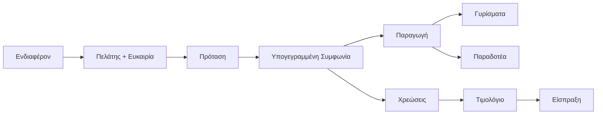

# DMS Blueprint

> **👁️ Με μια ματιά**
> Το νέο DMS είναι το ένα σύστημα όπου τρέχει όλη η Devre Media: η Ιστοσελίδα, οι πωλήσεις, τα γυρίσματα, τα παραδοτέα, η επικοινωνία με τους πελάτες, τα τιμολόγια και η εκπαίδευση της ομάδας. Ο πελάτης έχει τον δικό του χώρο, κλείνει γυρίσματα, εγκρίνει δουλειές και βλέπει τι χρωστά. Ο admin ρυθμίζει πακέτα, τιμές, κανόνες και ειδοποιήσεις χωρίς προγραμματιστή, και βλέπει ποιοι πελάτες τον συμφέρουν.

Αυτό το έγγραφο περιγράφει **τι κάνει** το σύστημα και **ποιος κάνει τι**, όχι πώς γράφεται ο κώδικας. Οι όροι ορίζονται στο [λεξικό](../../CONTEXT.md) και οι αποφάσεις στα [ADRs](../adr/).

Η εκδοχή για ανάγνωση, χωρίς ανοιχτά ερωτήματα, είναι μία σελίδα: [DMS Blueprint](https://claude.ai/artifact/8hgdLbwkdYDAv56KaUwpdZ). Φτιάχνεται από αυτά τα αρχεία με `python scripts/blueprint/build.py` και δεν διορθώνεται απευθείας.

## Πώς διαβάζεται

Κάθε κεφάλαιο διαβάζεται σε τέσσερα επίπεδα, οπότε μπορείς να σταματήσεις όπου σου αρκεί:
- **Αυτή η σελίδα:** το σύνολο σε ένα λεπτό.
- **«Με μια ματιά»:** το κουτί στην αρχή κάθε κεφαλαίου.
- **Το σώμα:** βήματα, ρόλοι, ειδοποιήσεις και σενάρια με φανταστικά νούμερα.
- **Τα κλειστά πλαίσια:** οι κανόνες που θα ελέγχονται αυτόματα και οι πηγές.

## Η ραχοκοκαλιά

## Κεφάλαια

| # | Κεφάλαιο | Τι περιέχει |
|---|---|---|
| 1 | [Ρόλοι και Δικαιώματα](01-roles-and-permissions.md) | Ποιος βλέπει και κάνει τι, στην ομάδα και στον πελάτη |
| 2 | [Χάρτης δυνατοτήτων](02-capability-map.md) | Όλες οι περιοχές του συστήματος και τι αλλάζει από σήμερα |
| 3.1 | [Η ραχοκοκαλιά](03-processes/01-backbone.md) | Ο πελάτης από το πρώτο ενδιαφέρον ως την πληρωμή |
| 3.2 | [Πωλήσεις](03-processes/02-sales.md) | Από την Ευκαιρία στην υπογεγραμμένη Συμφωνία |
| 3.3 | [Κατάλογος, Συμφωνία και κόστος](03-processes/03-catalogue-agreement-cost.md) | Πακέτα, τιμές, ώρες, περιθώριο και κερδοφορία |
| 3.4 | [Γυρίσματα και ημερολόγιο](03-processes/04-filming-and-calendar.md) | Κρατήσεις, εγκρίσεις, Συνεργείο, Google Calendar |
| 3.5 | [Παραδοτέα](03-processes/05-deliverables.md) | Εκδόσεις, σχόλια, οριστική έγκριση |
| 3.6 | [Μηνύματα και Αιτήματα](03-processes/06-messages-and-requests.md) | Μία Συνομιλία ανά πελάτη |
| 3.7 | [Τιμολόγια και εισπράξεις](03-processes/07-invoicing-and-payments.md) | Τι χρωστά ο κάθε πελάτης και πότε |
| 3.8 | [Γνώση και Βοηθός](03-processes/08-knowledge-and-assistant.md) | Εκπαίδευση ομάδας και απαντήσεις με πηγές |
| 4 | [Ειδοποιήσεις και Αυτοματισμοί](04-notifications-and-automations.md) | Ποιος μαθαίνει τι, πότε και πώς |
| 5 | [Ρυθμίσεις](05-settings-and-dynamic-configuration.md) | Όλα όσα αλλάζει ο admin χωρίς προγραμματιστή |
| 6 | [Ενσωματώσεις](06-integrations.md) | Google, email, AI και τα υπόλοιπα εργαλεία |
| 7 | [Τεχνική βάση και μετάβαση](07-foundation-and-cutover.md) | Ασφάλεια, αξιοπιστία, κόστος, ημέρα αλλαγής |
| 8 | [Οδηγοί και οθόνες ανά ρόλο](08-role-guides.md) | Η μέρα κάθε ρόλου και οι οθόνες του |
| 9 | [Ιστοσελίδα](09-website.md) | Οι δημόσιες σελίδες στο `devremedia.com` |

## Τι δεν περιλαμβάνει το v1

Τα παρακάτω έρχονται αργότερα:
- έκδοση Τιμολογίων από το σύστημα με διαβίβαση στο myDATA,
- πληρωμή με κάρτα,
- freelancers,
- Βοηθός με πρόσβαση στα δεδομένα του χρήστη,
- πλήρης builder αυτοματισμών,
- web push, SMS και Viber,
- μαθήματα και quiz στη Γνώση.

## Κανόνας για να μοιράζεται

Το Blueprint δεν περιέχει πραγματικές τιμές, κόστη ή ονόματα πελατών. Όλα τα σενάρια χρησιμοποιούν φανταστικά στοιχεία.
